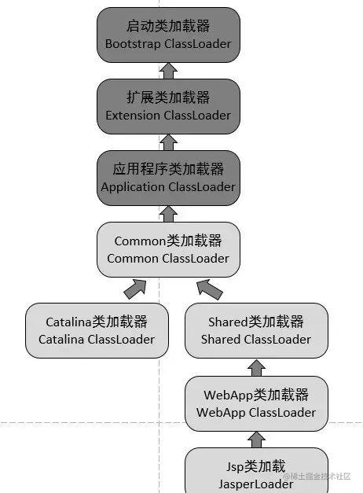

整理类加载过程、双亲委派、类隔离、热部署和 Class 文件结构。

## 类加载

1. 加载
2. 链接
    1. 验证：class文件，签名，合法，引用是否正确等
    2. 准备：对类静态变量，赋值初始化，类常量初始化
    3. 解析：符号引用替换成直接引用
3. 初始化：收集静态代码，生成&lt;cInit&gt;方法执行初始化
4. 使用
5. 卸载

### 双亲委派机制

1. 启动类加载器：负责加载&lt;JAVA_HOME&gt;\lib目录中的文件，或者被-Xbootclasspath参数所指定的路径，并且是虚拟机识别的（仅按照文件名识别，如rt.jar，名字不符合的类库即使放在lib目录中也不会被加载）类库加载到虚拟机内存中。
2. 扩展类加载器：负责加载&lt;JAVA_HOME&gt;\lib\ext目录中的，或者被java.ext.dirs系统变量所指定路径中的所有类库。该类加载器由sun.misc.Launcher$ExtClassLoader实现。
3. 应用类加载器：负责加载用户类路径（ClassPath）上所指定的类库，由sun.misc.Launcher$App-ClassLoader实现。
4. 自定义加载器

Jvm在加载一个类的时候，首先会判断当前类是否已经加载过，没有加载过的，请求委托给父加载器执行加载，直到顶级父类加载器，发现无法加载，会将其委托给下一层加载器加载，直到找到一个可以加载的类加载器，完成加载。**最顶层的类加载器（启动类加载器）无法加载该类时，再一层一层向下委派给子类加载器加载**。

### 什么时候触发类的加载

Java 是按需加载类，当真正需要使用这个类的时候才会触发加载

1. new 一个类会检查当前类是否已加载，否则执行加载流程
2. 子类的加载会触发父类的加载
3. 外部访问一个类的静态方法或者静态属性时会触发当前类加载
4. 涉及到反射调用时会触发类的加载
5. JVM 启动时标明的启动类，也就是文件名和类名相同的那个类，main函数所在的类

### Jvm中一个类是如何确认唯一性

对于任意一个类，都必须由**加载它的类加载器和这个类本身一起共同**确立其在Java虚拟机中的唯一性，**每一个类加载器都有一个独立的命名空间。**

比较两个类（或者对象）是否相等，只有在两个类都是同一个类加载器加载的才有比较的意义，否则永远都不会相等，比如equals，instance，等等比较方法。

### 什么情况下会打破双亲委派

#### 基础类需要调用用户代码

是这个双亲委派的模型自身的缺陷导致的。双亲委派模型很好的解决了各个类加载器的基础类的统一问题（**越基础的类由越上层的加载器进行加载**），基础类之所以称为"基础"，是因为它们总是作为被用户代码调用的API， 但没有绝对，如果基础类调用会用户的代码怎么办呢？

一个典型的例子就是JNDI服务，JNDI现在已经是Java的标准服务，**它的代码由启动类加载器去加载（在JDK1.3时就放进去的**`**rt.jar**`**）,**但它需要调用由独立厂商实现并部署在应用程序的ClassPath下的JNDI接口提供者（SPI， `Service Provider Interface`）的代码，但启动类加载器不可能"认识"这些代码啊。因为这些类不在rt.jar中，但是启动类加载器又需要加载，怎么办呢？

为了解决这个问题，Java设计团队只好引入了一个不太优雅的设计：线程上下文类加载器（`Thread Context ClassLoader`）。这个类加载器可以通过`java.lang.Thread`类的`setContextClassLoader`方法进行设置。如果创建线程时还未设置，它将会从父线程中继承一个，如果在应用程序的全局范围内都没有设置过的话，那这个类加载器默认即使应用程序类加载器。有了线程上下文加载器，JNDI服务使用这**个线程上下文加载器去加载所需要的SPI代码，也就是父类加载器请求子类加载器去完成类加载的动作（原本是各自加载各自的互不影响，现在是父加载请求子加载）**，这种行为实际上就是打通了双亲委派模型的层次结构来逆向使用类加载器，实际上已经违背了双亲委派模型的一般性原则。但这无可奈何，Java中所有涉及SPI的加载动作基本胜都采用这种方式。例如JNDI，JDBC，JCE，JAXB，JBI等。

#### 实现的类的隔离

[5K字详解！Tomcat 为什么要破坏 Java 双亲委派机制？_tomcat为什么打破双亲委派模型-CSDN博客](https://blog.csdn.net/wdj_yyds/article/details/132344142)

[如何实现Java类隔离加载-CSDN博客](https://blog.csdn.net/bingyuea/article/details/131069974)

Tomcat的机制，Tomcat是个web容器， 那么它要解决什么问题：

1. web容器可能需要部署两个甚至多个应用程序，不同的应用程序可能会依赖同一个第三方类库的不同版本，不能要求同一个类库在同一个服务器只有一份，因此要保证每个应用程序的类库都是独立的，保证相互隔离。
2. 部署在同一个web容器中相同的类库**相同的版本可以共享**。否则，如果服务器有10个应用程序，那么要有10份相同的类库加载进虚拟机，这是扯淡的。
3. web容器也有自己依赖的类库，不能于应用程序的类库混淆。基于安全考虑，应该让容器的类库和程序的类库隔离开来。
4. web容器要支持jsp的修改，jsp 文件最终也是要编译成class文件才能在虚拟机中运行，web容器需要支持 jsp 修改后不用重启。

为啥现有机制支持不了：第一个问题，如果使用默认的类加载器机制，那么是无法加载两个相同类库的不同版本的，默认的累加器是不管你是什么版本的，**只在乎你的全限定类名，并且只有一份**。第二个问题，默认的类加载器是能够实现的，因为他的职责就是保证唯一性。第三个问题和第一个问题一样。

再看第四个问题，要怎么实现jsp文件的热修改，jsp 文件其实也就是class文件，那么如果修改了，但类名还是一样，**类加载器会直接取方法区中已经存在的**，修改后的jsp是不会重新加载的。那么怎么办呢？是不是想到把Jvm中类给回收了，_**但是呢，Jvm对类的回收比较严格有个前置条件，加载的这个类的加载器给回收了才可以回收这个类（其中一个条件）**_，**所以最直接的办法就是直接卸载掉这jsp文件的类加载器**，**每个jsp文件对应一个唯一的类加载器**，当一个jsp文件修改了，就直接卸载这个jsp类加载器，重新创建类加载器，重新加载jsp文件。

**TomCat类加载架构图：本着能共享就共享，不能共享就私有。**

+ **commonLoader**：Tomcat最基本的类加载器，**加载路径中的class可以被Tomcat容器本身以及各个Webapp访问；（实现所有基础类加载一份）**
+ **catalinaLoader**：Tomcat容器私有的类加载器，加载路径中的class对于Webapp不可见；（Tomcat自己独属的类）
+ **sharedLoader**：各个Webapp共享的类加载器，加载路径中的class对于所有Webapp可见，但是对于Tomcat容器不可见；（所有应用程序共享的类）
+ **WebappClassLoader**：各个Webapp私有的类加载器，加载路径中的class只对当前Webapp可见；
+ JasperLoader： jsp文件类加载器，每个jsp文件一个

#### 实现程序的热部署

为了实现热插拔，热部署，模块化，意思是添加一个功能或减去一个功能不用重启，只需要把这模块连同类加载器一起换掉就实现了代码的热替换，也就是OSGI模块化。

> OSGI对类加载器的使用时值得学习的，弄懂了OSGI的实现，就可以算是掌握了类加载器的精髓。
>

### 类加载传导机制

一个的类加载触发另外一个类的加载，会尝试获取触发加载的类的加载器，执行加载当前类，然后后续一系列的加载都是用同一个加载器加载。

**也就是说，只要是main方法启动时候，触发加载的类都会使用同一个加载器加载，**可很轻松的实现不同main程序之间类的隔离加载（使用自定义的加载器）。（也是OSGI模块化的核心实现逻辑思想）

## 什么是字节码？

待补充。

## class类文件结构的组成了解吗？

[详解Java的类文件结构（.class文件的结构）](https://javabetter.cn/jvm/class-file-jiegou.html#_03%E3%80%81%E5%B8%B8%E9%87%8F%E6%B1%A0)

魔数，标识符

字符串常量池

属性表，方法表等
