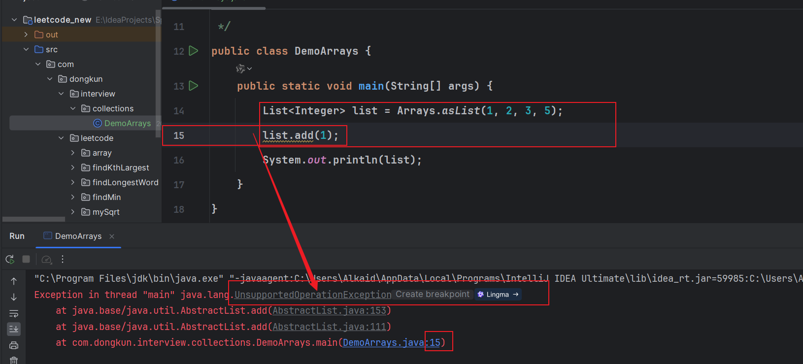
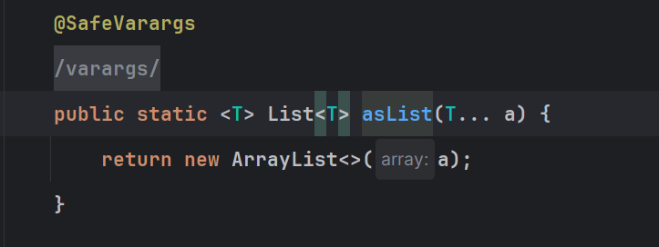
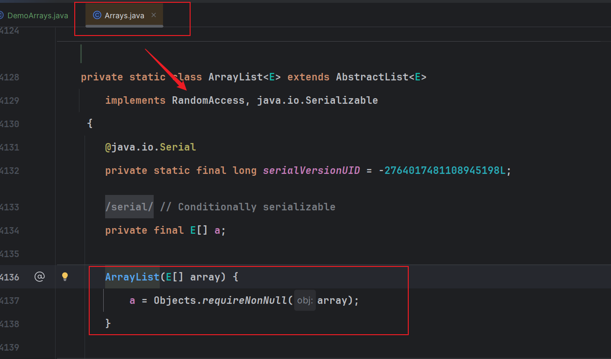
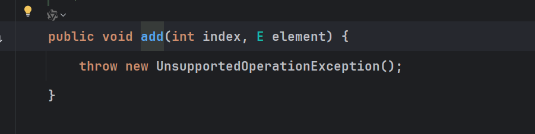

整理数组与集合、ArrayList、HashMap、CopyOnWriteArrayList 和集合遍历的复习笔记。

## 数组与集合的区别

+ 数组不是可以指定泛型，集合可以指定泛型
+ 数组可以存储基本数据类型，集合不可以，存储的数据都是引用
+ 数组不可以动态扩容，集合可以动态扩容
+ 数组只是一个存储数据结构，不对外提供更多的方法，但是集合对外的提供的方法很丰富

## ArrayList和LinkedList的区别

ArrayList底层是基于动态数组实现，LinkedList底层是基于双向链表实现

ArrayList的随机存取效率优先于LinkedList，LinkedList的添加删除效率优先于ArrayList

二者都是非线程安全，同时linkedList的内存占用比价大

## ArrayList的初始化和扩容机制

ArrayList默认创建大小0，第一次添加元素默认给元素初始化大小为10，后续每次添加元素会判断容量是否已满，是否需要扩容，判断到可扩容的话，会先创建一个新的数据组，容量大小为原来的1.5倍，此后把原来的元素给copy进入新数组，扩容完成

## 有哪些线程安全的集合类

待补充。

## Map，Set，List区别？

数据类型：Map存储的Key-Value键值对数据，其中，key和value都是引用对象，而且允许存在null值，而List 和Set存储的都是引用对象

存储有序：在存储数据的顺序上，List存储的数据是无序，而Set的一个实现类TreeSet允许数据进行排序存储,并且Set存储的数据都是唯一的，而List存储的数据是支持重复存储的

## HashMap 实现原理

HashMap底层基于动态数据实现，数组中的存储的是一个entry对象，包含了key，value两个重要属性，记录了key和value的值。每次put数据的时候都会尝试进行hash运算key对应的hashCode值，进行去摸运算得出一个索引下标，此外key值允许为null，默认存放在数组第一个位置。

HashMap默认初始化的数组大小为16，每次执行扩容时数组大小都是原来的2倍。

在Put一个元素时，会先计算出当前元素的HashCode然后，按照规则计算出当前数据存放的索引位置

- 如果当前索引没有数据，数据直接插入成功
- 如果当前索引有数据，需要比较是否为同一个key
    * 如何hashCode一致而且equals比较一致，直接替换value的值，执行修改,替换操作
    * 如果当前节点已经是链表的话需要检查链表每个元素是的key是否相同
        + 都不一致的话，加入到链表的尾部，同时加入链表时会判断是否需要转成红黑树
            - 如果链表的长度大于8而且当前集合的元素已经超过辽64个，执行链表转红黑树，优化查询的效率，链表的查询效率为o(n),红黑树的查询效率为olog(n)

## HashMap的扩容机制

HashMap在数据加入元素时，发现存储的元素已经打到扩容阈值了，就会执行reSize执行扩容，

扩容时会对原来的数组大小翻倍，也就是2倍大小的新数组，需要对元素的进行重新计算索引位，此时会对数组进行分组，范围old和new两个组，然后对原数据的元素便利计算新的索引位置

计算规则：利用Hash索引计算，一半移动数据，一半不需要移动

## HashMap 和 Hashtable的区别

线程安全：

HashMap 是线程不安全的，HashTable 是线程安全的，其中的方法是

Synchronized，在多线程并发的情况下，可以直接使用 HashTable，但是使用

HashMap 时必须自己增加同步处理。

底层数据结构：

HashMap底层的实现是数组+链表+红黑树实现

HashTabel底层实现是数组+链表

Hash

扩容方式：

Hashtable 扩容时，将容量变为原来的 2 倍加 1，而 HashMap 扩容时，将容量变

为原来的 2 倍（直接左移1位）

数组初始化：

HashTable 在不指定容量的情况下的默认容量为 11，而 HashMap 为 16

**key 和 value 是否允许 null 值 ：**

Hashtable 中，key 和 value 都不允许出现 null 值。HashMap 中，null 可以作为

键，这样的键只有一个；可以有一个或多个键所对应的值为 null。

## HashMap 为啥每次扩容为原来的2倍

1. **减少后续的Hash冲突**，因为HashMap采用开放定址法来解决冲突,每次扩容时,原有的hash值都需要重新计算,**如果扩容过小,重新计算后的索引位置有很大概率仍然会发生冲突,效果不明显**。如果采用两倍扩容,然后重新计算hash值,那么冲突的概率会大大减少,查询性能就能得到较大提高，扩容大浪费内存/。
2. 优化后面的再Hash操作，再hash的时候，老数据再Hash只需要一半的数据需要再次移动，可以很快完成再Hash散列操作

## CopyOnWriteArrayList

写时复制精髓就是，写的时候保证不修改原来的，而是复制出来一个新的到内存中去修改，原本的放着不动，供其他操作，待所有操作完成，再替换到原来的数据上（看情况，因为复制的时候可以直接更新引用了，比如 redis 的 RDB 写时复制操作）

读写分离，写时复制操作，解决线程安全问题

写操作保证线程安全是通过 Lock 加锁实现的，会阻塞所有的写操作，但是读操作不受影响

添加元素的时候，尝试加写锁，并且会把原来的数据给copy一份，新数组的长度+1,添加数据完成复制，替换原数组，相当于每次添加元素就要扩容一次数组，**每次数组长度+1**;

**读取元素的时候，读取的还是原数组，不是最新的数组。遍历的时候同理，也是基于快照实现的，所以是弱一致性读**

优点：读写分离，避免了线程安全问题

缺点：两个数组，占用内容，**读取的数据可能不是最新的数据，保证不了一致性，弱一致性。**

**适合用在读多，写少的场景，读操作无影响，写操作会阻塞，如果在两次垃圾回收之间，多次写操作，会有多个副本数据无用。**

```java
    public boolean add(E e) {
        final ReentrantLock lock = this.lock;
        lock.lock();
        try {
            Object[] elements = getArray();
            int len = elements.length;
            Object[] newElements = Arrays.copyOf(elements, len + 1);
            newElements[len] = e;
            setArray(newElements);
            return true;
        } finally {
            lock.unlock();
        }
    }
```

## Arrays.asList(1,2,3) 可以执行add(）操作吗？

看如下代码：执行add方法时抛出异常，不支持操作？为什么 List 的 add 操作会失败？



查看`asList` 源码，发现new了个 `ArrayList`对象，那更奇怪了，ArrayList怎么会不支持add操作呢



继续查看源码，好家伙，竟然时Arrays的内部类，自己定义了一个ArrayList类，此ArrayList非ArrayList啊



继续研究这个类发现它继承了`AbstractList` 这个类，但是呢没有重写add方法，相当于调用add方法，执行的是`AbstractList` 的add方法，但是`AbstractList` 的add方法又只有一行：熟悉的异常来了，直接抛出异常



原因是这个实现没有提供添加元素的操作。

## 如何安全的删除一个List中的元素？

在集合遍历过程中，使用迭代器的删除是优的方法，不能在迭代器便利的过程中使用list的remove方法删除元素，因为list.remove(value）会导致集合元素变化，导致和迭代器记录的值不一致，导致排除并发修改异常。

## 什么是hashCode，如何计算的？

待补充。

## 手动写一个HashCode冲突的案例？

创建10w左右的对象，就会开始产生hashCode冲突

再比如，创建一个10个元素大小的Hash表，存储100的数据，肯定存在hash冲突

## 普通for循环与增强for的区别？性能对比？

增强for循环其实是Java的语法糖，编译之后是使用迭代器执行遍历的

for 循环是从索引下标开始遍历循环

1. **传统的**`**for**`**循环**：
    - 适用于需要控制循环次数，或者需要在循环中修改循环变量的情况。
    - 可以用于数组和`Collection`类型的迭代。
2. **增强的**`**for**`**循环**：
    - 语法更加简洁，易于阅读和编写，不需要考虑数组或者集合元素元素长度问题
    - 只能用于数组和实现了`Iterable`接口的`Collection`类型的迭代，不能用于**修改集合中的元素，会报出并发修改异常。**

要说二者的性能对比，没有绝对的快与慢，还是要看数据量，遍历的数据量不足够多的时候，性能几乎没有差异，当遍历的数据量足够多的时候，增强的`for`循环在内部会使用迭代器，这可能会引入一些额外的性能开销，尤其是在迭代大型集合时。然而，这种开销通常是微不足道的，几乎内有差异。
