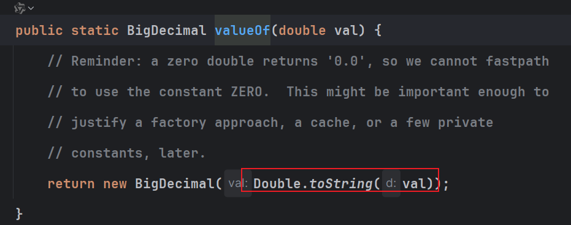
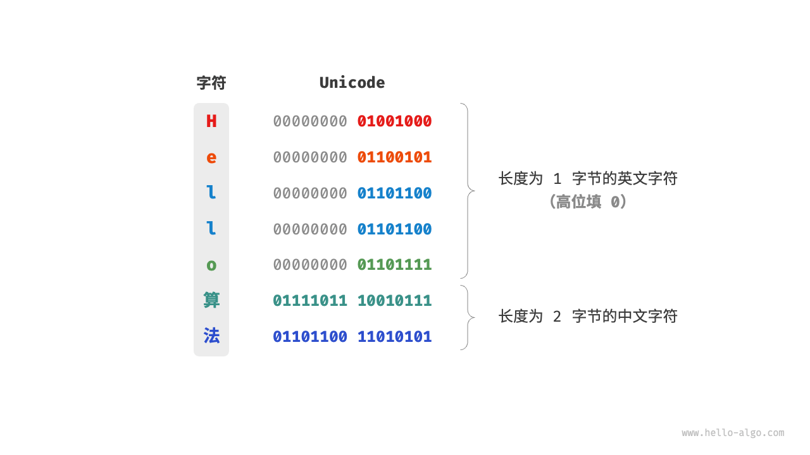
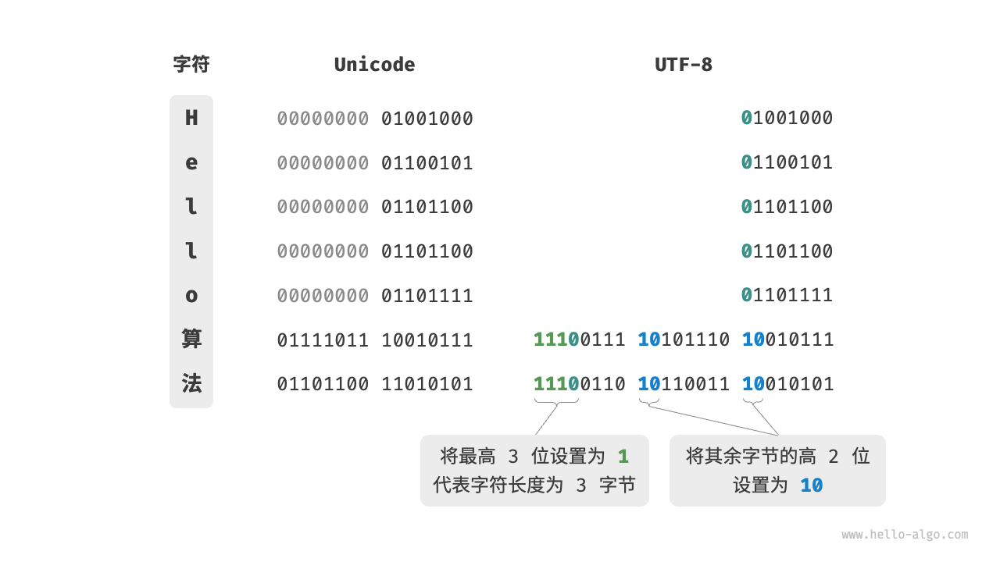
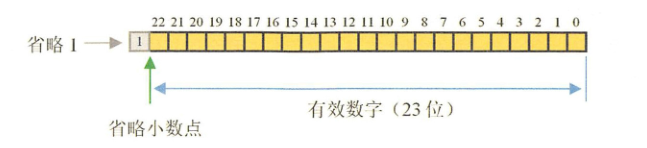

整理包装类型、自动拆箱、BigDecimal、字符与数字编码、String 和泛型通配符。

## 基本数据类型

### 包装类型缓存池？

+  Byte,Short,Integer,Long 这 4 种包装类默认创建了数值 [-128，127] 的相应类型的缓存数据
+  Character 创建了数值在[0,127]范围的缓存数据 ，Ascil码总计有256个，（0-255）char的包装类缓存了前128个
+ Boolean 直接返回 True Or False。

### 为什么要有包装类型？

+ Java是一个面向对象的语言，所谓一切都是对象引用
+ 基本类型所有有默认0值的，在某些业务是不对的，比如对象的某些属性没有赋值，我就希望它的值为 null。你给我默认赋个 值，不是帮倒忙么？
+ 集合不能加入基本类型，必须是引用数据类型
+  像泛型参数不能是基本类型。因为基本类型不是 Object 子类，应该用基本类型对应的包装类型代替。（因为泛型会在编译阶段执行泛型擦除，转成Object类接受对象）

### 自动拆箱导致的NPE问题

自动拆箱的代码本质上是调用 对一个的包装类的xxxValue()方法

但是在调用这个方法时，**此包装类要是一个null会**导致对应的NPE异常，自动拆箱导致的问题。

```java
public Long getNum(){
   return null;
}

long id = getNum();  等同于下面的代码 ，getNum是一个null，直接NPE
long id = getNum().longValue();
```

### BigDecimal 精度问题

创建三个对象a1，a2，a3，但是创建的方式不一样，两个构造器，一个valueOf方法

```java
BigDecimal a1 = new BigDecimal("0.01");
BigDecimal a2 = new BigDecimal(0.01);
BigDecimal a3 = BigDecimal.valueOf(0.01);
System.out.println(a1); // 0.01
System.out.println(a2); // 0.01000000000000000020816681711721685132943093776702880859375
System.out.println(a3); // 0.01
```

可以发现，a2对象最后的值是不符合我们预期的，因为二进制存储不能准确的表示一个小说（计算机的组成原理，IEEE浮点说表示法，存储的只是一个近似的二进制），只是表面的数据为0.01，实际存储的值并不是0.01。

为啥a3 是对的呢，请看valueOf(value) 源码，把double转成String进入构造函数了，避免了上面问题。



所以得出一个结论，如果想要准确的初始化一个BigDecimal对象，那就要使用valueOf（value）操作，或者构造函数传入String对象。

### BigDecimal 比较，计算

0.0100 与 0.01 实际是相等的，但是采用equals比较却得出一个false，所以BigDecimal的比较不建议使用equals，建议使用compareTo 方法比较，因为equals 会比较二者精度，精度不同也会返回false的，存在风险。

```java
 public static void main(String[] args) {
        BigDecimal a1 = new BigDecimal("0.0100");
        BigDecimal a3 = BigDecimal.valueOf(0.01);
        System.out.println(a1.equals(a3)); // false
        System.out.println(a1.compareTo(a3)); // true
        System.out.println(a1); // 0.0100
        System.out.println(a3); // 0.01
    }
```

### 字符编码

[3.4   字符编码 * - Hello 算法 (hello-algo.com)](https://www.hello-algo.com/chapter_data_structure/character_encoding/#345)

#### ASCII 字符集

ASCII 码是最早出现的字符集，其全称为 American Standard Code for Information Interchange（美国标准信息交换代码）。**它使用 7 位二进制数（一个字节的低 7 位）表示一个字符，最多能够表示 128 个不同的字符。**

然而，**ASCII 码仅能够表示英文**。随着计算机的全球化，诞生了一种能够表示更多语言的 EASCII 字符集。它在 ASCII 的 7 位基础上扩展到 8 位，能够表示 256 个不同的字符。

#### GBK 字符集

**EASCII 码仍然无法满足许多语言的字符数量要求**。比如汉字有近十万个，光日常使用的就有几千个。中国国家标准总局于 1980 年发布了 GB2312 字符集，其收录了 6763 个汉字，基本满足了汉字的计算机处理需要。

然而，GB2312 无法处理部分罕见字和繁体字。GBK 字符集是在 GB2312 的基础上扩展得到的，它共收录了 21886 个汉字。在 GBK 的编码方案中，**ASCII 字符使用一个字节表示，汉字使用两个字节表示。（后出现的字符集，要兼容之前的基本字符集）**

#### Unicode 字符集

Unicode 的中文名称为"统一码"，理论上能容纳 100 多万个字符。它致力于将全球范围内的字符纳入统一的字符集之中，提供一种通用的字符集来处理和显示各种语言文字，减少因为编码标准不同而产生的乱码问题。在庞大的 Unicode 字符集中，常用的字符占用 2 字节，有些生僻的字符占用 3 字节甚至 4 字节。

Unicode 是一种通用字符集，本质上是给每个字符分配一个编号（称为"码点"），**但它并没有规定在计算机中如何存储这些字符码点**。我们不禁会问：当多种长度的 Unicode 码点同时出现在一个文本中时，系统如何解析字符？例如给定一个长度为 2 字节的编码，系统如何确认它是一个 2 字节的字符还是两个 1 字节的字符？

对于以上问题，**一种直接的解决方案是将所有字符存储为等长的编码**。如图 3-7 所示，**"Hello"中的每个字符占用 1 字节，**"算法"中的每个字符占用 2 字节。我们可以通过高位填 0 将"Hello 算法"中的所有字符都编码为 2 字节长度。**这样系统就可以每隔 2 字节解析一个字符，恢复这个短语的内容了。**

> ASCII 码已经向我们证明，编码英文只需 1 字节。若采用上述方案，**英文文本占用空间的大小将会是 ASCII 编码下的两倍，**非常浪费内存空间。因此，我们需要一种更加高效的 Unicode 编码方法。(那就动态的设置，区分不同的字符站用不同的字节)
>



#### UTF-8 编码

UTF-8 已成为国际上使用最广泛的 Unicode 编码方法。**它是一种可变长度的编码**，使用 **1 到 4 字节来表示一个字符**，根据字符的复杂性而变。**ASCII 字符只需 1 字节，拉丁字母和希腊字母需要 2 字节，常用的中文字符需要 3 字节，其他的一些生僻字符需要 4 字节。**

UTF-8 的编码规则并不复杂，分为以下两种情况。

+ 对于长度为 1 字节的字符，将最高位设置为 0 ，其余 7 位设置为 Unicode 码点。值得注意的是，ASCII 字符在 Unicode 字符集中占据了前 128 个码点。也就是说，**UTF-8 编码可以向下兼容 ASCII 码**。
+ 对于长度为 𝑛 字节的字符（其中 𝑛>1），**将首个字节的高 ****𝑛**** 位都设置为 ****1（占几个字节，有几个1）** ，第 𝑛+1 位设置为 0 ；**从第二个字节开始（重点，第二个字节开始，****第一个字节的8位即使没有用完也不用了，所以UTF-8表示一个字符最多多占用8个字节****）**，**将每个字节的高 2 位都设置为 ****10**** **；其余所有位用于填充字符的 Unicode 码点。（真实存储的数据）

列子;

"Hello算法"对应的 UTF-8 编码。观察发现，由于最高 𝑛 位都设置为 1 ，因此系统可以通过读取最高位 1 的个数来解析出字符的长度为 𝑛 。

但为什么要将其余所有字节的高 2 位都设置为 10 呢？实际上，这个 10 能够起到校验符的作用。**假设系统从一个错误的字节开始解析文本，字节头部的 ****10**** 能够帮助系统快速判断出异常。(检验位）**

> 之所以将 10 当作校验符，是因为在 UTF-8 编码规则下，不可能有字符的最高两位是 10 。这个结论可以用反证法来证明：假设一个字符的最高两位是 10 ，说明该字符的长度为 1 ，对应 ASCII 码。而 ASCII 码的最高位应该是 0 ，与假设矛盾。因为只有占用字节的长度大于1，最高位的1才表示占用几个字节。
>



### 数字编码

[3.3   数字编码 * - Hello 算法 (hello-algo.com)](https://www.hello-algo.com/chapter_data_structure/number_encoding/#331)

#### 原码、反码和补码

待补充。

#### 浮点数编码

待补充。

#### float、double浮点数运算为啥会丢失精度？

[https://blog.csdn.net/AP0906424/article/details/109112451](https://blog.csdn.net/AP0906424/article/details/109112451)

float      符号位(1bit)   指数(8 bit)     尾数(23 bit)
double   符号位(1bit)  指数(11 bit)   尾数(52 bit)

计算机在处理数据都涉及到数据的转换和各种复杂运算，比如，不同单位换算，不同进制（如二进制十进制）换算等，很多除法运算不能除尽，比如10÷3=3.3333.....无穷无尽，而精度是有限的，3.3333333x3并不等于10，经过复杂的处理后得到的十进制数据并不精确，精度越高越精确**。float和double的精度是由尾数的位数来决定的,其整数部分始终是一个隐含着的"1"，由于它是不变的，故不能对精度造成影响**。float：2^23 = 8388608，一共七位，由于最左为1的一位省略了，这意味着最多能表示8位数： 28388608 = 16777216 。有8位有效数字，但绝对能保证的为7位，也即float的精度为7~8位有效数字；double：2^52 = 4503599627370496，一共16位，同理，double的精度为16~17位。



超出能够存储的精度小数位数，自动截断，截断后再换成10进制，自然精度缺少，失真了，不在是原来的数了。


## String字符串

### 字符串拼接，编译优化

String s= s1+s2 ，编译器会对 String 字符串相加的操作进行优化，会把这一过程转化为 StringBuilder 的 append 方法，append方法检测到是一个null字符串时，会自动的返回一个"null"值加入到结果集合中**，相当于s1和s2是null的话，会得到一个s值为"nullnull"；**

**但是一旦在循环中大量的进行字符串加号+拼接对象，底层会循环创建大量的StringBuilder对象，导致性能下降。**

### 改变 String 的值

因为string本身是final不可集成，而且存储的元素为final 不可改引用值，并且spring对外提供的方法，都是直接返回一个新的对象，不会修改原有的对象，所以想要修改的话只能通过反射直接修改String的属性值数组实现。

## 泛型

### 什么是上边界通配符？什么是下边界通配符？

在 Java 泛型中，&lt;? extends T&gt; 和 &lt;? super T&gt; 是通配符表达式，用于限定泛型的上界和下界。它们的主要区别在于对泛型类型参数的范围限定不同。

1. &lt;? extends T&gt;：
    - 上界通配符，表示通配符可以匹配 T 类型及其子类（包括 T 类型本身）。
    - **适用于获取数据的场景**，即读取数据，可以确保从集合中读取的元素是 T 类型的子类，保证类型安全。
    - 例如：List&lt;? extends Number&gt; 表示可以匹配 List&lt;Integer&gt;、List&lt;Double&gt; 等类型的集合。
2. &lt;? super T&gt;：
    - 下界通配符，表示通配符可以匹配 T 类型及其父类（包括 T 类型本身）。
    - **适用于存放数据的场景**，即写入数据，可以确保向集合中写入的元素是 T 类型的父类，保证类型安全。
    - 例如：List&lt;? super Integer&gt; 表示可以匹配 List&lt;Number&gt;、List&lt;Object&gt; 等类型的集合。

总结：

+ &lt;? extends T&gt; 适合读取数据
