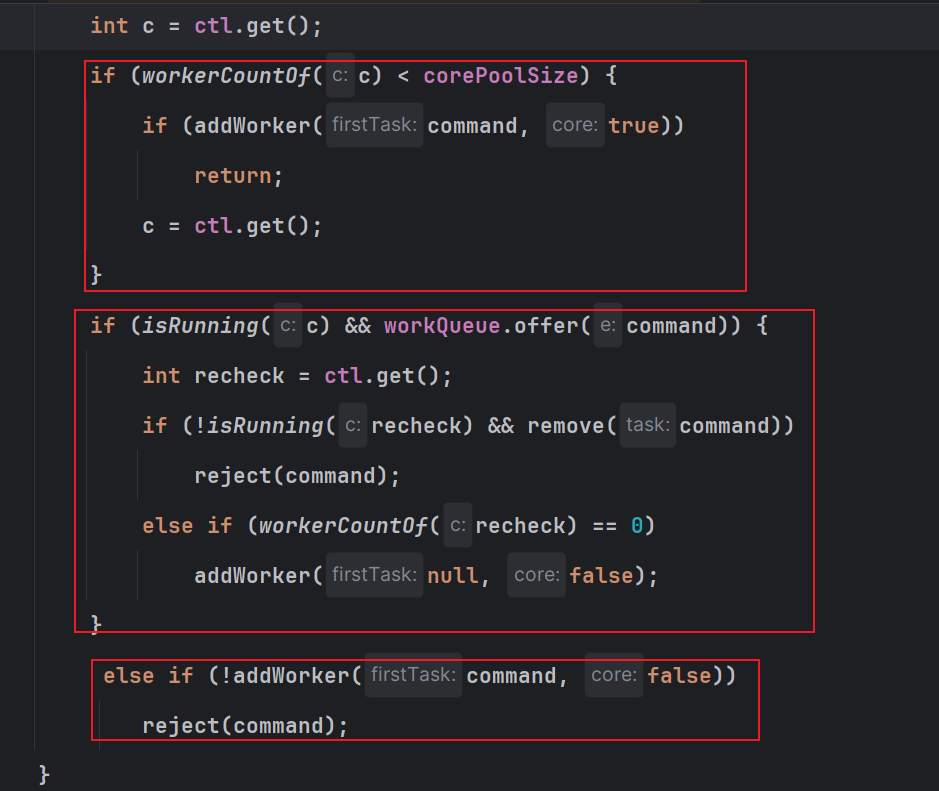
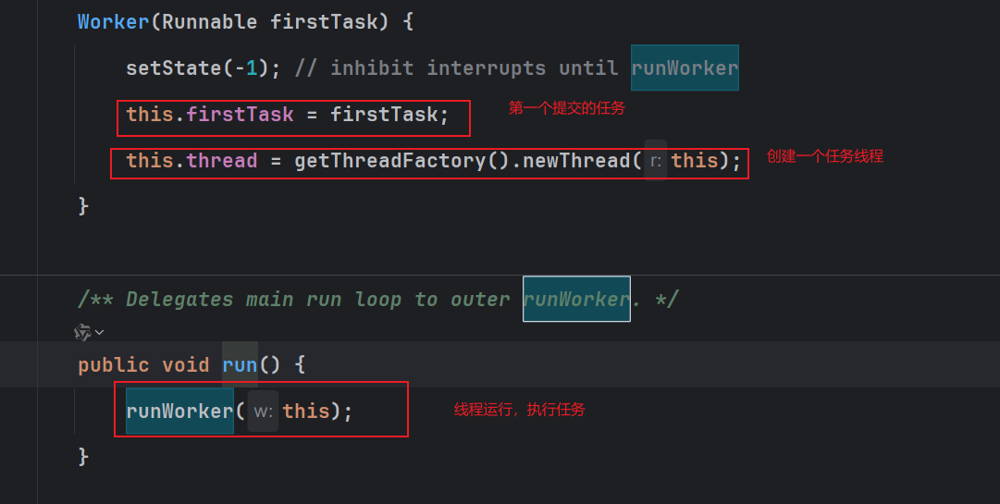
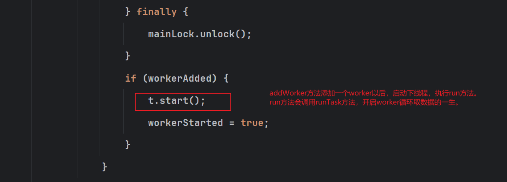

整理线程池创建、核心参数、状态、线程数量和 Worker 执行与获取任务的流程。

## 创建线程池的方式

总体上两种创建方式，一种使用jdk原生提供的创建好的，另一种自己指定参数创建

+ 通过 ThreadPoolExecutor 创建的线程池，填写对应的
+ 通过 Executors 创建的线程池

线程池的创建方式总共包含以下 7 种（其中 6 种是通过 Executors 创建的，1 种是通过 ThreadPoolExecutor 创建的）：

非定时任务有关：

1. Executors.**newFixedThreadPool**(int numsThread)：创建一个固定大小的线程池，可控制并发的线程数，超出的线程会在队列中等待；
2. Executors.**newCachedThreadPool**()：创建一个可缓存的线程池，若线程数超过处理所需，缓存一段时间后会回收多余的线程，若线程数不够，则新建线程；注意这个比较特殊，核心线程为0，最大线程无限大，为Int的最大值，所以如果我们一直提交任务，而且任务都没有执行结束，会一直创建线程。
3. Executors.**newSingleThreadExecutor**()：创建单个线程数的线程池，它可以保证先进先出的执行顺序

定时任务有关的：

4. Executors.newScheduledThreadPool()：创建一个可以执行延迟任务的线程池；
5. Executors.newSingleThreadScheduledExecutor()：创建一个单线程的可以执行延迟任务的线程池；
6. Executors.newWorkStealingPool()：创建一个抢占式执行的线程池（任务执行顺序不确定）JDK 1.8 添加

手动指定参数创建线程池：

7. ThreadPoolExecutor：最原始的创建线程池的方式，它包含了 7 个参数可供设置

## 线程池的核心七大参数

1. 核心线程数
2. 最大线程数
3. 最大线程等待任务时间
4. 时间单位
    1. 毫秒
    2. 秒
    3. 分钟
    4. 小时
    5. 天数
5. 创建线程的线程工厂
6. 阻塞任务队列
    1. 有界队列
        1. blockLinedQuene
        2. blockArrayQuene
    2. 优先级队列
        1. priorityBlockQuene
7. 拒绝策略
    1. 任务满了，抛出异常
    2. 任务满了，退回提交任务的线程处理
    3. 任务满了，丢弃队列首个任务
    4. 任务满了，丢弃任务不做额外处理
    5.  实现RejectedExecutionHandler 接口，自定义饱和策略，如记录日志或持久化存储不能 处理的任务

## 线程池的状态

1. running：
2. shoutdown 关闭中：线程池不再接受新任务，但会继续处理已提交的任 务，直到任务队列为空
3. stop 停止中：线程池不再接受新任务，并且会尝试终止正在执行的任务。 已提交但未执行的任务会从队列中移除 ， `shutdownNow()`方法用于将线程池状态切 换为 STOP
4.  tidying 清理： 线程池在 SHUTDOWN 或 STOP 状态下，**当所有任务 都已经终止，工作线程数为 0 时**，会将线程池状态切换为 TIDYING，表示线程池正在 进行一些清理工作。
5.  termnated 终止： 线程池的终止状态，表示线程池已经完全终止，不再 处理任务。**线程池状态会在 TIDYING 状态结束后切换到 TERMINATED  **

## 如何确认一个线程池的核心线程数

需要区分当前业务是CPU密集型还是IO密集型

目标：要最大化利用CPU，避免CPU空闲

CPU密集型：一般根据CPU的核心+1即可，不可设置过多的线程数，造成频繁的上下文切换

IO密集型：IO 密集型，主要是进行 IO 操作，执行 IO 操作的时间较长，这是 cpu 出于空闲状态，导致 cpu 的利用率不高，这种情况下可以增加线程池的大小。这种情况下可以结合线程的等待时长来做判断，等待时间越高，那么线程数也相对越多。一般可以配置 cpu 核心数的 2 倍。当然还是需要结合具体的业务进行是实际分析，线程池设定最佳线程数目计算公式：

（（线程池设定的线程等待时间+线程 CPU 时间）/ 线程 CPU 时间 ）* CPU 数目

## 线程池

### 如何创建线程池，有哪几种方式？

待补充。

### 如何创建指定数量的线程池？

待补充。

### 线程的其他核心参数？

待补充。

### 线程池的状态？状态之间的转换？

待补充。

### 如何优雅的关闭线程池？

待补充。

### 核心线程的创建流程

只要提交任务，就会判断当前工作的线程数量是否小于核心线程参数，小于的话就会创建一个worker（每个worker对应一个线程），否则才会进入队列等待worker调度。



### submit提交流程

```java
// 获取线程池状态
int c = ctl.get();
// 1、判断当前线程的数量是否达到核心线程数，不满足立即创建
if (workerCountOf(c) < corePoolSize) {
    // 1.1、创建worder，执行任务，并标识为核心线程worker
    if (addWorker(command, true))
        return;
    // 1.2、更新状态（如果创建worker失败，一般不会的
    // 除非并发提交任务，同时创建核心线程，超过限制，需要进入队列）
    c = ctl.get();
}
// 2、线程池处于运行态，而且加入队列成功
if (isRunning(c) && workQueue.offer(command)) {
    // 2.1、再次获取线程池状态
    int recheck = ctl.get();
    // 2.2、如果不是运行态，执行移除任务，拒绝任务
    if (! isRunning(recheck) && remove(command))
        reject(command);
    else if (workerCountOf(recheck) == 0)
    // 2.3、创建一个非核心线程，避免在这段时间内，所有线程都销毁了，创建一个线程从任务队列中取数据
        addWorker(null, false);
}
// 3、其实就是队列满了，需要创建非核心线程执行任务
else if (!addWorker(command, false))
    reject(command); // 达到最大线程数，执行拒绝
```

### worker执行任务

worker的创建与初始化，worker执行任务run触发runWorker，核心代码



worker工作线程启动的时间：run方法，就是调用runWorker方法



```java
final void runWorker(Worker w) {
        Thread wt = Thread.currentThread();
        Runnable task = w.firstTask;
        w.firstTask = null;
        w.unlock(); // allow interrupts
        boolean completedAbruptly = true;
        try {
            // 最核心的地方，就是这个while循环获取任务了
            // 第一个有任务，直接执行，执行完后，调用getTask获取任务，getTask是一个阻塞方法
            // 直到从队列中获取到任务，才会返回任务给当前线层，继续执行
            // 获取任务期间一直阻塞在while循环这个,拿到任务,继续执行任务,然后进入下一轮获取任务
            // 要是getTask没有拿到任务，就会结束这个线程
            while (task != null || (task = getTask()) != null) {
                // 加锁，避免worker执行其他任务
                w.lock();
                // If pool is stopping, ensure thread is interrupted;
                // if not, ensure thread is not interrupted.  This
                // requires a recheck in second case to deal with
                // shutdownNow race while clearing interrupt
                if ((runStateAtLeast(ctl.get(), STOP) ||
                     (Thread.interrupted() &&
                      runStateAtLeast(ctl.get(), STOP))) &&
                    !wt.isInterrupted())
                    wt.interrupt();
                try {
                    beforeExecute(wt, task);
                    try {
                        task.run();
                        afterExecute(task, null);
                    } catch (Throwable ex) {
                        afterExecute(task, ex);
                        throw ex;
                    }
                } finally {
                    task = null;
                    w.completedTasks++;
                    w.unlock();
                }
            }
            completedAbruptly = false;
        } finally {
            processWorkerExit(w, completedAbruptly);
        }
    }
```

### worker获取任务

```java
 private Runnable getTask() {
        boolean timedOut = false; // Did the last poll() time out?

     // 核心又是一个for无限循环，为啥是一个循环，其实就是避免cas更新state失败，重复执行重试
        for (;;) {
            int c = ctl.get();

            // Check if queue empty only if necessary.
            if (runStateAtLeast(c, SHUTDOWN)
                && (runStateAtLeast(c, STOP) || workQueue.isEmpty())) {
                decrementWorkerCount();
                return null;
            }

            int wc = workerCountOf(c);

            // Are workers subject to culling?
            // 判断当前线程是是等待超时获取任务，还是阻塞获取任务
            boolean timed = allowCoreThreadTimeOut || wc > corePoolSize;

            // 判断是否结束当前worker，返回一个null任务
            // timedOut的值会在上一次循环中poll失败更新为true
            if ((wc > maximumPoolSize || (timed && timedOut))
                && (wc > 1 || workQueue.isEmpty())) {
                // 减少worker数量
                if (compareAndDecrementWorkerCount(c))
                    return null;
                continue;
            }

            try {
                // 最核心的地方，poll是等待超时获取任务，take是阻塞获取任务，知道有任务返回
                Runnable r = timed ?
                    workQueue.poll(keepAliveTime, TimeUnit.NANOSECONDS) :
                    workQueue.take();
                if (r != null)
                    return r;
                 // poll超时了没有获取到任务，下一轮获取任务的循环会判断这个值，直接返回一个null任务
                // 结束这个worker
                timedOut = true;
            } catch (InterruptedException retry) {
                timedOut = false;
            }
        }
    }
```

### 核心线程是否允许销毁

如果allowCoreThreadTimeOut 参数为true,则表示允许销毁核心线程.
