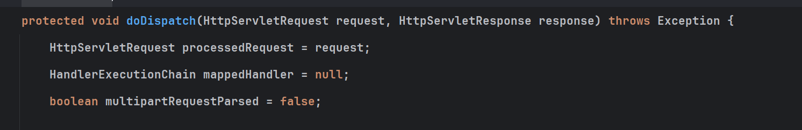
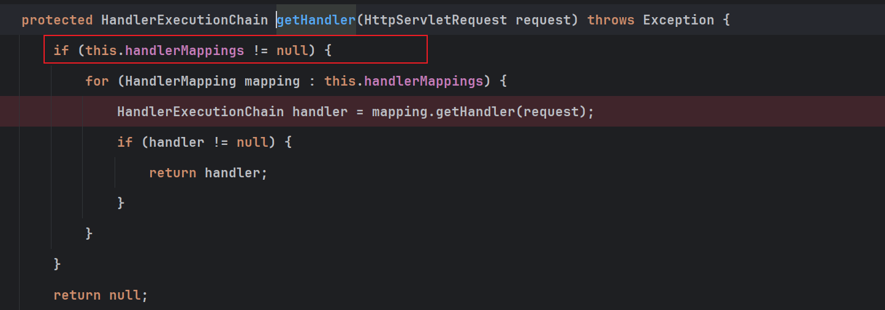
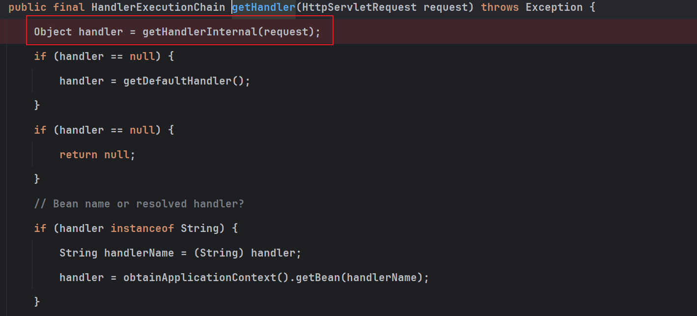
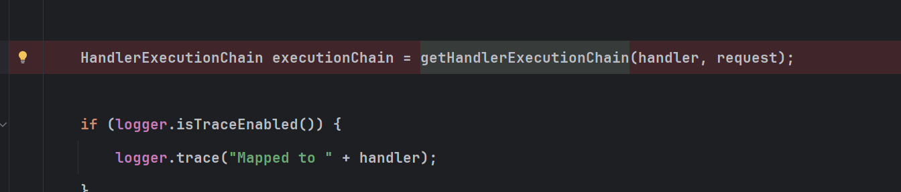
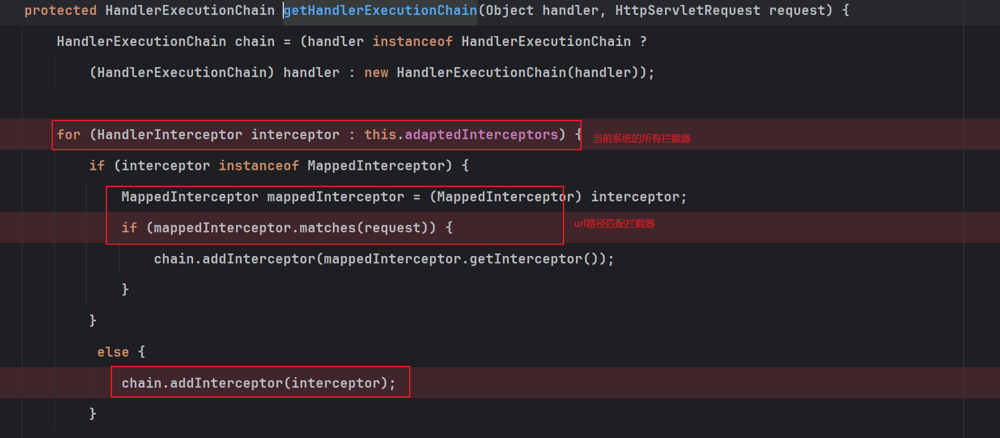
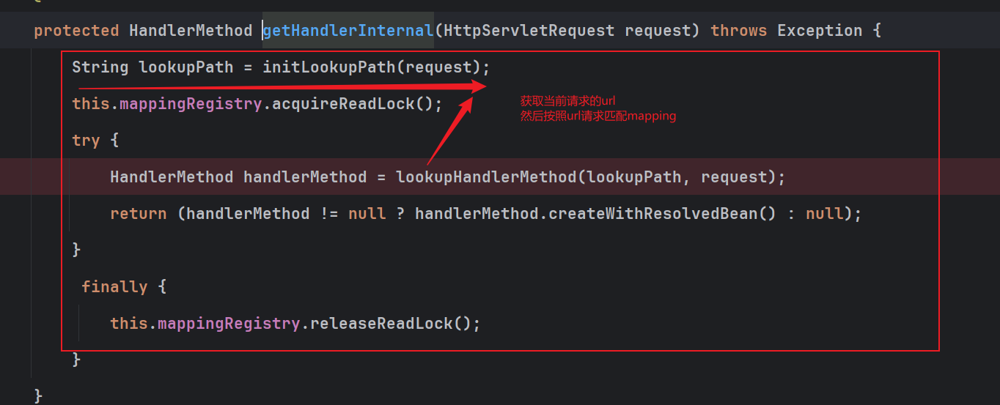
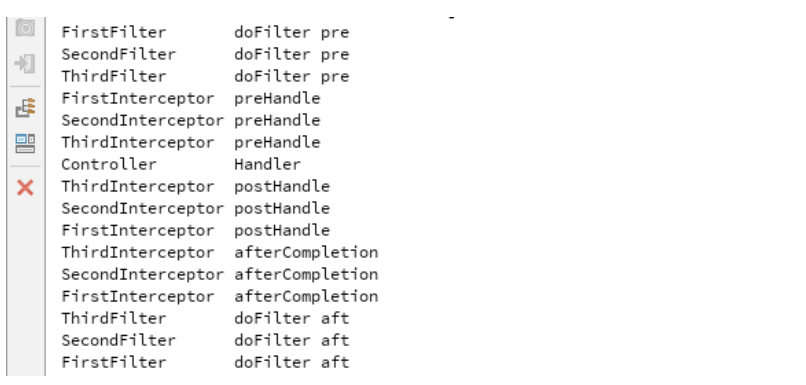

整理 DispatcherServlet、HandlerMapping、HandlerAdapter 和拦截器执行流程。

## 执行流程

### `doDispatch`方法，入口

在 Spring MVC 中，所有的请求首先到达 DispatcherServlet。DispatcherServlet 是前端控制器（Front Controller），它负责分发请求，并协调各种组件来处理请求，一切的起点都是源于`DispatcherServlet`的`doDispatch`方法，执行真正的handler映射执行处理。



源代码大致流程：

1. 当前请求，转化成HandlerExecutionChain
2. 获取handler对应的HandlerAdapter
3. **执行当前handler对应的拦截器对应的prehandler方法（拦截器如何匹配实在第一个转成handler时，已经从url中计算出符合的的拦截器了）**
4. HandlerAdapter 调用handler处理请求
5. **执行当前handler的所有拦截器的后置处理方法**
6. **执行handler的所有拦截器的完成执行方法**

```java
protected void doDispatch(HttpServletRequest request, HttpServletResponse response) throws Exception {
    HttpServletRequest processedRequest = request;
    HandlerExecutionChain mappedHandler = null;
    boolean multipartRequestParsed = false;

    WebAsyncManager asyncManager = WebAsyncUtils.getAsyncManager(request);

    try {
        ModelAndView mv = null;
        Exception dispatchException = null;

        try {
            // 判断是否文件上传
            processedRequest = checkMultipart(request);
            multipartRequestParsed = (processedRequest != request);

            // 重点方法，获取当前请求对应的handler，直接是一个封装完成的对象，Determine handler for the current request.
            mappedHandler = getHandler(processedRequest);
            if (mappedHandler == null) {
                noHandlerFound(processedRequest, response);
                return;
            }

            // 重点方法，获取当前handler对应的适配器，Determine handler adapter for the current request.
            HandlerAdapter ha = getHandlerAdapter(mappedHandler.getHandler());

            // 重点方法，执行当前handler对应的所有拦截器对应的prehandler方法
            if (!mappedHandler.applyPreHandle(processedRequest, response)) {
                return;
            }

            // 重点方法：通过适配器的handler方法，执行具体handler的方法
            mv = ha.handle(processedRequest, response, mappedHandler.getHandler());

            // 重点方法：执行当前handler的所有拦截器的后置处理方法
            mappedHandler.applyPostHandle(processedRequest, response, mv);
        }
        catch (Exception ex) {
            dispatchException = ex;
        }
        catch (Throwable err) {
            dispatchException = new NestedServletException("Handler dispatch failed", err);
        }
        // 重点方法：执行无异常排除，会在这个方法里触发handler的所有拦截器的完成执行方法
        processDispatchResult(processedRequest, response, mappedHandler, mv, dispatchException);
    }
    catch (Exception ex) {
        // 检测到异常排除，触发handler的所有拦截器的完成执行方法
        triggerAfterCompletion(processedRequest, response, mappedHandler, ex);
    }
    catch (Throwable err) {
        // 检测到其他异常排除，触发handler的所有拦截器的完成执行方法
        triggerAfterCompletion(processedRequest, response, mappedHandler,
                               new NestedServletException("Handler processing failed", err));
    }
    finally {
        if (asyncManager.isConcurrentHandlingStarted()) {
            // AsyncHandlerInterceptor  处理异步的请求，当异步请求完成后执行的操作。
            // 当你有一个异步的控制器方法（通常使用 @Async 注解标记）
            if (mappedHandler != null) {
                mappedHandler.applyAfterConcurrentHandlingStarted(processedRequest, response);
            }
        }
        else {
            // Clean up any resources used by a multipart request.
            if (multipartRequestParsed) {
                cleanupMultipart(processedRequest);
            }
        }
    }
}
```

---

### `getHandler(processedRequest)`获取handlerMapping

非常核心的第一个方法，讲请求转化成对应的handler，匹配上具体的mapping处理而且完成，拦截器的计算。

getHandler（）方法：非常暴力，直接循环找我们所有配置的handlerMapping，一个一个的匹配，知道找到合适的数据



此后会继续调用另外一个getHandler方法，在这个方法里，会创建返回HandlerExecutionChain 对象，找打当前请求适配的拦截器。

这个方法第一步就是从请求中计算出具体的handler。







getHandlerInternal 方法，获取HandlerMethod



### getHandlerAdapter(mappedHandler.getHandler()) ，获取适配器

又一个核心的方法，在这个方法里面，获取对应请求参数解析流程，执行请求，获取请求结果，返回结果等一系列的操作。

## 拦截器

### 如何创建一个拦截器

第一步：

### 执行的顺序

其中InterceptorRegistry内部有个List，这个addInterceptor( )方法是用来存放添加进去的interceptor，按照添加的先后顺序，依次拦截。



### 拦截器如何执行的

待补充。

### 链接如何给初始化的

待补充。

### 拦截器与过滤器的区别

[SpringMVC：拦截器和过滤器 - colin220 - 博客园 (cnblogs.com)](https://www.cnblogs.com/colin220/p/9606412.html)
