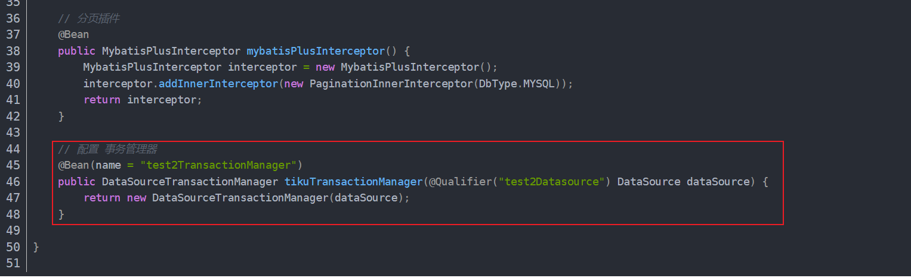
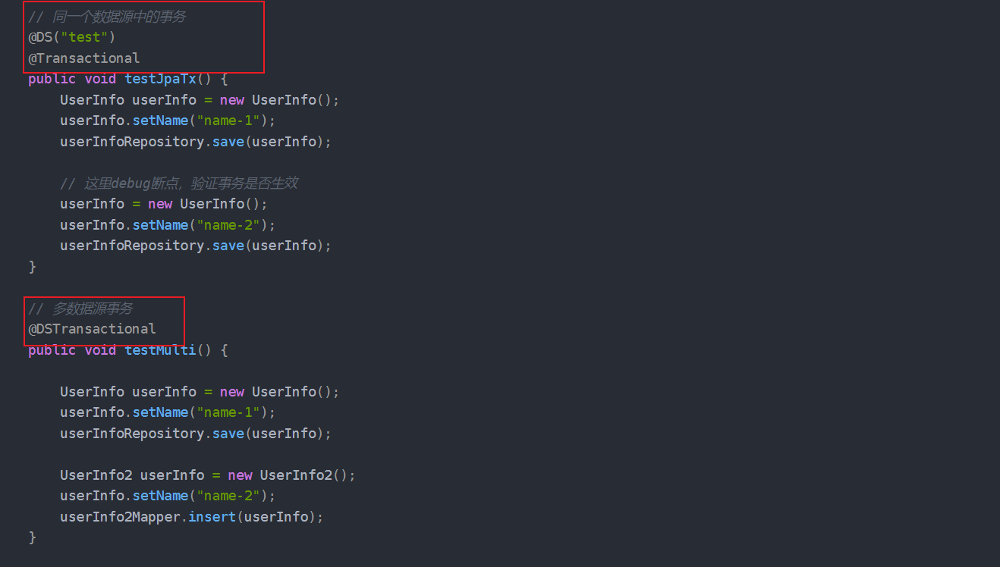

整理 Spring 事务传播机制、多数据源配置和多数据源事务笔记。

## 事务

### Spring事务的传播机制

站在设计者的角度上思考，如果要是你，你会设计哪几种传播机制

1. 如果存在事务，加入事务，不存在事务则创建一个事务执行（**比如查询，利用同一个事务视图**）
2. 如果存在事务，创建一个事务嵌套执行，不存在事务则创建一个事务执行（无论事务存在是否都会创建一个事务）**（新增删除，修改操作，当前读操作）**
3. 如果存在事务，不加入事务，以非事务方式执行（不以事务的方式执行）
4. 还有就是一些极端的
    1. 不存在事务，抛异常
    2. 存在事务，抛异常

### 如何实现多数据源

[SpringBoot 配置多数据源并支持事务_hikaridatasource 事务-CSDN博客](https://blog.csdn.net/Wu_Shang001/article/details/121182437)

很简单其实就是注入多个DataSource，然后在配置对应ORM框架的时候，手动指定，注入对应的数据源。当然也可以使用开源的动态数据源框架配置，配置好对应的DataSource依赖注入，然后在对应的mapper文件上配置指定数据源，配置对饮的事务管理器，扫描器，注册好对应的Bean。

### 如何多数据源事务

多数据源事务，只要保证我们用的是同一个数据库链接，即可完成事务操作，也就是一个事务中只操作一个数据源，事务还是有效的，这是对于申明式事务的操作方式。

但是想要在一个事务中操作多个数据源，声明式事务就不可以了，除非使用一些额外的机制来控制多数据源的事务的提交和回滚。可以使用编程式事务，手动开始多个数据园的事务然后，最后对这两个事务进行事务提交和回滚，其实就是分布式事务了，多个事务协调器，通知控制事务的提交和回滚。

当前对于单体服务多数据源也是存在开源框架来完成事务操作。

dynamic-datasource-spring-boot-starter 也是 baomidou 提供的（同mybatis-plus），通过 @DS 注解就能实现多数据源的操作，其基本实现逻辑也就上面那一套，动态代理，统一提交事务和回滚事务。

