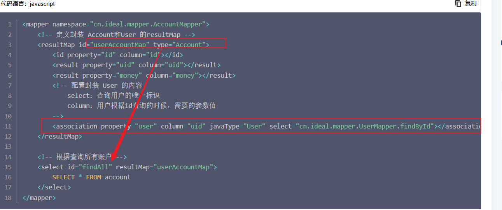
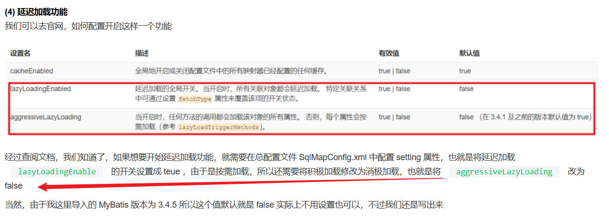
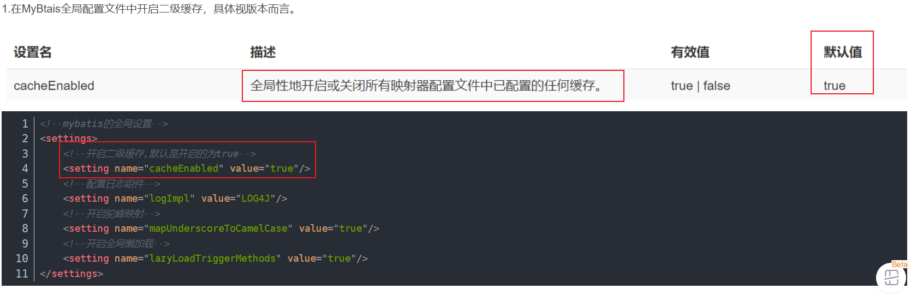

整理延迟加载、一级缓存、二级缓存和缓存使用建议。

## 懒加载

### 什么是延迟加载

[MyBatis 延迟加载（懒加载）一篇入门-腾讯云开发者社区-腾讯云 (tencent.com)](https://cloud.tencent.com/developer/article/1587223)

就是一个DTO有另外一个DTO信息，但是在执行查询的时候DTO的时候，不执行查询里面的DTO，等真的获取里面的DTO时，才主动触发查询对象。说白了就是不一次性加载所有对象，一个大的聚合根，可能包含多个对象，不能一下都加载了，浪费性能，按需加载。

### 如何配置

+ select 用来指定延迟加载所需要执行的 SQL 语句，也就是指定 某个SQL映射文件中的某个select标签对的 id，在这里我们指定了用户中通过id查询信息的方法
+ column 是指关联的用户信息查询的列，在这里也就是关联的用户的主键即，id
+ 
+ 

### 如何实现的

通用开启具体的DTO配置，关联具体的DTO到一个查询语句上，查询外层的DTO配置时，不直接查询里面的数据，而是在通过getFeileds() 触发加载。

## 一级缓存和二级缓存的问题

### 一级缓存导致的问题

**MyBatis的一级缓存分析：****默认开启而且不能关闭****，只能通过设置LocalCash参数为statement级别，****每次查询前清空缓存，来达到关闭的效果。**

MyBatis的一级缓存是基于SqlSession实现的，默认开启，同一个SqlSession发起的请求，先从一级缓存中查询查询，如果查询不到再从[数据库](https://cloud.tencent.com/solution/database?from_column=20065&from=20065)中查询，分布式环境下：数据库是隔离级别是read commit 级别情况下，为了**避免其他应用节点执行SQL更新语句后，本节点缓存得不到刷新而导致的数据一致性问题。（但是如果隔离级别是repeat read，就不存在问题了）**

**MyBatis的二级缓存分析：全局缓存，基于Mapper实现，默认关闭**

**在开启二级缓存的状况下，查询数据的顺序为：二级缓存→一级缓存→数据库。**

**Spring + Mybatis 对一级缓存的影响：**

1. **非事务环境下每次都开启新的SqlSession，一级缓存失效，因****为只有事务情况下才会服用sqlSession进而服用同一个connection，一级缓存只有在同一个SqlSession中才会有效。**
2. **事务环境下，SqlSession引用计数申请与释放，缓存与事务的隔离级别配合，可能导致缓存一致性问题；（****读已提交的级别，一级缓存导致数据不一致性，但是对于隔离级别是可重复读是不存在问题的****）**

### 二级缓存

二级缓存的作用域是SqlSessionFactory级别，整个应用程序只有一个。二级缓存区域是根据mapper的namespace划分的，相同的namespace的mapper查询的数据缓存在同一个区域。

后续每次查询这个mapper的SQL语句都会先查询二级缓存，查找不到执行一级缓存（默认开启，无法关闭，除非每次查选前，强制刷新缓存），要是还没有，会再查找数据库。

如何开启二级缓存：cacheEnable = true；看到默认值是true，所以默认是开始二级缓存的。



同时mapper文件配置cache标签，开始二级缓存，同时也可以在具体的SQL语句上，客制化缓存的配置，是否加入全局二级缓存以及刷新的时机。

```xml
<!--
    表示此namespace使用二级缓存
    cache标签的属性:
        eviction="LRU" :清除策略,默认为LRU,移除最长时间不被使用的对象。
        flushInterval="60000" :刷新间隔,以毫秒为单位的合理时间量
        size="512" :引用数目
        readOnly="true" :只读的缓存会给所有调用者返回缓存对象的相同实例
-->
<cache></cache>
<!--按照学号迭代查询-->
<!--
    二级缓存
        属性useCache="false",sql语句自己可以决定是否使用二级缓存
        属性flushCache="false",sql语句自己可以决定是否刷新缓存,多用与新增,修改,删除语句
-->
<select id="findUser" resultType="User">
    SELECT * FROM t_user WHERE id in
        <foreach collection="list" item="id" open="(" separator="," close=")">
            #{id}
        </foreach>
</select>
```

### 一些建议吧

看完上述两个小章节，可以知道一级缓存是默认开启的，而且是无法关闭的，对于同一个事务，如何数据库的隔离级别是可重复读，使用一级缓存是没有问题，但是一旦数据库隔离级别是读已提交，那就会导致另外一个问题，缓存的时间不是最新的，是旧的数据，带来一些不可避免的问题，可以通过每次查询前，清空缓存来达到这个效果，还是要和数据库的隔离级别搭配的者使用。（而且在mysql5.x版本中，DMS也是提供缓存的，但是很鸡肋，缓存的刷新的很快，mysql8直接删除了这个模块）。

对于二级缓存的开始，也是默认，关闭的话，可以通过全局配置cacheEnable来控制。试想一下：二级缓存的刷新速度，对于频繁更新删除数据，是没有什么意义的，导致缓存很快刷新，而且对于大量数据的缓存，也是会占用内存，需要配置好缓存的大小，以及过期，淘汰机制。

一级缓存导致的读取到旧数据，会被二级缓存给解决，其他session更新数据，导致缓存的更新，淘汰。
