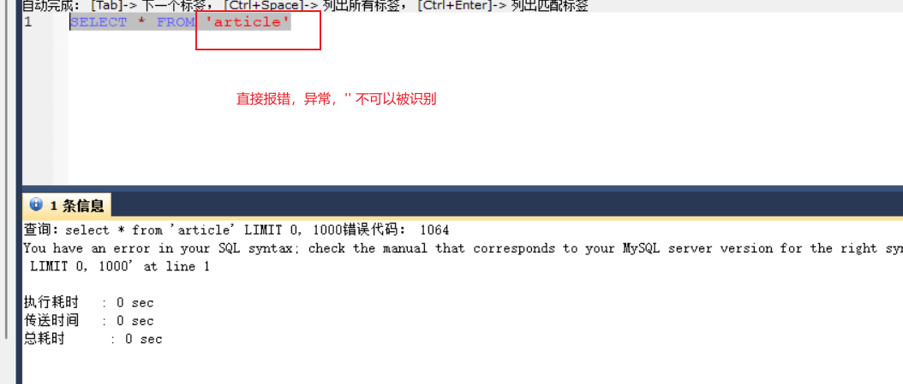
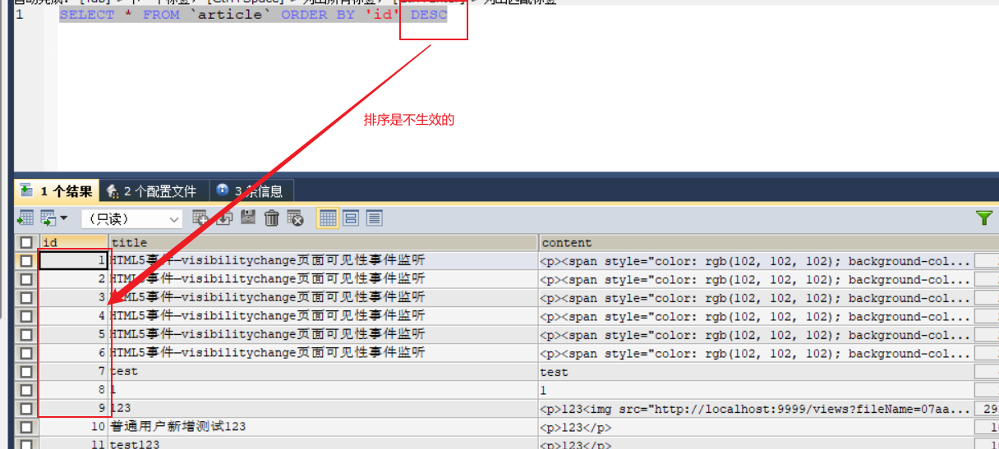
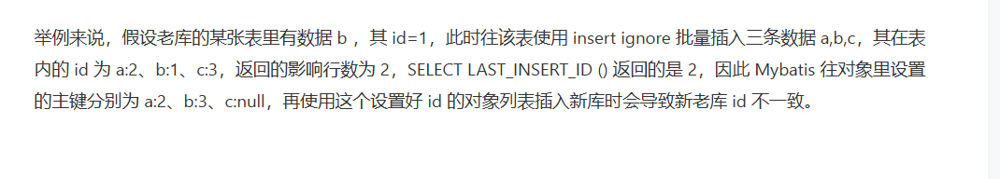

整理参数占位符、动态表名和字段、插入主键回填以及批量插入相关问题。

## 占位符问题

### # 和 $ 的区别？

#和$都是占位符，都起到了SQL执行参数动态替换的功能，但是# 会参与SQL预编译功能，自**动的加上单引号 ' '，**可以有效的避免SQL注入，以及提前对参数检查，避免了错误参数类型。

### 为啥 # 可以避免SQL注入

#{}在mybatis中的底层是运用了PreparedStatement 预编译，传入的参数会以 ? 形式显示而且因为sql的输入只有在sql编译的时候起作用，当sql预编译完后，传入的参数就仅仅是参数，不会参与SQL语句的生成，自**动的为变量加上单引号 ' '，**而${}则没有使用预编译，传入的参数直接和sql进行拼接，参与SQL语句的生成，由此会产生sql注入的漏洞。

### 什么时候会用$（动态表名+动态字段）

1. 当sql中表名是从参数中取的情况，使用# 会导致出现SQL异常，无法识别表，找不到表

2. order by排序语句中，**因为order by 后边必须跟字段名**，这个字段名不能带引号，如果带引号会被识别会字符串，而不是字段。

## Insert语句插入如何返回自增的ID

三种实现方式：[Mybatis 在 insert 插入操作后返回主键 id - distance66 - 博客园 (cnblogs.com)](https://www.cnblogs.com/distance66/p/15126391.html)

### 配置 useGeneratedKeys 和 keyProperty

useGeneratedKeys="true" 表示给主键设置自增长。

keyProperty="sid" 表示将自增长后的 Id 赋值给实体类中的 sid 字段。

```xml
<insert id="insertStudent" parameterType="Student" useGeneratedKeys="true" keyProperty="sid">
    insert into student(name, age)
    VALUES (#{name} , #{age})
</insert>
```

### 在 insert 标签中编写 selectKey 标签，查找最新的ID

新知识点：selectKey标签和order 属性

```xml
<insert id="insertStudent" parameterType="Student">
    insert into student(name, age)
    VALUES (#{name} , #{age})

    <selectKey keyProperty="sid" order="AFTER" resultType="int">
        SELECT LAST_INSERT_ID()
    </selectKey>
</insert>

1、< insert> 标签中没有 resultType 属性，但是 <selectKey> 标签是有的。
2、order="AFTER" 表示先执行插入语句，之后再执行查询语句。(真NB第一次见这个)
3、keyProperty="sid" 表示将自增长后的 Id 赋值给实体类中的 sid 字段。
4、SELECT LAST_INSERT_ID() 表示 MySQL 语法中查询出刚刚插入的记录自增长 Id。
```

### 在 Insert 标签中编写 selectKey 标签，查找刚插入的数据

存在一定的限制，依赖于唯一索引，就是 name 需要是 unique，不可重复的，这样才能在插入后，根据 name 来查询出主键 sid。

```xml
<insert id="insertStudent" parameterType="Student">
    insert into student(name, age)
    VALUES (#{name} , #{age})

    <selectKey keyProperty="sid" order="AFTER" resultType="int">
        select sid from student where name = #{name}   -- 小刀拉屁眼，开眼界了
    </selectKey>
</insert>

```

### Mybatis 是如何配置 useGeneratedKeys 和 keyProperty可以获取主键Id呢

#### select LAST_INSERT_ID()

SELECT LAST_INSERT_ID() 即为获取最后插入的ID值,获取到 insert 进去记录的主键值，只适用与自增主键，而且如果您将使用一个多行 [INSERT](https://dev.mysql.com/doc/refman/5.7/en/insert.html)的语句，** **[**LAST_INSERT_ID()**](https://dev.mysql.com/doc/refman/5.7/en/information-functions.html#function_last-insert-id)**返回所产生的价值****第一次插入****的行值（****SELECT LAST_INSERT_ID () 查询这次插入的最小 id** **）**，这样做的原因是可以轻松地重现[INSERT](https://dev.mysql.com/doc/refman/5.7/en/insert.html)与其他服务器相同的 语句。

#### mysql在执行完insert语句后返回的结果值是啥

执行完插入语句后，**MySQL 会返回这次插入影响的数据行数**，注意，使用 insert ignore 插入时，忽略的那部分数据不会加到影响的行数上。

#### mybatis 如何获取当前的主键ID呢

1. Mybatis 执行完插入语句后，MySQL 会返回这次插入影响的数据行数，注意，使用 insert ignore 插入时，忽略的那部分数据不会加到影响的行数上。
2. Mybatis 使用 SELECT LAST_INSERT_ID () 查询这次插入的最小 id 。（依赖于JDBC提供的一个函数，generateKey（），找个函数会自动执行select LAST_INSERT_ID 获取插入的ID返回给Mybatis）
3. **Mybatis 循环遍历插入时用的对象列表，循环的最大次数为第 1 步里获取的这次插入影响的行数**，使用 n 代表当前的循环次数，列表中的每个对象的 id 被赋值为 LAST_INSERT_ID () + n*AUTO_INCREMENT 。

#### 批量插入存在id不正确问题？（insert ignore into 场景）

[MySQL亿级数据平滑迁移实战 - OSCHINA - 中文开源技术交流社区](https://my.oschina.net/vivotech/blog/15526093)

执行完插入语句后，**MySQL 会返回这次插入影响的数据行数**，注意，使用 insert ignore 插入时，忽略的那部分数据不会加到影响的行数上，就会导致计算的id值是错误的，比如：


