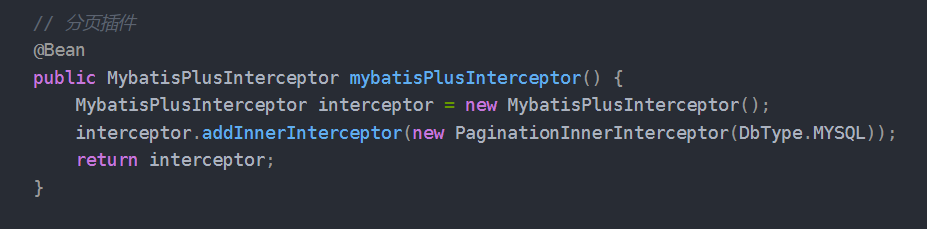

整理手动分页、PageHelper、游标分页和自定义拦截器分页的笔记。

## 如何分页

### 手动分页

手动分页，使用limit a，b这种，手动传入参数控制，

```xml
 <select id="selectActivityByPrincipal" resultMap="activity">
        select *
        from activity
        where principal = #{userId}
        <if test="start != nulll && limit != null" >
            limit #{start},#{limit}
        </if>
</select>
```

### 使用分页插件Pagehelper

本质也是通过Mybatis拦截器，拦截SQL语句的生成，生成对应的加入limit 语句生成



### 使用游标进行分页查询

直接使用limit start limit 这种语法查询，每次查询数据，都会查出所有符合的条件的数据然后，然后计数到offset位置执行limit的数据，前面的数据都是丢弃的。不利于性能，而且一旦limit的查询走的不是索引，回到更多问题，比如回表、扫全表找数据问题。

游标是对上述问题的一个优化，依赖一个有序的索引，快速定位本次查询的数据的起始位置索引，然后截断指定数据即可，一般采用自增的ID作为游标。

而且对于多个表的的分页查选，对于框架的分页排序算法是有优化操作，**避免limit 的回表，查询过多数据问题。**

```sql
select * from t_table
where id > LastQueryMaxId
order by id
limit 2000;
```

### 自定义Mybatis拦截器，拦截SQL自动分页

[Spring技术生态](https://www.yuque.com/kunkun-hl7p8/nggz5g/tmgbw2)
