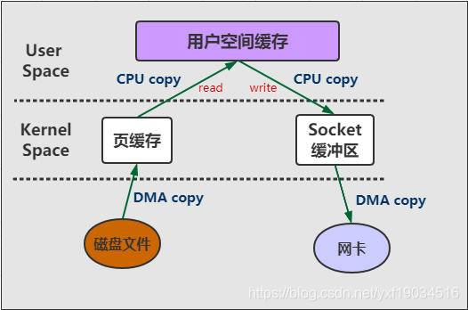
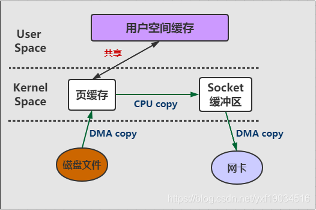
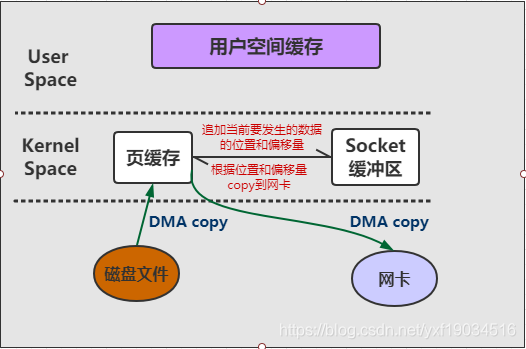
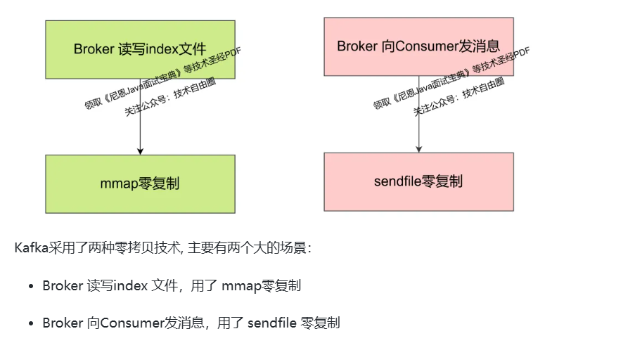
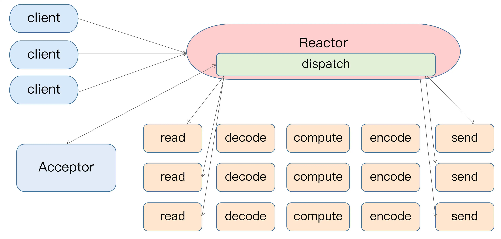
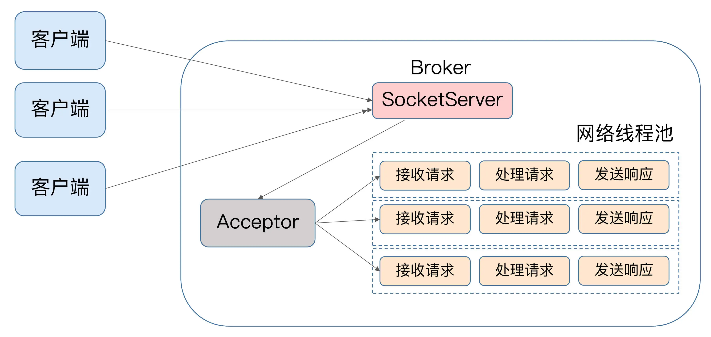
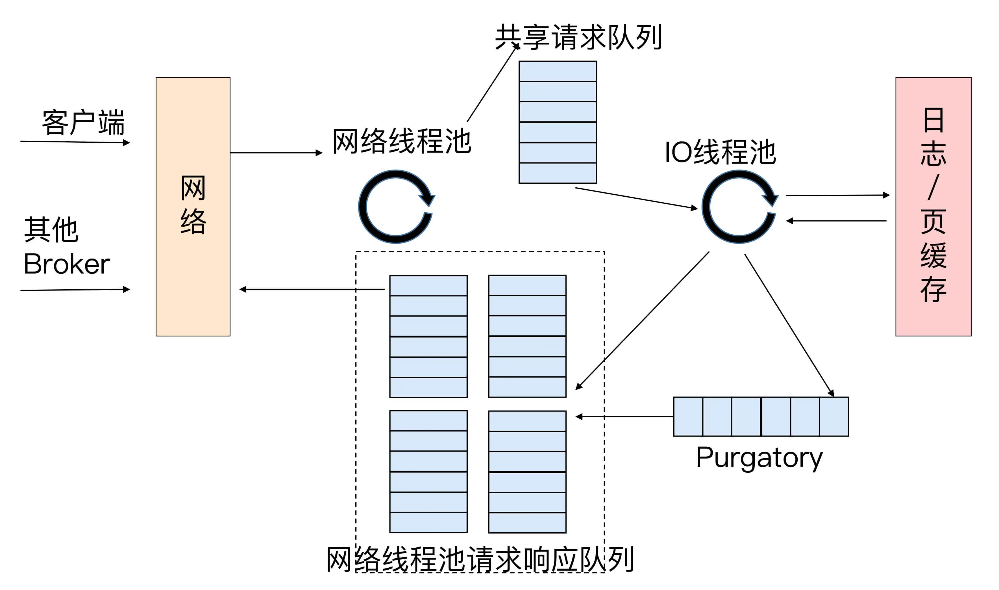

整理 Kafka 基础、零拷贝、页缓存、生产与消费优化、TCP 连接和 Reactor 网络模型。

## 什么是Kafka？

 Kafka 是什么呢？用一句话概括一下：Apache Kafka 是一款开源的消息引擎系统  ，用来传递消息，A系统可以发送一个消息给Kafka Broker 然后B系统可以消费这个消息。

## Kafka的优势？与其他消息队列的优势对比

也就是为啥要用Kafka呢？从性能，从业务上考虑

** "削峰填谷" ，就拿数据量激增来说，Kafka 能够有效隔离上下游业务，将上游突增的流量缓存起来，以平滑的方式传导到下游子系统中，避免了流量的不规则冲击。**

**高吞吐，低延迟，支持大批量数据的写入，消费。**

## Kafka高性能，高吞吐量的原因

[《吃透MQ系列》之 Kafka 精妙的高性能设计 - 知乎 (zhihu.com)](https://zhuanlan.zhihu.com/p/416024029)

### 巧用零拷贝

[通俗易懂的Kafka零拷贝机制_kafka零拷贝的原理-CSDN博客](https://blog.csdn.net/yxf19034516/article/details/108518194)

#### 传统IO模式拷贝数据

传统的文件读写或者网络传输，通常需要将数据从内核态转换为用户态。应用程序读取用户态内存数据，写入文件 / Socket之前，需要从用户态转换为内核态之后才可以写入文件或者网卡当中。我们可以称之为read/write模式，此模式的步骤为：

1. 首先，调用read时，**磁盘文件拷贝到了内核态**；（DMA操作）
2. 之后，**CPU控制将内核态数据copy到用户态下；（CPU操作）**
3. 调用write时，**CPU先将用户态下的内容copy到内核态下的socket的buffer中；（CPU操作）**
4. 最后将内核态下的**socket buffer的数据copy到网卡设**备中传送；（DMA操作）
5. 

::: note
**DMA(Direct Memory Access，直接存储器访问)** 是所有现代电脑的重要特色，它允许不同速度的硬件装置来沟通，而不需要依赖于 CPU 的大量中断负载 。通俗来讲，就是**DMA 传输将数据从一个地址空间复制到另外一个地址空间**，当CPU 初始化这个传输动作，传输动作本身是由 DMA 控制器来实行和完成，也就是两个硬件之间完成的，而没有CPU的参与，那么CPU就可以释放出来做别的事情，这样极大地提高了效率。我们常见的硬件设备如**网卡**、**磁盘设备**、显卡、声卡之类的都支持DMA。

:::

传统IO有两个很大的缺点导致很慢：

1. 我们可以清楚的看到共产生了**4次copy**，**从磁盘文件到Kernal的相互读写是支持DMA copy的**，但即使是这样，从Kernal到User没有硬件的支持所以不支持DMA，还有两次CPU copy。
2. Kafka只是把文件存放到磁盘之后通过网络发出去，中间并不需要修改什么数据，那read和write的两次CPU copy的操作完全是多余的。

#### mmap拷贝

通过mmap ，**用户进程空间中某一块虚拟内存与内核中的物理内存（PageCache）形成映射，**而这块物理内存与目标文件的某一块形成映射，通过内存映射文件的方式，减少了数据在用户空间和内核空间之间的拷贝次数，从而提高了数据传输效率。一旦内存映射建立，进程就可以直接访问映射的内存区域，就像访问普通内存一样。对这部分内存的读写操作将直接影响到文件的内容。**如****果需要确保对映射区域的修改被写回到文件中，可以使用**`**msync**`**系统调用**。这步操作是可选的，取决于应用是否需要**立即将数据同步到磁盘**（其实就是刷新page cache到磁盘中；当不再需要映射时，使用`munmap`系统调用来解除映射，释放资源。

::: note
总结一句话：**mmap技术可以将磁盘文件映射到内存中**，**用户通过修改内存就能修改磁盘文件**。这样可以避免将数据从内核态拷贝到用户态再拷贝回内核态的过程，从而提高数据传输效率。

:::

mmap是零拷贝主要就是去掉read write这两次CPU copy以提升性能，调用mmap()来代替read调用，将内核的数据直接映射给用户态，不需要从内核copy数据到用户态了。

1. 用户程序调用 mmap()，**磁盘上的数据会通过 DMA被拷贝的内核缓冲区；（DMA操作）**
2. 接着操作系统会把这段**内核缓冲区与用户程序共享，这样就不需要把内核缓冲区的内容往用户空间拷贝；**
3. 用户程序**再调用 write()，操作系统直接将内核缓冲区的内容拷贝到 socket缓冲区中；（CPU操作）**
4. 最后， socket缓冲区再把数据发到网卡去。（DMA操作）

**把数据copy的次数从4次降低到了3次，少了一次CPU拷贝操作**

#### sendFile拷贝

1. 将文件拷贝到kernel buffer中；（DMA操作）
2. 向socket buffer中追加当前要发生的数据在kernel buffer中的位置和偏移量；（CPU记录，不copy数据）
3. 根据socket buffer中的位置和偏移量直接将kernel buffer的数据copy到网卡设备中；（DMA操作）

数据只经过了2次copy就从磁盘传送出去了（DMA操作），才是真正的Zero-Copy(这里的零拷贝是针对kernel来讲的，数据在kernel模式下是Zero-Copy)。但是有个问题用户态程序见不到具体的数据，无法对cpoy的数据操作加工了。

#### 页缓存加速零拷贝

一般情况下，我们每次发送完消息，持久化到磁盘，此时短时间内，操作系统是其对应的页缓存数据的，而在这段时间在消费者如果来poll数据，是直接读取到页缓存的数据，磁盘都不需要IO读取数据。

但是由于消费者的速度无法匹及生产者的速度，极有可能导致它消费的数据已经不在操作系统的页缓存中了，那么这些数据就会失去享有 Zero Copy 技术的资格。**这样的话，消费者就不得不从磁盘上读取它们**，这就进一步拉大了与生产者的差距，进而出现马太效应，即那些 Lag 原本就很大的消费者会越来越慢，Lag 也会越来越大。

#### Kafka中存在的零拷贝

##### Broker写Log Segment目录的index文件

[美团面试：10Wtps，Kafka为啥那快？kafka 零复制 Zero-copy 如何实现？](https://mp.weixin.qq.com/s/jqlyBfOWHabGBb5WefsYAA)

Broker 读写index 文件，用了 mmap零复制，为啥使用mmap，因为需要读取这个index文件，进行操作计算，导致执行offset所在的起始索引位置。而且对于写数据，用户态更是需要操作数据，写入文件，所以涉及到文件的读写都必须使用mmap，Kafka默认每隔4K的record batch记录一次offset 和 postito位置，写入稀疏索引文件。

##### 读取index文件，定位数据

快速定位消息所在的物理文件位置：

**假设要查找偏移量为 230 的消息？**

第一步： 通过跳 表 ，找 分段的index文件

Kafka 中存在一个 `ConcurrentSkipListMap` 来保存在每个日志分段，

通过跳跃表方式，定位到在 `00000000000000000217.index` ，

第二步： 通过 **改进的二分查找**， 找到**不大于 相对偏移量的 最大索引项**

通过二分法在偏移量索引文件中找到不大于 230-217 =13 的最大索引项，即 offset 12 那栏,拿到这个索引项的指针456位置

第三步：找日志文件，找到相对的目标 记录

从日志文件物理位置456开始，继续向后查找找到相对偏移量为13的消息。

在查找确认消息位置的时候：**偏移量索引使用 mmap 来映射操作索引数据，这样索引数据不需要拷贝到用户态，提高了性能**

##### 发送数据给消费者

消费者读取数据的时，poll指定位移的数据，拉取数据的时候，直接从log文件中读取数据到Page cache中，然后提交，直接把数据copy到网卡中，使用的是sendFile 方式的零拷贝，cpu全程不参与数据的拷贝，都是DMA拷贝数据。

### 生产者优化

1. 简单有效的消息传输协议和消息格式
2. 批量发送消息，以record batch为单位传输数据，多次请求网络请求合并为一次
3. 持消息压缩，减少网络传输的压力，压缩消息不仅仅减少了网络 IO，它还大大降低了磁盘 IO。因为批量消息在持久化到 Broker 中的磁盘时，仍然保持的是压缩状态，消费者拉取消息客户端解压。
4. 高效的序列化模型：Kafka 消息中的 Key 和 Value，都支持自定义类型，只需要提供相应的序列化和反序列化器即可。因此，用户可以根据实际情况**选用快速且紧凑的序列化方式**（比如 ProtoBuf、Avro）来**减少实际的网络传输量以及磁盘存储量，进一步提高吞吐量。**
5. [内存池](https://zhida.zhihu.com/search?q=%E5%86%85%E5%AD%98%E6%B1%A0&zhida_source=entity&is_preview=1)复用（真的好这个思想）：Producer 发送消息是批量的， 因此消息都 会先写入 Producer 的 内存 中 进行缓冲， 直到多条消息 组成了一 个 Batch，才会 通过网络 把 Batch 发给 Broker。 当这个 Batch 发送完毕后，显然这部分数据还会在 Producer 端的 JVM 内存中，由于不存在引用了，它是可以被 JVM 回收掉的。但是JVM GC 时一定会存在 Stop The World 的过程，降低吞吐量	，Kafka 设计出**非常优秀的内存池机制，**它和连接池、线程池的本质一样，都是为了提高复用，减少频繁的创建和释放。具体实现：1、**Producer 一上来就会占用一个固定大小的内存块，比如 64MB**，然后将 64 MB 划分成 M 个小内存块（比如一个小内存块大小是 16KB）。**2、当需要创建一个新的 Batch 时，直接从内存池中取出一个 16 KB 的内存块即可，**然后往里面不断写入消息，但最大写入量就是 16 KB，接着将 Batch 发送给 Broker ，**3、此时该内存块就可以还回到缓冲池中继续复用了，根本不涉及垃圾回收。（内存的复用机制，逃逸触发JVM GC 或者 加速 GC的过程）。**

### Broker优化

1. broker集群，支持集群操作
2. 后台线程及时的清理过期的数据
3. 后台线程及时的压缩消息

### 优秀的网络模型

1+N+M 模型

1：表示 1 个 Acceptor 线程，负责监听新的连接，然后将新连接交给 Processor 线程处理（分发请求使用）
N：表示 N 个 Processor 线程，每个 Processor 都有自己的 selector，负责从 socket 中读写数据，封装一个个任务，放入IO任务队列中。（网络线程，一个网络线程对应一个IO复用模型，可想有有多快了（redis 单线程才一个模型））
M：表示 M 个 KafkaRequestHandler 业务处理线程，读取IO任务队列中任务，它通过调用 KafkaApis 进行业务处理，然后生成 response，再交由给 Processor 线程。（IO线程）

### 消息持久化存储

1. 主题分区，支持多个分区负载写入数据
 ⅱ. 优秀的分区日志文件写入机制
    1. 分区日志文件分为多个Log Segment，每个文件大小不大
2. 日志文件顺序写入
3. 索引文件的写入基于Zero copy机制写入数据
 a. 索引文件也是稀疏索引
 b. 位移索引 按照offert读取数据
 c. 时间索引 按照timestamp读取数据
4. 利用Page cache，利用了操作系统本身的缓存技术，在读写磁盘日志文件时，其实操作的都是内存，然后由操作系统决定什么时候将 Page Cache 里的数据真正刷入磁盘。

### 消费者优化机制

1. 高效的索引文件定位机制
    1. 通过跳跃表定位Log Segment文件
    2. 通过稀疏索引，二分查找快速定位 拉取数据的在Log Segment文件中最近的位置
2. mmap优化读取索引文件：通过 mmap（memory mapped files） 读写上面提到的[稀疏索引文件](https://zhida.zhihu.com/search?q=%E7%A8%80%E7%96%8F%E7%B4%A2%E5%BC%95%E6%96%87%E4%BB%B6&zhida_source=entity&is_preview=1)，进一步提高查询消息的速度。**只有索引文件的读写才用到了 mmap.**
3. **sendFile 零拷贝：**将消息从磁盘文件中读出来，然后通过网卡发给消费者，那这一步又可以怎么优化呢？Kafka 用到了**零拷贝（Zero-Copy）技术来提升性能**。所谓的零拷贝是指数据直接从磁盘文件复制到网卡设备，而无需经过应用程序，减少了内核和用户模式之间的[上下文切换](https://zhida.zhihu.com/search?q=%E4%B8%8A%E4%B8%8B%E6%96%87%E5%88%87%E6%8D%A2&zhida_source=entity&is_preview=1)。
4. 消费者组机制，批量拉取拉取数据，每次拉取一组数据执行消费
5. 高效利用Page cache机制，一般Broker 写入消息到磁盘中，会先写入Page cache中，但是一般写入后，消费者立刻就会来拉取数据，直接读取到Page cache中最新的数据，不需要磁盘IO操作。

## Java 生产者是如何管理 TCP 连接的？

### 什么时间创建TCP链接

1. KafkaProducer 实例创建时启动 Sender 线程，从而创建与 bootstrap.servers 中所有 Broker 的 TCP 连接。
2. KafkaProducer 实例**首次更新元数据信息之后**（当Producer与 bootstrap.servers中所有Broker都创建链接后，会发起一个MetaData请求，获取最新的集权元数据信息），拿到元数据信息后，发现与哪些Broker没有创建链接，还会再次创建与集群中所有 Broker 的 TCP 连接。
3. 如果 Producer 端发送消息到某台 Broker 时发现没有与该 Broker 的 TCP 连接，那么也会立即创建连接。

### Producer更新MetaData的时机

场景一：当 Producer 尝试给一个不存在的主题发送消息时，Broker 会告诉 Producer 说这个主题不存在。此时 Producer 会发送 METADATA 请求给 Kafka 集群，去尝试获取最新的元数据信息。
场景二：Producer 通过 metadata.max.age.ms 参数定期地去更新元数据信息。该参数的默认值是 300000，即 5 分钟，也就是说不管集群那边是否有变化，Producer 每 5 分钟都会强制刷新一次元数据以保证它是最及时的数据。

### 什么时间关闭TCP链接

+ 一种是用户主动关闭，调用 kill -9 主动"杀掉"Producer 应用。当然最推荐的方式还是调用 producer.close() 方法来关闭。
+ 一种是 Kafka 自动关闭，与Producer 端参数 connections.max.idle.ms 的值有关。默认情况下该参数值是 9 分钟，即如果在 9 分钟内没有任何请求"流过"某个 TCP 连接，那么 Kafka 会主动帮你把该 TCP 连接关闭。

## Producer 如何与Broker创建Tcp链接，保持联系的

### 创建连接的时间

1. KafkaProducer 实例创建时启动 Sender 线程，从而创建与 **bootstrap.servers 中所有 Broker 的 TCP 连接**。（参数指定多少broker创建多少）
2. KafkaProducer 实例首次更新元数据信息之后，还会再次创建与集群中**所有 Broker **的 TCP 连接。
    1. 比如向一个不存在的主题发送消息，Broker会报错Porcuser不存在该主题，Producer会主动拉取最新的集群元数据信息，更新信息
    2. KafkaProducer自己也会定时的拉取最新的集群信息，尽量保持集群最新的配置

> 当 Producer 更新了集群的元数据信息之后，如果发现与某些 Broker 当前没有连接，那么它就会**创建一个 TCP 连接，多少个broker就会创建多少个连接****，**一个 Producer 默认会向集群的所有 Broker 都创建 TCP 连接，不管是否真的需要传输请求
>

3. 如果 Producer 端发送消息到某台 Broker 时发现没有与该 Broker 的 TCP 连接，那么也会立即创建连接。
4. 如果设置 **Producer 端 connections.max.idle.ms 参数大于 0**，则步骤 1 中创建的 TCP 连接会被自动关闭；如果设置该参数 =-1，那么步骤 1 中创建的 TCP 连接将无法被关闭，从而成为"僵尸"连接。

## Java Consumer 如何与Broker创建Tcp连接，保持联系

### 何时创建 TCP 连接？

消费者端主要的程序入口是 KafkaConsumer 类。和生产者不同的是，构建 KafkaConsumer 实例时是不会创建任何 TCP 连接的。 TCP 连接是在调用 KafkaConsumer.poll 方法时被创建的。再细粒度地说，在 poll 方法 内部有 3 个时机可以创建 TCP 连接 。

1.  发起 FindCoordinator 请求时 ： 当消费者程序首次启动调用 poll 方法时，它需要向 Kafka 集群发送一个名为 FindCoordinator 的请求，希望 Kafka 集群告 诉它哪个 Broker 是管理它的协调者，**同时也会复用这个链接获取 获取Kafka集群元数据  **
2.  连接协调者时： Broker 处理完上一步发送的 FindCoordinator 请求之后，会返还对应的响应结果 （Response），显式地告诉消费者哪个 Broker 是真正的协调者，因此在这一步，消费者 知晓了真正的协调者后，会创建连向该 Broker 的 Socket 连接。
3.  消费数据时 ： 消费者会为每个要消费的分区创建与该分区领导者副本所在 Broker 连接的 TCP。

### FindCoordinator如何确认链接那个Broker？

理论上任何一个 Broker 都可以，也就是说消费者可以发送 FindCoordinator 请求给集群中的任意服务器。在这个问 题上，社区做了一点点优化：**消费者程序会向集群中当前负载最小的那台 Broker 发送请 求**。负载是如何评估的呢？其实很简单，**就是看消费者连接的所有 Broker 中，谁的待发送 请求最少**。

### 何时使用链接？

消费者关闭 Socket 也分为**主动关闭和 Kafka 自动关闭。**

主**动关闭是指你 显式地调用消费者 API 的方法去关闭消费者**，具体方式就是手动调用 KafkaConsumer.close() 方法，或者是执行 Kill 命令，不论是 Kill -2 还是 Kill -9；

而 **Kafka 自动关闭是由消费者端参数 connection.max.idle.ms控制的，**该参数现在的默认 值是 9 分钟，即如果某个 Socket 连接上连续 9 分钟都没有任何请求"过境"的话，那么 消费者会强行"杀掉"这个 Socket 连接 。

## Kafka如何处理网络请求

### Kafka 使用的是 Reactor 模式

Reactor 模式是事件驱动架构的一种实现方式，特别适合应用于处理多个客户端并发向服务器端发送请求的场景。Reactor架构如下：多个客户端会发送请求给到 Reactor。**Reactor 有个请求分发线程 Dispatcher(想起SpringMvc的Dispatchservlet了，分发请求)**，也就是图中的 Acceptor，它会将不同的请求下发到多个工作线程中处理。Acceptor 线程只是用于请求分发，不涉及具体的逻辑处理，非常得轻量级，因此有很高的吞吐量表现。而这些工作线程可以根据实际业务处理需要任意增减，从而动态调节系统负载能力。

> 核心的设计即使有个Acceptor组件负责分发请求，有一组工作线程进行处理，怎么处理，怎么安排还是可以按照业务架构设计。
>

Kafka的架构设计：客户端请求到Broker后，Acceptor分发请求，交给工作线程处理。

### 网络线程池

Kafka 的 Broker 端有个 SocketServer 组件，类似于 Reactor 模式中的 Dispatcher，它**也有对应的 Acceptor 线程和一个工作线程池**，在 Kafka 中，**工作线程池有个专属的名字，叫网络线程池**。**Kafka 提供了 Broker 端参数 num.network.threads**，用于调整该网络线程池的线程数。其默认值是 3，**表示每台 Broker 启动时会创建 3 个网络线程，专门处理客户端发送的请求。**
	Acceptor 线程采用轮询的方式将入站请求公平地发到所有网络线程中，因此，在实际使用过程中，这些线程通常都有相同的几率被分配到待处理请求。这种轮询策略编写简单，同时也避免了请求处理的倾斜，有利于实现较为公平的请求处理调度。

### IO 线程池

> Redis 6.0 中添加的多线程就是IO线程，主线程负责接受连接请求，Socket的处理（解析，回写）指令的解析等都是由IO多线程完成，，执行具体指令的还是主线程，只是在这种情况下，主线程专心负责执行指令，不在负责其他非核心业务了，比如，去医院看病，挂号、检查，买药，给药，都是护士完成，医生只负责看病，开药。
>

**客户端发来的请求会被 Broker 端的 Acceptor 线程分发到****任意一个网络线程****中**，由它们来进行处理。那么，当网络线程接收到请求后，它是怎么处理的？Kafka 在这个环节又做了一层异步线程池的处理，我们一起来看一看下面这张图。

当**网络线程拿到请求后**，它不是自己处理，而是将请求放入到一个**共享请求队列**中。Broker 端还有个 IO 线程池，**IO 线程池负责从该共享请求队列中取出请求，执行真正的处理。**

+ 如果是 PRODUCE 生产请求，则将消息写入到底层的磁盘日志中；
+ 如果是 FETCH 请求，则从磁盘或页缓存中读取消息。（**这可是Kafka的零拷贝技术发挥实力的地方，直接发送到网卡数据**）

IO 线程池处中的线程才是执行请求逻辑的线程。Broker 端参数 num.io.threads 控制了这个IO 线程池中的线程数。目前该参数默认值是 8，表示每台 Broker 启动后自动创建 8 个 IO 线程处理请求。当IO线程处理完请求后，**会将生成的响应发送到网络线程池的响应队列中**，然后由对应的网络线程负责将Response返还给客户端。

**请求队列是所有网络线程共享的，而响应队列则是每个网络线程专属的**。这么设计的原因就在于，**Dispatcher只是用于请求分发而不负责响应回传**，因此**只能让每个网络线程（网络线程池中的线程）自己发送Response给客户端，**所以这些Response也就没必要放在一个公共的地方，那个网络线层接受的请求创建的任务，就由那个线程回发。

### Purgatory组件

Kafka中著名的"炼狱"组件。**它是用来缓存延时请求（Delayed Request）的。所谓延时请求**，就是那些一时未满足条件不能立刻处理的请求。**比如设置了acks=all的PRODUCE请求，一**旦设置了acks=all，那么该请求就必须等待ISR中所有副本都接收了消息后才能返回，此时处理该请求的IO线程就必须等待其他Broker的写入结果。当请求不能立刻处理时，它就会暂存在Purgatory中。稍后一旦满足了完成条件，IO线程会继续处理该请求，并将Response放入对应网络线程的响应队列中。
