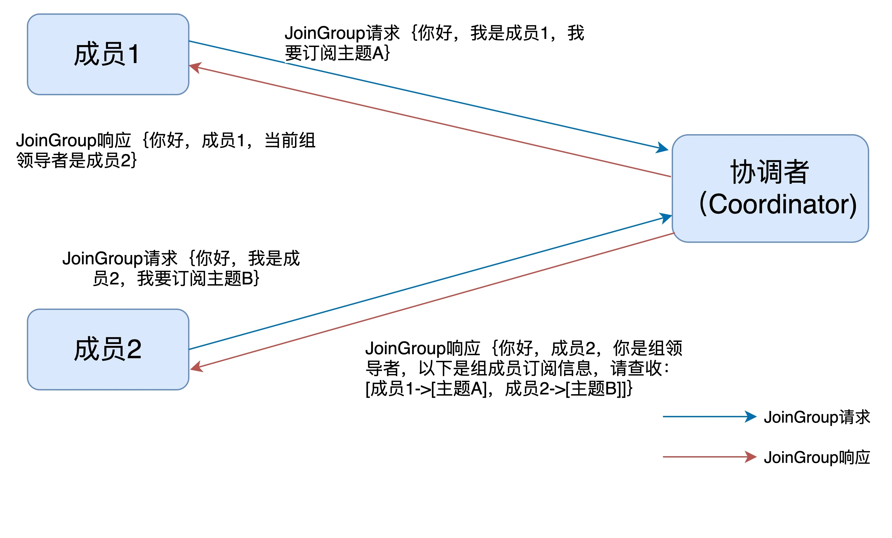
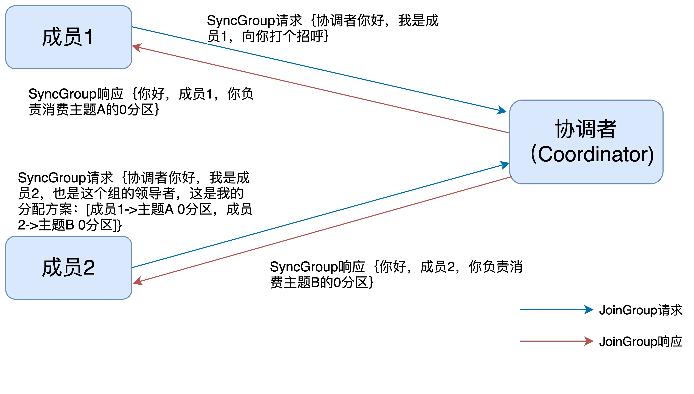
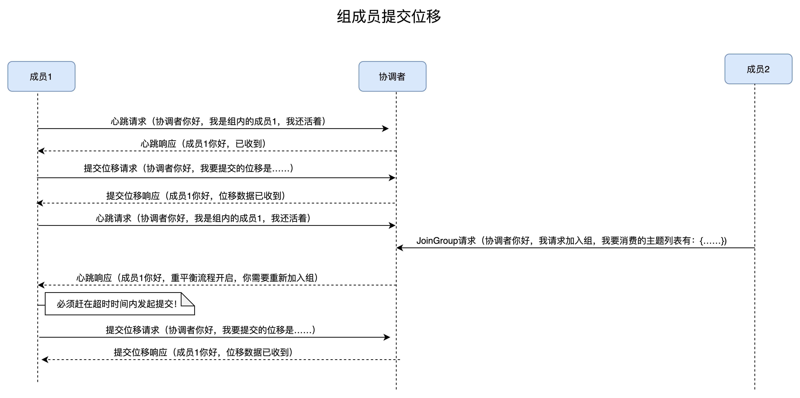

整理 Coordinator、消费者心跳、组状态机、重平衡流程和位移处理。

## 消费者Rebalance

### Coordinator 消费协调器

协调者，在 Kafka 中 对应的术语是 Coordinator，它专门为 Consumer Group 服务，负责为 Group 执行 Rebalance 以及提供位移管理和组成员管理等。

具体来讲，Consumer 端应用程序**在提交位移时，其实是向 Coordinator 所在的 Broker 提交位移**。**同样地，当 Consumer 应用启动时，也是向 Coordinator 所在的 Broker 发送 各种请求，然后由 Coordinator 负责执行消费者组的注册、成员管理记录等元数据管理操作 。（个人理解，就是负责管理消费者的一个机制，类似一个管理者，监听者，可以参考，Redis的哨兵集群机制）**

### Coordinator创建与定位服务

所有 Broker 在启动时，都会创建和开启相应的 Coordinator 组件。也就是说，所有 Broker 都有各自的 Coordinator 组件。

Consumer Group 如何确定为它服务的 Coordinator 在哪台 Broker 上呢？答案就在我们之前说过的** Kafka 内部位移主题 __consumer_offsets 身上 ，找到__consumer_offsets分区leader副本所在的broker就找了Coordinator所在的位置**。Kafka 为某个 Consumer Group 确定 Coordinator 所在的 Broker 的算法有 2 个 步骤。

第 1 步：确定由位移主题的哪个分区来保存该 Group 数据： partitionId=Math.abs(groupId.hashCode() % offsetsTopicPartitionCount)。
  第 2 步：找出该分区 Leader 副本所在的 Broker，该 Broker 即为对应的 Coordinator。

### FindCoordinator

 当消费者程序首次启动调用 poll 方法时，它需要向 Kafka 集群发送一个名为 FindCoordinator 的请求，希望 Kafka 集群告 诉它哪个 Broker 是管理它的协调者 。就会触发**9.17.2**的Coordinator 定位服务。

### Rebalance触发的条件

1. 消费者组消费的 主题数量有变化，新增或者删除
2. 消费者组消费的 主题分区有变化，新增或者删除
3. 消费者组消费者挂掉，或者新增（这个感觉是最常见的）

> 个人感觉1,2两种情况，一半都是发布新版本的时候，但此时也会重启服务发布，也就是重启了消费者，也不存在所谓的rebalance了，但是要是滚动发布，或者蓝绿发布的话，可能会存在不同节点消费者rebalance的情况。
>

### 消费者的心跳机制

** 	**当 Consumer Group 完成 Rebalance 之后（每次init完成，执行消费时候）**，每个 Consumer 实例都会定期地向 Coordinator 发送心跳请求，表明它还存活着**。 如果某个 Consumer 实例不能及时地发送 这些心跳请求，Coordinator 就会认为该 Consumer 已经"死"了，从而将其从 Group 中移除，然后开启新一轮 Rebalance。**  **

**说到心跳机制，我们就可以可预测的会有两个参数控制，发送的频率（多少时间发送一次请求），以及间隔多少时间没有收到请求（判断回话超市时间），判断下线。（Redis的哨兵集群，以及RedisCluster 没少用，哈哈）。**

::: note
比如2s发送一次请求，6s之内没有接受到心态，判断下线，也就是6s只要手动一次心跳请求，就可以判断存活，继续下一轮的判断。

:::

### 消费者"离线"情况

1. 心跳超时，自动判断下线，消费者奔溃，宕机等
2. 消费能力不足时，自动离线，退出消费者组，触发reblance

>  	Consumer 端有一个参数，**用于控制 Consumer 实际消费能力对 Rebalance 的影响，**即 max.poll.interval.ms 参数。**它限定了 Consumer 端应用程序两次 调用 poll 方法的最大时间间隔**。**它的默认值是 5 分钟，**表示你的 Consumer 程序如果在 5 分钟之内无法消费完 poll 方法返回的消息，那么 Consumer 会主动发起"离开组"的请 求，Coordinator 也会开启新一轮 Rebalance。 （tmd，真恶心）
>

### 消费者组状态机

重平衡一旦开启，**Broker 端的协调者组件**就要开始忙了，**主要涉及到控制消费者组的状态流转**。当前，Kafka 设计了一套消费者组状态机（State Machine），来帮助协调者完成整个重平衡流程。

**消费者组的 5 种状态**

| **状态** | **含义** |
| :--- | :--- |
| Empty | 组内没有任何成员，但消费者组可能存在已提交的位移数据，而且这些位移尚未过期。 |
| Dead | 同样是组内没有任何成员，但组的元数据信息已经在协调者端被移除。协调者组件保存着当前向它注册过的所有组信息，所谓的元数据信息就类似于这个注册信息。 |
| PreparingRebalance | 消费者组准备开启重平衡，此时所有成员都要重新请求加入消费者组。 |
| CompletingRebalance | 消费者组下所有成员已经加入，各个成员正在等待分配方案。该状态在老一点的版本中被称为AwaitingSync，它和 CompletingRebalance 是等价的。 |
| Stable | 消费者组的稳定状态。该状态表明重平衡已经完成，组内各成员能够正常消费数据了。 |

一个消费者组最开始是** Empty** 状态，当重平衡过程开启后，它会被置于 PreparingRebalance 状态等待成员加入，之后变更到 CompletingRebalance 状态等待分配方案，最后流转到 Stable 状态完成重平衡。

### 重平衡的流程

> 当重平衡开启时，协调者会给予成员一段缓冲时间，要求每个成员必须在这段时间内快速地上报自己的位移信息，然后再开启正常的JoinGroup/SyncGroup请求发送。但是要是消费者在处理复杂业务逻辑，无法及时汇报offset，reblance会导致重复消费问题。
>

1. 协调者通过 消费者发起的**心跳请求响应**高所消费者要**开启重平衡了**
2. 消费者发起JoinGroup请求，上报自己消费的主题，分区信息
3. 协调者选**取其中一个消费者为领导者，一般是第一个发起JoinGroup的请求**
4. 协调者把所有JoinGrop请求中告知的消费主题，分区有关的信息，**发送给消费领导者**
5. 消费领导者，按照返回的内容，执行分配消费方案
6. 消费者**发起SyncGroup请求，非领导者请求内容为null，领导者请求内容为消费方案**
7. 协调者，响应SyncGroup请求，把**分配方案同步给消费者**
8. 完成rebalance

JoinGroup 请求的处理过程：JoinGroup 请求的主要作用是：将组成员订阅信息发送给领导者消费者，待领导者制定好分配方案后，重平衡流程进入到 SyncGroup 请求阶段。

 SyncGroup 请求的处理流程，SyncGroup 请求的主要目的是：让协调者把领导者制定的分配方案下发给各个组内成员。**当所有成员都成功接收到分配方案后，消费者组进入到 Stable 状态，即开始正常的消费工作。**

### 重平衡时协调者对组内成员提交位移的处理

正常情况下，每个组内成员都会定期汇报位移给协调者。当重平衡开启时，协调者会给予成员一段缓冲时间，要求每个成员必须在这段时间内快速地上报自己的位移信息，然后再开启正常的JoinGroup/SyncGroup请求发送。

### 过期位移删除的时间

当有新成员加入或已有成员退出时，**消费者组的状态从 Stable 直接跳到 PreparingRebalance 状态**，此时，**所有现存成员就必须重新申请加入组**，变相的相当于消费者退出消费组了。当所有成员都退出组后，消费者组状态变更为** Empty**。**Kafka 定期自动删除过期位移的条件就是，组要处于 Empty 状态**。

因此，**如果你的消费者组停掉了很长时间（超过 7 天，因为Kafka默认位移过期的时间就是7天）**，那么 Kafka 很可能就把该组的位移数据删除了在 Kafka 的日志中一定经常看到下面这个输出：

Removed ✘✘✘ expired offsets in ✘✘✘ milliseconds。这就是 Kafka 在尝试定期删除过期位移。只有 Empty 状态下的组，才会执行过期位移删除的操作。

### Rebalance 的缺点？

**暂停消费：**Rebalance 过程对 Consumer Group 消费过程有极大的影响。在 STW 期间，所有应用线程都会停止工作，表现为整个应用程序僵在那边一动不动。Rebalance 过程也和这个类似，在 Rebalance 过程中，所有 Consumer 实例都会停止消费，等待 Rebalance 完成。stw会导致消费者不消费消息，而且如果consumer实例很多的话，会导致stw很长时间，是无法接受的。

**可能重复消费: **Consumer被踢出消费组，**可能还没有提交offset**，Rebalance时会Partition重新分配其它Consumer,会造成重复消费，虽有幂等操作但耗费消费资源，亦增加集群压力

**集群不稳定：**Rebalance扩散到整个ConsumerGroup的所有消费者，因为一个消费者的退出，导致整个Group进行了Rebalance，并在一个比较慢的时间内达到稳定状态，影响面较大

**影响消费速度：**频繁的Rebalance反而降低了消息的消费速度，大部分时间都在重复消费和Rebalance
