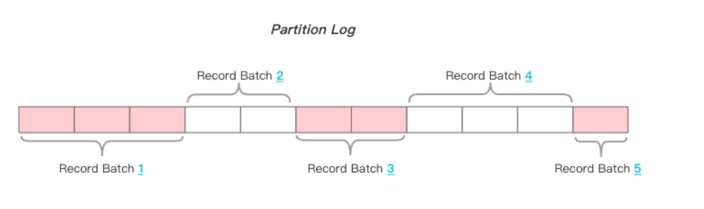

整理消息一致性、消息丢失场景、可靠性配置、幂等生产者和事务生产者。

## Kafka如何做到多系统之间传递消息一致性

 **消息传递的格式**：既然消息引擎是用于在不同系统之间传输消息的，那么如何设计待传输消息的格式从来都是 一等一的大事 ， Kafka使用的是纯二进制的字节序列。当然消息还是结构化的，只是在使用之前都要将其转换成 二进制的字节序列。

 **消息传输的协议**：消息设计出来之后还不够，消息引擎系统还要设定具体的传输协议，即我用什么方法把消息传输出去。常见的有两种方法：

**点对点模型**：也叫消息队列模型。如果拿上面那个"民间版"的定义来说，那么系统 A 发送的消息只能被系统 B 接收，其他任何系统都不能读取 A 发送的消息。日常生活的例 子比如电话客服就属于这种模型：同一个客户呼入电话只能被一位客服人员处理，第二个 客服人员不能为该客户服务。

**发布 / 订阅模型**：与上面不同的是，它有一个主题（Topic）的概念，你可以理解成逻辑 语义相近的消息容器。该模型也有发送方和接收方，只不过提法不同。发送方也称为发布 者（Publisher），接收方称为订阅者（Subscriber）。和点对点模型不同的是，这个模 型可能存在**多个发布者向相同的主题发送消息**，**而订阅者也可能存在多个，它们都能接收 到相同主题的消息**，允许消息的被多个不同的消费者消费。

## 消息不丢失持久化配置

### 消息丢失的场景

#### producer使用了异步发送

producer使用了异步发送，只管发送，不管发送结果，没有重试，异常处理。

使用不带回调通知的发送 API：producer.send(msg) ，执行完一个操作后不去管它的结果是否成功，到时发送失败的情况很多，比如

- 网络抖动，导致消息压根就没有发送到 Broker 端
- 或者消息本身不合格导致 Broker 拒绝接收
    * 消息体太大
    * 格式，内容校验不符合等

正确的使用方式：使用带有回调通知的发送 API：producer.send(msg, callback)。callback（回调）能准确地告诉你消息是否真的提交成功了。一旦出现消息提交失败的情况，你就可以有针对性地进行处理，发起重试，即使达到错误的重试次数也可以记录保存下来，为后续操作。

#### 消费者提交offset顺序错误

比如说一个消费者当前消费位移是10，拉取消息后，**立刻提交了offerset，**但是此时消费中断，仅仅消费了部分消息，但是提交了全部的位移，下次消费消息的时候，要从最新的部分开始拉取消息，中间还在未消费的消息，直接丢失了消费。

解决方案也很简单，**维持先消费消息（阅读），再更新消费位移（书签）的顺序即可。**

#### Kafka多线程异步消费自动提交

Consumer 程序从 Kafka 获取到消息后开启了多个线程异步处理消息，而 Consumer 程序自动地向前更新位移。假如其中某个线程运行失败了，它负责的消息没有被成功处理，但位移已经被更新了，（比如后面的offset的消费提交了）因此这条消息对于 Consumer 而言实际上是丢失了。**如果是多线程异步处理消费消息，Consumer 程序不要开启自动提交位移，而是要应用程序手动提交位移。**

#### 新的leader落后于旧leader很多，导致消息丢失

如果一个 Broker 落后原先的 Leader 太多，那么它一旦成为新的 Leader，必然会造成消息的丢失

#### 增加主题分区，consumer最新位置拉取消息

当增加主题分区后，在某段"不凑巧"的时间间隔后，Producer 先于 Consumer 感知到新增加的分区，而 Consumer 设置的是"从最新位移处"开始读取消息，因此在 Consumer 感知到新分区前，Producer 发送的这些消息就全部"丢失"了，或者说 Consumer 无法读取到这些消息。

### 如何保证消息不丢失呢

#### producer

+ 使用带有回调函数的发送方式，能对异常系做处理，开始重试机制
+ 设置 acks = all。acks 是 Producer 的一个参数，设置成 all，则表明所有副本 Broker 都要接收到消息，该消息才算是"已提交"，即所有ISR副本集合都要写入才可以确认消息写入成功。
+ 设置 retries 为一个较大的值，retries 同样是 Producer 的参数，对应前面提到的 Producer 自动重试。当出现网络的瞬时抖动时，消息发送可能会失败，此时配置了 retries > 0 的 Producer 能够自动重试消息发送，避免消息丢失。

#### broker

+ 设置 unclean.leader.election.enable = false，Broker 端的参数，它控制的是**哪些 Broker 有资格竞选分区的 Leader**。如果一个 Broker 落后原先的 Leader 太多，那么它一旦成为新的 Leader，必然会造成消息的丢失。故一般都要将该参数设置成 false，即不允许这种情况的发生。
+ 设置 **replication.factor >= 3，Broker 端的参数，****用来设置主题的副本数。**每个主题可以有多个副本，副本位于集群中不同的broker上，也就是说副本的数量不能超过broker的数量，否则创建主题时会失败。其实这里想表述的是，最好将消息多保存几份，避免leader副本挂机了，因为没有副本导致不可用了。

> 举例子解释replication.factor参数：当前集群有三个broker，创建的topic有3个分区partition
>
> 当replication-factor为1，基本上一个broker上一个分区。当一个broker宕机了，该topic就无法使用了，因为三个分区只有两个能用，拼凑不出一个完整的topic了。
>
> 当replication-factor为2时，可能分区数据分布情况是如下情况，每个分区会有一个follower副本，当其中一个broker宕机了，kafka集群还能完整凑出该topic的三个分区，例如当brokerA宕机了，可以通过brokerB和brokerC组合出topic的三个分区。
brokerA， partiton0，partiton1，
brokerB， partiton1，partiton2，
brokerC， partiton2，partiton0，
>

+ 设置 min.insync.replicas > 1，Broker 端参数，控制的是消息至少要被写入到多少个副本才算是"已提交"（开启ack=all优先级最高）。设置成大于 1 可以提升消息持久性，不仅要写入leader副本中，也要写入follwer副本中。确保 replication.factor > min.insync.replicas。如果两者相等，那么只要有一个副本挂机，整个分区就无法正常工作了（比如我们设置有三个副本，一个leader副本，两个follower副本，设置至少写入3个副本才算提交成功，一旦某个分区挂机了，会导致一直不满足条件2，无法提交成功），推荐设置成 **replication.factor = min.insync.replicas + 1。（即至少要有N+1个副本，而且，Producer发送的消息，Broker至少写入N个副本之中，才能返回ACK）**

#### consumer

确保消息消费完成再提交。**Consumer 端有个参数 enable.auto.commit，最好把它设置成 false，并采用手动提交位移的方式**，单 Consumer 多线程处理，手动控制位移提交offset策略。

## Kafka如何保证消息的幂等发送

### 单会话幂等生产者

[kafka11-kafka生产者重试和幂等性_kafka生产者幂等配置-CSDN博客](https://blog.csdn.net/m0_63833709/article/details/140243338)

1. 幂等性的关键组件
+ Broker 端的唯一键鉴别: Broker 需要能够识别重复的数据。这通常通过缓存已处理消息的唯一键或 ID 来实现。
+ 分区粒度的唯一键: Kafka 在每个分区上设计唯一键，让每个分区的 Leader 副本负责判断数据是否重复。
+ Producer + TopicPartition 维度的唯一键: 考虑到可能存在**多个生产者向同一分区写入数据**，**Kafka 选择以 Producer + TopicPartition 为维度设计唯一键，一个Producer只能在一个分区上写入一次消息，不能重复写。**
+ 序列号保证顺序性: **生产者发送消息时附带一个序列号，该序列号基于 TopicPartition 从 0 开始递增**。Broker 端通过序列号检测消息是否顺序发送。
2. Kafka 幂等性的实现
+ PID（Producer ID）: 每个生产者被分配一个唯一的生产者 ID（PID）。
+ Sequence Number: 生产者为每个 TopicPartition 发送的消息分配一个序列号。
    - 新消息: **如果新收到的消息序列号正好比 Broker 存储的序列号大 1，Broker 将其视为新消息**。
    - 重复消息: **如果序列号小于或等于 Broker 存储的最大序列号**，Broker 将其视为重复消息，不予记录**（幂等发送在次）**
    - 失序消息: 如果序列号与本地存储的最大序列号相差大于 1，Broker 检测到消息失序，**但这不影响幂等性，只是可能意味着有些消息在传输过程中丢失。（理论上消息序列号是按照发送消息时间生成的，但是呢消息什么时候到达Broker是另外一说，谁先到不好说****，Broker段有支持最大乱序消息的配置，默认超过5个record也会抛出异常）**
3. PID（Producer ID）

**每个生产者在初始化时被分配一个唯一的 PID，PID 是通过 Broker 端的 ProducerIdManager#generateProducerId() 方法生成的，通常是一个单调递增的数字，****当生产者故障重启后，会被分配一个新的 PID，这是幂等性无法跨会话保证的原因。**

4. Sequence Number

在为生产者生成 PID 后，Kafka 在 PID + TopicPartition 级别上为每条消息分配一个序列号，生产者在发送消息时，序列号会递增，Broker 通过序列号来验证数据是否重复。

5. 生成者PID 与分记录存储映射关系

Broker 使用 ProducerStateManager 类来存储生产者和给定 TopicPartition 之间的映射关系。**映射的 key 是 PID，value 是 ProducerStateEntry**，其中包含了给定 TopicPartition 中的 ProducerBatch 状态 。

6. ProducerStateEntry

**ProducerStateEntry 包含一个 batchMetadata 队列**，记录每个 ProducerBatch 的元数据，batchMetadata 包括：

* lastSeq:** 每个 ProducerBatch 的最后一条消息的序列号**。
* lastOffset: 每个 ProducerBatch 中最后一条消息的 offset。
* offsetDelta: 最后一条消息和第一条消息的 offset 差值。
* timestamp: 每个 ProducerBatch 最后一条消息的添加时间。
* ProducerStateEntry 只保留最近的 5 个批次元素，当达到容量限制时，最早的批次元数据会被移除。

### 事务生产者

#### 事务介绍

事务型 Producer 能够保证将消息原子性地写入到多个分区中。这批消息要么全部写入成功，要么全部失败。另外，事务型 Producer 也不惧进程的重启。**Producer 重启回来后，Kafka 依然保证它们发送消息的精确一次处理。（因为用的同一个事务ID，而且producer的id也没有改变）**

---

设置事务型 Producer 的方法也很简单，满足两个要求即可：

+ 和幂等性 Producer 一样，开启 enable.idempotence = true。
+ **设置 Producer 端参数 transctional. id。最好为其设置一个有意义的名字。**

和普通 Producer 代码相比，事务型 Producer 的显著特点是调用了一些事务 API，**如 initTransaction、beginTransaction、commitTransaction 和 abortTransaction，它们分别对应：事务的初始化、事务开始、事务提交以及出现异常事务终止 。（参数JDBC的事务）**

---

保证 Record1 和 Record2 被当作一个事务统一提交到 Kafka，要么它们全部提交成功，要么全部写入失败。**实际上即使写入失败，Kafka 也会把它们写入到底层的日志中，也就是说 Consumer 还是会看到这些消息**。因此在 Consumer 端，读取事务型 Producer 发送的消息也是需要一些变更的。修改起来也很简单，设置 isolation.level 参数的值即可。当前这个参数有两个取值：

1. read_uncommitted：这是默认值，表明 Consumer 能够读取到 Kafka 写入的任何消息，不论事务型 Producer 提交事务还是终止事务，其写入的消息都可以读取。很显然，如果你用了事务型 Producer，那么对应的 Consumer 就不要使用这个值。
2. read_committed：表明 Consumer 只会读取事务型 Producer 成功提交事务写入的消息。当然了，它也能看到非事务型 Producer 写入的所有消息。

#### 同一个Record batch中消息记录

如果两个Producer，一个开启事务，一个关闭事务，**分别向同一个Topic的同一个Partititon发送消息**，那么存在在Broker端的消息会长什么样呢？

可见，**同一个Record Batch中的Producer id、epoch、消息类型等都是****一样****的**，所以不存在同一个Batch中，既有事务消息，又有非事务消息；**换言之，某个Batch，要么是事务类型的，要么是非事务类型的。**

#### 事务幂等的具体实现

在Producer启动时，会进行初始化动作，**此时会拿到（ProduceId+Epoch）**，然后在每条消息上添加Sequence字段（从0开始），之后的请求都会携带Sequence属性。_**（每次produce重启，其id不变（单回话幂等，每次重启produce都会变），但是epoch会加1，即使由于网络原因，epoch低的消息Broker是不会接受的，相当于过时的消息）**_

+ 如果存在重复的RecordBatch（**通过produceId+epoch+sequence**），那么Broker会直接返回重复记录，client收到后丢弃重复数据。
+ 如果Broker收到的RecordBatch与预期不匹配，**例如比预期Sequence小或者大**，都会抛出`OutOfOrderSequenceException`异常
    - 比预期Sequence小：这种请求就是典型的重复发送，直接拒绝掉并扔出异常
    - 比预期Sequence大：因为设置了幂等参数后，`max.in.flight.requests.per.connection` 参数的设定最大值即为5，**即Producer可能同时发送了5个未ack的请求**，Sequence较大的请求先来到了，依旧扔出上述异常，消息的有序性。

#### 事务的注册，提交，回滚实现

[Kafka事务「原理剖析」 - 昔久 - 博客园 (cnblogs.com)](https://www.cnblogs.com/xijiu/p/16917741.html)

因为涉及到多个分区，事务的提交，避免需要一个事务协调器用于管理事务。其实很类似分布式事务。

### 二者区别

+ 幂等性 Producer 只能保证单分区、单会话上的消息幂等性；
+ 而事务能够保证跨分区、跨会话间的幂等性。从交付语义上来看，自然是事务型 Producer 能做的更多。
