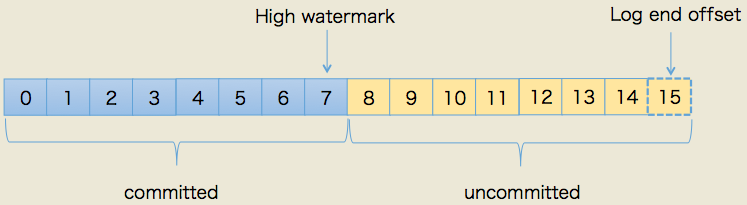

整理 Kafka 高可用、副本分布、ISR、Leader 选举、HW、LEO 和 Leader Epoch。

## Kafka 高可用的原因

### 分区副本

待补充。

### Broker集群

待补充。

### 消息持久化机制

待补充。

## kafka 分区副本机制

Kafka 定义了两类副本：领导者副本（Leader Replica）和追随者副本（Follower Replica）。

+ 领导者副本（Leader Replica）对外提供服务，这里的对外指的是与客户端程序进行交互；
+ 而追随者副本（Follower Replica）**只是被动地追随领导者副本而已，不能与外界进行交互，**追随者副本不处理客户端请求，它唯一的任务就是从领导者副本**异步拉取**消息，并写入到自己的提交日志中，从而实现与领导者副本的同步。

### 为啥追随者副本不需要对外提供设计

避免消息一致性的问题，比如追随着副本还没有拉取到最新的消息，另外一个住随着副本拉取到最新的消息，会到两边副本消息不一致，而且容易出现重复消息的问题，比如消费某一个副本时读取一个消息，消费另外一个副本时候也会出现一次。

**方便实现"Read-your-writes"**：当你使用生产者API向Kafka成功写入消息后，马上使用消费者API去读取刚才生产的消息，一定可以读到刚写入的消息，但是如果去读取副本的话，可能会存在时间差，读取不到消息，就像我发一条微博，但是我去刷新的时候，发现看不到，但是只有leader副本提供服务的话，不会存在这个问题。

**方便实现单调读（Monotonic Reads）：**就是对于一个消费者用户而言，在多次消费消息时，它不会看到某条消息一会儿存在一会儿不存在。**如果允许追随者副本提供读服务**，那么假设当前有2个追随者副本F1和F2，它们**异步地拉取领导者副本数据**。倘若F1拉取了Leader的最新消息而F2还未及时拉取，那么，此时如果有一个消费者先从F1读取消息之后又从F2拉取消息，它可能会看到这样的现象：第一次消费时看到的最新消息在第二次消费时不见了，这就不是单调读一致性。但是，如果所有的读请求都是由Leader来处理，那么Kafka就很容易实现单调读一致性。

### 副本的分布

同一个分区下的所有副本保存有相同的消息序列，这些副本分散保存在**不同的Broker上**，从而能够对抗部分Broker宕机带来的数据不可用。在实际生产环境中，每台Broker都可能保存有各个主题下不同分区的不同副本，因此，单个Broker上存有成百上千个副本的现象是非常正常的。按照一定的算法，将分区副本分配在不同的Broker上，避免出现一个Broker宕机了，导致分区不完整，无法提供服务问题。

### ISR集合

追随者副本不提供服务，只是定期地**异步拉取**领导者副本中的数据而已。既然是异步的，就**存在着不可能与Leader实时同步的风险**。Kafka引入了In-sync Replicas，也就是所谓的ISR副本集合,**ISR中的副本都是与Leader同步的副本**，相反，不在ISR中的追随者副本就被认为是与Leader不同步的，显而易见的是Leader副本天然就在ISR中。也就是说，ISR不只是追随者副本集合，它必然包括Leader副本。甚至在某些情况下，ISR只有Leader这一个副本.

Kafka判断Follower是否与Leader同步的标准，不是看相差的消息数，而是另有"玄机"。这个标准就是Broker端参数**replica.lag.time.max.ms**参数值。这个**参数的含义是Follower副本能够落后Leader副本的最长时间间隔，当前默认值是10秒**。这就是说，只要一个Follower副本落后Leader副本的时间不连续超过10秒，那么Kafka就认为该Follower副本与Leader是同步的，即使此时Follower副本中保存的消息明显少于Leader副本中的消息。（与Redis的主从同步不一样，redis主从同步是看消息同步进度来判断谁当主实例（第二轮比较时候））。

Follower副本唯一的工作就是不断地从Leader副本拉取消息，然后写入到自己的提交日志中。如果**这个同步过程的速度持续慢于Leader副本的消息写入速度，那么在replica.lag.time.max.ms时间后，此Follower副本就会被认为是与Leader副本不同步的，因此不能再放入ISR中**。此时，Kafka会自动收缩ISR集合，将该副本"踢出"ISR，倘若该副本后面慢慢地追上了Leader的进度，那么它是能够重新被加回ISR的。这也表明，ISR是一个动态调整的集合，而非静态不变的。

### 分区Leader选择

#### 选举的流程

Kafka partition leader的选举过程如下 (由controller执行)：

+ 从Zookeeper中读取当前分区的所有ISR(in-sync replicas)集合
+ 调用配置的分区选择算法选择分区的leader
    - 算法1：如果某个分区的Leader不可用，Kafka就会从ISR集合中选择一个副本作为新的Leader。
    - 算法2：开启 unClean选举，从所有副本中选举一个leader，不再局限一个ISR集合（因为可能存在ISR集合为空情况，Leader挂了，而且所有follower都不在ISR中，要是算法1，那就尴尬了，分区直接不可用，导致topic不可用了，但是开始了unClean选举会导致数据丢失，不一致问题，因为不再ISR集合中）

#### unClean选举

因为ISR是可以动态调整的，那么自然就可以出现这样的情形：ISR为空。因为Leader副本天然就在ISR中，如果ISR为空了，就说明**Leader副本也"挂掉"了**，Kafka需要重新选举一个新的Leader。可是ISR是空，此时该怎么选举新Leader呢？

Kafka把所有不在ISR中的存活副本都称为非同步副本。通常来说，**非同步副本落后Leader太多，因此，如果选择这些副本作为新Leader，就可能出现数据的丢失**。毕竟，这些副本中保存的消息远远落后于老Leader中的消息。**在Kafka中，选举这种副本的过程称为Unclean领导者选举**。Broker端参数unclean.leader.election.enable控制是否允许Unclean领导者选举。

开启Unclean领导者选举可能会造成数据丢失，**但好处是，它使得分区Leader副本一直存在**，不至于停止对外提供服务，因此提升了高可用性。反之，**禁止Unclean领导者选举的好处在于维护了数据的一致性，避免了消息丢失，但牺牲了高可用性。二者各有利弊，但是一般情况下可以通过其他机制增强可以用性，更多时候要维护数据一致性，不建议开始Unclean选举。**

## 副本异步拉取数据的流程

### Kafka高水位Hw 与 LEO

每个Kafka副本对象都有两个重要的属性：LEO和HW。**注意是所有的副本，而不只是leader副本。**

+ LEO：即日志末端位移(log end offset)，记录了该副本底层日志(log)中**下一条消息的位移值。注意是下一条消息**！也就是说，如果LEO=10，那么表示该副本保存了10条消息，位移值范围是[0, 9]。另外，leader LEO和follower LEO的更新是有区别的。
+ HW：即上面提到的水位值。对于同一个副本对象而言，其HW值不会大于LEO值。小于等于HW值的所有消息都被认为是"已备份"的（replicated）。**当集群中副本所在的Broker发生故障而后恢复时，副本先将数据截断（Truncation）到其HW处（LEO等于HW），然后再开始向Leader同步数据。****(此时hw及其以后的数据都是丢失的)**

上图中，HW值是7，**表示位移是0~7的所有消息都已经处于"已备份状态"（committed）**，而LEO值是15，那么8~14的消息就是尚未完全备份（fully replicated）——为什么没有15？因为刚才说过了，**LEO指向的是下一条消息到来时的位移**，故上图使用虚线框表示。我们总说consumer无法消费未提交消息。这句话如果用以上名词来解读的话，应该表述为：**consumer无法消费分区下leader副本中位移值大于****分区HW****的任何消息**。这里需要特别注意**分区HW就是leader副本的HW值**。

### HW与LEO的更新机制

每一个副本都保存了其HW值和LEO值，即Leader HW（实际上也是Partition HW）、Leader LEO和Follower HW、Follower LEO。而Leader所在的Broker上还保存了其他Follower的LEO值，**称为Remote LEO，用于Producer发送消息后，更新leo后，从比较所有副本的LEo计算出最小的一个值作为Leader副本的HW值。****（为啥使用两套Leo的原因在此，Remoter上的Leo值是为了辅助更新leader的HW）**

当Producer向.log文件写入数据时，**Leader LEO首先被更新**。**而Remote LEO要等到Follower向Leader发送同步请求（Fetch）时请求参数告诉leader自己的leo值**，才会根据请求携带的当前Follower LEO值更新。随后，**Leader计算所有副本LEO的最小值，将其作为新的Leader HW**。**考虑到Leader HW只能单调递增**，因此还增加了一个LEO最小值与当前Leader HW的比较，**防止Leader HW值降低**（`max[Leader HW, min(All LEO)]`）。

Follower在接收到Leader的响应（Response）后，**首先将消息写入.log文件中，随后更新Follower LEO**。由于Fectch 请求的Response中携带了新的Leader HW，Follower将其与刚刚更新过的Follower LEO相比较，取**最小值作为Follower HW（**`**min(Follower LEO, Leader HW)**`**）。**

### follower副本端的follower副本LEO何时更新

Follower副本端的LEO值就是其底层日志的LEO值，也就是说每当新写入一条消息，其LEO值就会被更新(类似于LEO += 1)。当follower发送FETCH请求后，leader将数据返回给follower，此时follower开始向底层log写数据，从而自动地更新LEO值。

### leader副本端的follower副本LEO何时更新？

leader副本端的follower副本LEO的更新发生在**leader在处理follower FETCH请求时**。一旦leader接收到follower发送的FETCH请求，**它首先会从自己的log中读取相应的数据，但是在给follower返回数据之前它先去更新Remoter follower的LEO，同时计算出当前Leader的HW值，一并放回给follower。**

### follower副本何时更新HW？

follower更新HW发生在其更新LEO之后，**一旦follower向log写完数据，它会尝试更新它自己的HW值**。具体算法就是比较当前LEO值与FETCH响应中leader的HW值，取两者的小者作为新的HW值。

> 这告诉我们一个事实：如果follower的LEO值超过了leader的HW值，那么follower HW值是不会越过leader HW值的。
>

### leader副本何时更新LEO？

和follower更新LEO道理相同，leader写log时就会自动地更新它自己的LEO值，即生产者发送消息，写入broker的时间。

### leader副本何时更新HW值？

1. 副本成为leader副本时：当某个副本成为了分区的leader副本，Kafka会尝试去更新分区HW。这是显而易见的道理，毕竟分区leader发生了变更，这个副本的状态是一定要检查的！
2. broker出现崩溃导致副本被踢出ISR时：若有broker崩溃则必须查看下是否会波及此分区，因此检查下分区HW值是否需要更新是有必要的
3. **producer向leader副本写入消息时：因为写入消息会更新leader的LEO，故有必要再查看下HW值是否也需要修改，min（leo，followers leo）（写消息的时候）**
4. **leader处理follower FETCH请求时：当leader处理follower的FETCH请求时首先会从底层的log读取数据，之后会尝试更新分区HW值（Fetch 消息的时候）**

### Kafka epoch

[Kafka：副本同步机制（HW&Leader Epoch） - koktlzz - 博客园](https://www.cnblogs.com/koktlzz/p/14580109.html)

[Kafka水位(high watermark)与leader epoch的讨论 - huxihx - 博客园](https://www.cnblogs.com/huxi2b/p/7453543.html)

#### 什么是epoch

Kakfa引入Leader Epoch后，**Follower就不再参考HW，而是根据Leader Epoch信息来截断Leader中不存在的消息**。这种机制可以弥补基于HW的副本同步机制的不足，Leader Epoch由两部分组成：

+ Epoch：**一个单调增加的版本号。每当Leader副本发生变更时，都会增加该版本号。Epoch值较小的Leader被认为是过期Leader，不能再行使Leader的权力；**
+ 起始位移（Start Offset）：**Leader副本在该Epoch值上写入首条消息的Offset。**

举例来说，某个Partition有两个Leader Epoch，分别为(0, 0)和(1, 100)。这意味该Partion历经一次Leader副本变更，版本号为0的Leader从Offset=0处开始写入消息，共写入了100条。而版本号为1的Leader则从Offset=100处开始写入消息。

#### epoch 保存位置

每个副本的Leader Epoch信息既缓存在内存中，也会定期写入消息目录下的leaderer-epoch-checkpoint文件中。

#### LeaderEpochRequest 核心机制

当一个Follower副本从故障中恢复重新加入ISR中，它将执行以下流程：

1. **向Leader发送LeaderEpochRequest，请求中包含了Follower的Epoch信息**；
2. **Leader将返回其Follower所在Epoch的Last Offset**；
    1. 如果Leader与Follower处于同一Epoch，那么Last Offset显然等于Leader LEO（这肯定的必须的）
    2. 如果Follower的Epoch落后于Leader，**则Last Offset等于Follower Epoch + 1所对应的Start Offset**。这可能有点难以理解，我们还是以(0, 0)和(1, 100)为例进行说明：Offset=100的消息既是Epoch=1的Start Offset，也是Epoch=0的Last Offset；
3. Follower接收响应后**根据返回的Last Offset截断数据**，截断数据的数据是依据**LeaderEpochRequest请求的返回值Last Offset值，不在参考HW值了，避免了数据丢失和不一致性问题。**
4. 在数据同步期间，只要Follower发现Leader返回的Epoch信息与自身不一致，便会随之更新Leader Epoch并写入磁盘。

#### epoch解决了哪些问题

**Kafka使用HW值来决定副本备份的进度，而HW值的更新通常需要额外一轮FETCH RPC才能完成，故而这种设计是有问题的。**它们可能引起的问题包括：

+ 备份数据丢失，落后的机器成为leader 后截断数据会导致的问题。
+ 备份数据不一致 ：数据离散问题，也就是每个leader都写入了数据，两边数据不一致问题。（其实就是脑裂问题）
