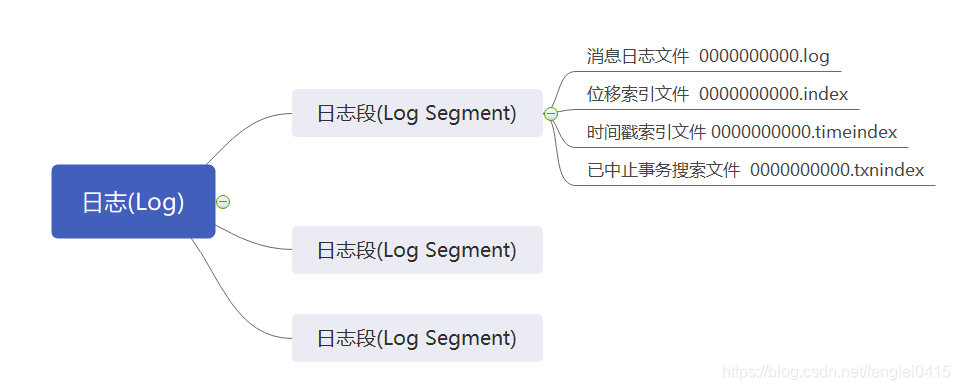
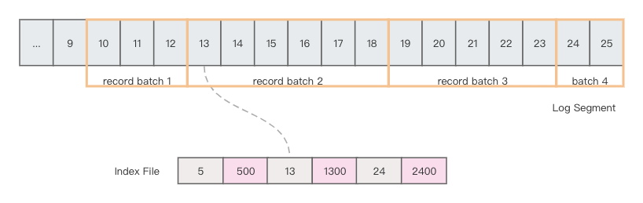
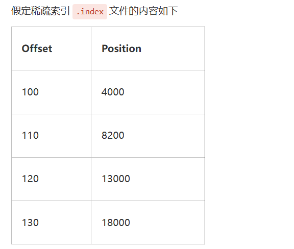
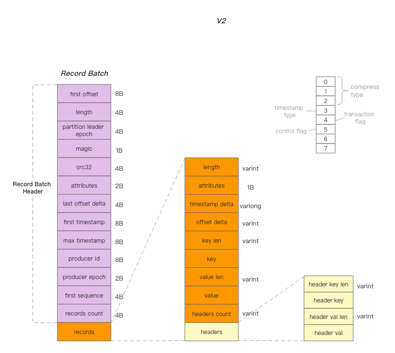

整理分区、日志段、索引、消息定位、日志清理、RecordBatch 与消息压缩。

## Kafka分区

### 什么是分区

Kafka 中的分区机制指的是将每个主题划分成多个分区（Partition），每个分区是一组有序的消息日志。生产者生产的每条消息只会被发送到一个分区中，也就是说如果向一个双分区的主题发送一条消息，这条消息要么在分区 0 中，要么在分区 1 中。如你所见，Kafka 的分区编号是从 0 开始的，如果 Topic 有 100 个分区，那么它们的分区号就是从 0 到 99。

### 为啥使用分区，有什么好处？

**负载均衡，高吞吐量，同时支持多个生成者写入分区数据****（高性能）**，而且**分区可以分布在不同的broker机器上，降低机器的负载****（高可用）**，而且支持特殊业务含义数据存储分区。

而且数据的读写操作也都是针对分区这个粒度而进行的，这样每个节点的机器都能独立地执行各自分区的读写请求处理。并且，**还可以通过添加新的节点机器来增加整体系统的吞吐量。**

**适配消费者组，**每个消费者组中的消息者可以分别消费一个分区，加速消费。

### 多个分区，如何确认消息分发到那个分区？

1. 轮询：轮询策略，也称 Round-robin 策略，即顺序分配。比如一个主题下有 3 个分区，那么第一条消息被发送到分区 0，第二条被发送到分区 1，第三条被发送到分区 2，以此类推。当生产第 4 条消息时又会重新开始，即将其分配到分区 0。
2. 随机：随机策略，也称 Randomness 策略。所谓随机就是：随意地将消息放置到任意一个分区上
3. 按照Key 区分：按消息键保序策略，也称 Key-ordering 策略，**Kafka 允许为每条消息定义消息键**，简称为 Key。这个 Key 的作用非常大，它可以是一个有着明确业务含义的字符串，比如客户代码、部门编号或是业务 ID 等；也可以用来表征消息元数据。**一旦消息被定义了 Key，那么你就可以保证同一个 Key 的所有消息都进入到相同的分区里面**，由于每个分区下的消息处理都是有顺序的，故这个策略被称为按消息键保序策略
4. 按**照自定义的业务规则区**分，比如，IP，地理位置：同一个IP的生成者消息存储到从同一个IP所有区的分区，同时消费者保持在一起，避免网络传输延迟问题。

## Kafka Broker 持久化数据

### 如何存储消息

Kafka 使用**消息日志（Log）来保存数据**，一个日志就是磁盘上一个只能追加写（Append-only）消息的物理文件（一个分区一个Log文件）。因为只能追加写入，故避免了缓慢的随机 I/O 操作，改为性能较好的顺序 I/O 写操作，这也是实现 **Kafka 高吞吐量特性的一个重要手段。**

在 Kafka 底层，**一个日志又近一步细分成多个日志段**，消息被追加写到当前最新的日志段中，当写满了一个日志段后，Kafka 会自动切分出一个新的日志段，并将老的日志段封存起来。Kafka 在后台还有定时任务会定期地检查老的日志段是否能够被删除，从而实现回收磁盘空间的目的。（类似redis的定时任务，删除过期的key）

### 分区的存储日志Log结构



Kafka 日志对象由多个**日志段对象组成**，而每个日志段对象会在磁盘上创建一组文件。图中的一串数字 0 是该日志段的起始位移值（Base Offset），也就是该日志段中所存的第一条消息的位移值。

一个 Kafka 主题（topic）有很多分区，**每个分区就对应一个 Log 对象(一个分区一个Log对象）**，在物理磁盘上则对应于一个子目录。比如你创建了一个双分区的主题 test-topic，那么，Kafka 在磁盘上会创建两个子目录：test-topic-0 和 test-topic-1。而在服务器端，这就是两个 Log 对象。每个子目录下存在多组日志段，也就是多组.log、.index、.timeindex 文件组合，只不过文件名不同，**因为每个日志段的起始位移不同。（文件名就是其实就是起始位移值）**

### xxxx.log文件

log文件是用来存储消息的，是按照Producer发送的Record Batch存储的数据，结构如下：



### xxxx.index文件

**index文件则是用来存储稀疏索引的，每隔4K存储一次offset+position，**帮助快速定位指定位点的文件position用的。所谓的稀疏索引文件，是指记录的不是每个offset 对应的的log position，而是每隔一段数据记录一次，默认是4K的log记录一次，当前offset对应的log文件positon，读取指定offset开始的数据，会先二分查找确定要读取的offset所在index文件记录中符合记录的offset的position，然后拿着这个position去log文件定位数据，遍历 Record Batch，比较Record Batch上的最小offset和确定数据有没有再这个Record Batch中，在的话直接返回Record Batch的起始position，读取fetch.max.size指定长度的值，返回给客户端（至少一个Record Batch，避免fetch.max.size很小，不足Record Batch的大小）交互是Record Batch为基本单位进行的。

> 为什么要隔4K做一次稀疏索引，而不是3K或者5K呢？其实这里主要是与硬件兼容，**现在多数厂商的硬件，单次扫数据的大小一般都是4K对齐的**，很多硬件都提升到了8K甚至16K，**稀疏索引设置为4K，能保证即便是当前的 Record Batch 只有 1 个字节，后续的内容也能缓存在Page Cache中**，下次扫描的时候，可以直接从缓存中读取，而不用扫描磁盘。另外，基于V2的存储版本，消息的查询都是以 Record Batch 作为最小粒度查询的**，而 Producer 设置的 Record Batch 的默认值为16K**，即如果消息攒批合理的话，稀疏索引可能是每隔16K构建起来的。
>

文件存储记录大概如下，记录某一个每隔4k大小，记录一次offset对应的position。



### 消息定位

基于稀疏索引的Kafka，如何快速定位查询，既然是稀疏索引，那么势必没有将每条消息对应的position做存储，那么如何定位单条消息的具体位置呢？**先****读取稀疏索引定位大致位置（此时index文件的读取是mmap读取，不需要加载到Jvm内存中）****，然后读取log文件准确定位，以Record Batch 为基本单位遍历查找数据。**

当我们要寻找 offset 为115（**9.7.4章节的**稀疏索引实例）位点对应的文件position时，因为115介于「110-120」之间，因此稀疏索引能够提供的信息就是需要从** 8200 的位置开始往后找**，这样也就粗略定位了115的大致position；延深一些，110对应的8200如何寻找呢？ 真实环境是这个数据存储在index文件中，而且会有很多KV对，其实这里使用的是二分查找，当知道某个队列的起始结束offset，快速定位其中的某个offset时，二分查找是个非常不错的方案。（稀疏索引的粗略定位数据位置）

精细定位，通过迭代 Record Batch 实现，已经知道了开始扫描的文件起始position，那么接下来就要逐一扫描 Record Batch，因为V2版本的消息协议已经指定了 **Record Batch 的总长度、start offset、last offset等**，因此很快可以定位，要查找的offset的数据是否在当前Record Batch中。

> 举个例子：比如从1300位置读取 Record Batch，不过只读取header部分即可，从而获取到此Batch的最小offset是13，最大offset是18，length是XX（参照V2消息协议，其中都有存储这些数据）；发现目标offset 20并不在当前Batch中，那么继而扫描下一个 Record Batch，并最终定位 Record Batch 3 就是目标Batch，**然后返回此Batch 的start position （注：不是20对应的position，而是Record Batch 3的position）因为消息的操作的基本单位是 Record Batch ，不能是个半拉的不完整，会导致客户端解析失败。**
>

### 消息的拉取

数据拉取就相对比较简单了，这里用到了零拷贝技术，也就是`FileChannel.transferTo(long position, long count)`，将磁盘中的数据直接拷贝给网卡。**拷贝的起始position就是上文中定位的，而拷贝的长度则是**`**fetch.max.bytes**`。

但`fetch.max.bytes`是用户指定的，如何确保拷贝的数据段结尾正好落在 Record Batch 的结尾？无法保证，每次返回的fetch.max.bytes  字节数据，consumer需要自己做兼容处理。

> 因为无法保证最后一个 Record Batch 是完整的，**也就是存在拷贝了半个 Record Batch 的情况**；而这种情况的兼容则放在了**Consumer端来做，当Consumer发现拉取的数据不完整时，便直接截断了。**
>
> _如何判断Record Batch的记录是否完整，__还记录Record Batch 元数据有个length字段吗__，每次读取一个Record Batch 是，获取length字段，判断消息剩余的长度是否符合大于等于length，否则就是不完整的，直接截断。_
>

### fetch.max.bytes导致的问题

因为无法保证最后一个 Record Batch 是完整的，**也就是存在拷贝了半个 Record Batch 的情况，**_比如第一次fetch消息，返回了3个半消息（1,2,3,__**4的前一半**__），第二次fetch消息，会返回（4,5,6,7的前一半），客户端需要自己截断不完整的Record Batch ,而且会发现__**，4的前一半被发送了两次，存在浪费的情况。**_

_**但是**_不过我们要分情况来讨论：

- Consumer热读，即Consumer读取数据时**，消息还在 Page Cache 中有停留**，这也是大部分的Kafka的消费场景，因为默认单次拉取的最大数据为50M，因此一般可以拉去全量未读数据，因此也就不存在浪费资源的情况**（其实就是每次发送完消息，消费者就来拉取消息，不存在消息积压的情况，可能fetch.max.bytes 的数量都达不到，因为不存在消息的积压）**
- Consumer冷读，直接从磁盘中读取数据，是大概率存在读取了半条消息的case的，不过由于单次可能会拉取50M的数据，而浪费的数据可能只有几K，因此是可以接受的。（**存在消息的积压的情况**）

### 拉取消息举例

[Kafka干货之「零拷贝」 - 昔久 - 博客园 (cnblogs.com)](https://www.cnblogs.com/xijiu/p/17941103)

#### 一个Record batch 只有一个消息情况

**元数据：**创建topic3，单分区、单副本

**生产消息：**向其发放5条消息，**每条消息1K**，然后linger.ms保持默认值0，因为linger.ms=0，因此topic3中就存在了5个 Record Batch，然后每个Batch中的消息数量为 1

设置 fetch.max.bytes=3.5k 执行拉取数据，**而我们单条消息设置了1K**，且1个Batch中只有1条消息，因此预期会有拉取半条消息的case，实际中Consumer直接从Broker中拉取了3500byte的数据，也就是拉取了3条完整的Batch+半条消息。处理完这3条消息后第二次发起查询，发现只返回了最后2条消息**（因为仅仅剩余2K的数据了）**，且不存在半条消息的case。这种情况下，第4条消息的前半段实际上是重复发送了2次。

#### 一个Record Batch 有多个消息的情况

| **元数据：** | 创建topic4，单分区、单副本 |
| --- | --- |
| **生产消息：** | 连续向其发放2条消息，第一条消息1K，第二条2K，linger.ms=1000，因为默认Record batch 记录大小为16k，所以只会存在一个Record Batch，这个Record Batch有两条数据 |

然后设置 fetch.max.bytes=10 btyes 后进行查询，因为单Batch的消息已经有3K，因此预期会返回3K的数据，因为我们的Record Batch大小3K远大于 fetch.max.bytes的值，但是Kafka兜底策略至少会返回一个Record Batch，所以会返回这个完整的Record Batch 3k大小，而且如何指定从offset =  1的位置拉取数据（拉取第二条消息）也会返回整个Record Batch，但是这个Record Batch是包含offset = 0 和1的两条消息，但是客户端会自己兼容处理，过滤掉offset =  1 之前的数据，也就是Broker你返回我也不消费，我自己处理过滤。

### 日志清理

**Kafka中的消息清理**是通过Kafka Broker的日志压缩**（log compaction）机制来实现的**。在Kafka中，每个Topic都有一个或多个Partition，**每个Partition都对应一个日志文件（log file）每个logFile存在多个log Segment**，其中包含了该Partition中所有消息的日志。Kafka Broker会定期对每个Partition的日志文件进行压缩，将相同Key的消息合并成一条消息，并保留最新的一条消息。这样可以有效地减少磁盘空间的占用，并且保证消息的可靠性。

日志压缩（Log Compaction）：**按照消息的key进行整合，有相同key的但有不同value值，只保留最后一个版本。（类似于redis的AOF文件重写机制）**

### 日志删除

日志删除（Log Deletion）：按照指定的策略**直接删除**不符合条件的日志。**日志删除是以段（segment日志）为单位来进行定期清理的。**

#### 如何判断一个日志段是否要被删除

Kafka日志管理器中会有一个专门的日志删除任务来定期检测和删除不符合保留条件的日志分段文件，这个周期可以通过broker端参数log.[retention](https://so.csdn.net/so/search?q=retention&spm=1001.2101.3001.7020).check.interval.ms来配置，默认值为300,000，即5分钟。当前日志分段的保留策略有3种：

1. **基于时间的保留策略：**指定如果Kafka中的消息超过指定的阈值，就会将日志进行自动清理，**默认日志的保留时间为168小时，相当于保留7天。**
2. **基于日志大小的保留策略**：日志删除任务会检查当前日志的大小是否超过设定的阈值来寻找可删除的日志分段的文件集合。可以通过broker端参数 log.retention.bytes 来配置，默认值为-1，表示无穷大。如果超过该大小，会自动将超出部分删除。
3. **基于日志起始偏移量的保留策略**：每个segment日志都有它的起始偏移量，如果起始偏移量小于 logStartOffset，那么这些日志文件将会标记为删除。

#### 具体删除流程

1. 从日志文件对象中所维护日志分段的跳跃表中移除待删除的日志分段，以保证没有线程对这些日志分段进行读取操作。
2. 将日志分段文件添加上"**.deleted"的后缀**（也包括日志分段对应的索引文件）
3. Kafka的后台定时任务会定期删除这些".deleted"为后缀的文件，这个任务的延迟执行时间可以通过file.delete.delay.ms参数来设置，默认值为60000，即1分钟。

### 消息可靠性配置

如果分区副本设置为 1 个，或者 ISR 里应答的最小副本数量（ min.insync.replicas 默认为：1）设置为 1，和ack=1 的效果是一样的，仍然有丢数的风险（leader：0，isr：0）。
**	数据完全可靠的条件 = ACK级别设置为-1 + 分区副本数≥2 + ISR 里应答的最小副本数≥2+开启发送失败重试机制+重试失败告警日志+持久化记录，补偿操作。**
可靠性总结：
●acks = 0，生产者发送过来数据就不管了，可靠性差，效率高
●acks = 1，生产者发送过来数据 Leader 应答，可靠性中等，效率中等；
●acks = -1，**生产者发送过来数据 Leader 和 ISR 队列里面所有 Follwer 应答，可靠性高，效率低；（最安全的配置）**

在生产环境中，acks=0 很少使用；
acks=1，一般用于传输普通日志，允许丢个别数据；
acks=-1，一般用于传输和钱相关的数据，对可靠性要求比较高的场景。

## Kafka消息

### 消息协议之RecoredBatch

[Kafka干货之「零拷贝」 - 昔久 - 博客园 (cnblogs.com)](https://www.cnblogs.com/xijiu/p/17941103) 必读，很详细

Kafka在演变的过程中，经历了3个消息协议版本的迭代，**其中V0与V1版大同小异，都是单个消息发送**，较为普及的还是V2版本也就是大家耳熟能详的`**Record Batch**`**即一个Record Batch可能含有1-N条消息（**同一个Producer的消息会按照一定的策略归并入同一个Record Batch中**）。v2版本的消息结构如下图： **

> **Record Batch会记录很多元数据内容，比如第一条记录的offset和最后一条记录的offset，以及时间戳，记录真实的消息集合records。**
>

**注意：v2的版本的消息的发送和读取都是以RecordBatch为基本单位，不管一个RecordBatch里面有多少records，都是一个整体作为基本交互单位。**

在默认情况下，**单Batch的上限是16K**，**一个Batch可以存储1条或者多条消息**，取决于Producer端的配置，_如果Producer设置了黏性分区策略，__**linger.ms聚批时间设置足够长（例如1000ms）**__，那么很容易将Batch填满_；**又或者linger.ms配置了默认值（linger.ms=0）**，**那么聚批将不会被触发，那一个Batch上就只有一条消息**。因此无论怎样，Record Batch是消息的载体，也是消息读取的最小单位（注意不是消息本身record，而且record batch），Producer 都是以 Record Batch 粒度将消息发送至Broker的，**消费者也是直接读取Recod batch（基本单位）。**



### 压缩发送的好处

[Kafka消息的压缩机制 - sherlockyb - 博客园](https://www.cnblogs.com/sherlockyb/p/16257692.html)

Kafka开启压缩后，producer每次发送消息都会，创建一个消息集合块，对这批次的消息统一压缩发送到broker中，批量发送可以减少与服务端的交互的次数，而且**每次发送一批数据，一批数据压缩比会比单条数据的压缩比更高，节省更多空间和网络带宽。**

### Kafka底层消息结构，每个record的结构，参数上图的v2版本构成

Kafka 的消息结构由消息头、消息键、消息值和时间戳等组成。

+ **消息头：**包含一些元数据信息，例如消息的大小、压缩信息等
+ **消息键（Key）：** 用于标识消息的唯一性，通常用于分区和查找消息。
+ **消息值（Value）：** 包含实际的消息内容。
+ **时间戳**：表示消息的产生时间，有两种类型：
    - **创建时间戳：** 表示消息被创建的时间。
    - **LogAppendTime 时间戳：** 表示消息被追加到日志的时间。

```text
----------------------------------------------------------------------------------------------
| Message Header | Key | Value | Timestamp | Optional Headers |
----------------------------------------------------------------------------------------------

```

### 什么时候需要开启消息压缩

压缩是需要额外的 CPU 代价的，并且会带来一定的消息分发延迟（因为消息压缩首先是批次压缩，压缩是需要占用CPU，而且Broker也需要开启解压，压缩，消费者也需要解压等，都会带来额外的时间消耗）

+ 压**缩带来的磁盘空间和带宽节省**远大于额外的 CPU 代价，这样的压缩是值得的。
+ **数据量足够大且具重复性**。消息压缩是批量的，**低频的数据流可能都无法填满一个批量，会影响压缩比**。数据重复性越高，往往压缩效果越好，例如 JSON、XML 等结构化数据；但若数据不具重复性，例如文本都是唯一的 md5 或 UUID 之类，违背了压缩的重复性前提，压缩效果可能不会理想。
+ 系统对消息分发的延迟没有严苛要求，**可容忍轻微的延迟增长**。

### 消息压缩

[Kafka消息的压缩机制 - sherlockyb - 博客园](https://www.cnblogs.com/sherlockyb/p/16257692.html)

> **压缩就是用时间换空间**，其**基本理念是基于重复，将重复的片段编码为字典，字典的 key 为重复片段，value 为更短的代码**，比如序列号，然后将原始内容中的片段用代码表示，达到缩短内容的效果，压缩后的内容则由字典和代码序列两部分组成，解压时根据字典和代码序列可无损地还原为原始内容。
>
> 通常来讲，**重复越多，压缩效果越好**。比如 JSON 是 Kafka 消息中常用的序列化格式，单条消息内可能并没有多少重复片段，但如果是批量消息，则会有大量重复的字段名，**批量中消息越多，则重复越多，这也是为什么 Kafka 更偏向块压缩，而不是单条消息压缩**， Kafka 共支持四种主要的压缩类型：**Gzip、Snappy、Lz4 和 Zstd。**
>

在 Kafka 中，压缩可能发生在两个地方：生产者端和 Broker 端。

生产者程序中配置** compression.type 参数即表示启用指定类型的压缩算法**，比如：`compression.type` Producer 启动后生产的每个消息集合(RecordBatch)都是经 GZIP 压缩过的，故而能很好地节省网络传输带宽以及 Kafka Broker 端的磁盘占用，而且**批量中消息越多，则重复越多，这也是为什么 Kafka 更偏向块压缩，而不是单条消息压缩。**

在 Broker 端也可能进行压缩呢？其实大部分情况下 Broker 从 Producer 端接收到消息后仅仅是原封不动地保存而不会对其进行任何修改，但这里的"大部分情况"也是要满足一定条件的。**有两种例外情况就可能让 Broker 重新压缩消息：**

**情况一：Broker 端指定了和 Producer 端不同的压缩算法。**

**情况二：Broker 端发生了消息格式转换。（兼容老版本的消息格式）**

### 消息解压

[Kafka消息的压缩机制 - sherlockyb - 博客园](https://www.cnblogs.com/sherlockyb/p/16257692.html)

**常来说解压缩发生在消费者程序中，**也就是说 Producer 发送压缩消息到 Broker 后，Broker 照单全收并原样保存起来。当 Consumer 程序请求这部分消息时，Broker 依然原样发送出去，当消息到达 Consumer 端后，由 Consumer 自行解压缩还原成之前的消息。

**除了在 Consumer 端解压缩，Broker 端也会进行解压缩**。注意了，这和前面提到消息格式转换时发生的解压缩是不同的场景。每个压缩过的消息集合在 Broker 端写入时都要发生解压缩操作，**目的就是为了对消息执行各种验证**，这种解压缩对 Broker 端性能是有一定影响的，特别是对 CPU 的使用率而言。

### 消息消费

#### 消费拉取数据的几个核心配置

1. fetch.min.bytes 单次拉取最小字节数，默认 1 byte，**表明单次拉取消息的最小字节数**，只要某次拉取的消息数大于了这个配置项，**即便是其还未达到fetch.max.bytes，那么也会直接返回**
2. fetch.max.bytes 单次拉取最大字节数，默认 50 * 1024 * 1024 byte，即50M，表明单次拉取消息的最大字节数，如果 fetch.max.bytes 配置的大小是1M，而下一条消息有2M，那岂不是永远都拉不到消息了？ 这种场景，其实Kafka的策略是**至少会返回一条消息**，即便是这条消息的大小超过了 fetch.max.bytes，也会将其返回。
3.  fetch.max.wait.ms 消费者每次拉取消息，阻塞等待的时间，即使没有满足fetch.min.bytes，也会立即返回数据，避免一直阻塞等待拉取数据
4. max.partition.fetch.bytes ：表示分区一次允许拉取最多的字节数
5. max.poll.records：消费者一次最多允许拉取消息记录数

**fetch.min.bytes 是在服务端没有足够数据的情况下起作用，比如我们基本没有堆积，那么 fetch 请求会在服务端达到 fetch.min.bytes 或者 fetch.max.wait.ms 时间后返回，但是一旦消息有了堆积，****那么 max.partition.fetch.bytes ， fetch.max.bytes ，max.poll.records起作用，会一下子拉取最多这么多数据 ，这三者取最小限制。**
