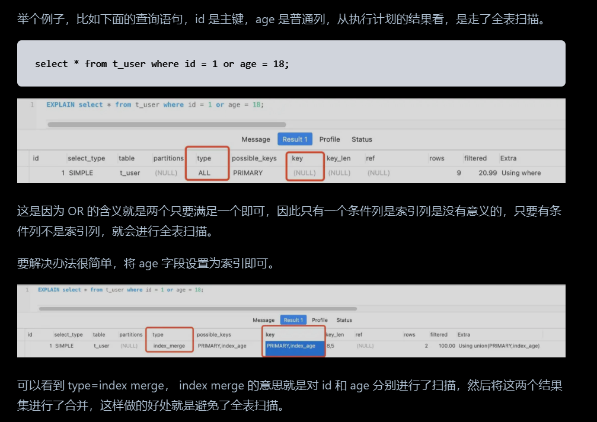
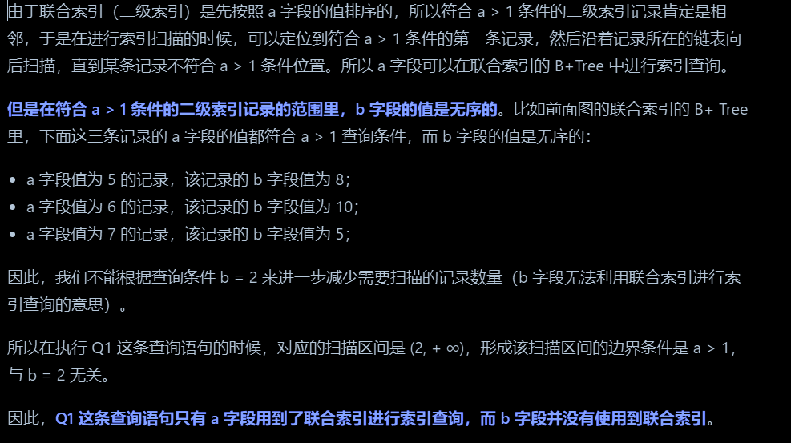
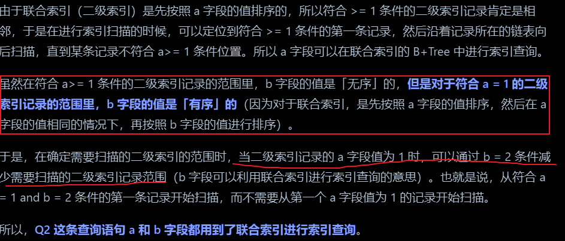
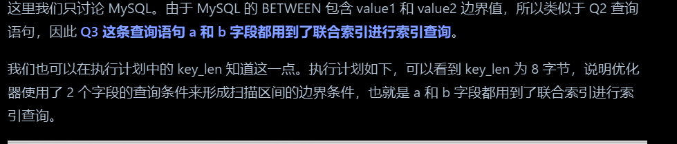
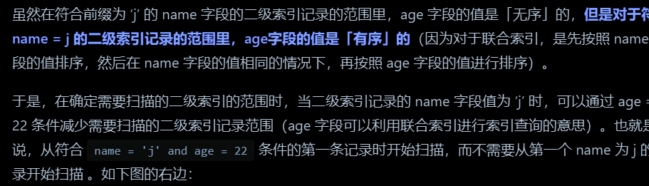

整理索引分类、B+ 树、最左匹配、联合索引、覆盖索引与自适应哈希索引。

## 索引

### 索引的分类

[索引常见面试题 | 小林coding (xiaolincoding.com)](https://xiaolincoding.com/mysql/index/index_interview.html#%E6%8C%89%E6%95%B0%E6%8D%AE%E7%BB%93%E6%9E%84%E5%88%86%E7%B1%BB)

1. 按照索引字段的个数可以分为：单列索引和联合索引
2. 按照物理存储分为：聚簇索引（主键索引，一张表只有一个）和二级普通索引（非主键索引，叶子节点存储的是主键ID和索引值，如果不是覆盖索引，需要回表查询数据）
3. 按照字段特性可以分为：主键索引，唯一索引，普通索引，前缀索引
4. 按照存储结构分：B+树索引，B树索引，Hash索引，Full-text索引

#### 主键索引如何确认？

1. 创建表是指定某一个列为主键索引
2.
3. 创建表是没有指定某一个列为主键索引，但是存在唯一索引，就选择**第一个不包含 NULL 值**的**唯一列**作为主键
4. 既没有指定主键索引，也不存在唯一索引，这时候mysql行格式存储就是启动行上的隐藏列，主键id列，主动的为没行数据生成一个id，并存储记录在这个隐藏列上

#### 主键聚簇索引

Innodb存储的索引结构存储为 B+树，叶子节点是存储数据的，但是也就只有主键索引会存储数据，其他的索引的叶子节点存储的为主键的值，需要回表查询数据，但是主键索引因为叶子节点存储了数据，所以叫聚簇索引。

#### 联合索引

通过将多个字段组合成一个索引，该索引就被称为联合索引

#### 前缀索引

前缀索引是指对字符类型字段的前几个字符建立的索引，而不是在整个字段上建立的索引，前缀索引可以建立在字段类型为char、varchar、.binary、varbinary的列上。使用前缀索引的目的是为了减少索引占用的存储空间，提升查询效率，而且前缀索引命中后，还会有个回表查出具体的值比较是否一致，因为前缀索引只是部分数据，不是准确的数据

#### 覆盖索引

这个是索引下推功能的具体实现，比如我们select id from where age =12；此时age是有索引的，又因为非主键索引的叶子节点值是主键id，所以不需要会表字节可以返回结果。

另外一个情况是覆盖索引的情况，比如存在索引（a，b）直接select b from a  = 10，此时也不需要回表，因为索引上就有b的值。

### 最左匹配原则？为啥需要最左匹配原则

因为Indb的索引存储是基于B+树的，B+树的存储特点就是，有序的存储的数据，各个节点之间的数据都是有序的，而且叶子节点存储的数据也都是基于双向链表存储，而且如果是多聚合索引的话，会先按照第一个索引进行排序存储，然后再在第一个相同值的基础上进行第二个值排序存储，后续的索引也是如此，所以就组成了一个从左到右数据是有序的存储，所以每当来一个索引值匹配时，是需要按照顺序配置索引值的，如果左边的数据匹配不上，就不会走当前索引。

> 第一个索引是全局有序，第二个索引及其后续的索引是部分有序，后面的索引是在前面索引的基础上有序的。
>

### 索引失效的场景

1. 使用了 like 进行后缀模糊匹配或者中间迷糊匹配，即 like ‘%121’ or like '%1213%' 很好理解，因为索引有最左前缀匹配原则
2. 查询优化，认为索引可能没有全表扫描来的快，表数据量小的时候，或者复杂计算时候
3. 使用函数计算，因为函数计算后结果会改变这个值
4. 不符合最左索引匹配原则
5. **存在索引列的数据类型隐形转换，**则用不上索引，比**如列类型是字符串，那一定要在条件中将数据使用引号引用起来,否则不使用索引（对于123这个字符）**
6. 在索引列上使用** IS NULL 或 IS NOT NULL操作**。（**索引是不索引空值的，所以这样的操作不能使用索引**，可以用其他的办法处理，例如：数字类型，判断大于0，字符串类型设置一个默认值，判断是否等于默认值即可。）
7. 使用**not，<>，!=。（不等于操作符是永远不会用到索引的，因此对它的处理只会产生全表扫描**，优化方法：key<>0 改为 key>0 or key<0。）
8. 多表链接查询的时候，**两个表的字符集不一致导致，字符集都不一样，两个字符肯定不一样**
9. **where 子句中的 or 查询：**如果在 OR 前的**条件列是索引列**，而在 **OR 后的条件列不是索引列**，那么索引会失效。

### 优化索引的方法

#### 前缀索引优化

使用前缀索引是为了减少索引字段的长度大小，一但索引的长度下来，mysql索引页就可以存储更多索引节点，记录更多数据，可以大幅度提高索引的查询速度，在一些大字符串的字段作为索引时，使用前缀索引同时可以帮助我们减小索引项的大小。

使用前缀索引的缺陷：存在回表操作而且无法作为覆盖索引，因为值是不完整的，索引区分度问题，另外order by 时候也无法使用前缀索引，同样因为字段不完整，需要全表扫字段，比较完整的字段。

#### 覆盖索引优化

需要针对专门的SQL语句进行优化，尽量避免回表操作，比如select a，b ，就可以建立一个索引(a,b);

#### 主键索引优化

主键索引要递增，最大化利用innodb的B+树存储数据的优点

#### 索引列尽量设置为NOT NUll

第一原因：索引列存在 NULL** 就会导致优化器在做索引选择的时候更加复杂，更加难以优化，**因为可为 NULL 的列会使索引、索引统计和值比较都更复杂，比如进行索引统计时，count 会省略值为NULL 的行。

第二个原因：**NULL 值是一个没意义的值，但是它会占用物理空间，所以会带来的存储空间的问题**，因为 InnoDB 存储记录的时候，如果表中存在允许为 NULL 的字段，那么行格式至少会用 1 字节空间存储 NULL 值列表，（记录那个位置的值为NULL）

### 为啥使用B+树?

Hash 在做等值查询的时候效率贼快，搜索复杂度为 O(1)，但是不适合做范围查询操作，相对来说，Hash索引只适合做等值查询。

B+Tree只在叶子节点存储数据，而B树的非叶子节点也要存储数据，所以B+Tree的单个节点的数据量更小，在相同的磁盘/O次数下，**就能查询更多的节点。**另外，**B+Tree叶子节点采用的是双链表连接**，适合MySQL中常见的基于范围的顺序查找，而B树无法做到这一点。

B+树的优点，相对二叉树的层数少，B+Tree存储千万级的数据只需要3-4层高度就可以满足，这意味着从千万级的表查询日标数据**最多需要3-4次磁盘I/O,**所以B+Tee相比于B树和二叉树来说，**最大的优势在于查询效率很高，因为即使在数据量很大的情况，查询一个数据的磁盘IO依然维持在3-4次，而且存储的空间只有聚簇索引的叶子节点才会真正存储数据，非叶子节点只是索引值。**

### 联合索引范围查询问题

联合索引有一些特殊情况，并不是查询过程使用了联合索引查询，**就代表联合索引中的所有字段都用到了联合索引**进行索引查询，也就是可能存在部分字段用到联合索的B+Tee,部分字段没有用到联合索引的B+Tree的情况。

这种特殊情况就发生在范围查询**。联合索引的最左匹配原则会一直向右匹配****直到遇到「范围查询」就会停**

**止匹配****，**也就是范围查询的字段可以用到联合索引，**但是在范围查询字段的后面的字段无法用到联合索引。（因为联合索引第一个范围用了索引，会导致后面索引的数据无序）**

::: note
判断后续的的索引有没有用，就看前面的范围查询有没有等于操作，有等于操作，就可以进一步使用索引，缩减扫描的范围。

:::

1. select * from t_table where a > 1 and b = 2 联合索引（a, b）哪一个字段用到了联合索引的 B+Tree？

2. select * from t_table where a >= 1 and b = 2，联合索引（a, b）哪一个字段用到了联合索引的 B+Tree？

3. select * from t_table where a betwen 2 and 7 and b =8

4. SELECT * FROM t_user WHERE name like 'j%' and age = 22,，联合索引（name, age）哪一个字段用到了联合索引的 B+Tree？

### 什么时候不推荐创建索引

从Innodb的索引结构特点上分析：有序排列存储，占磁盘实际空间，可以推断出以下几个：

1. 在 WHERE 中**使用不到的字段**，不要设置索引；
2. 有大量重复数据的列上不要建立索引；**索引区分度低不推荐**
3. 避免对经常更新的表创建过多的索引；
4. 避免对经常更新删除新增的列穿件索引
5. 不建议用**无序的值**作为索引；
6. **不要定义**[**冗余**](https://so.csdn.net/so/search?q=%E5%86%97%E4%BD%99&spm=1001.2101.3001.7020)**或重复的索引**；比如index(a,b),index(a)
7. 避免为大列创建索引，占用过多的磁盘空间，可以创建前缀索引优化，index(name(3))

## 自适应哈希索引页

Innodb存储引擎会监控对表上各索引页的查询，如果检测到创建索引可以加速访问，则建立哈希索引，称之为自适应哈希索引。

Innodb会自动根据访问的频率和模式来自动地为某些热点建立哈希索引，AHI有个要求，即对这个页的连续访问模式必须是一样的，即查询条件必须是一样的，而且要以改模式（查询条件）访问该页100次，还有最后一个条件：页通过该模式访问了N次，其中N=`页中记录*1/16`。

所以连续大量的同一个条件访问该页，会出发AHI生成，提高查询效率。
