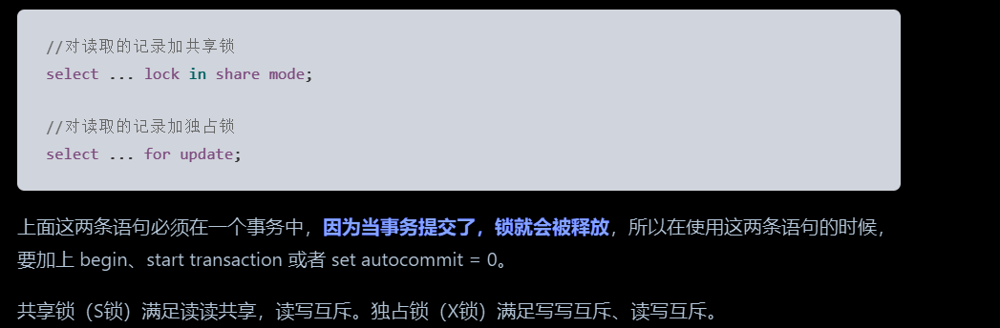

整理全局锁、表级锁、行锁以及不同索引和查询条件下的加锁规则。

## Mysql中的锁

[MySQL 有哪些锁？ | 小林coding (xiaolincoding.com)](https://xiaolincoding.com/mysql/lock/mysql_lock.html#%E5%85%A8%E5%B1%80%E9%94%81)

记住一句话，**只要这个索引项被扫描到了，那就会给这个索引项加一个next-lock锁**，然后才会根据一些情况判断是否需要退换成记录锁或者间隙锁。**所有加的所有锁都是为了避免幻读的出现。（****加锁的对象是索引，加锁的基本单位是 next-key lock****）**

**还有一句话，锁的二阶段协议：****获取的锁，只有在事务结束后才会释放，即使当前事务中某个sql语句获取的锁，执行结束后，执行其他sql语句，也会释放锁，直到整个事务执行结束，统一释放所有的锁。**

### 锁的分类

#### 全局锁

开启全局锁后，整个数据库就处于**可读状态了**，所有对数据库的写操作都会阻塞，比如更新表结构，或者插入删除数据，由此可见开启全局锁后，对外服务处于严重阻塞的，因为只能读了。全局锁主要应用于做**全库逻辑备份**，这样在备份数据库期间不会因为数据或表结构的更新，而出现备份文件的数据与预期的不一样。

但是对于InnoDB 存储引擎默认的事务隔离级别正是可重复读，在备份数据库之前先开启事务，会先创建 Read View，然后整个事务执行期间都在用这个 Read View，而且由于 MVCC 的支持，备份期间业务依然可以对数据进行更新操作。（利用可重复的机制，既可以备份，也可以对外提供服务）

#### 表级锁

+ 表锁：**注意mysql的表锁不是可重入锁**，也就说加了表锁后，当前线程的后续读写操作也会被阻塞。
+ 元数据锁（MDL）：不需要显示的使用 MDL，因为当我们对数据库表进行操作时，会自动给这个表加上 MDL，MDL 是为了保证当用户对表执行 CRUD 操作时，防止其他线程对这个表结构做了变更。
    - 对一张表进行 CRUD 操作时，加的是 **MDL 读锁**
    - 对一张表做结构变更操作的时候，加的是 **MDL 写锁**

> 申请 MDL 锁的操作会形成一个队列（tmd是一个优先级队列），队列中**写锁获取优先级高于读锁，**一旦出现 MDL 写锁等待，会阻塞后续该表的所有 CRUD 操作，**直到MDL写锁释放**。
>
> 所以为了能安全的对表结构进行变更，在对表结构变更前，**先要看看数据库中的长事务**，是否有事务已经对表**加上了 MDL 读锁，如果可以考虑 kill 掉这个长事务，然后再做表结构的变更，没有MDL读锁，MDL写锁可以直接获取，避免阻塞后续CRUD的MDL读锁。**
>

+ 意向锁：
    - 在使用 InnoDB 引擎的表里对**某些记录加上「共享锁」之前（注意是是加行锁的时候触发）**，需要先在表级别加上一个「意向共享锁」
    - 在使用 InnoDB 引擎的表里对**某些纪录加上「独占锁」之前**（**注意是是加行锁的时候触发**）需要先在表级别加上一个「意向独占锁」，也就是，当执行插入、更新、删除操作，需要先对表加上「意向独占锁」，然后对该记录加独占锁。如果没有「意向锁」，那么加「独占表锁」时**，就需要遍历表里所有记录，查看是否有记录存在独占锁**，这样效率会很慢（**因为只有确认了每个记录上没有独占锁，才可以给表加独占锁**），那么在加「独占表锁」时，直接查该表是否有意向独占锁，如果有就意味着表里已经有记录被加了独占锁，这样就不用去遍历表里的记录。**意向锁的目的是为了快速判断表里是否有记录被加锁。（其实可以简单理解为全局标识，当前表中有没有独占锁或者共享锁）**
+ AUTO-INC 锁：主键自增锁，多个插入SQL语句并发的获取锁，生成自增值，释放锁。AUTO-INC 锁是特殊的表锁机制，锁**不是再一个事务提交后才释放，而是在执行完插入语句后就会立即释放**，**在插入数据时，会加一个表级别的 AUTO-INC 锁，**然后为被 `AUTO_INCREMENT` 修饰的字段赋值递增的值，等插入语句执行完成后才会把 AUTO-INC 锁释放掉，所以可见当有大量的插入请求操作时，锁**的竞争激烈是很大的，存在很大的性能问题，因为另一个事务中的插入会被阻塞，是一个重量级锁。**

后来，InnoDB 存储引擎提供了一种**轻量级的锁**来实现自增，尽量的减少性能问题，一样也是在插入数据的时候，会为被 `AUTO_INCREMENT` 修饰的字段加上轻量级锁，**然后给该字段赋值一个自增的值****，****就把这个轻量级锁释放了，而不需要等待整个插入语句执行完后才释放锁。**

> **轻量级锁，存在导致主从数据ID不一致问题，前提binlog的模式是statement，也就是记录SQL语句模式，在这个场景在，主库多个事务并发插入，每个事务交叉获取锁，写入数据，但是到binlog记录的时候，只能一个事务一个事务记录，不能按照执行的顺序记录，要一个事务的SQL语句都在前面，要么一个事物的所有SQL都在后面，就会导致从库执行命令时，按照顺序执行，导致同一行数据，有不同的ID值。但是设置binlog模式为row就可以避免这个问题。**
>

#### 行锁

InnoDB 引擎是支持行级锁的，而 MyISAM 引擎并不支持行级锁，**普通的 select 语句是不会对记录加锁的（**除了串行化隔离级别，这种级别下会所有操作都要加锁**），因为它属于快照读，基于MVVC机制实现无锁查询**，如果要在查询时对记录加行锁，可以使用下面这两个方式，这种查询会加锁的语句称为**锁定读。**

行锁主要有下面三种：

+ Record Lock，记录锁，也就是仅仅把一条记录锁上，记录锁是有 S 锁和 X 锁之分的
+ Gap Lock，间隙锁，锁定一个范围，但是不包含记录本身，只存在于可重复读隔离级别，目的是为了解决可重复读隔离级别下幻读的现象，间隙锁虽然存在 X 型间隙锁和 S 型间隙锁，但是并没有什么区别，**间隙锁之间是兼容的，即两个事务可以同时持有包含共同间隙范围的间隙锁，并不存在互斥关系，因为间隙锁的目的是防止插入幻影记录而提出的。**
+ Next-Key Lock：Record Lock + Gap Lock 的组合，锁定一个范围，并且锁定记录本身，**next-key lock 是前开后闭区间，而间隙锁是前开后开区间。**

::: note
Next-Key Lock，只要索引被扫描上了，就会加上了就会添加，但是后面会有针对情况进行优化，退化为记录锁，间隙锁，做一个优化。

:::

### 怎么加锁的

[https://xiaolincoding.com/mysql/lock/how_to_lock.html](https://xiaolincoding.com/mysql/lock/how_to_lock.html)

#### 什么SQL语句会加锁行级锁

普通的select语句不会加锁，通过MVVC机制控制，实现无锁读，但是可以通用for update这种，实现独占读，加锁

update,delete 加行级锁。

::: note
此外加锁的基本单位为行级锁：Next-key lock，加锁对象为索引；但是next-key lock 在一些场景下会退化成记录锁或间隙锁，**在能使用记录锁或者间隙锁****就能避免幻读现象的场景下****，next-key lock 就会退化成记录锁或间隙锁**。

_**Next-key lock 锁为啥退化成 记录锁，或者间隙锁，更本原因，就是不需要Next-key lock就可以保证不出现幻读。**_

二级索引: 非主键索引

如果是用二级索引（不管是不是非唯一索引，还是唯一索引）进行锁定读查询的时候，除了会对二级索引项**加行级锁**（如果是唯一索引的二级索引，加锁规则和主键索引的案例相同），**而且还会对查询到的记录的主键索引项上加「记录锁」。（前提是查询到记录）**

:::

#### 主键唯一索引等值查询

select * from table where id = 10;

##### 存在这个记录

表中存在id =10 的记录，会添加一个next-key lock 索引（id=7 是 id=10的前一条数据）此时加的锁就是（7,10】前开后闭，但是此时会命中索引优化规则：在索引树上定位到这一条记录后，将该记录的索引中的 next-key lock 会**退化成「记录锁」。**

为什么唯一索引等值查询并且查询记录存在的场景下，该记录的索引中的 next-key lock 会退化成记录锁？原因就是在唯一索引等值查询并且查询记录存在的场景下，仅靠记录锁也能避免幻读的问题，因为此时的记录锁会阻塞，删除，更新操作，多次查选id = 10也不会有问题，不会出现幻读的场景。

##### 不存在这个记录

比如当前表中有数据6,8,9,14,16，执行select * from table where id = 10;表中没有id=10的数据，向后继续找，找到第一个大于10的记录，id = 14，此时加一个Next-key lock （9，14】前开后闭， 此时会触发另外一个优化：在索引树找到第一条大于该查询记录的记录后，将该记录的索引中的next-key lock 会**退化成「间隙锁」，也就是（9,14）。**

**同理，****因为间隙锁就可以保证幻读不出现****，因为间隙锁住的区间是（9,14），在这个区间内，插入删除更新都会阻塞，重复执行id = 10的查询，也不会出现幻读，忽然出现值了，而且退化成间隙锁后，****14这列可以正常更新删除操作，因为我们只想限制住id =10 的所有操作。（关键，不能锁的过多）**

#### 主键唯一索引范围查询

##### 大于

比如当前表中有数据6,8,9,14,16，执行select * from table where id >10，会扫描到14,16两条记录，此时会分别加两个Next-key lock 锁，（**10**,14】（**注意是10**，不是9，因为是大于10，），（14,16】，（16， +∞】

##### 大于等于

因为存在等值查询的条件，那么如果**等值查询的记录是存在于表中**，那么该记录的索引中的 next-key 锁会**退化成记录锁（等值的查询参考上个章节），后续的扫描到索引加上Next-key lock。**

**比如表中**6,8,9,14,16，执行select * from table where id >= 9，此时有扫描到id=9开始，**会加上9的记录锁（（8,9】这个锁退化的记录锁）**，（9,14】（14的next lock），（14,16】（16的next lock），（16，+∞】

假如执行select * from table where id >= 10，数据不存在表中，加锁如下：id=10不存在记录的加锁（退化成间隙锁）（9,14），和id> 10记录加锁，（**10**,14】，（14,16】，（16， +∞】

##### 小于

当条件值的记录不在表中：

那么**不管是「小于」还是「小于等于」条件的范围查询**，**扫描到终止范围查询的记录时，该记录的索引的 next-key 锁会退化成间隙锁，**其他扫描到的记录，都是在这些记录的索引上加 next-key 锁。（**同样这个终止的索引是不符合查询条件的，没必要锁他，间隙锁就可以，因为记录不在表中，找到第一个比记录大的值，加上next lock锁，然后退化成gap lock，因为第一个大于的值的记录，是不符合条件的不需要加锁的）**

当条件值的记录在表中：

**如果是「小于」条件的范围查询**，**扫描到终止范围查询的记录时，该记录的索引的 next-key 锁会退化成间隙锁，**其他扫描到的记录，都是在这些记录的索引上加 next-key 锁；（**同样这个终止的索引是不符合查询条件的，没必要锁他，间隙锁就可以）**

##### 小于等于

当条件值的记录不在表中：**扫描到终止范围查询的记录时，该记录的索引的 next-key 锁会退化成间隙锁，****其他扫描到的记录，都是在这些记录的索引上加 next-key 锁。****（很好理解，因为表中不存在这个记录，不需要当前终止记录加锁，因为终止记录是不符合条件的，只需要对间隙锁就可以避免幻读）**

当条件值的记录在表中**：都是在这些记录的索引上加 next-key 锁。（所有索引都是Next-key lock锁）****（很好理解，因为是等于了，所以最后等于的记录也需要加锁，避免被修改操作，产生幻读）**

#### 非唯一索引等值查询

::: tip
**非唯一索引的插入避免幻读：**当有一个事务持有二级索引的间隙锁 (22, 39) 时，插入 age = 22 或者 age = 39 记录的语句是否可以执行成功，**关键还要考虑插入记录的主键值：**

**因为「二级索引值（age列）+主键值（id列）」才可以确定插入的位置（二级索引值一样会按照主键排序），因为只有主键索引的叶子节点才存储数据**

确定了插入位置后，**就要看插入的位置的下一条记录是否有间隙锁：**

1. 如果有间隙锁，就会发生阻塞
2. 如果没有间隙锁，则可以插入成功
3. 为啥这么做，主要避免幻读，数据插入

:::

##### 存在这个值

由于不是唯一索引，所以肯定存在索引值相同的记录，于是非唯一索引等值查询的过程是一个扫描的过程，直到扫描到第一个不符合条件的二级索引记录就停止扫描，然后**在扫描的过程中，对扫描到的二级索引记录加的是 next-key 锁，****而对于第一个不符合条件的二级索引记录，该二级索引的 next-key 锁会退化成间隙锁。****同时，在符合查询条件的记录的主键索引上加记录锁。（只有在主键索引上锁住这个唯一记录，才可以避免其他事务操作其他索引同步校验，避免幻读问题的存在）。**

##### 不存在这个值

当查询的记录「不存在」时，**扫描到第一条不符合条件的二级索引记录，****该二级索引的 next-key 锁会退化成间隙锁****，因为不存在满足查询条件的记录，所以不会对主键索引加锁。（间隙锁可以避免幻读，不需要加Next-key lock）**

#### 非唯一索引范围查询

**非唯一索引范围查询****，索引的 next-key lock 不会退化为间隙锁和记录锁，**但是唯一索引在满足一些条件的时候，索引的 next-key lock 退化为间隙锁或者记录锁，**（主要要以避免幻读角度去分析）。因为二级索引的只能保证当前索引，而且当前二级索引还是允许重复的，****要是退化成记录锁，****不能保证插入****，只能保证删除，修改****，必须加一个Next-key lock 锁，锁住区间，避免区间重复索引的插入****（最关键的是锁是加载记录上的，要保证在加入一个新元素的时候给锁住区间）****。**

#### 未加索引的查询

**如果锁定读查询语句（select ... for update），没有使用索引列作为查询条件，或者查询语句没有走索引查询，导致扫描是全表扫描。那么，每一条记录的索引上都会加 next-key 锁，****这样就相当于锁住的全表，这时如果其他事务对该表进行增、删、改操作的时候，都会被阻塞**。

#### update、delete 语句加锁

[update 没加索引会锁全表？ | 小林coding (xiaolincoding.com)](https://xiaolincoding.com/mysql/lock/update_index.html)

开始安全执行模式，**必须走索引范围加锁**，避免走全表扫描，会对每个记录加一个Next-key lock锁，直接变成表锁。（还是那句话，只要这个索引项被扫描到了，都会加一个Next-key lock锁）
