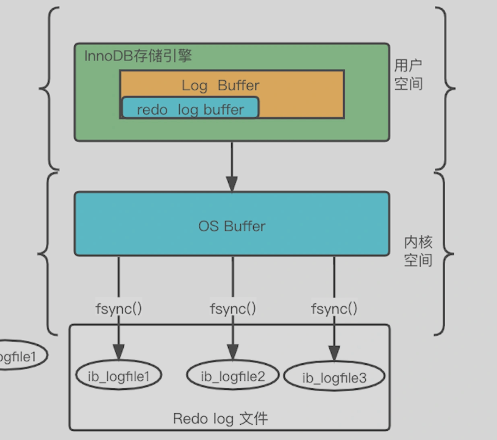
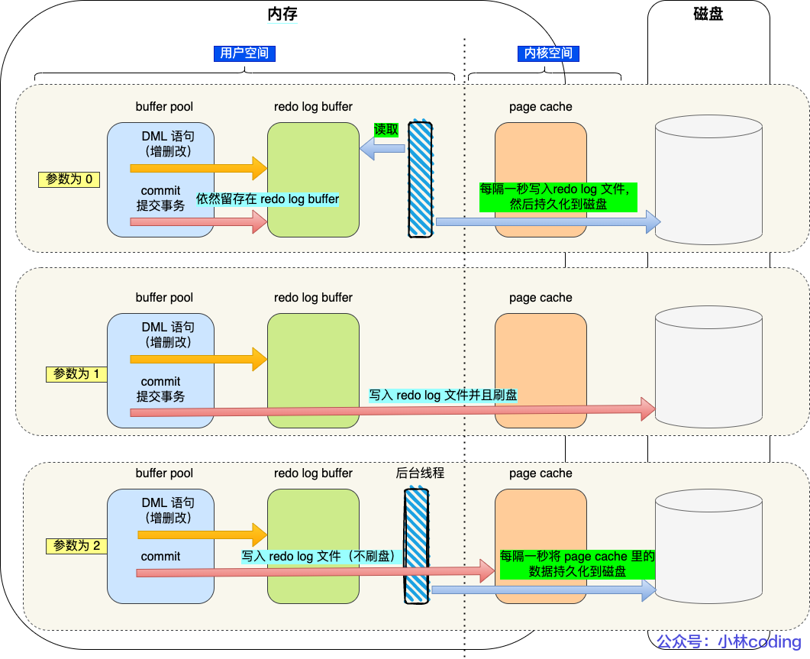
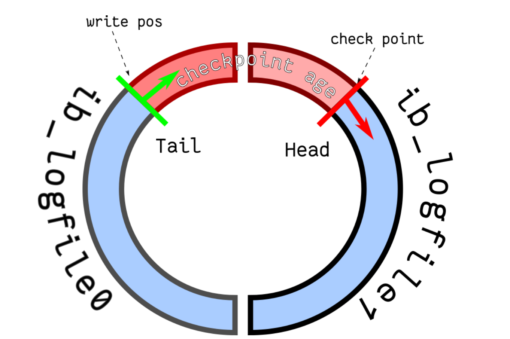
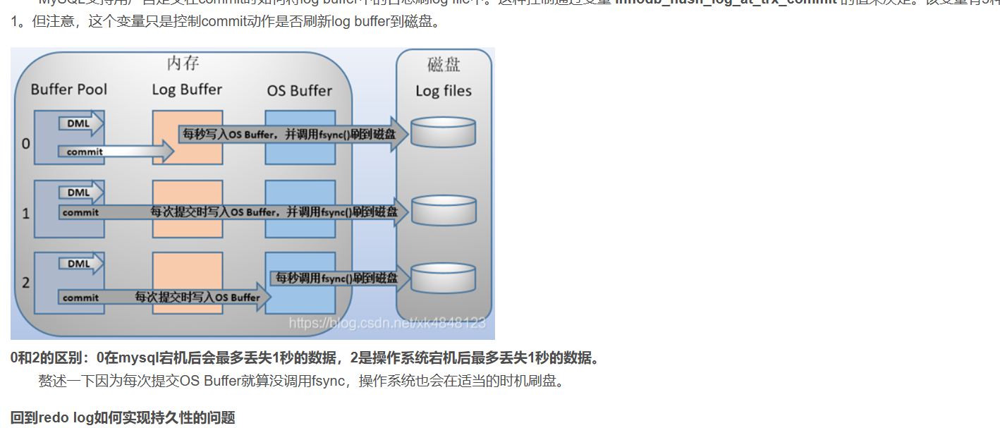
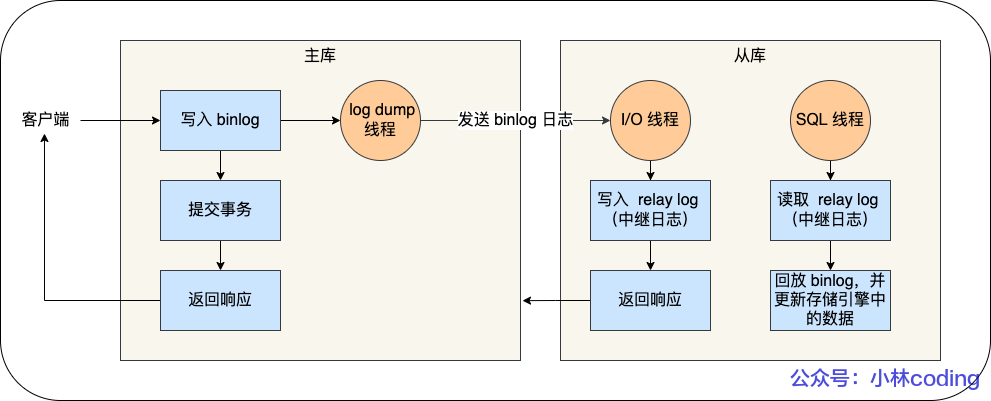
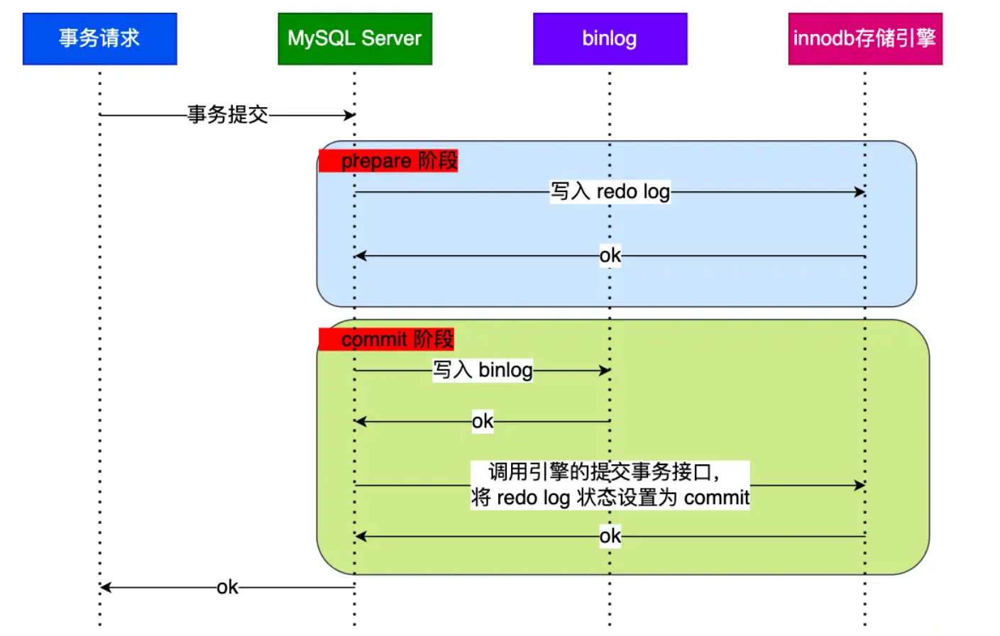

整理 redo log、binlog、undo log、刷盘策略、主从复制和两阶段提交。

## mysql 存在哪些日志？

 MySQL 中常⻅的⽇志类型主要有下⾯⼏ 类（针对的是 InnoDB 存储引擎）：

+ 错误⽇志（error log） ：对 MySQL 的启动、运⾏、关闭过程进⾏了记 录。
+ **⼆进制⽇志（binary log） ：主要记录的是更改数据库数据的 SQL 语 句。**
+ ⼀般查询⽇志（general query log） ：已建⽴连接的客户端发送给 MySQL 服务器的所有 SQL 记录，因 为 SQL 的量⽐较⼤，默认是不开启 的，也不建议开启。
+ **慢查询⽇志（slow query log） ：执 ⾏时间超过 long_query_time 秒 钟的查询，解决 SQL 慢查询问题的 时候会⽤到。 **
+ **事务⽇志(redo log 和 undo log) ： redo log 是重做⽇志，undo log 是回 滚⽇志。**
+ 中继⽇志(relay log) ：relay log 是复 制过程中产⽣的⽇志，很多⽅⾯都跟 binary log 差不多。不过，relay log 针对的是主从复制中的从库。
+ DDL ⽇志(metadata log) ：DDL 语 句执⾏的元数据操作

## redo log

### 介绍

redo log 是物理日志，记录了某个数据页做了什么修改，比如**对 XXX 表空间中的 YYY 数据页 ZZZ 偏移量的地方做了AAA 更新，**每当执行一个事务就会产生这样的一条或者多条物理日志。

- redo log 记录了此次事务「**完成后**」的数据状态，记录的是更新**之后**的值
- undo log 记录了此次事务「**开始前**」的数据状态，记录的是更新**之前**的值

### 产生的 redo log 是直接写入磁盘的吗？

不是的。

实际上， 执行一个事务的过程中，产生的 redo log 也不是直接写入磁盘的，因为这样会产生大量的 I/O 操作，而且磁盘的运行速度远慢于内存。

所以，redo log 也有自己的缓存—— **redo log buffer，**每当产生一条 redo log 时，会先写入到 redo log buffer，后续在持久化到磁盘。

**redo log buffer 默认大小 16 MB，**可以通过 `innodb_log_Buffer_size` 参数动态的调整大小，增大它的大小可以让 MySQL 处理「大事务」是不必写入磁盘，进而提升写 IO 性能。

### 什么时候刷盘

+ MySQL 正常关闭时；
+ 当 redo log buffer 中记录的写入量大于 redo log buffer 内存空间的一半时，会触发落盘
+ **InnoDB 的后台线程每隔 1 秒，将 redo log buffer 持久化到磁盘(非常重要的一个策略)**
+ 每次事务提交时都将缓存在 redo log buffer 里的 redo log 直接持久化到磁盘（这个策略可由 innodb_flush_log_at_trx_commit 参数控制，也是非常重要的一个策略）

### redo log 事务提交刷新策略

redo log 刷新到磁盘有个策略，**后台线程每隔1s刷新一次redo log 到磁盘**

- 0：事务提交还是保持redo log 在redo log buffer，不主动触发写入磁盘，交给后台线程每隔1s执行刷新，**所以参数为 0 的策略，MySQL 进程的崩溃会导致上一秒钟所有事务数据的丢失**;
- 1：事务每次提交都写入Page Cache（Os buffer），然后执行fsync刷入磁盘
- 2：事务提交都写入Page Cache（Os buffer），不主动执行fsync，交给后台线程每1s执行一次fsync刷入缓存，**所以参数为 2 的策略，较取值为 0 情况下更安全，因为 MySQL 进程的崩溃并不会丢失数据，只有在操作系统崩溃或者系统断电的情况下，上一秒钟所有事务数据才可能丢失。**

加入了后台现线程后，innodb_flush_log_at_trx_commit 的刷盘时机如下图：

### redo log文件写满怎么办

重做日志文件组是以**循环写**的方式工作的，从头开始写，写到末尾就又回到开头，相当于一个环形。我们知道 redo log 是为了防止 Buffer Pool 中的脏页丢失而设计的，随着系统运行，Buffer Pool 的脏页刷新到了磁盘中，那么 redo log 对应的记录也就没用了，这时候我们擦除这些旧记录，以腾出空间记录新的更新操作。

- write pos 和 checkpoint 的移动都是顺时针方向
- write pos ～ checkpoint 之间的部分（图中的红色部分），用来记录新的更新操作
- check point ～ write pos 之间的部分（图中蓝色部分）:待落盘的脏数据页记录

### redo log check point机制

如果 write pos 追上了 checkpoint，就意味着 **redo log 文件满了,这时 MySQL 不能再执行新的更新操作，也就是说 MySQL 会被阻塞,**（_因此所以针对并发量大的系统，适当设置 redo log 的文件大小非常重要,默认的大小是两个G_）此时**会停下来将 Buffer Pool 中的脏页刷新到磁盘中，然后标记 redo log 哪些记录可以被擦除，接着对旧的 redo log 记录进行擦除，等擦除完旧记录腾出了空间，****checkpoint 就会往后移动（图中顺时针****）**然后 MySQL 恢复正常运行，继续执行新的更新操作。

一次 checkpoint 的过程（向前移动的过程就是刷新脏页的时刻）就是脏页刷新到磁盘中变成干净页，然后标记 redo log 哪些记录可以被覆盖的过程。

### redo log 如何保证事务的持久性？

一个事务在执行时候，会涉及到大量的SQL语句修改，考虑到执行的IO刷盘执行的效率问题，需要在执行不能直接刷写磁盘，需要刷写到redo log中，redo log 记录了数据的修改，对页的修改记录，等信息，转随机IO为顺序IO追加循环写入，当事务提交的时候，会根据我们的配置（执行write or fsync操作），对redo log进行刷盘（因为之前的数据都是存储在内存中的 Buffer pool中，因为一个事务的执行，中间会对应多个SQL语句，每执行一次记录到缓存中，效率问题）事务提交触发刷盘操作，这个过程会把数据给持久化完成的关键。

下图演示了redo log日志的刷新机制：`innodb_flush_log_at_trx_commit` 控制，事务在执行的过程中会将对页的修改写入redo log ，但是不是直接写入磁盘文件中，而是内存中的 redo log buffer这个区域，当事务提交的时候，会根据`innodb_flush_log_at_trx_commit` 参数的配置，判断是否讲redo log buffer中数据刷新到磁盘中

- 0：事务提交还是保持redo log 在redo log buffer，不主动触发写入磁盘，交给后台线程每隔1s执行刷新
- 1：事务每次提交都写入Page Cache（Os buffer），然后执行fsync刷入磁盘
- 2：事务提交都写入Page Cache（Os buffer），不主动执行fsync，交给操作系统控制每1s执行一次fsync刷入缓存。

## BinLog

### binlog cache，保证事务语句的完整性

事务执行过程中，先把日志写到 binlog cache（Server 层的 cache），事务提交的时候，再把 binlog cache 写到 binlog 文件中。而且为了整整事务语句的完整性，每个线程都有自己恶的 bin log cache，因为一个个线程只能同时执行一个事务，保证写入bin log文件中事务语句是连续的，不是分开的。

一个事务的 binlog 是不能被拆开的，因此无论这个事务有多大（比如有很多条语句）也要保证一次性写入。这是因为有一个线程只能同时有一个事务在执行的设定，所以每当执行一个 begin/start transaction 的时候，就会默认提交上一个事务，如果一个事务的 binlog 被拆开的时候，在备库执行就会被当做多个事务分段自行，这样破坏了原子性，是有问题的。

**为此，MySQL 给每个线程分配了一片内存用于缓冲 binlog，该内存叫 binlog cache。**虽然每个线程有自己 binlog cache，**但是最终都写到同一个 binlog 文件**，在事务提交的时候，**执行器把 binlog cache 里的完整事务写入到 binlog 文件中，并清空 binlog cache。****（其实可以参考redo log buffer ，只不过redo log buffer 是共享缓存，bin log cache 是线程私有的缓存）**

### Bin Log刷盘时间（换句话叫bin log cache 刷盘时间）

MySQL提供一个 sync_binlog 参数来控制数据库的 binlog 刷到磁盘上的频率：

+  sync_binlog = 0 的时候，表示每次提交事务都只 write，不 fsync，后续交由操作系统决定何时将数据持久化到磁盘；（与redo 不同点，redo log 为0 时，也不执行write，交给后台线程刷新写入）
+ sync_binlog = 1 的时候，表示每次提交事务都会 write，然后马上执行 fsync；
+ sync_binlog =N(N>1) 的时候，表示每次提交事务都 write，但累积 N 个事务后才 fsync（只要操作系统不宕机，没有啥问题的，与redo log 不同的是，redo log仅仅支持到2这个参数，表示每次提交事务，只write，交给操作系统刷新，类似与binlog 为0的情况）

在MySQL中系统默认的设置是 sync_binlog = 0，也就是不做任何强制性的磁盘刷新指令，这时候的性能是最好的，但是风险也是最大的，因为一旦主机发生异常重启，还没持久化到磁盘的数据就会丢失。

### binlog 主要记录了什么？

`Binlog（Binary Log）` 是MySQL数据库中的二进制日志文件，用于记录数据库的所有更改操作。它以二进制的形式存储，包含了对数据库执行的所有修改操作的详细信息，如插入、更新、删除等。

主要用于数据备份和主从复制，以及数据变更订阅操作

### Binlog的文件内容

statement模式：记录了执行的sql语句

优点：可读性高，节省空间

缺点：sql语句的执行结果受到环境和状态的影响，存在不确定因素。

row模式：记录了每一行数据的变更的情况

优点：精准的记录了每一行数据的变更记录，不收其他影响

缺点：因为记录聊每行的数据变更，所以呢，磁盘占用比较大，尤其是对于加一个索引，加列这种操作，会对表的每行数据做记录。

### binlog的用处？

+  数据恢复：Binlog记录了数据库的历史变更，通过重放Binlog中的事件，可以将数据库还原到特定的时间点。这对于恢复误删数据、应对错误的批量操作等情况非常有用。
+ 主从复制：在主从复制中，主服务器将所有的更改记录到Binlog中，而从服务器通过读取主服务器的Binlog并执行相同的更改来保持数据同步。这实现了数据的复制和冗余，提高了系统的可用性和可靠性。
+ 数据库备份:在主从复制中，主服务器将所有的更改记录到Binlog中，而从服务器通过读取主服务器的Binlog并执行相同的更改来保持数据同步。这实现了数据的复制和冗余，提高了系统的可用性和可靠性。

### 基于Binlog的主从复制

#### 如何实现的

记录 MySQL 上的所有变化并以二进制形式保存在磁盘上，复制的过程就是将 binlog 中的数据从主库传输到从库上(主库有一个log dump线程，用于接受从库的IO连接，发送binlog日志)。这个过程一般是**异步**的，也就是主库上执行事务操作的线程不会等待复制 binlog 的线程同步完成。（这是必须的，考虑性能问题，主要主库写入了，从库异步写入）。

MySQL 集群的主从复制过程梳理成 3 个阶段：

+ **写入 Binlog**：主库写 binlog 日志，提交事务，并更新本地存储数据。
+ **同步 Binlog**：把 binlog 复制到所有从库上，每个从库把 binlog 写到暂存日志中。**从库**会创建一个专门的 I/O 线程，连接主库的** log dump 线程，**来接收主库的 binlog 日志，再把 binlog 信息写入 **relay log 的中继日志里，**再返回给主库"复制成功"的响应。
+ **回放 Binlog**：从库回放 binlog，并更新存储引擎中的数据。从库会创建一个用于回放 binlog 的线程，去读 relay log 中继日志，然后回放 binlog 更新存储引擎中的数据，最终实现主从的数据一致性。

#### 从库是不是越多越好

因为从库数量增加，从库连接上来的 I/O 线程也比较多，**主库也要创建同样多的**** log dump ****线程来处理复制的请求，对主库资源消耗比较高，同时还受限于主库的网络带宽。**

在实际使用中，一个主库一般跟 2～3 个从库

#### 主从复制有哪些模型

所谓的复制模型，就是主库提交事务，需不需等待从库完成复制才提交提交，还是怎么滴，每个模型都是对性能与安全的考虑与取舍。

1. **同步复制：**MySQL 主库提交事务的线程要等待所有从库的复制成功响应，才返回客户端结果，这种方式在实际项目中，基本上没法用，原因有两个：**一是性能很差，因为要复制到所有节点才返回响应**，二是**可用性也很差，主库和所有从库任何一个数据库出问题，都会影响业务**。（因为二者之间的网络是不可靠的）
2. **异步复制**（默认模型）**：**MySQL 主库提交事务的线程并不会等待 binlog 同步到各从库，就返回客户端结果，这种模式一旦主库宕机，数据就会发生丢失。
3. **半同步复制：**介于两者之间，事务线程不用等待所有的从库复制成功响应，只要一部分复制成功响应回来就行，比如一主二从的集群，只要数据成功复制到任意一个从库上，主库的事务线程就可以返回给客户端，种**半同步复制的方式，兼顾了异步复制和同步复制的优点，即使出现主库宕机，至少还有一个从库有最新的数据，不存在数据丢失的风险**。

::: note
其实从上面的配置可以看出，基本上所有的系统或者中间件存在主从副本机制的都会存在这个几个配置，比如redis 的主从模式（主库自动同步指令给从库，异步的，不会阻塞主库）

Kafka的副本写入机制（消息写入leader副本，或者写入所有ISR队列，甚至还支持异步发送）

:::

## undo log

### 介绍

 undo log 属于逻辑日志，**记录的是 SQL 语句**，比如说事务执行一条 DELETE 语句，那 undo log 就会记 录一条相对应的 INSERT 语句。

### undo log 如何保证事务的原⼦性？

每一个事务对数据的修改都会被记录到 undo log ，当执行事务过程中出现错误或者需要执行回滚操作 的话**，MySQL 可以利用 undo log 将数据恢复到事务开始之前的状态**，怎么找到，每行数据都有个roll_pointer指向上一个数据版本。

### undo log的作用

1. 事务回滚，保证事务的原子性
2. MVCC实现，可重复读实现，MVCC 是通过 ReadView + undo log 实现的。

### undo log 是如何刷盘

undo log 和数据页的刷盘策略是一样的，都需要通过 redo log 保证持久化，也就是undo log 页的变更也会同步记录到redo log中，数据页是数据，undo log 也是数据呀，所以数据脏页的刷新机制也使用undo log的刷新机制，其实可以简单的理解为，innodb的页的刷新机制都是一致的。

buffer pool 中有 undo 页，对 undo 页的修改也都会记录到 redo log，redo log 会每秒刷盘，提交事务时也会刷盘，数据页和 undo 页都是靠这个机制保证持久化的。

## binlog 和 redo log一致性问题

### 如何保持一致？

[https://blog.csdn.net/weixin_63566550/article/details/129819638](https://blog.csdn.net/weixin_63566550/article/details/129819638)

采用redo log两阶段提交机制，保证red log 和 bin log之间的数据一致性

**将 redo log 的写入拆成了两个步骤：prepare 和 commit，中间再穿插写入binlog**

+ **prepare 阶段：**将 XID（内部 XA 事务的 ID） 写入到 redo log，同时将 redo log 对应的事务状态设置为 prepare，然后**将 redo log 持久化到磁盘**（innodb_flush_log_at_trx_commit = 1 的作用，事务提交立即刷盘）；
+ **commit 阶段：**把 XID 写入到 binlog，**然后将 binlog 持久化到磁盘**（sync_binlog = 1 的作用，事务提交立即刷盘）；接着调用引擎的提交事务接口，将 redo log 状态设置为 commit，此时该状态并不需要持久化到磁盘，只需要 write 到文件系统的 page cache 中就够了，**因为只要 binlog 写磁盘成功，就算 redo log 的状态还是 prepare 也没有关系，一样会被认为事务已经执行成功；**

### 为啥binlog 写入成功，redo log 处于prepare阶段，重启也要提交事务

第一是因为redo log prepare阶段也是写入成功了，只是没有提交修改状态

第二是因为bin log写入成功，从库已经同步提交事务了，为了保证主从之间数据一直，主库也要提交事务。

### 事务没有提交的时候，redo log也会持久化到磁盘吗

会的，因为存在后台线层，每秒执行一次刷盘，**事务没提交的时候，redo log 也是可能被持久化到磁盘的**。

### 为什么需要两阶段提交？

如果不采用二阶段提交机制，就要考虑先提交那个日志文件

**先写bin log 日志，后写redo log ：**

bin log日志提交完成，但是redo log日志提交失败，此时数据库重启的时候，发现redo log没有当前事务的信息，因此不会提交此奔溃事务的日志，但是bin log给提交了，两边日志不一致，而且会导致订阅监听binlog服务（从库，容灾备分库）比主库多出一份记录。

**先写redo log日志，后写bin log：**

redo log 日志写入完成后， 但是bin log 日志写入失败，数据库重启，发现事务存在提交记录，会提交当前事务，但是bin log是没有写入的，导致两边数据不一致，此时主库会比从库，备份库多出一条提交记录。

所以说，不论先写那个日志，都会导致两边数据的一致，而是用redo log二阶段提交提交可以很好的避免此问题。

首先redo log 准备阶段，redo log提交失败：

数据库重启，不会提交此事务，bin log 也没有写入数据，二者一致

redo log 准备阶段，写入完成，但是提交阶段的 bin log写入失败：

此时数据库重启，发现redo log 是准备阶段，而且bin log 写入失败了，会选择回滚事务，两边数据保持一致。

bin log 写入成功，但是redo log commit 失败：数据库重启会，发现bin log 写入成功，会再重新执行一次commit，更新redo log 完成事务的提交，两边数据一致。

最主要的就是bin log日志，有bin log 日志，那就提交事务，没有bin log 日志，那就回滚事务，保证两边数据一致，同时保证主库，从库的数据也是一致的。

### 二阶段提交会有哪些问题？

**磁盘IO频繁**：对于"双1"配置，每个事务提交都会进行两次 fsync（刷盘），一次是 redo log 刷盘，另一次是 binlog 刷盘。

**锁竞争激烈**：两阶段提交虽然能够保证「单事务」两个日志的内容一致，**但在「多事务」的情况下**，却不能保证两者的提交顺序一致，因此，在两阶段提交的流程基础上，还需要加一个锁来保证提交的原子性，从而保证多事务的情况下，两个日志的提交顺序一致。

通过使用 prepare_commit_mutex 锁来保证事务提交的顺序，**在一个事务获取到锁时才能进入 prepare 阶段**，一直到 commit 阶段结束才能释放锁（二阶段协议，事务提交才会释放锁），下个事务才可以继续进行 prepare 操作。

### bin log 事务组提交优化二阶段提交

**MySQL 引入了 binlog 组提交（group commit）机制，当有多个事务提交的时候，会将多个 binlog 刷盘操作合并成一个，从而减少磁盘 I/O 的次数**，如果说 10 个事务依次排队刷盘的时间成本是 10，那么将这 10 个事务一次性一起刷盘的时间成本则近似于 1。引入了组提交机制后，prepare 阶段不变，**只针对 commit 阶段，将 commit 阶段拆分为三个过程：**

+ **flush 阶段**：多个事务按进入的顺序将 binlog 从 cache 写入文件（不刷盘）；
+ **sync 阶段**：对 binlog 文件做 fsync 操作，（多个事务的 binlog 合并一次刷盘）；
+ **commit 阶段**：各个事务按顺序做 InnoDB redo log commit 操作；

上面的**每个阶段都有一个队列****，每个阶段有锁进行保护（锁住的是队列，减小了锁的颗粒度）**，因此**保证了事务写入的顺序，**第一个进入队列的事务会成为 leader，leader领导所在队列的所有事务，全权负责整队的操作，完成后通知队内其他事务操作结束。

### redo log事务组提交优化二阶段提交

在 prepare 阶段**不再让事务各自执行 redo log 刷盘操作，**而是推迟到**组提交的 flush 阶段**，也就是说 prepare 阶段融合在了 flush 阶段。将 redo log 的刷盘延迟到了 flush 阶段之中，sync 阶段之前。通过延迟写 redo log 的方式，为 redolog 做了一次组写入。

此时加入redo log 组提交后的流程：

+ prepare阶段：redo log执行write 机制，写入page  cache中，即可
+ commit阶段：
    - **flush 阶段**：
        * 首先执行redo log 组事务的fsync机制，刷入磁盘（优化改动点，多个事务的redo log一次刷盘）
        * 然后多个事务按进入的顺序将 binlog 从 cache 写入文件（不刷盘）；
    - **sync 阶段**：
        * binlog 写入到 binlog 文件后，并不会马上执行刷盘的操作，而是**会等待一段时间，**这个等待的时长由 `Binlog_group_commit_sync_delay` 参数控制，**目的是为了组合更多事务的 binlog，然后再一起刷盘。**
        * 对 binlog 文件做 fsync 操作，（**多个组的多个事务****的 binlog **合并一次刷盘）；
    - **commit 阶段**：各个事务按顺序做 InnoDB commit 操作；

## binlog 和 redolog 有什么区别？

+  binlog 主要用于数据库还原，属于数据级别的数据恢复，主从复制是 binlog 最常见的一个应用场景，还有binlog的监听，数据的缓存同步等等。redolog 主要用于保证事务的持久性，属于事务级别的数据恢复。
+  redolog 属于 InnoDB 引擎特有的，binlog 属于所有存储引擎共有的，因为 binlog 是 MySQL 的 Server 层实现的。
+  redolog 属于物理日志，主要记录的是某个页的修改。binlog 属于逻辑日志，主要记录的是数据库 执行的所有 DDL 和 DML 语句。 ，而且binlog存储有三种格式，STATEMENT，ROW，MIXED
+  binlog 通过追加的方式进行写入，大小没有限制。redo log 采用循环写的方式进行写入，大小固 定，当写到结尾时，会回到开头循环写日志，触发脏页的刷新
+ binlog的文件存储比较大，redlog的文件存储是比较小的。
