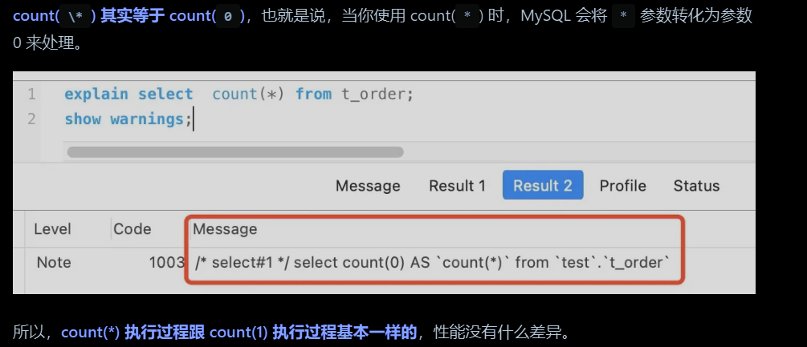
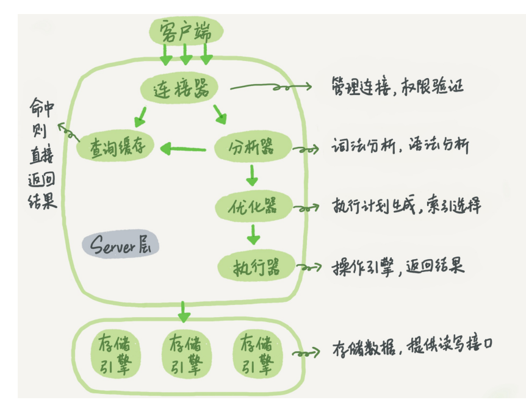
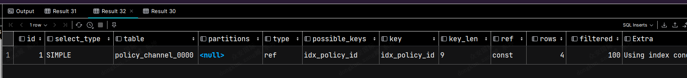
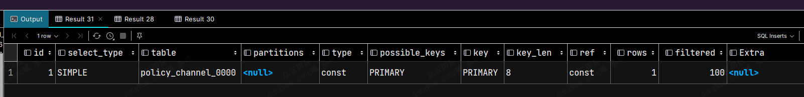
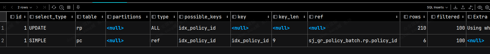

整理 SQL 执行、COUNT、EXPLAIN、查询优化、深度分页、数据删除与插入技巧。

## count(*) ,count（1），count（主键），count（非索引）的区别

COUNT(1) 和 COUNT(*) 表示的是直接查询符合条件的数据库表的行数，COUNT(列名) 表示的是查询符合条件的**列的值不为 NULL 的行数，查询出的结果可能存在不一致。**

在性能方面 COUNT(*) 约等于 COUNT(1)，count（列名）需要对当前列元素判null操作，效率会低一点，但是count（主键）肯定非空，效率要优先于count（非索引列）

+ count(*)包括了**所有的列**，相当于行数，在统计结果的时候，不会忽略为NULL的值，而且count（*）还会被优化为count（0） 去查询，所以本质上，count(*)和count(1)基本一样。
+ count(1)包括了**忽略所有列**，**用1代表代码行**，在统计结果的时候，不会忽略为NULL的值。
+ count(列名)只包括列名那一列，在统计结果的时候，会忽略列值为空（这里的空不是指空字符串或者0，而是表示null）的计数，即某个字段值为NULL时，不统计。

## 一个SQL的执行流程

### 查询SQL的执行流程

连接器：管理数据库连接，权限的验证

分析器：相当于编译器的分析阶段：比如词法分析，语法分析

优化器：对分析器分析出的SQL语句执行优化，执行计划生成，索引选择，查询最优

执行器：槽子引擎

存储引擎：存储数据

中间还有个缓存模块，但是几乎很少使用，因为缓存的数据很快就会失效，除非这个表的数据不在变化，day8.0已经删除了这个模块。



### update语句执行流程

```sql
UPDATE t_user SET name = 'xiaolin' WHERE id = 1;
```

1. 客户端通过连接器创建链接，权限校验
2. 解析器执行词法分析，语法分析，判断语法是否正确
3. 多个预处理器，会判断表和字段是否存在；
4. 优化器确定执行计划，因为 where 条件中的 id 是主键索引，所以决定要使用 id 这个索引；
5. 执行器负责具体执行，找到这一行，然后更新。

## select*和select全部字段的区别

SELECT *，需要[数据库](https://cloud.tencent.com/solution/database?from_column=20065&from=20065)先 Query Table Metadata For Columns，获取所有字段的定义，一定程度上为数据库增加了负担（影响网络传输的性能），但是实际上，两者效率差别不大。

只查选部分字段的话，索引优化，可以避免回表select abc from table where = abc > 10; 和 select * from table where abc > 10;在 abc 字段有索引的情况下，mysql 是可以不用读 data，直接使用 index 里面的值就返回结果的。但是一旦用了 select *，就会有其他列需要读取，这时在读完 index 以后还需要去读 data 才会返回结果，这样就造成了额外的性能开销。

开发中建议，只查询需要的列，而且即使要查询所有数据，也需要指定列表，尽量使用索引来优化查选，避免不必要的性能问题。

## analyze Table 和 optimize Table优化表

analyze Table 指令会优化统计表信息，比如infomation_schema库下的相关表的数据，比如tables表，获取某一个表的数据存储信息，但是默认情况下 mysql 对表进行增删操作时，是不会自动实时的更新 information_schema 库中 tables 表的中的信息的，所以就会导致和实际表的空间值不符合的问题，此时既可以执行analyze Table 让mysql收集一下最新的数据。

## SQL优化

### explain 指令

EXPLAIN执行计划: 使用EXPLAIN关键字模拟优化器执行SQL语句，分析查询语句或表结构的性能瓶颈，可以显 显示表的读取顺序、数据读取操作类型、可用和实际使用的索引、表之间的引用、每张表被查询的行数。

SQL优化过程中重点关注的几个列：

1. select_type: 表示查询类型，如simple、primary、subquery、derived、union等
    1. simple ：**表示简单的SQL 查询，不包含子查询，union查询**
    2. primary：复杂查询中最外层的 select；
    3. subquery：包含在 select 中的子查询(不在 from 子句 中)
    4. derived:包含在 from 子句中的子查询。MySQL会将结果存放在一个临时表中，也称为派生 表(derived的英文含义)。
2. table:  表示正在访问的表，可能包括子查询或union结果
3. type: 表示关联类型或访问类型，如system、const、eq_ref、ref、range、index、ALL，执行效率system > const > eq_ref > ref > range > index > ALL 一般来说，得保证查询达到range 级别，最好达到ref。
    1. system：**system是const的特例，表里只有一条元组匹配时为system**。(而且表中只有一条数据)
    2. const：用于 primary key 或 unique key **的所有列****与常量比较时**，所以表最多有一个匹配行，读取1 次，速度比较快。**（比如select * from user where id =  1）**
    3. eq_ref：**primary key 或 unique key 索引（唯一索引）**的所有部分被**连接使用（多个表之间连接查询）** ，最多只会返回一条符合条件的记 录。**简单的 select 查询不会出现这种 type（因为简单查查询没有链接多个表查询）**。
    4. ref：相比 eq_ref，**不使用唯一索引，****而是使用普通索引或者唯一性索引的部分前缀**，索引要和某个值相比较，可能会找到多个符合条件的行。（允许存在重复数据，**比如 select * from user where id like '1%'）**
    5. range：范围扫描通常出现在** in(), between ,> ,&lt;, &gt;= 等操作中**。使用一个索引来检索给定范围的行。
    6. index：扫描全表索引，这通常比ALL快一些,只是全表扫描的时候扫的是索引，数据是有序的，不需要重复排序。
    7. all：即全表扫描，意味着mysql需要从头到尾去查找所需要的行，数据还是无序的。
    8. 注意一下：mysql在5.0之后新增了一个**index merge 的**type类型，见名思意，就是多个索引分开查询然后交并汇集结果。[MySQL 优化之 index merge(索引合并) - digdeep - 博客园 (cnblogs.com)](https://www.cnblogs.com/digdeep/p/4975977.html)我们的 where 中可能有多个条件(或者join)涉及到多个字段，它们之间进行 AND 或者 OR，那么此时就有可能会使用到 index merge 技术。index merge 技术如果简单的说，其实就是：对多个索引分别进行条件扫描，然后将它们各自的结果进行合并(intersect/union)。**MySQL5.0之前，一个表一次只能使用一个索引，无法同时使用多个索引分别进行条件扫描。但是从5.1开始，引入了 index merge 优化技术，对同一个表可以使用多个索引分别进行条件扫描。（关键之处，支持多个索引）**
#### Index Merge 的合并方式

1. ** index merge 之 intersect：**简单而言，index intersect merge就是多个索引条件扫描得到的结果进行交集运算。显然在多个索引提交之间是 AND 运算时，才会出现 index intersect merge.  但是如果出现了 index intersect merge，那么一般同时也意味着我们的索引建立得不太合理，因为** index intersect merge 是可以通过建立 复合索引进行更一步优化的****。**

```sql
SELECT * FROM innodb_table WHERE primary_key < 10 AND key_col1=20;
SELECT * FROM tbl_name WHERE (key1_part1=1 AND key1_part2=2) AND key2=2;
```

2. **index merge 之 union：**index uion merge就是多个索引条件扫描，对得到的结果进行并集运算，显然是多个条件之间进行的是 OR 运算，只有一个及其以下的范围查询适用。

```sql
SELECT * FROM t1 WHERE key1=1 OR key2=2 OR key3=3;
SELECT * FROM innodb_table WHERE (key1=1 AND key2=2) OR (key3='foo' AND key4='bar') AND key5=5;
```

3. ** index merge 之 sort_union：**多个条件扫描进行 OR 运算，但是不符合 index union merge算法的，此时可能会使用 sort_union算法。当WHERE子句转换为OR组合的**多个范围条件时**，此访问算法适用，但`Index Merge union` 算法不适用。`**sort-union**`**算法和**`**union**`**算法之间的区别在于sort-union算法必须首先获取所有行的行ID，然后在返回任何行之前对它们进行排序。**

```sql
SELECT * FROM tbl_name WHERE key_col1 < 10 OR key_col2 < 20;
SELECT * FROM tbl_name WHERE (key_col1 > 10 OR key_col2 = 20) AND nonkey_col=30;
```

4. ** index merge的局限**

   待补充。

#### 执行计划的其他字段

4. possible_keys: 显示可能使用的索引。
5. key: 显示实际采用的索引。
6. Extra ：表示当前sql语句额外操作的信息，重点关注下面三个
    1. Using filesort：当查询语句中包含 group by 或者 order by操作时，而且无法利用索引完成排序操作的时候（表示没有使用索引的排序） ，这时不得不选择相应的排序算法进行（QuickSort，即对需要排序的记录生成元数据进行分块排序，然后再使用mergesort方法合并块），甚**至可能会通过文件排序（**其中filesort可以使用的内存空间大小为参数sort_buffer_size的值，默认为2M。**当排序记录太多sort_buffer_size不够用时，mysql会使用临时文件来存放各个分块****），效率是很低的，所以要避免这种问题的出现，****同时大批量数据也会排序打满内存缓存区，会启用临时文件存放分块。**
    2. Using temporary：**使了用临时表保存中间结果，MySQL 在对查询结果排序时使用临时表**，常见于排序 order by 和分组查询 group by，效率低，要避免这种问题的出现。
    3. Using index：**所需数据只需在索引即可全部获得，**并且没有对结果集进行额外的过滤，**不须要再到表中取数据，也就是使用了覆盖索引，避免了回表操作，效率不错。（期待这个值的出现）**
    4. **Using where：**意味着MySQL服务器在从表中检索数据后，还需要对结果集应用WHERE子句中的条件，这意味着数据并没有完全满足查询条件，**因此在获取数据后还需要进行过滤操作，索引只能满足where中某一个或者多个，但是满足不了全部，需要回表查出具体数据，进行过滤，其实出现这个条件也就意味了要回表啦****，回表必然导致性能下降。**
    5. **Using Index Condition：传说中的索引下推，**它会在索引扫描期间应用WHERE子句的条件，而不是在扫描完整个表后再过滤结果集。这可以减少需要检查的行数，从而提高查询性能。

```sql
explain
select policy_no
from sj_gr_outbound.sj_sync_transaction
WHERE policy_no > 'SRM123454657' # id 是唯一索引，所以不需要使用索引下推功能应用在where上，可以直接唯一判断，但是如果是一个非唯一索引，就会利用到索引索引下推功能，判断是否符合条件，然后因为使用的索引返回之后，还需要回表查出结果，应用where条件过滤
limit 0,2000;

explain
select id
from sj_gr_outbound.sj_sync_transaction
WHERE id > '1212' # id 是唯一索引，所以不需要使用索引下推功能应用在where上，可以直接唯一判断，但是如果是一个非唯一索引，就会利用到索引索引下推功能，判断是否符合条件，然后因为使用的索引返回之后，还需要回表查出结果，应用where条件过滤
limit 0,2000;
```

其他几个列解释：

1. ref： 显示索引查找值所用到的列或常量。
2. rows： 估计要读取并检测的行数







### 索引不生效的情况

待补充。

### 如何发现慢SQL

开启慢SQL收集功能，然后

### 如何优化慢SQL

待补充。

## Limit 二级索引深度分页导致性能问题

[实战！聊聊如何解决MySQL深分页问题-腾讯云开发者社区-腾讯云 (tencent.com)](https://cloud.tencent.com/developer/article/1884103)

当表的数据量比较大是，执行limit 深度分页的是，会带来严重的性能问题，贴别是存在二级索引的回表的场景。

limit 语句是在server层执行，每次执行时，需要从存储引擎返回需要的数据符合条件的数据，计算到limit offset值才会真正的返回客户端需要的数据，比如执行 `select * from t where age > 30 limit 300000 10` 相当于要从存储引擎层返回300000条数据后，在获取后面的10条数据终止查询，也就是虽然我们只要10条数据，但是会返回300010条数据，此时要是age 上没有索引，执行效率会相当慢，而且即使age 上有索引，我们查寻的结果是*，还是需要回表拿到具体的信息，也就是需要在回表300000次，这些回表数据都是没有用的，也会严重的拉低性能。

所以如何优化呢，就是尽量使用索引，然后尽量避免没有意义的回表查询，可以快速的定位到需要的数据开始位置，避免多查没有意义的数据。

1. 子查询优化：因为以上的SQL，回表了300010次，实际上，我们只需要10条数据，也就是我们只需要10次回表其实就够了，因此，我们可以通过**减少回表次数**来优化，如果我们把查询条件，转移回到主键索引树，那就可以减少回表次数，子查询如下：直接利用二级索引age，避免回表，直接索引覆盖查id，定位到真正需要的id后，最外层直接比这个起始id大于取出10条数据，一次回表都不存在`select * from t where id >= (select id from t where age > 30 limit 300000 1) limit 10`
2. join 自链接优化：同理，优化SQL如下：`select t1.* from t as t1 inner join (**select id from t where age > 30 limit 300000 10**) as t2 on t1.id = t2.id `   直接子表查出符合条件的数据，然后主表内连接id，直接一次也不需要回表，利用主键id的链接。
3. 游标优化：利用id的有序性，每次查选时候，都是记录上一次查询最大结果的id，然后下一次查询的是也是从最大id开始查找起来，`select * from t where age >30 and id > maxId order by id limit 10`

## 删除数据的方式

delete是DML语言，删除数据后，并不会真正的删除数据，每次从表中删除一行，都会将该行的的删除操作记录在redo和undo表空间中以便进行回滚（rollback）和重做操作，但要注意表空间要足够大，需要手动提交（commit）操作才能生效，**可以通过rollback撤消操作（也是为啥不直接抹除数据的一个原因，为了事务）**。InnoDB 数据库在使用 delete 进行删除操作的时候，只会将已经删除的数据标记为删除，并没有把数据文件删除，因此并不会彻底的释放空间。**这些被删除的数据会被保存在一个链接清单中，当有新数据写入的时候，MySQL 会重新利用这些已删除的空间进行再写入。**

> 如果表是自增主键的话，删除完数据后再次添加数据，主键还是从之前删除完的数据自增，而不是从剩下的数据自增。但是可以通过修改自增id值，达到相要的效果：`ALTERTABLE[表名称]AUTO_INCREMENT=[21];`
>

truncate是DDL，会隐式提交，所以，不能回滚，**当表被TRUNCATE 后，这个表和索引所占用的空间会恢复到初始大小，自增ID也会恢复到1开始。语法：**`TRUNCATE TABLE[表名称];`

DROP 是DDL，会隐式提交，所以，不能回滚,DROP 语句删除表结构及所有数据，并将表所占用的空间全部释放。

## 不知道的一些操作

### Insert 语句报错跳过，继续插入

这种是针对于 insert values语句插入数据时，某一个数据错误，插入失败，但是后续的数据可能就执行失败了，比如出现主键冲突，唯一键冲突问题，可以跳过当前数据，继续插入（我们做期待的）也可以是出现重复的数据，使用新的数据覆盖旧的数据（某些场景是我们所期待的）

#### insert ignore into t_table 语句

用来排除数据重复的。**会忽略数据库中已经存在的记录**，如果表中存**在主键或unique索引**相同的数据不在插入该条数据，反之则插入（存在则忽略，反之插入）这样就**可以保留数据库中已经存在数据，达到在间隙中插入数据的目的。**

`INSERT IGNORE INTO`语句只能在插入数据时**忽略唯一约束冲突，对于其他类型的约束冲突无效。**

```sql
insert ignore into t values (1,3),(2,4);
```

#### replace into t_table 语句

如果表中存在**与主键或unique索引相同的数据**，则替换掉该主键的记录，反之则插入（存在就替换，反之插入）**替换整条数据。**

```sql
replace into t values (1,3),(2,4);
```

#### insert into * on duplicate key update

如果表中存在该记录，**则按新的数据进行修改**，不存在则插入。（与replace into的区别在于：**replace是完全替换成新的数据记录，**此处是**修改不同的地方**，新纪录中没有的部分依然采用老记录中的数据。）

```sql
insert into t values (1,3),(2,4) on duplicate key update;
```

#### insert into values where not exists (select * from where xx =xx)

::: note
相对上面几种操作，都是直接比对唯一键冲突处理，不支持其他字段的操作（为了插入的效率，直接索引树比对数据），但是本次where not exists 是支持所有的类型饿字段，利用子查询实现的，就是存在点性能问题，如果不存在索引的话。

:::

在SQL中，WHERE NOT EXISTS条件是一种用于在插入数据之前进行条件检查的语句。其中，存在一个SELECT子句，用于检查目标表中是否已存在相同记录。如果SELECT子句返回结果为空，则插入语句执行，否则将取消插入操作。

下面是WHERE NOT EXISTS条件的基本语法：

```sql
INSERT INTO 表名 (列名1, 列名2, ...)
VALUES (值1, 值2, ...)
WHERE NOT EXISTS (SELECT * FROM 表名 WHERE 条件);
```

### order by 多个字段

[mysql order by 多个字段排序 - kaizenly - 博客园 (cnblogs.com)](https://www.cnblogs.com/Braveliu/p/10654091.html)

1、`SELECT * FROM students st ORDER BY st.sAge, st.sGrade DESC;`sage会默认按照升序排列，sgrade会按照desc排序，也就是说order by 多个字段的时候，是需要单独指定每个字段的排序的规则，否则未指定就会按照默认的规则来排序，导致一些不知道问题。

2、`SELECT * FROM students st ORDER BY st.sAge DESC, st.sGrade DESC;`MySql中，order by 多个字段时，需要各自分别定义升降序。

3、此外，order by 多个字段时，按字段先后顺序排优先级。`SELECT * FROM students st ORDER BY st.sAge ASC, st.sStuId DESC, st.sGrade DESC;`

4、总结一下就是：

（1）在MySql中，使用 ASC 或 DESC 关键字来设置查询结果是按升序或降序排列。

（2）尤其非常特别重要：默认按升序（ASC）排列。

（3）order by 后可加2个（或多个）字段，字段之间用英文逗号隔开。

（4）若A用升序，B用降序，SQL该这样写：order by A ASC, B DESC; 默认同理，也可以这样写：order by A, B DESC;

（5）若A、B都用降序，必须用两个DESC，order by A DESC, B DESC;

（6）**多个字段时，优先级按先后顺序而定。**
