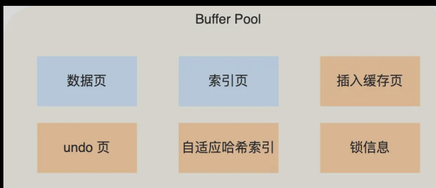
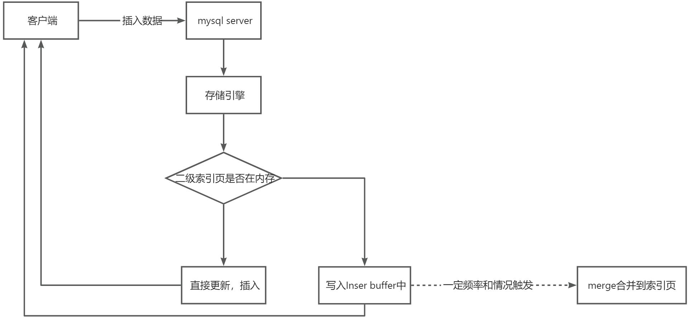
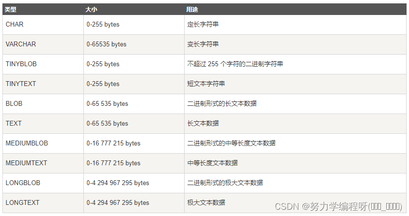
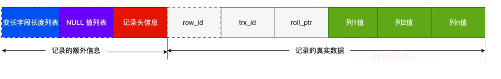
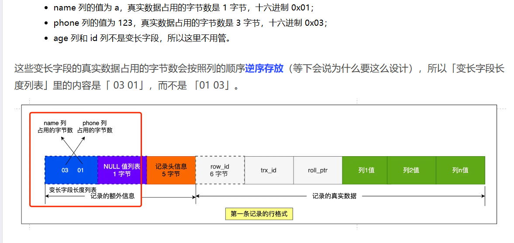
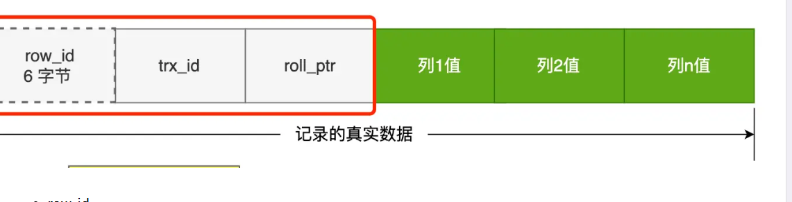
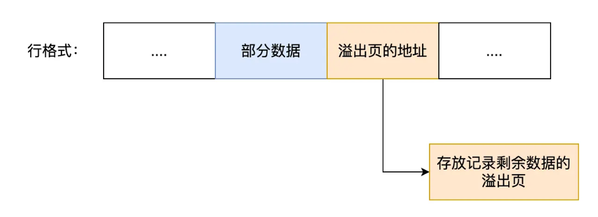

整理 Buffer Pool、Change Buffer、Double Write、字段类型、表空间与行格式。

## Buffer pool

### 为啥需要Buffer pool

说白了，一些都是为了性能，避免每次操作都发生磁盘IO，拖慢性能，Buffer pool个人理解就是mysql程序运行的内存，缓存了一些磁盘数据，内存的操作效率，优先于磁盘的，就像redis一样，完全的内存操作，性能何止是mysql的几倍，但是有为啥要有磁盘持久化操作，一起为了安全，为了数据可以持久保存，即使程序奔溃了，数据也是在的，不会因为内存掉电导致数据丢失问题，这一切的一切就是体现了程序的设计的一个哲学设计思想，**trade-off，折衷，一种取舍，看实际的侧重点。**

**实时上，每个软件都给我们提供很多参数，让我们在性能与安全做取舍，比如redis，mysql，seta等**

**对于mysql来说，每次查询数据，加载磁盘中的数据到内存中后，下次再访问这个页的数据，就不需要读磁盘了，而且对于增删改查修改页数据，页不需要每次都立即刷新到磁盘中，而在内存中缓存的页进行修改，等待何时的实际刷新到磁盘中。**

### Buffer pool 的创建

InnoDB 会把存储的数据划分为若干个「页」，以页作为磁盘和内存交互的基本单位，一个页的大小默认是16K，因此，Buffer Pool 同样需要按「页」来划分。

**MySQL 启动的时候**，**InnoDB 会为 Buffer Pool 申请一片连续的内存空间，然后按照默认的**`**16KB**`**的大小划分出一个个的页， Buffer Pool 中的页就叫做缓存页。**此时这些缓存页都是空闲的，之后随着程序的运行，才会有磁盘上的页被缓存到 Buffer Pool 中。

### Buffer pool 缓存的都是什么？

其实这个问题可以换个直白的问法，mysql运行时内存中都是记录了什么数据？

Buffer Pool 除了缓存「索引页」和「数据页，还包括了 Undo 页，插入缓存、自适应哈希索引、锁信息等等。

### 查选一条数据的时候，就只缓存一行数据吗？

不是的，

还记得吗，对于Innodb来说，每次与磁盘交互的单位都以页为单位，16KB的页，可能存储很多数据呢，而且对于磁盘IO老说，一次会加载多个页，因为有个定律，一旦访问了当前页，那么与其相邻的页也会很快被访问，索性多加载点。

### 内存页修改之后为什么不直接刷盘？

> 执行效率问题（修改页后每次刷新到磁盘会有严重的性能问题，16K大小页，数据也不是连续的，redo log的日志大小很小）
>
> 修改非顺序写为顺序写入（redo log 顺序写入）
>

性能⾮常差。最⼤的问题就是 InnoDB ⻚的⼤⼩⼀般为 16KB，⽽⻚⼜是磁盘和内存交互的基本 单位。这就导致即使我们只修改了⻚中的 ⼏个字节数据，⼀次刷盘操作也需要将16KB ⼤⼩的⻚整个都刷新到磁盘中。⽽ 且，这些修改的⻚可能并不相邻，也就是说这还是**随机IO**。

**采⽤ redo log 的⽅式就可以避免这种性 能问题，因为 redo log 的刷盘性能很 好，写多读少，采用追加写入，将随机IO转成顺序写，大大加快了磁盘IO的性能。⾸先，redo log 的写⼊属于顺序 IO。 其次，⼀⾏ redo log 记录只占⼏⼗ 个字节  。**

为了实现Redo Log Buffer到Redo Log File间的映射，DBMS会把Redo Log Buffer逻辑上分为多个redobuf block/page，每次满足刷写条件时（如：事务提交），**则以redobuf block尺寸大小为基本单位（redo buf block的大小和磁盘基本存储保持一致512K）**向磁盘做write和flush，这么做的方式主要是兼顾底层存储的I/O性能问题，还可以避免**原子性**的问题，一次性写入，避免double wirite（因为[redolog](https://so.csdn.net/so/search?q=redolog&spm=1001.2101.3001.7020)写入的单位就是512字节，也就是磁盘IO的最小单位，所以无所谓数据损坏）

另外，Buffer Pool 中的⻚（脏⻚）在某 些情况下（⽐如 redo log 快写满了，主线程刷新脏页操作）也会进⾏刷盘操作。不过，这⾥的刷盘操作 会**合并写⼊，更⾼效地顺序写⼊到磁盘 **。

### Insert（change） buffer （对于二级索引页的优化）

#### 适用的情况

一级索引主键是有序的，索引存储的在页子中的数据也是主键排列的存储，是有序的存储在页数据中的，但是这条数据在存储在非唯一索引数据页叶子节点中顺序不再是顺序，这个时候就需要离散的访问非聚集索引页了，由于随机的读取会导致插入性能的下降。

::: note
解释一下**为啥二级索引在插入索引页的叶子节点的时候是不按照数据插入顺序插入的（即不是顺序追加写页）**，因为一个数据的插入按照主键递增插入数据页的叶子节点，当插入二级索引叶子节点的时候，要插入二级索引的值并不是递增的（比如说当前二级索引age最大值40，但是我们当前插入的数据是10），是需要到计算出具体的值，**按照索引顺序插入**，插入的位置可能是一个已经写满的页，也可能是一个未写满的页，可能会导致页分裂问题，而且一旦一个表上有多个二级索引的时候，**就会导致多次随机磁盘IO，读取数据页，进一步的导致插入性能变慢。**

:::

为此，Innodb为了解决上述问题，对于非聚集索引（非唯一索引）的插入或者更新，删除操作，不是每一次都直接插入到索引页中，而是先判断插入的非聚集索引页是否在buffer pool中，若是在直接插入（或者修改）若是不在，则先放到一个角insert buffer对象中。这个时候其实就可以返回客户端，插入成功，然后再以一定的频率和情况（比如索引页加载入内存）进行Insert buffer 和辅助索引叶子节点merge（合并）。

insert buffer 使用满足的条件：

1. 索引是二级索引，不是主键索引，因为主键索引是唯一而且有序的
2. 索引不是唯一索引，因为如果是唯一索引的话，就必须读取数据判断索引值是否存在，不能利用insert buffer机制。

#### merge合并的时间

1. 二级索引页被读取到内存中，每当一个索引页加载到内存中都会检查Insert buffer bitmmp，然后确认该辅助索引是否有记录存放在Insert buffer中，若有则执行merge，把数据插入到索引页中
2. Insert buffer bitmmp是用来追踪记录每个铺助索引页的可用空间的，若插入铺助索引记录检测到插入记录后可用空间小于1/32页，则会强制进行一个合并操作，即强制读取索引页，merge数据。
3. 主线层每秒或者10s会进行一次Merge Insert buffer 操作。（必须有的兜底方案）

## Double-Write机制

磁盘IO的最小单位为512K，每次写入512K数据就是一个原子写，不需要考虑数据分多次写入导致的问题，但是innndob的每个页大小大小默认16KB，多要分多次写入磁盘，需要考虑每次写入数据可能存在断电，宕机的问题，导致一个页的数据只写入了部分数据而且页也损坏了，无法使用redo log 恢复，而double-writer 就是来解决这个问题。

> **数据库的页大小为对应文件系统页大小的整数倍，一个完整的数据页落盘将会对应多次磁盘I/O，但是文件系统只能保证每次4KB的I/O是原子性被刷写至磁盘中的。**
>

**每次刷新脏页时，****为了避免页的数据只刷新了部分数据到磁盘中的问题****（**当数据库正在从内存向磁盘写一个数据页是，数据库宕机，从而导致这个页只写了部分数据，这就是部分写失效，它会导致数据丢失。这时是无法通过重做日志恢复的**，****因为重做日志记录的是对页的物理修改**，**如果页本身已经损坏，重做日志也无能为力****），采用了doble-write双写来解决这个问题。**

doublewrite由两部分组成，一部分为**内存中的doublewrite buffer，其大小为2MB**，另一部分是磁盘上共享[**表空间**](https://so.csdn.net/so/search?q=%E8%A1%A8%E7%A9%BA%E9%97%B4&spm=1001.2101.3001.7020)(ibdata x)中连续的**128个页，即2个区(extent)，大小也是2M。**

1. 当一系列机制触发**数据缓冲池中的脏页刷新时**，并不直接写入磁盘数据文件中，而是先拷贝至内存中的doublewrite buffer中；
2. 接着从**doublewrite buffer**分两次写入磁盘共享表空间中(**连续存储，顺序写，性能很高**)，每次写1MB；（因为double buffer 本省就只有2M，两个区）（缓存区的数据到磁盘中）
3. 待第二步完成后，再将doublewrite buffer中的脏页数据写入实际的各个表空间文件(离散写)；(脏页数据固化后，即进行标记对应doublewrite数据可覆盖)
4. doublewrite的崩溃恢复：如果操作系统在将页写入磁盘的过程中发生崩溃，在恢复过程中，[innodb存储引擎](https://so.csdn.net/so/search?q=innodb%E5%AD%98%E5%82%A8%E5%BC%95%E6%93%8E&spm=1001.2101.3001.7020)可以从**共享表空间的double write中找到该页的一个最近的副本（无敌了）**，将其复制到表空间文件，再应用redo log，就完成了恢复过程。**因为有副本所以也不担心表空间中数据页是否损坏。**

扩展：当**doule writer 写入共享表空间异常，****此时脏页数据未刷新到磁盘中**，**页没有损坏**，只需要按照redo log 日志恢复数据。

## 创建表的时候，定义列的大小详解？

分为几种情况：

+ 当列的数据是整形数据时，也就是tinyInt，int ，bigInt
+ 当列的数据是字符串时，也就是 char，varchar
+ 当列数据是小数时候，float，double，decimal

### 整数情况

int(M)、BigInt(M)、**tinyint（M）**

这里的M代表的并不是存储在数据库中的具体的长度，如果误以为int(3)只能存储3个长度的数字，int(11)就会存储11个长度的数字，这是不对的** tinyint(1) 和 tinyint(4) 中的1和4并不表示存储长度**，它代表的是数据在显示时显示的最小长度，只有字段指定zerofill才是有用(也就是零填充时)， **如tinyint(4)，如果实际值是2，如果列指定了zerofill，查询结果就是0002，左边用0来填充`。**

### 字符串情况

CHAR(M)定义的列的长度为固定的，**M取值可以为0～255之间**，当保存CHAR值时，**在它们的右边填充空格以达到指定的长度。当检索到CHAR值时，尾部的空格被删除掉。**在存储或检索过程中不进行大小写转换。CHAR存储定长数据很方便，CHAR字段上的索引效率级高，比如定义char(10)，那么不论你存储的数据是否达到了10个字节，都要占去10个字节的空间,不足的自动用空格填充。

VARCHAR(M)定义的列的长度为可变长字符串**，M取值可以为0~65535之间**，(VARCHAR的最大有效长度由最大行大小和使用的字符集确定。整体最大长度是65,532字节）。VARCHAR值保存时只保存需要的字符数，另加一个字节来记录长度(如果列声明的长度超过255，则使用两个字节)。VARCHAR值保存时不进行填充。当值保存和检索时尾部的空格仍保留，符合标准SQL。varchar存储变长数据，但存储效率没有CHAR高。如果一个字段可能的值是不固定长度的，我们只知道它不可能超过10个字符，把它定义为 VARCHAR(10)是最合算的。

CHAR和VARCHAR最大的不同就是一个是固定长度，一个是可变长度。

::: warning
~~M的意思占用的字节数量，做大只能存储M个字节，超过这个字节数据库库自动截断存储，而且我们常用的UTF-8存储，一个英文字符占用一个字节，拉丁字母和希腊字母需要 2 字节，常用的中文字符需要 3 字节，其他的一些生僻字符需要 4 字节。~~

M代表的是最多存储的字符数量，并不是字节大小，超过这个字符数量数据库库自动截断存储~~，~~要算 varchar(n) 最大能允许存储的字节数，还要看数据库表的字符集，因为字符集代表着，1个字符要占用多少字节，比如 ascii 字符集， 1 个字符占用 1 字节，那么 varchar(100) 意味着最大能允许存储 100 字节的数据。

:::

### Decimal(M,D)数据类型用法

当我们需要存储小数，并且有精度要求，比如存储金额时，通常会考虑使用DECIMAL字段类型。

+ DECIMAL(M,D)中M为总长度,D为小数点后的保留的位数，M范围是1到65，D范围是0到30。
+ M大于D,存储数值时，小数位不足会自动补0，首位数字为0自动忽略。

比如DECIMAL（5,2）表示长度5，小数部分占2位。

### 普通小数

float(M,D)

## 数据如何存储

[MySQL 的 NULL 值是怎么存储的？ - 小林coding - 博客园](https://www.cnblogs.com/xiaolincoding/p/16941244.html)

### 表数据存储位置

每创建一个 database（数据库） 都会在 /var/lib/mysql/ 目录里面创建一个以 database 为名的目录，然后**保存表结构和表数据**的文件都会存放在这个目录里，比如创建一个my_test数据库，/var/lib/mysql/test目录下三个文件

+ db.opt，**用来存储当前数据库的默认字符集和字符校验规则。**
+ t_order.frm **，t_order 的表结构会保存在这个文件**。在 MySQL 中建立一张表都会生成一个.frm 文件，**该文件是用来保存每个表的元数据信息的，主要包含表结构定义。**
+ t_order.ibd，**t_order 的表数据会保存在这个文件**。**表数据既可以存在共享表空间文件（文件名：ibdata1）里，也可以存放在独占表空间文件（文件名：表名字.idb）**。这个行为是由参数 innodb_file_per_table 控制的，若设置了参数 innodb_file_per_table 为 1，则会将存储的数据、索引等信息单独存储在一个独占表空间，从 MySQL 5.6.6 版本开始，它的默认值就是 1 了，因此从这个版本之后， **MySQL 中每一张表的数据都存放在一个独立的 .idb 文件**。

所以一张数据库表的数据是保存在「 表名字.idb 」的文件里的，这个文件也称为独占表空间文件。

### 表空间文件的结构是怎么样的？

**表空间由段（segment）、区（extent）、页（page）、行（row）组成，mysql按照页为单位读取数据，每页上存储多行数据，Innodb每页大小为16K，一个分区有存在多个多个页，连续的页存储在一个分区中，避免了离散随机IO**问题，每个分区大小为1MB，所以一个分区可以有1MB*1024/16Kb=64个页。

一个表空间有多个段，一个段有多个分区，一个分区有多个页，一个页有多个行

#### 行

数据库表中的记录都是按行（row）进行存放的，每行记录根据不同的行格式，有不同的存储结构。

#### 页

数据库的读取并不以「行」为单位，否则一次读取（也就是一次 I/O 操作）只能处理一行数据，效率会非常低。

因此，**InnoDB 的数据是按「页」为单位来读写的**，也就是说，当需要读一条记录的时候，并不是将这个行记录从磁盘读出来，而是以页为单位，将其整体读入内存。**默认每个页的大小为 16KB**，也就是最多能保证 16KB 的连续存储空间。

#### 分区

InnoDB 存储引擎是用 B+ 树来组织数据的，B+ 树中每一层都是通过双向链表连接起来的，如果是以页为单位来分配存储空间，那么链表中相邻的两个页之间的物理位置并不是连续的，可能离得非常远，那么磁盘查询时就会有大量的随机I/O，随机 I/O 是非常慢的，解决这个问题也很简单，就是让链表中相邻的页的物理位置也相邻，这样就可以使用顺序 I/O 了。**在表中数据量大的时候，为某个索引分配空间的时候就不再按照页为单位分配了，而是****按照区（extent）为单位分配****。每个区的大小为 1MB，对于 16KB 的页来说，连续的 64 个页会被划为一个区，这样就使得链表中相邻的页的物理位置也相邻，就能使用顺序 I/O 了**。

#### 段

表空间是由各个段（segment）组成的，段是由多个区（extent）组成的。段一般分为数据段、索引段和回滚段等。

+ 索引段：存放 B + 树的非叶子节点的区的集合；
+ 数据段：存放 B + 树的叶子节点的区的集合；
+ 回滚段：存放的是回滚数据的区的集合，

#### 表空间

每次创建一个表的时候，都是同步创建一个表明idb文件，存储具体的表数据。

### COMPACT行格式存储数据

#### 行格式

可预想的数据存储肯定分为两个部分，真实的行数据，以及描述行数据的元数据信息及其辅助优化操作的信息，即一条完整的记录分为「记录的额外信息」和「记录的真实数据」两个部分。

#### 记录的额外信息

记录的额外信息包含 3 个部分：**变长字段长度列表**、NULL 值列表、记录头信息。

##### 变长字段的长度列表

varchar(n) 和 char(n) 的区别是什么，**char 是定长的，varchar 是变长的**，变长字段实际存储的数据的长度（大小）不固定的。如何记录每个行那个不定长列实际的长度呢，mysql在行的开头设置了一个列表，记录了那些不定长列的实际存储长度，这个列表是倒序存储记录的数据，相当于列表的最左边的元素对应最右边那个变长字符长度值，而且**NULL 是不会存放在行格式中记录的真实数据部分里的**，**所以「变长字段长度列表」里不需要保存值为 NULL 的变长字段的长度，因为我们有专门的NULL值列表存储记录数据。**

> 其实变长字段字节数列表不是必须的，**当数据表没有变长字段的时候，比如全部都是 int 类型的字段，这时候表里的行格式就不会有「变长字段长度列表」了**，因为没必要，去掉以节省空间，所以「变长字段长度列表」只出现在数据表有变长字段的时候。
>

比如我们有两个字段age，name 是个varChar机制，怎么做呢，mysql在存储记录这行数据的时候，会计算出这个来列数据的真实的字符长度，存储了变长字段的长度列表。

##### NULL 值列表

表中的某些列可能会存储 NULL 值，如果把这些 NULL 值都放到记录的真实数据中会比较浪费空间，所以 Compact 行格式把这些值为 NULL 的列存储到 NULL值列表中。如果存在允许 NULL 值的列，则每个列对应一个二进制位（bit），二进制位按照列的顺序逆序排列。**NULL 值列表必须用整数个字节的位表示（1字节8位），如果使用的二进制位个数不足整数个字节，则在字节的高位补 **`**0**`**。（当行中null的数据低于8个一个字节表示，超过8个是需要两个字节表示，同理，超过24个需要3个字节表示）**

+ 二进制位的值为`1`时，代表该列的值为NULL。
+ 二进制位的值为`0`时，代表该列的值不为NULL。

> NULL 值列表也不是必须的。**当数据表的字段都定义成 NOT NULL 的时候，这时候表里的行格式就不会有 NULL 值列表了**。所以在设计数据库表的时候，通常都是建议将字段设置为 NOT NULL，这样可以节省 1 字节的空间（NULL 值列表占用 1 字节空间）。
>

#### 记录头信息

记录头信息中包含的内容很多，这里说几个比较重要的：

+ **delete_mask ：标识此条数据是否被删除。从这里可以知道，我们执行 detele 删除记录的时候，并不会真正的删除记录，只是将这个记录的 delete_mask 标记为 1。（页的复用，以及页中行数据的复用）**
+ next_record：**下一条记录的位置。从这里可以知道，记录与记录之间是通过链表组织的**。在前面我也提到了，指向的是下一条记录的「记录头信息」和「真实数据」之间的位置，这样的好处是向左读就是记录头信息，向右读就是真实数据，比较方便。
+ record_type：表示当前记录的类型，**0表示普通记录，1表示B+树非叶子节点记录，2表示最小记录，3表示最大记录**

#### row_id

如果我们建表的时候指定了主键或者唯一约束列，那么就没有 row_id 隐藏字段了。如果既没有指定主键，又没有唯一约束，那么 InnoDB 就会为记录添加 row_id 隐藏字段。row_id不是必需的，占用 6 个字节。

#### trx_id

事务id，表示这个数据是由哪个事务生成的。 trx_id是必需的，占用 6 个字节。

#### roll_pointer

这条记录上一个版本的指针。roll_pointer 是必需的，占用 7 个字节。

#### 真实数据

真实的每列的数据

#### 行数据溢出怎么办

MySQL 中磁盘和内存交互的基本单位是页，一个页的大小一般是 `16KB`，也就是 `16384字节`，而一个 varchar(n) 类型的列最多可以存储 `65532字节`，一些大对象如 TEXT、BLOB 可能存储更多的数据，这时一个页可能就存不了一条记录。这个时候就会**发生行溢出，多的数据就会存到另外的****「溢出页」中**。

当发生行溢出时，在记录的真实数据处只会保存该列的一部分数据，而把剩余的数据放在「溢出页」中，然后真实数据处用** 20 字节存储指向溢出页的地址，从而可以找到剩余数据所在的页**。

## Delete 删除数据后，空闲行问题

InnoDB表的数据存储在页（page）中，每个页可以存放多条记录，在InnoDB中，删除一些行，这些行只是被标记为"已删除"，记录到空闲表中（**和redis删除数据逻辑一样，不是立即释放空间，只是标记记录一下已删除**）**而不是真的从索引中物理删除了**，因而空间也没有真的被释放回收（**同时也会将该行的的删除操作记录在redo和undo表空间中以便进行回滚（rollback）和重做操作（事务原子行操作）**）；虽然InnoDB的Purge线程会异步的来清理这些没用的索引键和行，但是依然没有把这些释放出来的空间还给操作系统重新使用，**因而会导致页面中存在很多空洞，许多的空闲行，而且****如果表结构中包含动态长度字段**，那么这些空洞甚至可能不能被InnoDB重新用来存新的行，因为空闲的空间长度不足，动态的字段申请的空间大小不一致。

大量随机的DELETE操作，必然会在数据文件中造成不连续的空白空间。而当插入数据时,这些空白空间则会被利用起来，于是造成了数据的存储位置不连续。物理存储顺序与逻辑上的排序顺序不同,这种就是数据碎片，顺序IO读取变成随机IO了，自增的key，可能下一条数据不在同一个页，甚至相邻的页，分区，段等。

对于Innodb存储引擎来说，可以通用过表空间压缩（OPTIMIZE TABLE），重建表，避免这些问题，定时的对表数据进行一次重建可以避免很多问题。
