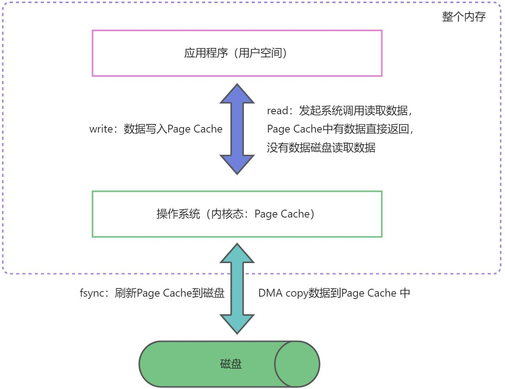

整理用户空间与内核空间、write、fsync，以及 MySQL 和 Redis 的刷盘笔记。

## 用户空间与内核空间

可以看到，每次writer数据都需要讲用户空间的数据传递（也就是copy）到内核空间中，读取数据也是需要讲内核空间的数据传递（copy）到用户空间中，如何设计到读数据，然后写入数据，会发生多次CPU copy操作，此时的优化就可以用我们的（CPU零CPU技术优化这个操作，比如mmap，sendFile）。

## 系统IO操作

### Page Cache 与 fsync 与 write

只 write，不 fsync，后续交由操作系统决定何时将数据持久化到磁盘；

此时的write 操作是讲数据写入了Page Cache中了，并没有刷新到磁盘，此时只是讲数据从用户空间copy到内核空间。

fsync操作是讲Page Cache中的数据写入到磁盘中，此时才设计中磁盘IO操作

### mysql中的 write 与 fsync

待补充。

### Redis中的 writer 与 fsync

redis一个AOF文件，会记录每个key的更新指令，会有几种策略配置指令设么时候刷新到磁盘中

always：表示每次操作redis内存，都要执行fsync，将内核空间中的Page Cache 刷新到磁盘中

every-seconds：每次操作的指令执行write写入内核空间中的Page Cache，然后后台线程每秒执行一次fsync刷新数据到磁盘

no：意思就是每次的操作指令都执行write写入内核空间中的Page Cache，然后刷新到磁盘的时间交给操作系统自主判断
