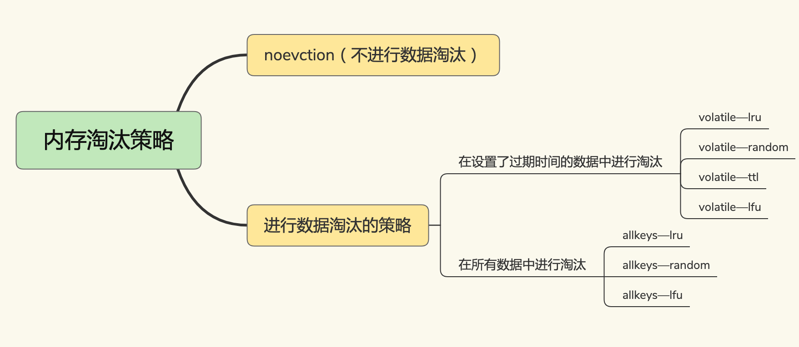
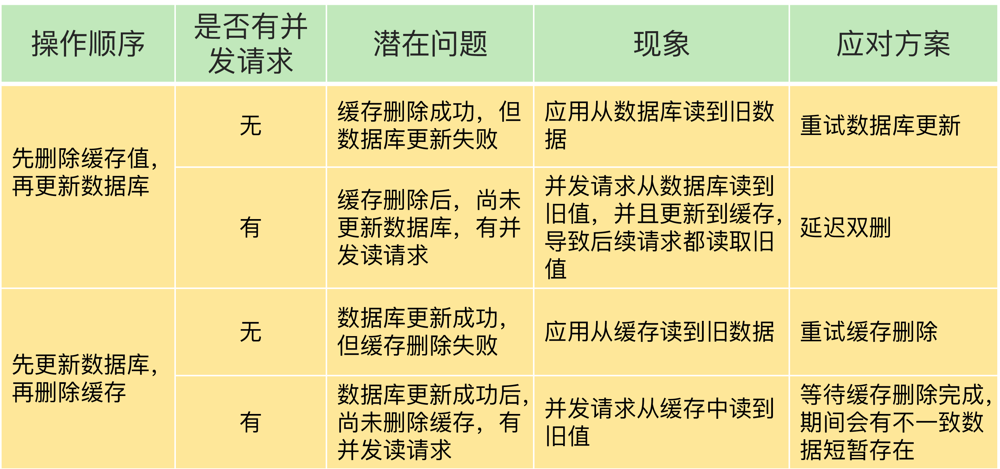
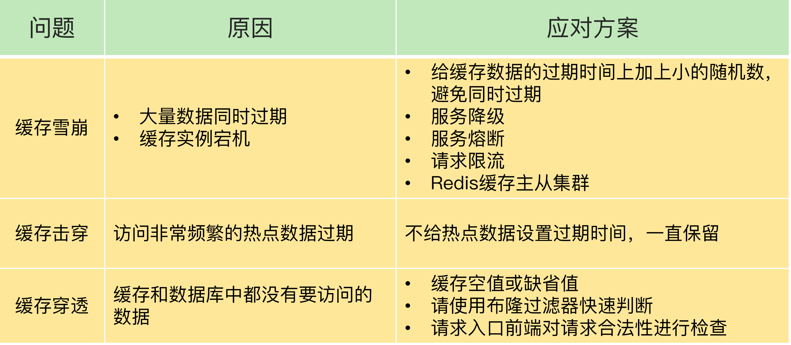
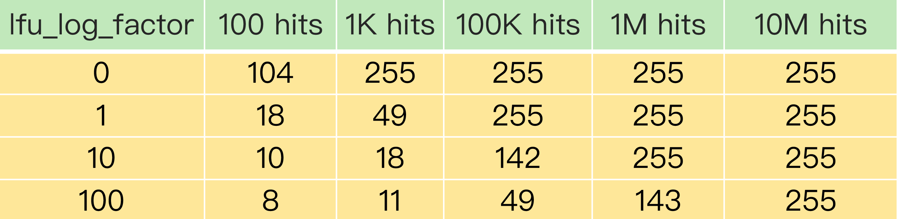

整理键过期、旁路缓存、内存淘汰、缓存与数据库一致性、缓存异常和 LRU、LFU。

## key的过期策略

默认情况下，**Redis 每 100 毫秒会删除一些过期 key**，具体的算法如下：

**采样 ACTIVE_EXPIRE_CYCLE_LOOKUPS_PER_LOOP 个数的 key，并将其中过期的 key 全部删除；如果超过 25% 的 key 过期了，则重复删除的过程，直到过期 key 的比例降至 25% 以下**。ACTIVE_EXPIRE_CYCLE_LOOKUPS_PER_LOOP 是 Redis 的一个参数，**默认是 20**，那么，一秒内（执行10次）基本有 200 个过期 key 会被删除。这一策略对清除过期 key、释放内存空间很有帮助。如果每秒钟删除 200 个过期 key，并不会对 Redis 造成太大影响。
	但是，如果触发了上面这个算法的第二条，Redis 就会**一直删除以释放内存空间（不再是100ms删除一次了，而是一直执行删除）**。注意，**删除操作是阻塞的**（Redis 4.0 后可以用异步线程机制来减少阻塞影响，封装成一个事件任务放入队列中，由后台异步线程取出任务删除数据）。

所以，一旦该条件触发，Redis 的线程就会一直执行删除，这样一来，就没办法正常服务其他的键值操作了，就会进一步引起其他键值操作的延迟增加，Redis 就会变慢。

**频繁使用带有相同时间参数的 EXPIREAT 命令设置过期 key**，这就会导致，在同一秒内有大量的 key 同时过期。

大量的key过期，删除数据释放空间会导致redis主线程阻塞，同时也有可能造成缓存雪崩的问题。

同时，**还有一个策略是对定期删除的的一个补充，就是惰性删除策略**。（因为定时删除的一直没有扫描到这个要已经过期的时间，导致一直删除不了，所以只能在有客户独胆主动访问的时候给顺手删除了，二者互补）。因为当一个数据的过期时间到了以后，并不会立即删除数据，而是等到再有请求来读写这个数据时，对数据进行检查，如果发现数据已经过期了，再删除这个数据。

如果一个key的设置的过期时间不过期，

## 旁路缓存（Redis充当缓存服务）

Redis 是一个独立的系统软件，和业务应用程序是两个软件，当我们部署了 Redis 实例后，**它只会被动地等待客户端发送请求，然后再进行处理**。所以，如果应用程序想要使用 Redis 缓存，我们就要在程序中增加相应的缓存操作代码。所以，我们也把 Redis 称为旁路缓存，也就是说，读取缓存、读取数据库和更新缓存的操作都需要在应用程序中来完成

## Redis的内存淘汰

### 8种淘汰策略

Redis 4.0 之前一共实现了 6 种内存淘汰策略，在 4.0 之后，又增加了 2 种策略。我们可以按照是否会进行数据淘汰把它们分成两类：

+ 不进行数据淘汰的策略，只有 noeviction 这一种。
+ 会进行淘汰的 7 种其他策略。

会进行淘汰的 7 种策略，我们可以再进一步根据淘汰候选数据集的范围把它们分成两类：

+ 在设置了过期时间的数据中进行淘汰，包括 volatile-random、volatile-ttl、volatile-lru、volatile-lfu（Redis 4.0 后新增）四种。
+ 在所有数据范围内进行淘汰，包括 allkeys-lru、allkeys-random、allkeys-lfu（Redis 4.0 后新增）三种。

 	

默认情况下，Redis 在使用的内存空间超过 **maxmemory** 值时，并不会淘汰数据，也就是设定的 **noeviction 策略**。对应到 Redis 缓存，也就是指，一旦缓存被写满了，再有写请求来时，**Redis 不再提供服务，而是直接返回错误。**Redis 用作缓存时，实际的数据集通常都是大于缓存容量的，总会有新的数据要写入缓存，这个策略本身不淘汰数据，也就不会腾出新的缓存空间，我们不把它用在 Redis 缓存中。

### volatile 淘汰策略

+ volatile-ttl 在筛选时，**会针对设置了过期时间的键值对**，根据过期时间的先后进行删除，越早过期的越先被删除。
+ volatile-random 就像它的名称一样，在设置了过期时间的键值对中，进行随机删除。
+ volatile-lru 会使用 LRU 算法筛选设置了过期时间的键值对。
+ volatile-lfu 会使用 LFU 算法选择设置了过期时间的键值对。

### allkeys 淘汰策略

+ allkeys-random 策略，从所有键值对中随机选择并删除数据；
+ allkeys-lru 策略，使用 LRU 算法在所有数据中进行筛选。
+ allkeys-lfu 策略，使用 LFU 算法在所有数据中进行筛选。

### Redis LRU算法实现优化（Last recently used）

**LRU 算法背后的想法非常朴素：它认为刚刚被访问的数据，肯定还会被再次访问，所以就把它放在 MRU 端；长久不访问的数据，肯定就不会再被访问了，所以就让它逐渐后移到 LRU 端，在缓存满时，就优先删除它。**
	不过，LRU 算法在实际实现时，需要用链表管理所有的缓存数据，这会**带来额外的空间开销**。而且，当有数据被访问时，需要在链表上把该数据移动到 MRU 端，如果有大量数据被访问，**就会带来很多链表移动操作，会很耗时，进而会降低 Redis 缓存性能。**
所以，**在 Redis 中，LRU 算法被做了简化**，以减轻数据淘汰对缓存性能的影响。具体来说，Redis 默认会记录每个数据的最近一次访问的时间戳（由键值对数据结构 **RedisObject 中的 lru 字段记录**）。然后，Redis 在决定淘汰的数据时，**第一次会随机选出 N 个数据，把它们作为一个候选集合**，接下来，Redis 会比较这 N 个数据的 lru 字段，把 lru 字段值最小的数据从缓存中淘汰出去。

> Redis 提供了一个配置参数 **maxmemory-samples，这个参数就是 Redis 选出的数据个数 N**。例如，我们执行如下命令，可以让 Redis 选出 100 个数据作为候选数据集：
>
> CONFIG SET maxmemory-samples 100
>

当需要**再次淘汰数据**时，Redis 需要挑选数据进入**第一次淘汰时创建的候选集合**。这儿的挑选标准是：**能进入候选集合的数据的 lru 字段值必须小于候选集合中最小的 lru 值**。当有新数据进入候选数据集后，如果候选数据集中的数据个数达到了 maxmemory-samples，**Redis 就把候选数据集中 lru 字段值最小的数据淘汰出去（最久未被访问的数据）**。（随机挑选数据也是需要一段时间的，只有LRU集合中元素个数符合要求才执行淘汰删除数据）

## 缓存和数据库如何保持一致性

删除缓存值或更新数据库失败而导致数据不一致，你可以使用重试机制确保删除或更新操作成功。

在删除缓存值、更新数据库的这两步操作中，有其他线程的并发读操作，导致其他线程读取到旧值，**应对方案是延迟双删**。

### 延迟双删

更新完数据库缓存后，过一段时间，让同一时间并发的线程完成更新缓存的操作，然后再去删除缓存，此时数据库的值是最新的值，后续线程访问读取的值也是最新的值

### 基于消息队列

保证在修改数据的过程中出现异常也要发起重试操作，保证更新缓存，更新数据库成功。

## 如何解决缓存雪崩、击穿、穿透难题？

这三个问题一旦发生，会导致大量的请求积压到数据库层。如果请求的并发量很大，就会导致数据库宕机或是故障，这就是很严重的生产事故了。

雪崩：大量数据同时过期，到时跟多请求来带数据库

击穿：某一个热点数据过期，导致大量的热点请求来到数据库

穿透：大量请求访问一个不存在值（发生这种情况被攻击了）

## 缓存污染

在一些场景下，有些数据被访问的次数非常少，甚至只会被访问一次。当这些数据服务完访问请求后，如果还继续留存在缓存中的话，就只会白白占用缓存空间。这种情况，就是缓存污染。**（其实就是内存淘汰算法不能及时的那个无用数据给淘汰掉）**

当缓存污染不严重时，只有少量数据占据缓存空间，此时，对缓存系统的影响不大。但是，缓存污染一旦变得严重后，就会有大量不再访问的数据滞留在缓存中。如果这时数据占满了缓存空间，我们再往缓存中写入新数据时，就需要先把这些数据逐步淘汰出缓存，这就会引入额外的操作时间开销，进而会影响应用的性能。

### 如何解决缓存污染

就是选择一个适合具体业务场景的内存淘汰策略，淘汰无用缓存数据

 首先是**volatile-random 和 allkeys-random** 这两种策略。它们都是采用随机挑选数据的方式，来筛选即将被淘汰的数据。既然是随机挑选，那么 **Redis 就不会根据数据的访问情况来筛选数据**。如果被淘汰的数据又被访问了，就会发生缓存缺失。也就是说，应用需要到后端数据库中访问这些数据，降低了应用的请求响应速度。所以，volatile-random 和 allkeys-random 策略，**在避免缓存污染这个问题上的效果非常有限。不推荐使用。**

**其次是volatile-ttl **针对的是设置了过期时间的数据，把这些数据中剩余存活时间最短的筛选出来并淘汰掉。虽然 volatile-ttl 策略不再是随机选择淘汰数据了，但是剩余存活时间并不能直接反映数据再次访问的情况。除非我们可以清晰的知道业务数据的存货时间，可以一定程度上避免问题。

### LRU

如果一个数据刚刚被访问，那么这个数据肯定是热数据，还会被再次访问。
	按照这个核心思想，Redis 中的 LRU 策略，会在每个数据对应的 **RedisObject 结构体中设置一个 lru 字段，用来记录数据的访问时间戳**。在进行数据淘汰时，LRU 策略会在候选数据集中淘汰掉 lru 字段值最小的数据（也就是访问时间最久的数据）。所以，在数据被频繁访问的业务场景中，**LRU 策略的确能有效留存访问时间最近的数据**。而且，因为留存的这些数据还会被再次访问，所以又可以提升业务应用的访问速度。

但是，也正是**因为只看数据的访问时间，使用 LRU 策略在处理扫描式****单次查询操作****时，无法解决缓存污染**。所谓的扫描式单次查询操作，就是指应用对大量的数据进行一次全体读取，每个数据都会被读取，而且只会被读取一次。此时，因为这些被查询的数据刚刚被访问过，所以 lru 字段值都很大。

> 为了避免操作链表的开销，Redis 在实现 LRU 策略时使用了两个近似方法：
>
> + Redis 是用 RedisObject 结构来保存数据的，RedisObject 结构中设置了一个 lru 字段，用来记录数据的访问时间戳；
> + Redis 并没有为所有的数据维护一个全局的链表，而是通过随机采样方式，选取一定数量（例如 10 个）的数据放入候选集合，后续在候选集合中根据 lru 字段值的大小进行筛选。
>

### LFU

为了应对**扫描式单次查询**这类缓存污染问题，Redis 从 4.0 版本开始增加了 LFU 淘汰策略。

LFU 缓存策略是在 LRU 策略基础上，为每个数据增加了一个计数器，来统计这个数据的访问次数。当使用 LFU 策略筛选淘汰数据时，**首先会根据数据的访问次数进行筛选，把访问次数最低的数据淘汰出缓存**。如果两个数据的访问次数相同**，****LFU 策略再比较这两个数据的访问时效性，把距离上一次访问时间更久的数据淘汰出缓存。**

> 在LRU使用基础上，**Redis 在实现 LFU 策略的时候，只是把原来 24bit 大小的 lru 字段，又进一步拆分成了两部分**。
>
> + ldt 值：lru 字段的前 16bit，表示数据的访问时间戳；
> + counter 值：lru 字段的后 8bit，表示数据的访问次数。
>

### LFU 算法counter的计算规则

**Redis 只使用了 8bit 记录数据的访问次数，而 8bit 记录的最大值是 255**，所以说数据的counter来到255就无法区分了，对于那种一段时间大量访问，后续不在访问的情况。

counter计数器的初始值默认是 5（由代码中的 LFU_INIT_VAL 常量设置），**而不是 0**，这样可以避免数据刚被写入缓存，就因为访问次数少而被立即淘汰。（因为存在衰减机制）

#### 计数器counter增长

redis**在实现 LFU 策略时，Redis 并没有采用数据每被访问一次，就给对应的 counter 值加 1 的计数规则，而是采用了一个更优化的计数规则**。
	简单来说，LFU 策略实现的计数规则是：每当数据被访问一次时，首先，用计数器当前的值乘以**配置项 lfu_log_factor 再加 1**，再**取其倒数，得到一个 p 值**；然后，把这个 p 值和**一个取值范围在（0，1）间的随机数 r 值比大小**，只有 p 值大于 r 值时，计数器才加 1。（太抽象了，算法）
	使用了这种计算规则后，我们可以通过设置不同的 lfu_log_factor 配置项，来控制计数器值增加的速度，避免 counter 值很快就到 255 了。

正是因为使用了**非线性递增的计数器方法**，即使缓存数据的访问次数成千上万，LFU 策略也可以有效地区分不同的访问次数，从而进行合理的数据筛选。

#### 计数器counter衰减

在一些场景下，**有些数据在短时间内被大量访问后就不会再被访问**了。那么再按照访问次数来筛选的话，这些数据会被留存在缓存中，但不会提升缓存命中率。为此，Redis 在实现 LFU 策略时，还设计了一个 **counter 值的衰减机制。**
	LFU 策略使用衰减因子配置项** lfu_decay_time ****来控制访问次数的衰减**。LFU 策略会计算当前时间和数据最近一次访问时间的差值，并把这个差值换算**成以分钟为单**位。然后，L**FU 策略再把这个差值除以 lfu_decay_time 值，所得的结果就是数据 counter 要衰减的值。**

> 简单举个例子，假设 lfu_decay_time 取值为 1，如果数据在 N 分钟内没有被访问，那么它的访问次数就要减 N。如果 lfu_decay_time 取值更大，那么相应的衰减值会变小，衰减效果也会减弱。所以，如果业务应用中有**短时高频访问的数据（暂时的的高频率值）**的话，建议把 lfu_decay_time 值设置为 1，这样一来，LFU 策略在它们不再被访问后，**会较快地衰减它们的访问次数，尽早把它们从缓存中淘汰出去，避免缓存污染。 **
>
