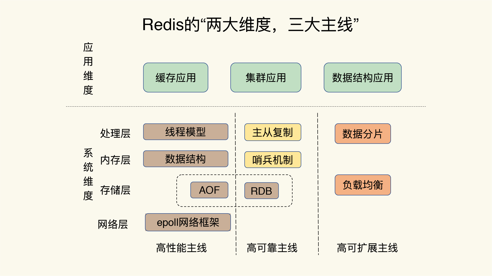
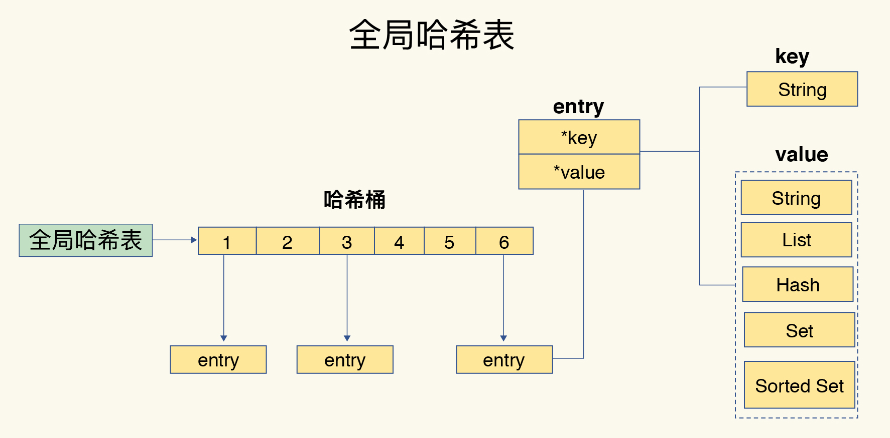
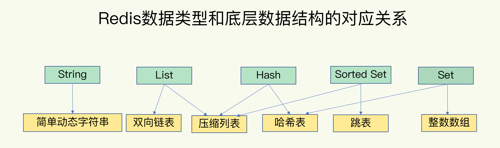
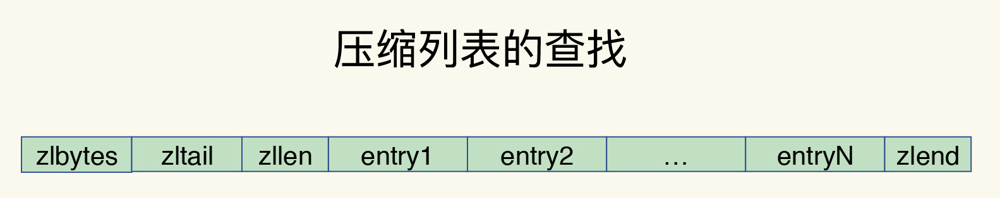
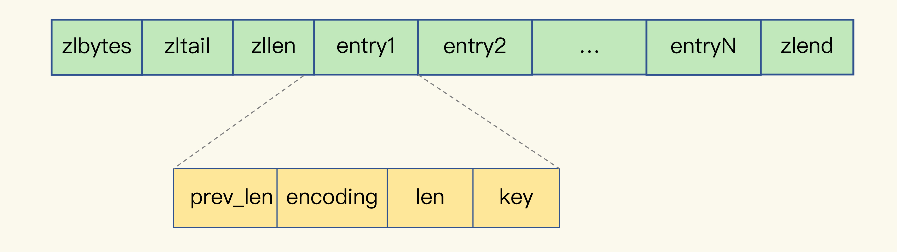
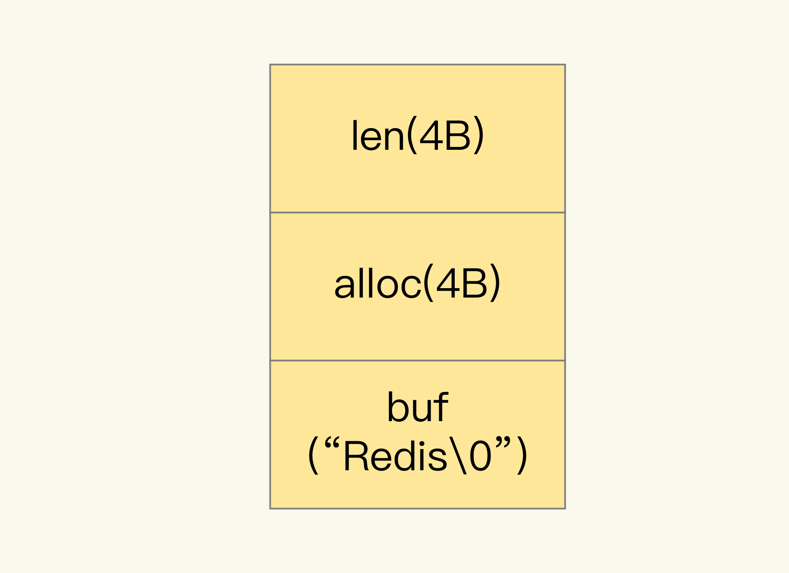
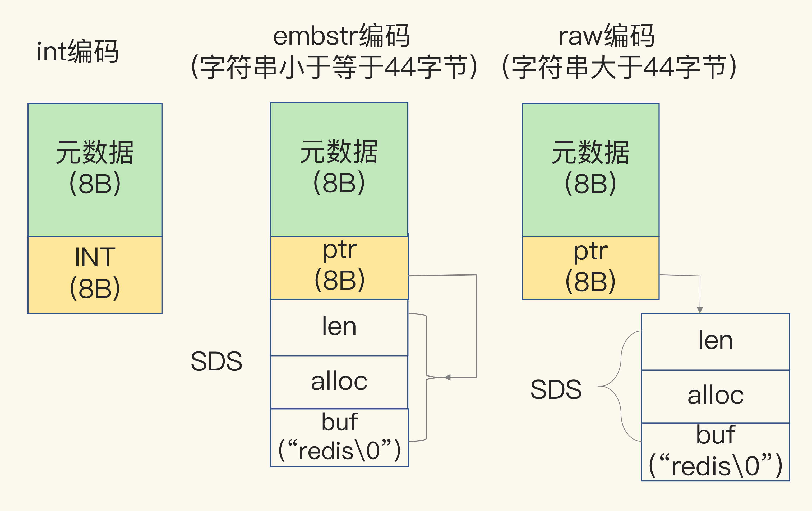
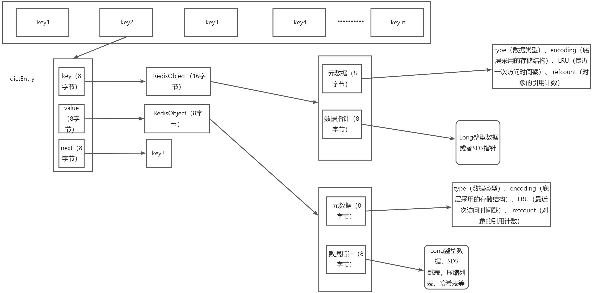

整理 Redis 全局结构、字典与渐进式 Rehash、压缩列表、跳表、RedisObject 和键值设计。

## Redis全局系统观

先建立起"**系统观**"。这也就是说，如果我们想要深入理解和优化 Redis，就必须要对它的**总体架构**和**关键模块**有一个全局的认知，然后再深入到具体的技术点。

从三高入手分析

高可用（主从模式，哨兵集群，主从切换，RDB）

高性能：基于内寸，单线程，优化的数据存储结构，网络模型，AOF刷新

高扩展：数据分片集群，多实例部署，负载均衡

## Redis为什么这么快？

+ 单线程操作，避免线程上下文切换，多线程问题，不需要考虑数据共享，资源安全问题，加锁，释放锁，等待锁等多线程的问题
+  **完全基于内存，**绝大部分请求是纯粹的内存操作，非常快速。数据存在内存中，类 似于 HashMap，HashMap 的优势就是查找和操作的时间复杂度都是 O(1)
+ 数据定位索引模块采用hash算法，时间复杂度是0(1)，可快递定位Key
+ ** 数据结构简单**，对数据操作也简单，Redis 中的数据结构是专门进行设计的 ,都是专门优化后的数据存储结构。比如节省内寸的压缩列表，优化查选速度的跳表等
+ 基于IO多路复用操作， 非阻塞 IO  ，可以同时处理多个客户端的连接请求操作

## Keys的索引表

### 如何存储映射

为了实现从键到值的快速访问，Redis 使用了一个哈希表来保存所有键值对

> 采用哈希表作为索引，很大一部分原因在于，其键值数据基本都是保存在内存中的，而内存的高性能随机访问特性可以很好地与哈希表 O(1) 的操作复杂度相匹配。
>

其实，哈希桶中的元素保存的并不是值本身，而是指向具体值的指针。这也就是说，不管值是 String，还是集合类型，哈希桶中的元素都是指向它们的指针。在下图中，可以看到，哈希桶中的 entry 元素中保存了_key和_value指针，分别指向了实际的键和值，这样一来，即使值是一个集合，也可以通过*value指针被查找到。

### 索引表Rehash 的触发时机

Redis 会使**用装载因子（load factor）**来判断是否需要做 rehash。装载因子的计算方式是，**哈希表中所有 entry 的个数除以哈希表的哈希桶个数**。Redis 会根据装载因子的两种情况，来触发 rehash 操作：

**装载因子≥1，同时，哈希表被允许进行 rehash；（允许是指此时没有RDB，AOF执行）**
**装载因子≥5。**
	在第一种情况下，如果装载因子等于 1，同时我们假设，所有键值对是平均分布在哈希表的各个桶中的，那么，此时，哈希表可以不用链式哈希，因为一个哈希桶正好保存了一个键值对。
	但是，如果此时再有新的数据写入，哈希表就要使用链式哈希了，这会对查询性能产生影响。**在进行 RDB 生成和 AOF 重写时，哈希表的 rehash 是被禁止的，这是为了避免对 RDB 和 AOF 重写造成影响。**如果此时，Redis 没有在生成 RDB 和重写 AOF，那么，就可以进行 rehash。否则的话，再有数据写入时，哈希表就要开始使用查询较慢的链式哈希了。
	在第二种情况下，也就是**装载因子大于等于 5 时**，就表明当前保存的数据量已经远远大于哈希桶的个数，哈希桶里会有大量的链式哈希存在，性能会受到严重影响，此时，就立马开始做 rehash。
	刚刚说的是触发 rehash 的情况，如果装载因子小于 1，或者装载因子大于 1 但是小于 5，同时哈希表暂时不被允许进行 rehash（例如，实例正在生成 RDB 或者重写 AOF），此时，哈希表是不会进行 rehash 操作的。

### 渐进式执行机制

+ 查选数据的时候，渐进式Hash，
+ 此外还有一个定时任务，也是定时的渐进hash

为了使 rehash 操作更高效，Redis 默认使用了两个全局哈希表：哈希表 1 和哈希表 2。一开始，当你刚插入数据时，默认使用哈希表 1，此时的哈希表 2 并没有被分配空间。随着数据逐步增多，产生hash冲突，达到扩容的阈值时候（触发扩容），Redis 开始执行 rehash，这个过程分为三步：

1. 给哈希表 2 分配更大的空间，例如是当前哈希表 1 大小的两倍；
2. 把哈希表 1 中的数据重新映射并拷贝到哈希表 2 中；
3. 释放哈希表 1 的空间。
4. 此时Hash表就可以当多下次Hash扩容的Hash表了，循环利用操作

> 第二步拷贝数据时，Redis 仍然正常处理客户端请求，**每处理一个请求时，从哈希表 1 中的第一个索引位置开始，顺带着将这个索引位置上的所有 entries 拷贝到哈希表 2 中；等处理下一个请求时，再顺带拷贝哈希表 1 中的下一个索引位置的 entries。****（传说中渐进式Hash，一切的一切都是为了避免阻塞主线程数据操作）**
>

同时，Redis 会执行定时任务，定时任务中就包含了 rehash 操作。所谓的定时任务，就是按照一定频率（例如每 100ms/ 次）执行的任务。

> 在 rehash 被触发后，即使没有收到新请求，Redis 也会定时执行一次 rehash 操作，而且，每次执行时长不会超过 1ms，以免对其他任务（特别是主线程数据操作）造成影响。
>

## 存储数据结构分析

### 有哪些？

List、Hash、Sorted Set 为了减少内存的使用，在数据量比较少时，都采用压缩列表（ziplist）存储，这样可以节省内存。而 String 和 Set 在存储数据时，也尽量选择使用 int 编码存储，这也是为了节省内存占用。

### 底层数据实现数据结构？

+ 简单动态字符串
+ 压缩列表（使用一段连续的存储的空间）
+ 跳表（快速查找数据，有序的列表）
+ 哈希表（Hash桶定位算法）
+ 整形数组

可以看到，String 类型的底层实现只有一种数据结构，也就是简单动态字符串。而 List、Hash、Set 和 Sorted Set 这四种数据类型，都有两种底层实现结构。通常情况下，我们会把这四种类型称为集合类型，它们的特点是一个键对应了一个集合的数据。

> **List、Hash、Sorted Set 为了减少内存的使用，在数据量比较少时，都采用压缩列表（ziplist）存储**，这样可以节省内存。而 String 和 Set 在存储数据时，也尽量选择使用 int 编码存储，这也是为了节省内存占用。
>

### 压缩列表

压缩列表实际上类似于一个数组，**数组中的每一个元素都对应保存一个数据**。和数组不同的是，**压缩列表在表头有三个字段 zlbytes、zltail 和 zllen**，分别表示列表长度、列表尾的偏移量和列表中的 entry 个数；压缩列表在表尾还有一个** zlend，表示列表结束。**

> 在压缩列表中，如果我们要查找定位**第一个元素和最后一个元素**，可以通过表头三个字段的长度直接定位，复杂度是 O(1)。而查找其他元素时，就没有这么高效了，只能逐个查找，**此时的复杂度就是 O(N) 了。但是节省内寸空间占用**
>

### 压缩列表为啥节省内寸？

ziplist使用**紧凑的连续内存块顺序存储数据**，在list或者hash结构中，未使用listNode（24字节）和dictEntry（24字节）结构体来存储元素项，因此会节省内存。

> 真正的value值大小都是一样的，但是描述的元数据结构不一样大，因为ziplist使用的是联系的内寸结构，**相当于只需要记录一切段位移的结束位置，以及起始位置到末尾位置的位移偏移量**，就可以定位其中的数据，不需要为每个value都定义重复定义一条元数据描述。
>

ziplist结构元素访问采用的是后向遍历（从后往前），因此在hash中可将热点的key或者在list中将热点的元素项放在最后，可以提升性能。

+ zlbytes：占4字节，记录整个压缩列表长度。
+ zltail：**占4字节，记录压缩列表表尾节点距离压缩列表的起始地址有多少字节，通过偏移量，可以确定表尾节点的地址，用于****后向遍历****。**
+ zllen：占2字节，记录了压缩列表包含的元素数量。
+ entryN：列表节点，长度由节点内容决定。
+ zlend：1字节，用于标记压缩列表的末端。

在以上ziplist的内存结构中，仅仅只使用了额外的**11个字节来存储ziplist的属性**，另外很重要的是ziplist使用后向遍历，当list或者hash中的元素较多时，可以根据元素的冷热性调整元素存储顺序。

每个节点的内容构成：

压缩列表之所以能节省内存，就在于它是用一系列连续的 entry 保存数据。每个 entry 的元数据包括下面几部分。

+ **prev_len**，**表示前一个 entry 的长度**。prev_len 有两种取值情况：1 字节或 5 字节。取值 1 字节时，表示上一个 entry 的长度小于 254 字节。虽然 1 字节的值能表示的数值范围是 0 到 255，**但是压缩列表中 zlend 的取值默认是 255**，因此，就默认用 255 表示整个压缩列表的结束，其他表示长度的地方就不能再用 255 这个值了。**所以，当上一个 entry 长度小于 254 字节时，prev_len 取值为 1 字节，否则，就取值为 5 字节。**
+ **len**：表示自身长度，4 字节；
+ **encoding**：表示编码方式，1 字节；
+ **content**：保存实际数据。

这些 entry 会挨个儿放置在内存中，不需要再用额外的指针进行连接，这样就可以节省指针所占用的空间。在前一个数据长度小于254长度是，每个entry的大小在6个字节大小。

题外话：

Redis中，未使用ziplist存储数据时，list的元素项以listNode结构体存储，hash以dictEntry结构体存储。

这两个数据结构都是占用24个字节的长度，在这24个字节中，元素的内容（上面结构体中的key、val）都是以指针声明形式存储在结构体中，**也就是在结构体所占用的24字节中并未存储实际的元素内容**。假设当你采用listNode来存储一个4字节的字符串时，你至少需要24+4=28字节的内存长度。而用ziplist的话，只需要（1+4+1+4 = 10）个字节就可以了。

> 但是实际分配内寸的时候，会申请最接近2的倍数大小的内寸，28实际申请了32，10实际申请了16
>

### 跳表

有序链表只能逐一查找元素，导致操作起来非常缓慢，于是就出现了跳表。具体来说，跳表在链表的基础上，增加了多级索引，通过索引位置的几个跳转，实现数据的快速定位。

### Hash表底层数据结构

哈希表的每一项是一个 dictEntry 的结构体，用来指向一个键值对。dictEntry 结构中有**三个 8 字节的指针**，分别指向 **key、value** 以及**下一个 dictEntry**，三个指针共 24 字节。

### String字符串

除了记录实际数据，String 类型还需要额外的内存空间记录数据长度、空间使用等信息，这些信息也叫作**元数据**。当实际保存的数据较小时，元数据的空间开销就显得比较大了，有点"喧宾夺主"的意思。
	**当保存 64 位有符号整数时**，String 类型会把它保存为一个 **8 字节的 Long 类型整数，这种保存方式通常也叫作 int 编码方式。（可以少点元数据描述占用空间）**
	但是，当保存的数据中包含字符时，String 类型就会用简单动态字符串（Simple Dynamic String，SDS）结构体来保存，如下图所示：

+ **buf**：字节数组，保存实际数据。为了表示字节数组的结束，Redis 会自动在数组最后加一个"\0"，**这就会额外占用 1 个字节的开销**。
+ **len**：占 4 个字节，表示 buf 的已用长度。
+ **alloc**：也占个 4 字节，表示 buf 的实际分配长度，一般大于 len。

所以使用SDS存储时，会SDS元数据描述信息占用空间大小为1+4+4 = 9字节

### RedisObject

因为 Redis 的数据类型有很多，而且，不同数据类型都有些相同的元数据要记录（比如最后一次访问的时间、被引用的次数等），所以，**Redis 会用一个 RedisObject 结构体来统一记录这些元数据，同时指向实际数据。**
	一个 RedisObject 包含了** 8 字节的元数据和一个 8 字节指针**，这个指针再进一步指向具体数据类型的实际数据所在，例如指向 String 类型的 SDS 结构所在的内存地址。

为了节省内存空间，Redis 还对 Long 类型整数和 SDS 的内存布局做了专门的设计。一方面，当保存的是 Long 类型整数时，RedisObject 中的指针就直接赋值**为整数数据了，这样就不用额外的指针再指向整数了，节省了指针的空间开销**。
	另一方面，当保存的是**字符串数据，并且字符串小于等于 44 字节时**，**RedisObject 中的元数据、指针和 SDS 是一块连续的内存区域，这样就可以避免内存碎片**。这种布局方式也被称为 embstr 编码方式。
	当字符串大于 44 字节时，**SDS 的数据量就开始变多了**，Redis 就不再把 SDS 和 RedisObject 布局在一起了，而是会给 SDS 分配独立的空间，并用指针指向 SDS 结构。这种布局方式被称为 raw 编码模式。

RedisObject 的内部组成包括了** type,、encoding,、lru 和 refcount 4 个元数据**，以及 1 个_ptr指针。_

+ _type：表示值的类型，涵盖了我们前面学习的五大基本类型；_
+ _encoding：是值的编码方式，用来表示 Redis 中实现各个__**基本类型的底层数据结构**__，例如 SDS、压缩列表、哈希表、跳表等；_
+ _lru：__**记录了这个对象最后一次被访问的时间，用于淘汰过期的键值对；（八个策略，其中4个策略和这个值有关）3字节，24bit位置（LRU情况下，前16位存储最后一次访问的时间戳，后8为存储计数次数）**_
+ _refcount：记录了对象的引用计数；_
+ ptr：是指向数据的指针。（8字节）

### Redis 为啥不用红黑树，而用跳表

第一优先考虑的肯定是性能，首先跳表存储的数据有有序的，对于快速便利，迭代以及范围查找都是很适合的，而且使用跳表的存储结构是Sorted Set，是需要排序和快速查找，定位的。

对于插入、删除、查找以及迭代输出有序序列这几个操作[红黑树](https://so.csdn.net/so/search?q=%E7%BA%A2%E9%BB%91%E6%A0%91&spm=1001.2101.3001.7020)也可以完成，且时间复杂度跟跳表一样。**但按照区间来查找数据这个操作红黑树的效率没有跳表高**， **跳表可以做到 O(logn) 的时间复杂度定位区间的起点**，再在原始链表中顺序往后遍历，非常高效。

第二就是内存占用，还有就是跳表更容易代码实现；跳表更加灵活，它可以通过改变索引构建策略，**有效平衡执行效率和内存消耗。**

## Redis数据存储对象分析

### RedisObject

待补充。

### 一个String 类型的数据结构如何存储？占用多大

区分当前String的value是一个整数还是一个字符串

要是String的value是一个64位的整数，redis会在redisObject的指针位置设置为value的值，不需要而外设置其他结构

要是存储的数据是一个字符串，底层采用一个SDS存储，一个SDS的构成

len(数据的实际占用大小，4个字节)，alloc（内寸申请的值4个字节），buffer \0，实际存储的缓存值，值的结尾一个\0 表示字符串的结束，占用1个字节，所以，SDS的描述元数据占用9个字节，其他的是字符串世界大小

假如存储字符串大小小于等于44字节时，SDS会和redisObject的指针位置占用一块连续存储内寸，避免内寸碎片

但是一旦大于44字节，就会把SDS单独拉出去存储，redisObject对象指针指向即可。

所以算一下从RedisObject开始，元数据的描述占用，8+8+9 =25字节

实际字符串大小，加入有5字节，那就是25+5 =30字节，但是实际申请会是32字节（最近2的倍数大小内寸）

此时只是一个value的值，还有对饮key的值

还记得我们存在一个索引模块吗？记录全局Hash表对应key的值，而redis的hash表的实现是一个dictEntity，存在那个数据值，key（RedisObject），value（RedisObject），以及next指针，所以这三个指向对象的指针分别占用8个字节，也就是24个字节，此时会申请32个字节存储这个dictEntity

最终占用32+32 = 64字节，此外还有没有算key这个SDS占用的大小（至少是32个字节，因为元数据都已经25个字节了）

### 一个Redis对象是如何存储的？

从全局的Hash索引表定位key开始算起

### hash的底层数据如何存储实现的？

hash底层基于 压缩列表和hash表实现，但是什么时候使用hash表，什么时候使用压缩列表呢？

## 开发中Redis key 和 value的使用

**key的设计**

1、具有可读性，结合业务具体设计

region（服务名称）+业务前缀（Policy、renewal、renew、pos、claim）+业务字段（policyNo，goodsId，goodsplan等）+other（自定义操作）

2、key的名称不能过长，可以适当的简写

当key较多时，内存占用也不容忽视 举例：user:{uid}:friends:messages:{mid}简化为u:{uid}:fr:m:{mid}

3、 不允许包含特殊字符，如单引号，空格，换行符，转义字符等

一般就是单词加:分隔处理

**value的设计**

1、禁止大key使用 redis是单线程服务，操作big key会阻塞其他请求访问，极易发生生产事故 string字符串不允许超过10k，hash、list、set、zset元素个数不要超过4000

2、做缓存使用时，必须设置过期时间，对于大批量的key的过期时间设置需做打散处理，避免内存雪崩

3、选择合适的数据类型

redis支持丰富的数据类型，使用合适的数据类型，可以有效提升使用效率及存储效率

举例：如存储用户信息时，使用string来存储用户的各项信息会产生大量的key并且使用效率低下，可以使用list来存储一个用户的所有信息
