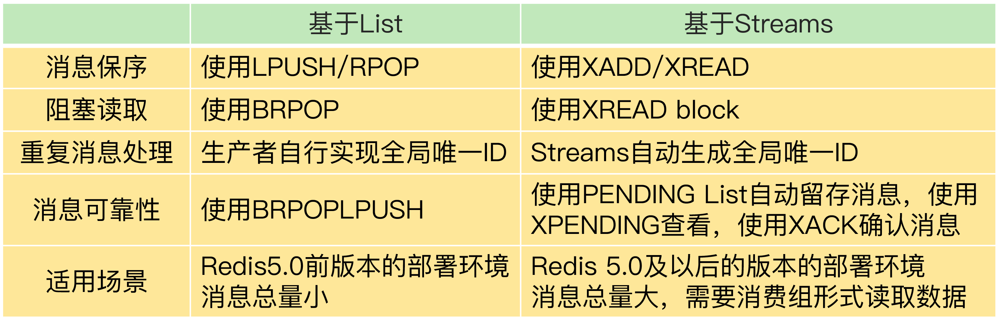

整理消息队列的基本问题，以及使用 List 和 Stream 实现消息队列的笔记。

## Redis消息队列的实现

### 消息队列的三大问题

1. 消息的有序性，有序的消费消息
2. 消息的幂等消费，重复消息的处理
3. 消息的可靠性，消费出现异常，或者宕机了消息丢失，持久化问题

### List 实现消息队列

List 本身就是按先进先出的顺序对数据进行存取的，所以，如果使用 List 作为消息队列保存消息的话，就已经能满足消息保序的需求了。生产者可以使用 LPUSH 命令把要发送的消息依次写入 List，而消费者则可以使用 RPOP 命令，从 List 的另一端按照消息的写入顺序，依次读取消息并进行处理。

在生产者往 List 中写入数据时，List 并不会主动地通知消费者有新消息写入，如果消费者想要及时处理消息，就需要在程序中不停地调用 RPOP 命令（比如使用一个 while(1) 循环）。如果有新消息写入，RPOP 命令就会返回结果，否则，RPOP 命令返回空值，再继续循环。所以，即使没有新消息写入 List，消费者也要不停地调用 RPOP 命令，这就会导致消费者程序的 CPU 一直消耗在执行 RPOP 命令上，带来不必要的性能损失。
为了解决这个问题，Redis 提供了 BRPOP 命令。**BRPOP 命令也称为阻塞式读取，客户端在没有读到队列数据时，自动阻塞，直到有新的数据写入队列，再开始读取新数据**。和消费者程序自己不停地调用 RPOP 命令相比，这种方式能节省 CPU 开销。（出现一个问题，必有一个问题解决办法）

List 本身是不会为每个消息生成 ID 号的，所以，消息的全局唯一 ID 号就需要生产者程序在发送消息前自行生成。生成之后，我们在用 LPUSH 命令把消息插入 List 时，需要在消息中包含这个全局唯一 ID，消费者在消费消息时候，需要记录更新已经消费的消息，同时也要比较消息Id是否已经消费过等问题。

为了留存消息，List 类型提供了 BRPOPLPUSH 命令，这个命令的作用是让消费者程序从一个 List 中读取消息，同时，Redis 会把这个消息再插入到另一个 List（可以叫作备份 List）留存。这样一来，如果消费者程序读了消息但没能正常处理，等它重启后，就可以从备份 List 中重新读取消息并进行处理了。

### Stream实现消息队列

Streams 是 Redis 专门为消息队列设计的数据类型，它提供了丰富的消息队列操作命令。

+ XADD：插入消息，保证有序，可以自动生成全局唯一 ID；
+ XREAD：用于读取消息，可以按 ID 读取数据；
+ XREADGROUP：按消费组形式读取消息；
+ XPENDING 和 XACK：XPENDING 命令可以用来查询每个消费组内所有消费者已读取但尚未确认的消息，**而 XACK 命令用于向消息队列确认消息处理已完成**。（mq的确认ACK操作）

XADD 命令可以往消息队列中插入新消息，消息的格式是键 - 值对形式。对于插入的每一条消息，Streams 可以自动为其生成一个全局唯一的 ID。

**消息的全局唯一 ID 由两部分组成**：第一部分"1599203861727"是数据插入时，以毫秒为单位计算的当前服务器时间，第二部分表示插入消息在当前毫秒内的消息序号，这是从 0 开始编号的。例如，"1599203861727-0"就表示在"1599203861727"毫秒内的第 1 条消息。

当消费者需要读取消息时，可以直接使用 XREAD 命令从消息队列中读取。另外，消费者也可以在调用 XRAED 时设定 block 配置项，**实现类似于 BRPOP 的阻塞读取操作**。当消息队列中没有消息时，一旦设置了 block 配置项，XREAD 就会阻塞，阻塞的时长可以在 block 配置项进行设置。

Streams 本身可以使用 XGROUP 创建消费组，创建消费组之后，Streams 可以使用 XREADGROUP 命令让消费组内的消费者读取消息。

```text
创建消费组
XGROUP create mqstream group1 0
OK

消费组消费消息
XREADGROUP group group1 consumer1 streams mqstream >
```

再执行一段命令，让 group1 消费组里的消费者 consumer1 从 mqstream 中读取所有消息，其中，命令最后的参数">"，表示从第一条尚未被消费的消息开始读取。消息队列中的消息一旦被消费组里的一个消费者读取了，**就不能再被该消费组内的其他消费者读取了（和kafka的消费组一样）。**

为了保证消费者在发生故障或宕机再次重启后，仍然可以读取未处理完的消息，**Streams 会自动使用内部队列（也称为 PENDING List）留存消费组里每个消费者读取的消息**，直到消费者使用 XACK 命令通知 Streams"消息已经处理完成"。如果消费者没有成功处理消息，它就不会给 Streams 发送 XACK 命令，消息仍然会留存。此时，消费者可以在重启后，用 XPENDING 命令查看已读取、但尚未确认处理完成的消息。

### 对比


