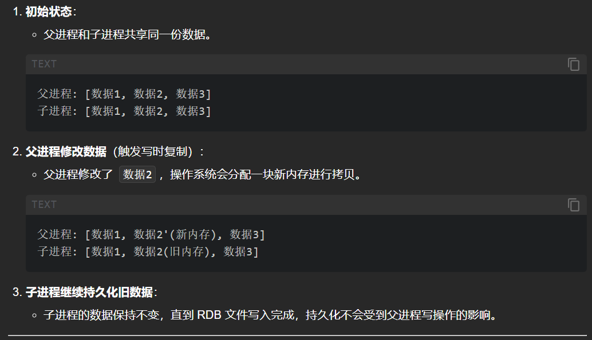
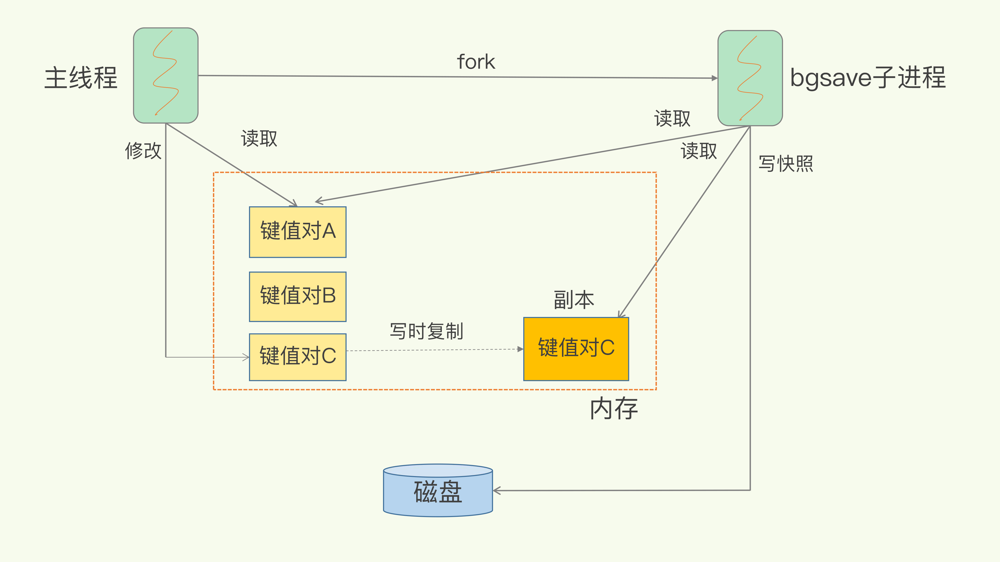
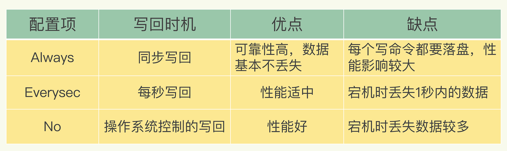
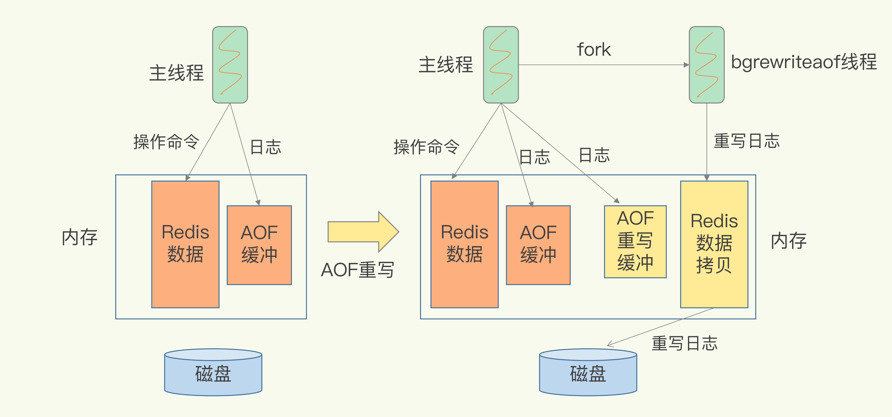

整理 RDB、AOF、写回策略、日志重写、Fork 和混合持久化。

## RDB

### 记录那些数据？

Redis 的数据都在内存中，为了提供所有数据的可靠性保证，它执行的是**全量快照**，也就是说，把内存中的所有数据都记录到磁盘中，这就类似于给 100 个人拍合影，把每一个人都拍进照片里。这样做的好处是，一次性记录了所有数据，一个都不少。

### 内寸快照会阻塞主线程吗？

全量数据越多，RDB 文件就越大，往磁盘上写数据的时间开销就越大。对于 Redis 而言，它的单线程模型就决定了，我们要尽量避免所有会阻塞主线程的操作，所以，针对任何操作，我们都会提一个灵魂之问："它会阻塞主线程吗?"RDB 文件的生成是否会阻塞主线程，这就关系到是否会降低 Redis 的性能。
Redis 提供了两个命令来生成 RDB 文件，分别是 save 和 bgsave。

+ **save：在主线程中执行，会导致阻塞；**
+ **bgsave：创建一个子进程，专门用于写入 RDB 文件，避免了主线程的阻塞，这也是 Redis RDB 文件生成的默认配置。**

好了，这个时候，我们就可以通过 bgsave 命令来执行全量快照，这既提供了数据的可靠性保证，也避免了对 Redis 的性能影响。

### 记录的数据的频率时间间隔？

虽然 bgsave 执行时不阻塞主线程，但是，**如果频繁地执行全量快照，也会带来两方面的开销**。

+ 一方面，频繁将全量数据写入磁盘，会给磁盘带来很大压力，多个快照竞争有限的磁盘带宽，前一个快照还没有做完，后一个又开始做了，容易造成恶性循环。
+ 另一方面，bgsave 子进程需要通过 fork 操作从主线程创建出来。虽然，子进程在创建后不会再阻塞主线程，**但是，fork 这个创建过程本身会阻塞主线程，而且主线程的内存越大，阻塞时间越长**。如果频繁 fork 出 bgsave 子进程，这就会频繁阻塞主线程了。

所以快照的生成不可太频繁，但是也不可以太落后操作，一般可以根据对一段时间内有多少key被修改了做判断，比如1秒内有99个key修改，或者10秒内有500key修改等，按照业务修改具体配置触发条件。

### 生成RDB文件时，有现成修改数据时，如何操作？

为了内寸快照而暂停写操作，肯定是不能接受的。所以这个时候，Redis 就会借助操作系统提供的写时复制技术（Copy-On-Write, COW），在执行快照的同时，正常处理写操作。

**bgsave 子进程是由主线程 fork 生成的，可以共享主线程的所有内存数据**，bgsave 子进程运行后，开始读取主线程的内存数据，并把它们写入 RDB 文件。
	此时，如果主线程对这些数据也都是读操作（例如图中的键值对 A），那么，主线程和 bgsave 子进程相互不影响。

如果主线程要修改一块数据（例如图中的键值对 C），那么，**这块数据就会被复制一份，生成该数据的副本**。**然后，bgsave 子进程会把这个副本数据写入 RDB 文件**，而在这个过程中，主线程仍然可以直接修改原来的数据。（主线程还是修改原来的数据，而bgSave线程复制写入的是原来的那一瞬间的副本数据）

::: warning
写时复制概念

+ 写时复制（Copy-On-Write，COW）是一种优化技术，通常用于操作系统的虚拟内存管理或进程管理中。
+ 当需要对一片内存区域进行拷贝时，操作系统不会立刻复制整块内存，而是将这片内存区域标记为"共享"。
+ 只有当某一进程试图修改这片内存时，操作系统才会为该进程分配一块新的内存，并复制原始数据到新内存中。这样就避免了不必要的内存拷贝开销，提高了性能。

Redis 整个流程

1. Redis 主进程调用 `fork()` 创建一个子进程。
2. 子进程负责将内存中的数据写入磁盘，生成 RDB 文件。
3. 在 `fork()` 之后，父进程和子进程共享内存中的数据（因为 fork 是通过写时复制实现的）

COW 的作用：

+ 如果在持久化过程中，父进程有写操作（修改了某个键），操作系统会为父进程分配一个新的内存页，父进程在新内存页中完成写入，而子进程仍然使用原来的内存数据。
+ 这样就保证了子进程持久化的数据是一致的，不会受到父进程写操作的影响。

数据演示：

:::

## AOF

### AOF回写回阻塞影响主线程吗？

会的，AOF 日志也是在主线程中执行的，如果在把日志文件写入磁盘时，磁盘写压力大，就会导致写盘很慢，进而导致后续的操作也无法执行了，AOF开启Always策略的话，主线程是需要监测数据是否回写的状态，由主线成写入。开始**Everysec，No策略是，是封装程一个事件任务，放入队列中，就交给后台线程处理。**

### 三种写回策略

+ **Always**，同步写回：每个写命令执行完，立马同步地将日志写回磁盘；
+ **Everysec**，每秒写回：每个写命令执行完，只是先把日志写到 AOF 文件的**内存缓冲区**，每隔一秒把缓冲区中的内容写入磁盘；
+ **No**，操作系统控制的写回：每个写命令执行完，只是先把日志写到 AOF 文件的内存缓冲区，由操作系统决定何时将缓冲区内容写回磁盘。

### AOF文件写存在的问题？

随着接收的写命令越来越多，**AOF 文件会越来越大**。这也就意味着，我们一定要小心 AOF 文件过大带来的性能问题。

里的"性能问题"，主要在于以下三个方面：

+ 一是，文件系统本身对文件大小有限制，无法保存过大的文件；
+ 二是，如果文件太大，之后再往里面追加命令记录的话，效率也会变低；
+ 三是，如果发生宕机**，AOF 中记录的命令要一个个被重新执行**，用于故障恢复，如果**日志文件太大，整个恢复过程就会非常缓慢**，这就会影响到 Redis 的正常使用。

### AOF重写会阻塞主线程吗？

和 写入**AOF 日志由主线程**写回不同，重写过程是由后台线程 bgrewriteaof 来完成的，这也是为了避免阻塞主线程，导致数据库性能下降。

重写的过程总结为"**一个拷贝，两处日志**"。
**"一个拷贝"**就是指，每次执行重写时，主**线程 fork 出后台的 bgrewriteaof 子进程。此时，fork 会把主线程的内存拷贝一份给 bgrewriteaof 子进程，这里面就包含了数据库的最新数据。**然后，bgrewriteaof 子进程就可以在不影响主线程的情况下，逐一把拷贝的数据写成操作，记入重写日志。
"**两处日志"又是什么呢？**

> 其实就是为了保证重写AOF文件的时候，保证系统也是可以接受记录新的指令，而且规避了宕机数据丢失风险，老文件和新文件都接受记录新的指令。
>

**因为主线程未阻塞，仍然可以处理新来的操作。此时，如果有写操作，第一处日志就是指正在使用的 AOF 日志，Redis 会把这个操作写到它的缓冲区。这样一来，即使宕机了，这个 AOF 日志的操作仍然是齐全的，可以用于恢复。（避免宕机数据丢失）**
	而第二处日志，就是指新的 AOF 重写日志。这个操作也会被**写到重写日志的缓冲区。这样，重写日志也不会丢失最新的操作。**等到拷贝数据的所有操作记录重写完成后，重写日志记录的这些最新操作也会写入新的 AOF 文件，**以保证数据库最新状态的记录。此时，我们就可以用新的 AOF 文件替代旧文件了。**

## Fork 操作

`fork()` 创建的子进程 不会立即复制内存数据，而是依赖操作系统的 写时复制（Copy-On-Write, COW） 机制来高效管理内存。

`fork()` 的默认行为：当 Redis 主进程调用 `fork()` 创建子进程时，操作系统会为子进程创建一个与父进程完全相同的虚拟内存空间（包括堆、栈等），但 物理内存页并不会被立即复制。

::: warning
`fork()` 是 Linux 多进程编程的基石，其 COW 机制和资源继承特性平衡了效率与隔离性。实际开发中需结合场景选择进程/线程模型，并通过同步机制避免竞态条件。

:::

+ 子进程和父进程 共享相同的物理内存页，直到某一方尝试修改这些内存页时，操作系统才会为修改方分配新的物理内存页，并复制原始数据（即"写时复制"）。
+ 优势：避免不必要的内存拷贝，大幅减少 `fork()` 的耗时和内存开销。

对 Redis 的影响：

+ 如果 AOF 重写期间 或者 RDB 快照期间 没有写操作，子进程直接读取共享的内存数据，无需额外内存。
+ 如果父进程（Redis 主进程）修改了数据，操作系统会为父进程分配新的内存页，而子进程仍读取旧的内存页（保证数据一致性）

## 混合使用 AOF 日志和内存快照

Redis 4.0 中提出了一个**混合使用 AOF 日志和内存快照**的方法。简单来说，**内存快照以一定的频率执行，在两次快照之间，使用 AOF 日志记录这期间的所有命令操作。**
这样一来，快照不用很频繁地执行，这就避免了频繁 fork 对主线程的影响。而且，**AOF 日志也只用记录两次快照间的操作，也就是说，不需要记录所有操作了，因此，就不会出现文件过大的情况了，也可以避免重写开销。**

**取二者的优点攻之**
