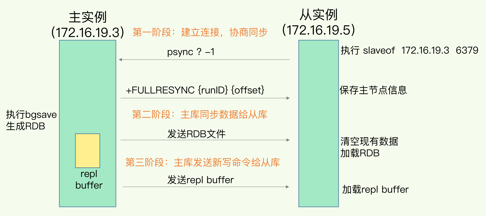
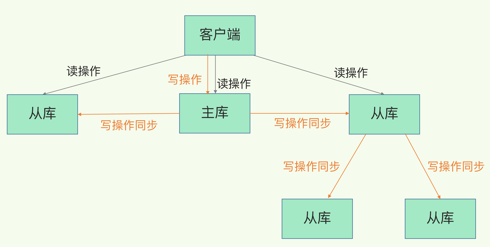
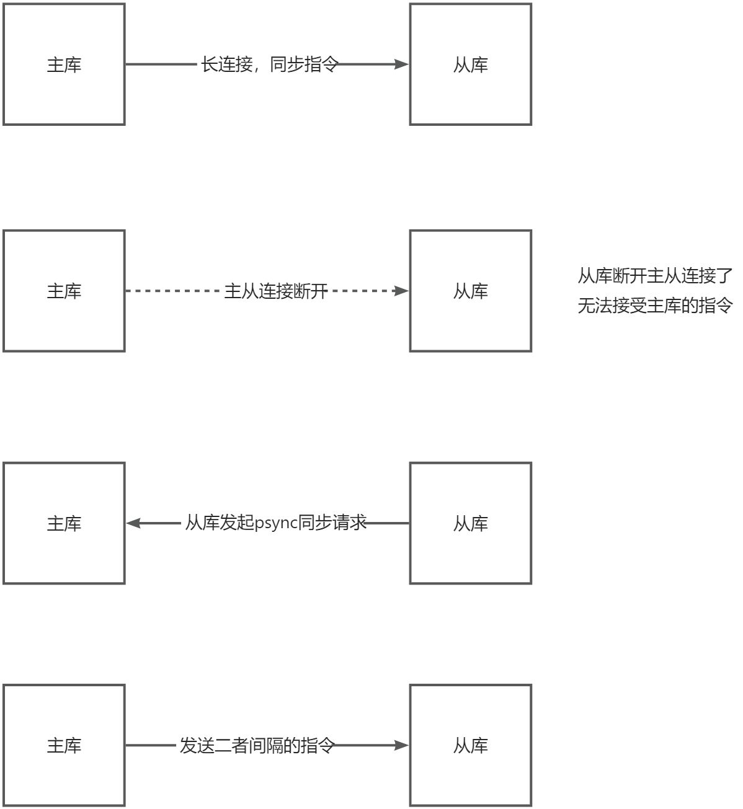
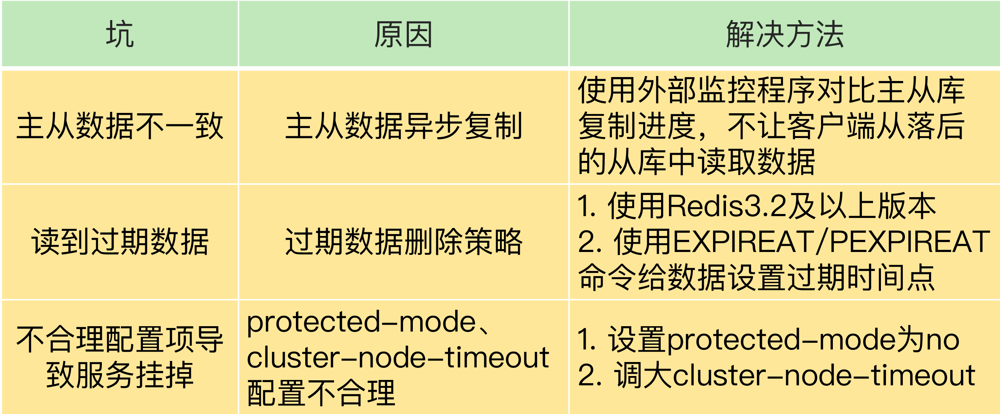

整理全量复制、增量复制、复制缓冲区、复制延迟、过期数据与同步配置。

## Redis集群

### 主从数据同步（全量同步）

#### 第一个阶段：协商同步

第一阶段是主从库间建立连接、协商同步的过程，主要是为全量复制做准备。在这一步，**从库和主库建立起连接，并告诉主库即将进行同步，主库确认回复后，主从库间就可以开始同步了**。
具体来说，从库给主库发送 psync 命令，表示要进行数据同步，主库根据这个命令的参数来启动复制。psync 命令包含了**主库的 runID** 和**复制进度 offset** 两个参数。

+ runID，是每个 Redis 实例启动时都会自动生成的一个随机 ID，用来唯一标记这个实例。当从库和主库第一次复制时，因为不知道主库的 runID，所以将 runID 设为"？"。
+ offset，**此时设为 -1，表示第一次复制。**

主库收到 psync 命令后，会用 FULLRESYNC 响应命令带上两个参数：主库 runID 和主库目前的复制进度 offset，返回给从库。从库收到响应后，会记录下这两个参数。
这里有个地方需要注意，**FULLRESYNC 响应表示第一次复制采用的全量复制，也就是说，主库会把当前所有的数据都复制给从库**。

#### 第二个阶段：全量复制

在第二阶段，**主库将所有数据同步给从库。从库收到数据后，在本地完成数据加载**。这个过程依赖于内存快照生成的 RDB 文件。
	具体来说，**主库执行 bgsave 命令**，生成 RDB 文件，接着将文件发给从库。从库接收到 RDB 文件后，会先清空当前数据库，然后加载 RDB 文件（执行时间可能很久）。这是因为从库在通过 replicaof 命令开始和主库同步前，可能保存了其他数据。为了避免之前数据的影响，从库需要先把当前数据库清空。
	在主库将数据同步给从库的过程中，**主库不会被阻塞，仍然可以正常接收请求**。否则，Redis 的服务就被中断了。但是，这些请求中的写操作并没有记录到刚刚生成的 RDB 文件中。**为了保证主从库的数据一致性，主库会在内存中用专门的 replication buffer，记录 RDB 文件生成后收到的所有写操作。 **

#### 第三个阶段：同步从库全量复制期间，主库接受的命令

最后，也就是第三个阶段，主库会把第二阶段执行过程中**新收到的写命令，再发送给从库**。具体的操作是，当主库完成 RDB 文件发送后，就会把**此时 replication buffer 中**的修改操作发给从库，从库再重新执行这些操作。这样一来，主从库就实现同步了。

#### 主从级联模式分担全量复制时的主库压力

通过分析主从库间第一次数据同步的过程，你可以看到，**一次全量复制中，对于主库来说，需要完成两个耗时的操作：生成 RDB 文件和传输 RDB 文件。**
	如果**从库数量很多**，而且都要和主库进行全量复制的话，就会导致主库忙于 fork 子进程生成 RDB 文件，进行数据全量同步。**fork 这个操作会阻塞主线程处理正常请求**，从而导致主库响应应用程序的请求速度变慢。此外**，传输 RDB 文件也会占用主库的网络带宽**，同样会给主库的资源使用带来压力。那么，有没有好的解决方法可以分担主库压力呢？其实是有的，这就是"主 - 从 - 从"模式。

在刚才介绍的主从库模式中，所有的从库都是和主库连接，所有的全量复制也都是和主库进行的。现在，我们可以**通****过"主 - 从 - 从"模式将主库生成 RDB 和传输 RDB 的压力，以级联的方式分散到从库上**。简单来说，我们在部署主从集群的时候，可以手动选择一个**从库（比如选择内存资源配置较高的从库），用于级联其他的从库**。然后，我们可以再选择一些从库（例如三分之一的从库），在这些从库上执行如下命令，`replicaof 所选从库的IP 6379`让它们和刚才所选的从库，建立起主从关系。这样一来，这些从库就会知道，在进行同步时，不用再和主库进行交互了，只要和级联的从库进行写操作同步就行了，这就可以减轻主库上的压力，如下图所示：

#### 主从数据之间的后续同步

一旦**主从库完成了全量复制，它们之间就会一直维护一个网络连接**，主库会通过这个连接将**后续陆续收到的命令操作再同步给从库**，这个过程也称为**基于长连接的命令传播**，可以避免频繁建立连接的开销。

#### 主从库间网络断了怎么办？

主从全量复制后的之后的长链接同步，这个过程中存在着风险点，最常见的就是**网络断连或阻塞**。如果网络断连，主从库之间就无法进行命令传播了，从库的数据自然也就没办法和主库保持一致了，客户端就可能从从库读到旧数据。

网络断了之后，恢复连接后，主从库会采用增量复制的方式继续同步，**增量复制只会把主从库网络断连期间主库收到的命令，同步给从库。**

当主从库断连后，主库会把断连期间收到的写操作命令，写入 replication buffer，**同时也会把这些操作命令也写入 repl_backlog_buffer 这个缓冲区。**repl_backlog_buffer 是一个**环形缓冲区**，**主库会记录自己写到的位置，从库则会记录自己已经读到的位置**。
	刚开始的时候，主库和从库的写读位置在一起，这算是它们的起始位置。随着主库不断接收新的写操作，它在缓冲区中的写位置会逐步偏离起始位置，我们通常用偏移量来衡量这个偏移距离的大小，对主库来说，对应的偏移量就是 master_repl_offset。主库接收的新写操作越多，这个值就会越大。
	同样，**从库在复制完写操作命令后，它在缓冲区中的读位置也开始逐步偏移刚才的起始位置，此时，从库已复制的偏移量 slave_repl_offset 也在不断增加**。正常情况下，这两个偏移量基本相等。

主从库的连接恢复之后，**从库首先会给主库发送 psync 命令，并把自己当前的 slave_repl_offset 发给主库，**主库会判断自己的 master_repl_offset 和 slave_repl_offset 之间的差距。在网络断连阶段，主库可能会收到新的写操作命令，所以，一般来说，master_repl_offset 会大于 slave_repl_offset。此时，**主库只用把 master_repl_offset 和 slave_repl_offset 之间的命令操作同步给从库就行**。

> 因为 repl_backlog_buffer 是一个环形缓冲区，所以在缓冲区写满后，主库会继续写入，此时，就会覆盖掉之前写入的操作。**如果从库的读取速度比较慢，就有可能导致从库还未读取的操作被主库新写的操作覆盖了，这会导致主从库间的数据不一致**。
>
> 因此，我们要想办法避免这一情况，一般而言，我们可以调整 **repl_backlog_size** 这个参数。**这个参数和所需的缓冲空间大小有关**。缓冲空间的计算公式是：缓冲空间大小 = 主库写入命令速度 _操作大小 - 主从库间网络传输命令速度 _操作大小。在实际应用中，考虑到可能存在一些突发的请求压力，我们通常需要把这个缓冲空间扩大一倍，即 repl_backlog_size = 缓冲空间大小 * 2，这也就是 repl_backlog_size 的最终值。
>

#### 主从库断开或者复制同步中，从库是否可对外提供服务？

从节点的 slave-serve-stale-data 参数也与此有关，它控制这种情况下从节点的表现 **当从库同主机失去连接或者复制正在进行，从机库有两种运行方式**：

+ 如果slave-serve-stale-data设置为yes(默认设置)，从库会继续响应客户端的请求。
+ 如果slave-serve-stale-data设置为no，除去INFO和SLAVOF命令之外的任何请求都会返回一个错误"SYNC with master in progress"。（**推荐这个，不执行指令，避免数据不一致性问题，还有脑裂问题等）**

### 主从同步（全量同步后的同步）

一旦**主从库完成了全量复制，它们之间就会一****直维护一个网络连接**，主库会通过这个连接将**后续陆续收到的命令操作再同步给从库**，这个过程也称为**基于长连接的命令传播**，可以避免频繁建立连接的开销。

这个同步的发起对象是主库，主库主动同步指令给从库。

### 增量同步（主从断联后的同步）

从库就会主动的发起psync指令，主动发起同步，告诉主库自己的复制进度，主动这时间检测到从库的psync指令，会发送断联期间的指令给从库，但是一旦repl_backlog_buffer循环写覆盖了之前的指令，就要发起一次全量同步了，使用不了增量复制了，所以建议适当的配置repl_backlog_buffer的大小，避免这个问题。

### replication buffer 和 repl_backlog_buffer 的区别

> 复制缓存，复制积压缓存
>

replication buffer 记录了从库在执行全量复制时，主库接受的写入命令，每个从库客户端都是单独一份的不共享，主要为了缓冲记录从库重放RDB文件期间的主库接受的指令。

**作用：**主节点开始和一个从节点进行全量同步时，**会为从节点创建一个输出缓冲区**，这个缓冲区就是复制缓冲区。当主节点向从节点发送 RDB 文件时，如果又接收到了写命令操作，就会把它们暂存在复制缓冲区中。等 RDB 文件传输完成，并且在从节点加载完成后，主节点再把复制缓冲区中的写命令发给从节点，进行同步。
**	对主从同步的影响：**如果主库传输 **RDB 文件以及从库加载 RDB 文件耗时长，同时主库接收的写命令操作较多，就会导致复制缓冲区被写满而溢出（****文件大小是有限的，但是可以指定大小****）**。一旦溢出，主库就会关闭和从库的网络连接，重新开始全量同步。所以，我们可以通过调整 client-output-buffer-limit slave 这个配置项，来增加复制缓冲区的大小，以免复制缓冲区溢出。

repl_backlog_buffer 记录了后续**主从库网络断开后，****执行增量复制时的使用**，主库接收的写入命令，而且是一个循环写入的操作，从库也会记录同步到那个偏移量，每次同步的时候会按照偏移量同步最新的命令。（当前既然是复制积压缓冲区，那么就可以调整大小，避免主从断开一段时间，主库的循环覆盖写，导致从库必须全量复制的问题）

> 当**主节点把复制积压缓冲区写满后**，会覆盖缓冲区中的旧命令数据。如果从节点还没有同步这些旧命令数据，就会造成主从节点间重新开始**执行全量复制**。
>

其实，总结起来就是：

replication buffer 是每个从库客户端独属的，不是共享的，记录了全量复制阶段的指令

repl_backlog_buffer 是所有从库共享的一块的区间，主库会一直循环写记录接受的指令，从库一旦发生网络断联或者重启了，发起**增量同步使用的**。（因为主库每次接受指令后都会通过维护的长链接来发送指令给从库，完成同步，在这个期间，从库是没有主动发起同步的，但是一旦网络断开了，从库就会主动的发起psync指令，主动发起同步，告诉主库自己的复制进度，主动这时间检测到从库的psync指令，会发送断联期间的指令给从库，但是一旦repl_backlog_buffer循环写覆盖了之前的指令，就要发起一次全量同步了，使用不了增量复制了，所以建议适当的配置repl_backlog_buffer的大小，避免这个问题）

## 主从同步可能存在问题

### 主从数据不一致，从库数据慢与主库

在主从库命令传播阶段，**主库收到新的写命令后，会发送给从库**。但是，主库并不会等到从库实际执行完命令后，再把结果返回给客户端，而是主库自己在本地执行完命令后，就会向客户端返回结果了（不会等待从库）。如果从库还没有执行主库同步过来的命令，主从库间的数据就不一致了。

什么情况会导致从库执行指令落后于主库：

1. 网络波动，传输指令不畅
2. 从库一般对外提供读服务，可能正在执行复杂计算，或者bIgKey的操作（导致主线程阻塞的问题）都会导致执行写命令延后

关于主从库数据不一致的问题，Redis 中的 s**lave-serve-stale-data** 配置项设置了从库能否处理数据读写命令，你可以把它设置为 no。这样一来，从库只能服务 INFO、SLAVEOF 命令，这就可以避免在从库中读到不一致的数据了。**（当主从之间网络断开，该参数决定从库可以执行指令，是否对外提供服务。避免断开期间，数据不一致）**

**解决方案：监控从库与主库之间的同步复制进度，落后太多不让提供服务，类似于Kafa的ISR活跃副本集合，动态调整。**

### 从库读取到过期的数据

**Redis 同时使用了两种策略来删除过期的数据，分别是惰性删除策略和定期删除策略**。惰性删除策略。当一个数据的过期时间到了以后，并不会立即删除数据，而是等到再有请求来读写这个数据时，对数据进行检查，如果发现数据已经过期了，再删除这个数据。定期删除策略是指，Redis 每隔一段时间（默认 100ms），就会随机选出一定数量的数据，检查它们是否过期，并把其中过期的数据删除，这样就可以及时释放一些内存。

主库执行完命令后，同步指令给从库，从库在执行指令，这个中间是存在时差的，可能主库的数据都已经过期了，从库才执行指令，导致客户端从库读取数据的时候，读取到过期的数据。

解决方案：可以采用时间戳过期方案，指定到某个点就过期。

### 不合理配置项导致的服务挂掉

这里涉及到的配置项有两个，分别是 **protected-mode 和 cluster-node-timeout。**
**1.protected-mode 配置项**
	这个配置项的作用是限定哨兵实例能否被其他服务器访问（一般都是多个哨兵节点，肯定要支持其他节点访问）。当这个配置项设置为 yes 时，哨兵实例只能在部署的服务器本地进行访问。当设置为 no 时，其他服务器也可以访问这个哨兵实例。
	如果 protected-mode 被设置为 yes，而其余哨兵实例部署在其它服务器，那么，这些哨兵实例间就无法通信。当主库故障时，哨兵无法判断主库下线，也无法进行主从切换，最终 Redis 服务不可用。

**2.cluster-node-timeout 配置项**
**	这个配置项设置了 Redis Cluster 中实例响应心跳消息的超时时间**。当在 Redis Cluster 集群中为每个实例配置了"一主一从"模式时，如果主实例发生故障，从实例会切换为主实例，**受网络延迟和切换操作执行的影响，切换时间可能较长，就会导致实例的心跳超时（超出 cluster-node-timeout）**。

实例超时后，就会被 Redis Cluster 判断为异常，而 Redis Cluster 正常运行的条件就是，**有半数以上的实例都能正常运行**，如果执行主从切换的实例超过半数，而主从切换时间又过长的话，就可能有半数以上的实例心跳超时，从而可能导致整个集群挂掉。所以，**我建议你将 cluster-node-timeout 调大些（例如 10 到 20 秒）**。
