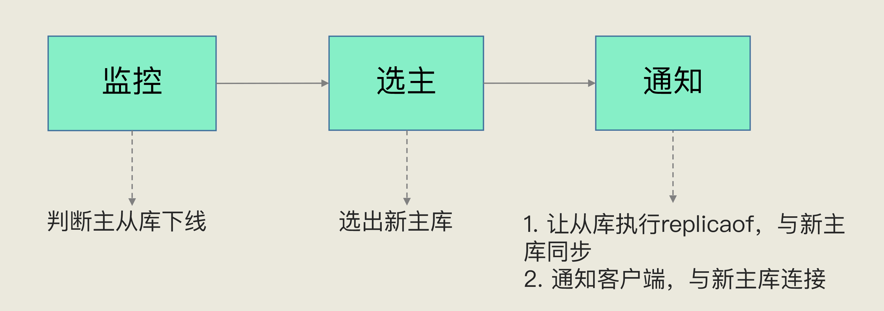
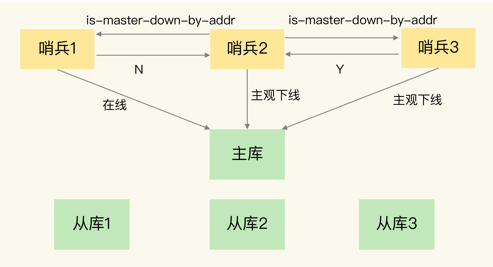
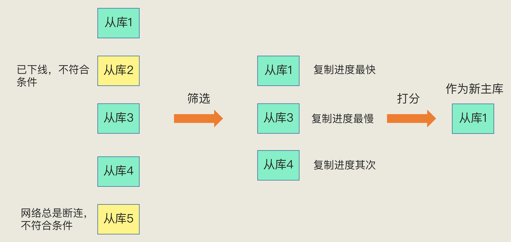
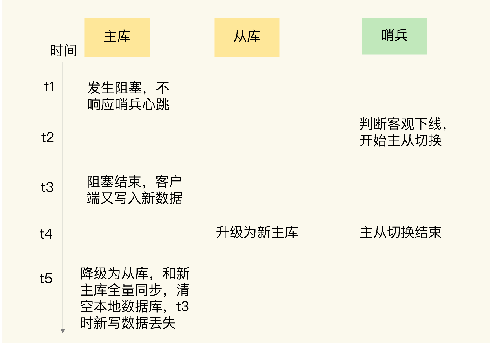

整理哨兵配置、节点下线判断、选举、主从切换和脑裂问题。

## Sentinel 哨兵模式

### 什么是 Sentinel？ 有什么用？

哨兵其实就是一个运行在特殊模式下的 Redis 进程，主从库实例运行的同时，它也在运行。哨兵主要负责的就是三个任务：监控、选主（选择主库）和通知。

监控是指哨兵进程在运行时，周期性地给所有的主从库发送 PING 命令，检测它们是否仍然在线运行。如果从库没有在规定时间内响应哨兵的 PING 命令，哨兵就会把它标记为"下线状态"；同样，如果主库也没有在规定时间内响应哨兵的 PING 命令，哨兵就会判定主库下线，然后开始**自动切换主库**的流程。

第二个任务，选主。主库挂了以后，哨兵就需要从很多个从库里，按照一定的规则选择一个从库实例，把它作为新的主库。这一步完成后，现在的集群里就有了新主库。

哨兵会执行最后一个任务：通知。在执行通知任务时，哨兵会把新主库的连接信息发给其他从库，让它们执行 replicaof 命令，和新主库建立连接，并进行数据复制。同时，哨兵会把新主库的连接信息通知给客户端，让它们把请求操作发到新主库上。

### Sentinel 配置关键的几个参数

+ down-after-milliseconds 选项指定了 Sentinel 认为服务器已经断线所需的毫秒数。

> 如果服务器在给定的毫秒数之内， 没有返回 Sentinel 发送的 [PING](http://doc.redisfans.com/connection/ping.html#ping) 命令的回复， 或者返回一个错误， 那么 Sentinel 将这个服务器标记为**主观下线**（subjectively down，简称 SDOWN ）。
>

+ **parallel-syncs** 选项指定了在执行故障转移时， 最多可以有多少个从服务器同时对新的主服务器进行同步， 这个数字越小， 完成故障转移所需的时间就越长。

> 可能不希望所有从服务器都在**同一时间向新的主服务器发送同步请求**， 因为尽管复制过程的绝大部分步骤都不会阻塞从服务器， 但**从服务器在载入主服务器发来的 RDB 文件时， 仍然会造成从服务器在一段时间内不能处理命令请求（清空自身的内存数据，然后载入新的Rbd文件，会导致从库一段时间不可用）**： 如果全部从服务器一起对新的主服务器进行同步， 那么就可能会造成所有从服务器在短时间内全部不可用的情况出现。
>
> **可以通过将这个值设为 1 来保证每次只有一个从服务器处于不能处理命令请求的状态。**
>

### Sentinel 如何检测节点是否下线？

+ 每个 Sentinel 以每秒钟一次的频率向它所知的主服务器、从服务器以及其他 Sentinel 实例发送一个 [PING](http://doc.redisfans.com/connection/ping.html#ping) 命令。
+ 如果一个实例（instance）距离最后一次有效回复 [PING](http://doc.redisfans.com/connection/ping.html#ping) 命令的时间超过 down-after-milliseconds 选项所指定的值， 那么这个实例会被 Sentinel 标记为主观下线。 一个有效回复可以是： +PONG 、 -LOADING 或者 -MASTERDOWN 。

### Sentinel如何之间如何通信、如何与客户端通信、如何与从库之间通信？

主从集群中，主库上有一个名为"**sentinel**:hello"的频道，**不同哨兵就是通过它来相互发现，实现互相通信的**。**通过 pub/sub 机制，哨兵之间相互订阅发布可以组成哨兵集群，同时，哨兵又通过 INFO 命令，获得了从库连接信息，也能和从库建立连接，并进行监控了**。每个哨兵实例也提供 pub/sub 机制，**客户端可以从哨兵订阅消息**。哨兵提供的消息订阅频道有很多，不同频道包含了主从库切换过程中的不同关键事件。

### 主观下线与客观下线的区别?

+ 主观下线（Subjectively Down， 简称 SDOWN）指的是单个 Sentinel 实例对服务器做出的下线判断。
+ 客观下线（Objectively Down， 简称 ODOWN）指的是多个 Sentinel 实例在对同一个服务器做出 SDOWN 判断， 并且**通过 SENTINEL is-master-down-by-addr 命令互相交流之后， 得出的服务器下线判断。** 任**何一个哨兵实例只要自身判断主库"主观下线"后**，就会给其他实例发送 is-master-down-by-addr 命令。接着，其他实例会根据自己和主库的连接情况，做出 Y 或 N 的响应，Y 相当于赞成票，N 相当于反对票。
+ 

一个哨兵获得了仲裁所需的赞成票数后，就可以标记主库为"客观下线"。这个**所需的赞成票数是通过哨兵配置文件中的 quorum 配置项设定的**。例如，现在有 5 个哨兵，**quorum 配置的是 3**，那么，一个哨兵需要 3 张赞成票，就可以标记主库为"客观下线"了。这 3 张赞成票包括哨兵自己的一张赞成票和另外两个哨兵的赞成票。

### 为什么建议部署多个 sentinel 节点（哨兵集群）？

单个节点，一旦宕机就会导致监控失败，无法完成主从故障恢复，而且容易误判（由于网络原因，连接不上等）

### Sentinel 如何选择出新的 master（选举机制）?

哨兵选择新主库的过程称为"筛选 + 打分"。

简单来说，我们在多个从库中，先按照**一定的筛选条件**，把不符合条件的从库去掉。然后，我们再按照**一定的规则**，给剩下的从库逐个打分，将得分最高的从库选为新主库，如下图所示：

我们肯定要先保证所选的**从库仍然在线运行**。不过，在选主时从库正常在线，这只能表示从库的现状良好，并不代表它就是最适合做主库的。

在选主时，**除了要检查从库的当前在线状态，还要判断它之前的网络连接状态**。如果从库总是和主库断连，而且断连次数超出了一定的阈值，我们就有理由相信，这个从库的网络状况并不是太好，就可以把这个从库筛掉了。

> 具体怎么判断呢？你使用配置项 down-after-milliseconds _10。其中，down-after-milliseconds 是我们认定主从库断连的最大连接超时时间。如果在 down-after-milliseconds 毫秒内，主从节点都没有通过网络联系上，我们就可以认为主从节点断连了。__**如果发生断连的次数超过了 10 次，就说明这个从库的网络状况不好，不适合作为新主库。（给筛选掉）**_
>

_筛选后的从库，进行打分阶段_

_**第一轮：优先级最高的从库得分高。**__
__	用户可以通过 slave-priority 配置项，给不同的从库设置不同优先级。比如，你有两个从库，它们的内存大小不一样，你可以手动给内存大的实例设置一个高优先级。在选主时，哨兵会给优先级高的从库打高分，如果有一个从库优先级最高，那么它就是新主库了。如果从库的优先级都一样，那么哨兵开始第二轮打分。_

_**第二轮：和旧主库同步程度最接近的从库得分高。**__
__	这个规则的依据是，如果选择和旧主库同步最接近的那个从库作为主库，那么，这个新主库上就有最新的数据。_

> _如何判断从库和旧主库间的同步进度呢？
__主从库同步时有个命令传播的过程。在这个过程中，主库会用 master_repl_offset 记录当前的最新写操作在 repl_backlog_buffer 中的位置，而从库会用 slave_repl_offset 这个值记录当前的复制进度。
__此时，我们想要找的从库，它的 slave_repl_offset 需要最接近 master_repl_offset。如果在所有从库中，有从库的 slave_repl_offset 最接近 master_repl_offset，那么它的得分就最高，可以作为新主库。
__就像下图所示，旧主库的 master_repl_offset 是 1000，从库 1、2 和 3 的 slave_repl_offset 分别是 950、990 和 900，那么，从库 2 就应该被选为新主库。_
>

_**第三轮：ID 号小的从库得分高。**__
__	每个实例都会有一个 ID，这个 ID 就类似于这里的从库的编号。目前，Redis 在选主库时，有一个默认的规定：*在优先级和复制进度都相同的情况下，ID 号最小的从库得分最高，会被选为新主库_。到这里，新主库就被选出来了，"选主"这个过程就完成了。

::: note
我们再回顾下这个流程**。首先，哨兵会按照在线状态、网络状态，筛选过滤掉一部分不符合要求的从库**，然后，依次按照**优先级、复制进度、ID 号大小再对剩余的从库进行打分**，只要有得分最高的从库出现，就把它选为新主库。

:::

### 如何从 Sentinel 集群中选择出 Leader 用于执行主从切换？

**quorum：投票，法定人数**

当一个哨兵节点判断到主库客观下线后，这个哨兵就可以再给其他哨兵发送命令，表明希望由自己来执行主从切换，并让所有其他哨兵进行投票。这个投票过程称为"Leader 选举"。因为最终执行主从切换的哨兵称为 Leader，投票过程就是确定 Leader。

> 在投票过程中，任何一个想成为 Leader 的哨兵，要满足两个条件：
>
> **第一，拿到半数以上的赞成票**；
>
> 第二，拿**到的票数同时还需要大于等于哨兵配置文件中的 quorum 值**。
>
> 以 3 个哨兵为例，假设此时的 quorum 设置为 2，那么，任何一个想成为 Leader 的哨兵只要拿到 2 张赞成票，就可以了。
>

其实使用的raft算法达到共识选出leader节点

发起投票的节点不能给其他借点投赞同票，只能时是否定票

已经投过赞同票的，不可以重复投，相当于只能给后面的借点投反对票

### Sentinel 可以防止脑裂吗？

不可以，脑裂的原因是因为一个系统中同时存在两个主实例（而且还是主从切换导致的问题）

## Redis 的脑裂

### 什么是脑裂？

所谓的脑裂，就是指在**主从集群**中，同时有两个主节点，它们都能接收写请求。而脑裂最直接的影响，就是客户端不知道应该往哪个主节点写入数据，结果就是_不同的客户端会往不同的主节点上写入数据_。而且，严重的话，脑裂会进一步导致数据丢失。

> 在主从切换的过程中，如果原主库只是"假故障"，它会触发哨兵启动主从切换，一旦等它从假故障中恢复后，又开始处理请求，这样一来，就会和新主库同时存在，形成脑裂。等到哨兵让原主库和新主库做全量同步后，原主库在切换期间保存的数据就丢失了。
>

### 如何确认是否存在脑裂情况？

确认是不是数据同步出现了问题，在主从集群中发生数据丢失，最常见的原因就是**主库的数据还没有同步到从库，结果主库发生了故障，等从库升级为主库后，未同步的数据就丢失了。**如果是这种情况的数据丢失，可以通过比对**主从库上的复制进度差值来进行判断**，也就是计算 master_repl_offset 和 slave_repl_offset 的差值。如果从库上的 slave_repl_offset 小于原主库的 master_repl_offset，那么，我们就可以认定数据丢失是由数据同步未完成导致的。

### 什么情况会导致脑裂？

> 脑裂发生的原因主要是原主库发生了假故障，我们来总结下假故障的两个原因。
>
> 和主库部署在同一台服务器上的其他程序临时占用了大量资源（例如 CPU 资源），导致主库资源使用受限，短时间内无法响应心跳。其它程序不再使用资源时，主库又恢复正常。
	主库自身遇到了阻塞的情况，例如，处理 bigkey 或是发生内存 swap（你可以复习下第 19 讲中总结的导致实例阻塞的原因），**短时间内无法响应心跳**，等主库阻塞解除后，又恢复正常的请求处理了。
>

采用哨兵机制进行主从切换的，当主从切换发生时，一定是有超过预设数量（quorum 配置项）的哨兵实例和主库的心跳都超时了，才会把主库判断为客观下线，**然后，哨兵开始执行切换操作。哨兵切换完成后，客户端会和新主库进行通信，发送请求操作**。（理想中的，下线的主库在此期间不上线）
	但是如果主库是由于某些原因无法处理请求，也没有响应哨兵的心跳，才被哨兵错误地判断为客观下线的。结果，在被判断下线之后，原主库又重新开始处理请求了，**而此时，哨兵还没有完成主从切换（主从切换是需要一段时间的）**，**客户端仍然可以和原主库通信，客户端发送的写操作就会在原主库上写入数据了。**

**但是一段主动切换完成，此时哨兵才会通知客户端，主节点变了，需要更新本地缓存连接信息。而且，后续的主节点也需要成为新主借点的从节点，是需要清空数据库全量同步主节点的数据（问题就来了，导致主从切换期间的数据丢失）**

### 为什么脑裂会导致数据丢失？

主从切换后，从库一旦升级为新主库，哨兵就会让原主库执行 slave of 命令，和新主库重新进行全量同步。而在全量同步执行的最后阶段，原主库需要清空本地的数据，加载新主库发送的 RDB 文件，这样一来，原主库在主从切换期间保存的新写数据就丢失了。

### 怎么避免脑裂？

既然问题是出在原主库**发生假故障后仍然能接收请求**上，就开始在主从集群机制的配置项中查找是否有**限制主库接收请求的设置**。
	Redis 已经提供了两个配置项来限制主库的请求处理，分别是** min-slaves-to-write 和 min-slaves-max-lag。**

- min-slaves-to-write：**这个配置项设置了主库能进行数据同步的最少从库数量**；
- min-slaves-max-lag：这个配置项设置了主从库间进行数据复制时，**从库给主库发送 ACK 消息的最大延迟（以秒为单位）。**

可以把 min-slaves-to-write 和 min-slaves-max-lag 这两个配置项搭配起来使用，分别给它们设置一定的阈值，假设为 N 和 T。这两个配置项组合后的要求是，**主库连接的从库中至少有 N 个从库**，**和主库进行数据复制时的 ACK 消息延迟不能超过 T 秒**，否则，主库就不会再接收客户端的请求了。
