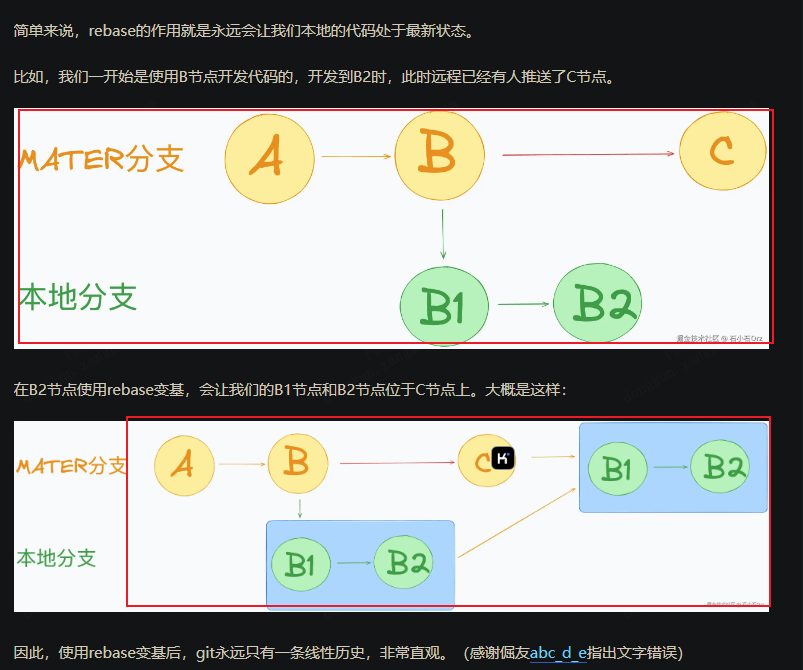

整理 Git 拉取代码、合并和 rebase 的使用笔记。

## 拉取代码

### git pull 与 git fetch

git pull = git fetch + merge

这两个指令可以在任意分支中，

比如我在dev1分支，执行git fetch  默认为 git fetch origin dev1，意思就是拉去远程dev1代码，到本地的当前的分支上，如果执行git fetch origin dev2，也就是拉取远程的dev2的代码到本地dev1分支上

同理，在dev1分支，上执行git pull默认为git pull origin dev1 ，也可以指定分支 即 git pull origin dev2

也就是拉取远程指定分支代码到本地dev1上，并且自动执行merge操作，所以一旦有了冲突那是需要手动处理和解决的。

### git pull --rebase

git pull 默认是会执行merge，可以通过指定rebase指令变更基座，替换merge指令。

[https://juejin.cn/post/7389650358539255845](https://juejin.cn/post/7389650358539255845)

`rebase`的使用非常简单，我们只需要在git pull的时候，添加上额外命令即可！`git pull --rebase`

目前开发中可以适用的场景，比如我在我的分支a上开发代码，另外一个开发提交代码了，需要更新最新代码到我们的分支，在idea中可以直接合并develop分支到我们的分支来更新代码，此时执行的就是megr操作，会多个mg记录，但是如果执行git pull --rebase就不会多出一次mg记录，git的提交记录线很干净。
