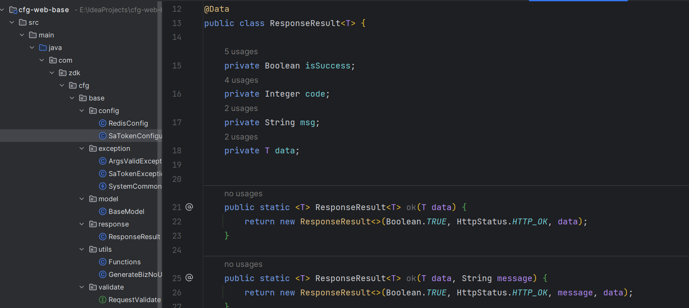

# idea配置

:::tip 前言
以下为个人IDEA配置喜好，仅供参考 
**遵循原则:**
- 简单、简约
- 更少的图标
- 看着更舒服
 

**IDEA版本:** IntelliJ IDEA 2022.3.2 (Ultimate Edition)
:::

## 主题配置
在2022.3.2版本中IDEA更新了新的UI，以及配置的新主题色。使用体验一番后，发现非常友好，比之前版本配置的更加舒服，有点偏向海洋天空色，个人觉得IDEA默认的新UI，主题色已经满足欣赏了。个人认为其他魔改的主题都或多或少的看着不舒服，引用一句话：
> 主题的尽头，尽是默认

当然之前的版本的主题色配置也是非常优秀的，同时IDEA提供了许多的主题插件，以及图标插件，可以很好的美化IDEA主题，后续有机会再展示。

## 插件推荐
### 彩虹进度条 Nyan Progress Bar

### 彩虹多级括号  Rainbow Brackets
## 设置同步

## IDEA打开进入项目选择页面

## 项目文件夹展开

## 快速定位打开文件的位置

## 保持文件展示目录树，关闭打开不影响

## 打开文件新开窗口
以往打开项目新的文件，或者`ctrl+B`进入源码中时，IDEA总是覆盖当前文件，展示新文件内容，非常不舒服，我们要的效果时打开新的文件时，使用另外一个窗口展示，多个层级展示。 
**setting**

