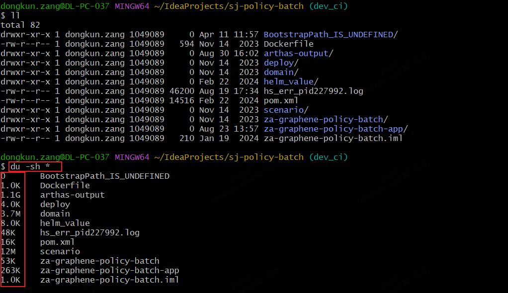
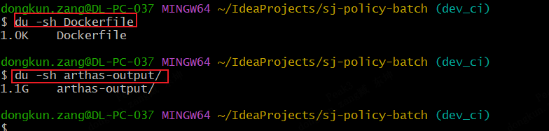
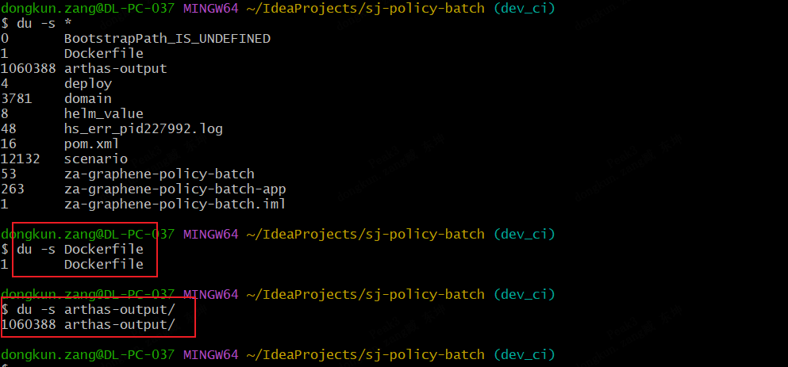
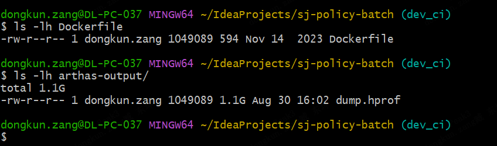

整理 ls 和 du 查看文件、目录大小的常用命令。

## 如何查看的大小

[Linux命令：查看文件和文件夹大小（一） - LovelyAmy - 博客园](https://www.cnblogs.com/LovelyAmy/articles/7986959.html)

1. 显示当前目录所有文件大小的命令`ls -lht `将会一一列出当前目录下所有文件的大小，以及所有文件大小的统计总和。或者直接打入ll命令，注意ls ，ll这种统计是文件大小，不统计文件夹内容带下，文件会显示0
2. `du -sh *`命令也可以列出当前文件以及文件夹的大小。**这个命令要注意：sh与*之前要有个空格的，列出单签文件下所有一级文件包括文件夹的大小**

3. 查看单独文件的大小：
    1. 查询具体的文件大小首先你要找到该文件，然后使用`du -s ，du -sh，ls -lh`，都是可以看到该文件的大小的。**不过这些命令后面需要带文件名**，比如查找文件名为backup.sh文件的大小，命令为：`du -s  backup.sh` ，`ls -lh backup.sh`
    2. du -sh xxx文件 or 文件夹，会显示文件最大尺寸单位的大小，比如M，K，G等，不是具体的值是一个模糊值

        

    3. du -s xxx文件 or 文件夹，显示是按照k为单位显示数据的，详细的大小

        

    4. ls -lh xx文件仅仅支持文件，不支持文件夹（里面还是文件夹的展示）
    5. 
