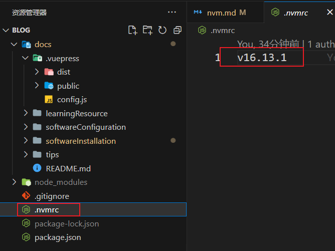

# node版本管理工具

::: tip 说在前面
- 用了都说好，真舒服，再也不用被node版本，node-saas，saas-loader这个几个sb玩意给版本恶心了。
- 随意切换node版本，应对各种版本需求
- 版本自动切换，无须担心项目node版本问题
:::

- [参考教程](https://juejin.cn/post/6984984068924375076)
- [GitHub-for-windows](https://github.com/coreybutler/nvm-windows)

## 下载安装（windows）
1. 进入GitHub下载地址
2. 选择二进制文件安装下载
3. 启动setUp.exe安装
4. 默认安装配置或者指定路径均可（按需指定）
## 常用指令
- nvm list
- nvm use version
- nvm install version
- nvm rm version

## 配置下载代理

- [参考文献](https://juejin.cn/post/7095318124433506341)

CMD终端输入： 
设置**npm_mirror**: nvm npm_mirror https://npmmirror.com/mirrors/npm/  
设置**node_mirror**: nvm node_mirror https://npmmirror.com/mirrors/node/

## 项目优化配置
在项目中新建文件 `.nvmrc` ,在文件中写入当前项目的版本。当切换到该项目时使用 `nvm use`指令自动切换node版本，**前提已经安装了当前版本。**

