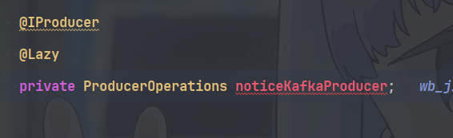
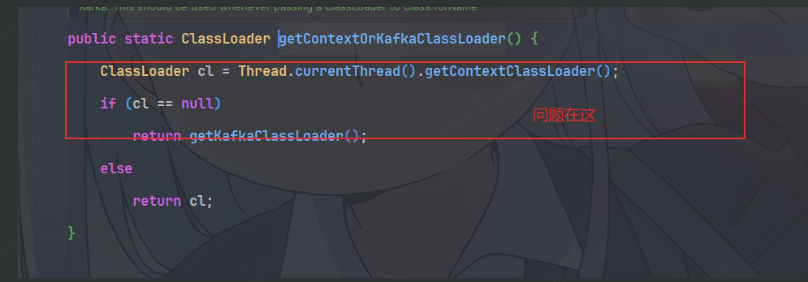
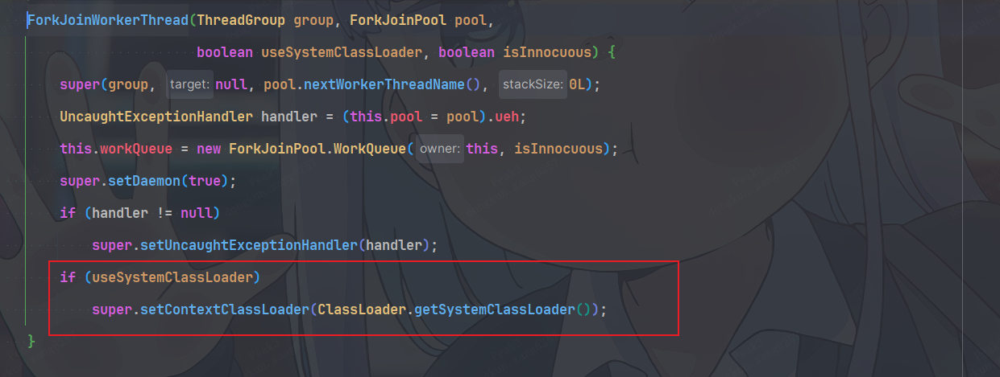

本次调查围绕一个偶发问题展开：Spring Boot 应用在并行处理业务数据时，首次发送 Kafka 消息失败，提示无法找到 `org.apache.kafka.common.serialization.StringSerializer`。

排查重点是**初始化发生在哪个线程，以及 Kafka 在该线程上使用哪个类加载器**。在 Spring Boot 可执行 JAR 的部署场景中，依赖存在于应用包里，并不代表系统类加载器能够访问它。

## 事件概述

| 项目 | 记录 |
| --- | --- |
| 原始日志时间 | 2025-07-31 11:28:49 |
| 故障现象 | 首次发送 Kafka 消息时，序列化类配置解析失败 |
| 失败线程 | `ForkJoinPool.commonPool-worker-1` |
| 业务执行方式 | `parallelStream().forEach(...)` 并行处理 |
| 初始化方式 | 生产者注入与框架内部创建过程均存在延迟初始化 |
| 调查关注的运行环境 | JDK 17、Spring Boot 可执行 JAR、Kafka Java 客户端 |

原稿没有列出完整的 JDK 更新号、Spring Boot 与 Kafka 客户端版本。下文使用 Kafka 3.7.0、OpenJDK 17u 的公开源码解释机制；实际修复时需对照部署产物中的版本。

### 关键异常

原始日志包含多层代理异常、消息体与重复堆栈。这里保留诊断所需的线程信息和异常链，省略业务字段与中间调用：

```text
2025-07-31 11:28:49,947 [ForkJoinPool.commonPool-worker-1]
发送 Kafka 消息失败

java.lang.reflect.UndeclaredThrowableException
Caused by: java.lang.reflect.InvocationTargetException
    ... 业务消息发送包装异常与中间调用省略 ...
Caused by: org.apache.kafka.common.config.ConfigException:
Invalid value org.apache.kafka.common.serialization.StringSerializer
for configuration key.serializer:
Class org.apache.kafka.common.serialization.StringSerializer could not be found.
    at org.apache.kafka.common.config.ConfigDef.parseType(ConfigDef.java:747)
    at org.apache.kafka.common.config.AbstractConfig.<init>(...)
    at org.apache.kafka.clients.producer.ProducerConfig.<init>(...)
    at org.apache.kafka.clients.producer.KafkaProducer.<init>(...)
```

最外层的 `UndeclaredThrowableException` 是代理包装，真正需要关注的是底层 `ConfigException`。这次异常发生在 **Producer 构建时的配置解析阶段**，尚未进入该 Producer 的消息发送流程。

`Class ... could not be found` 也不能直接证明依赖未打包。需要进一步区分“依赖不存在”和“当前类加载器不可见”。

## 调查发现

### 并行流把首次初始化带到了公共线程池

业务代码使用并行流遍历数据，并在处理过程中发送消息。示意代码如下：

```java
records.parallelStream().forEach(record -> {
    producerOperations.send(record);
});
```

执行某个元素的线程可能是调用线程，也可能是公共池的工作线程。本次失败日志明确记录了 `ForkJoinPool.commonPool-worker-1`。

因此，不能只检查 HTTP 请求线程上的类加载器，还需要检查实际执行发送操作的工作线程。

### 延迟初始化改变了错误出现的时机

生产者注入使用了 `@Lazy`，消息框架内部也存在按需创建 Producer 的过程。应用启动成功，并不说明生产者已完成创建。

第一次业务发送可能依次触发：

```text
业务 send 调用
    → 延迟解析生产者依赖
    → 消息框架创建 KafkaProducer
    → ProducerConfig 解析 key.serializer
    → 按类名加载 StringSerializer
```



这把原本可能在启动阶段出现的问题，推迟到了某个业务工作线程上。

### 为什么表现为偶发

如果调用线程先完成 Producer 初始化，而工厂随后缓存并复用该实例，后续工作线程发送消息时可能不再解析序列化类配置。

如果首次初始化落在类加载器不可见的公共池工作线程上，则可能失败。因此，“同一段业务代码有时成功、有时失败”与初始化时机、任务分配及 Producer 复用方式有关。

这需要结合具体消息框架的缓存逻辑确认，不能把“某次发送成功”作为问题已消失的依据。

## 根因分析

### Kafka 如何选择类加载器

Kafka 3.7.0 的 `Utils.getContextOrKafkaClassLoader()` 优先使用线程上下文类加载器，简称 TCCL；只有它为 `null` 时才回退：

```java
public static ClassLoader getContextOrKafkaClassLoader() {
    ClassLoader cl = Thread.currentThread().getContextClassLoader();
    if (cl == null)
        return getKafkaClassLoader();
    else
        return cl;
}

public static ClassLoader getKafkaClassLoader() {
    return Utils.class.getClassLoader();
}
```

一个**非空但无法访问目标类**的 TCCL，不会自动触发这段回退逻辑。

`ConfigDef.parseType()` 在处理 `CLASS` 类型的配置时，如果配置值是字符串，就使用上述类加载器查找目标类。公开源码中的关键分支是：

```java
case CLASS:
    if (value instanceof Class)
        return value;
    else if (value instanceof String) {
        ClassLoader contextOrKafkaClassLoader =
                Utils.getContextOrKafkaClassLoader();
        Class<?> klass = contextOrKafkaClassLoader.loadClass(trimmed);
        return Class.forName(
                klass.getName(), true, contextOrKafkaClassLoader);
    } else
        throw new ConfigException(
                name, value, "Expected a Class instance or class name.");
```

该方法捕获 `ClassNotFoundException` 后，重新构造 `ConfigException`。因此，排查或匹配异常时，不能要求异常链里一定保留一个 `ClassNotFoundException`。



### JDK 17 公共池工作线程使用系统类加载器

OpenJDK 17u 的默认公共池线程工厂，在通常的无 SecurityManager 路径中，创建工作线程时传入 `useSystemClassLoader = true`。`ForkJoinWorkerThread` 构造过程包含：

```java
if (useSystemClassLoader)
    super.setContextClassLoader(ClassLoader.getSystemClassLoader());
```

这意味着公共池工作线程不会因为接收了某个 HTTP 请求线程提交的任务，就自动改用该请求线程的 TCCL。



原稿对比了 JDK 8 与 JDK 17 的线程构造实现。这里需要收窄结论：**不能概括为“所有 JDK 8 都继承应用 TCCL，只有 JDK 17 才会改变”**。JDK 更新版本、回移补丁、自定义线程工厂和安全配置都会影响行为，当前 OpenJDK 8u 源码也有专用的公共池线程工厂。应以实际运行版本和线程日志为准。

### Spring Boot 嵌套依赖对系统类加载器不可见

Spring Boot 可执行 JAR 通常把业务类和依赖分别放在 `BOOT-INF/classes/` 与 `BOOT-INF/lib/`，由应用启动器建立相应的类加载路径。

Spring Boot 官方文档明确指出：系统类加载器不能直接加载这种嵌套 JAR 中的类。不同 Boot 版本中，启动器的加载器名称也可能不同，例如 `LaunchedURLClassLoader` 或 `LaunchedClassLoader`。

```text
系统类加载器
    └── Spring Boot 应用类加载器
            ├── BOOT-INF/classes/
            └── BOOT-INF/lib/kafka-clients-*.jar
                    └── StringSerializer
```

父加载器不能仅凭子加载器已经知道某个类，就自动获得对该类的访问能力。在这个部署场景中，Kafka 选择了公共池线程上的系统 TCCL，便可能无法找到嵌套依赖中的 `StringSerializer`。

### 触发条件归纳

本次排查关注的是以下条件的组合：

1. 序列化类确实存在于应用依赖中，但对当前 TCCL 不可见。
2. Kafka 使用类名字符串解析序列化配置，需要执行类加载查找。
3. Producer 延迟到业务调用时创建。
4. 首次创建落在公共池或其他 TCCL 不合适的工作线程上。

“该类之前完全没有加载过”不是必要条件。关键是**这一次查找所选的类加载器能否访问它**。

## 诊断与复现

### 对比实际执行线程的加载器

在首次创建 Producer 的位置记录线程名、TCCL 和 Kafka 自身的类加载器，而不只在调用并行流之前记录：

```java
Thread thread = Thread.currentThread();
ClassLoader tccl = thread.getContextClassLoader();
ClassLoader kafkaLoader =
        org.apache.kafka.common.utils.Utils.getKafkaClassLoader();

log.info("thread={}, tccl={}, kafkaLoader={}",
        thread.getName(), tccl, kafkaLoader);
```

随后对比依赖内容与加载路径：

- 确认部署产物含有 Kafka 客户端依赖，依赖 JAR 内含有 `StringSerializer.class`。
- 在相同工作线程上，对比 Kafka 自身加载器与 Kafka 实际选用的加载器能否加载该类。
- 对照冷启动、首次发送与复用已初始化 Producer 的行为。
- 记录实际 JDK、Spring Boot、Kafka 客户端版本及线程工厂配置。

### 复现应保留部署与初始化条件

IDE 中直接运行和 `java -jar` 的依赖加载路径可能不同。复现时应使用与故障环境一致的打包方式、依赖版本和延迟初始化路径。

`parallelStream()` 创建的是惰性流，真正触发本例处理的是 `forEach(...)` 终止操作。该操作需要等待本次遍历完成，调用线程也可以参与计算；具体任务分配不应被当作稳定保证。

这解释了一个复现坑点：同一次遍历里，某些元素可能由 `http-nio-8080-exec-1` 处理，另一些由公共池处理。**单次成功不能排除问题，也不能认为每个元素都运行在公共池里。**

| 场景 | 观察重点 |
| --- | --- |
| 冷启动后的同步首次发送 | 调用线程能否完成初始化 |
| 冷启动后的并行首次发送 | 是否出现公共池线程与不同 TCCL |
| 成功初始化后再次并行发送 | 是否复用了已创建的 Producer |
| 显式线程池执行首次发送 | 线程工厂与执行线程的实际 TCCL |

原稿还对 11 个服务做了横向排查。公开报告保留共性检查方法：覆盖所有可能在异步任务中**首次创建 Producer** 的调用点，包括并行流、默认异步执行器与自定义线程池。具体服务名及逐项检查状态保留在原始记录中，不把含义未定义的 `ok/no` 标记改写成验证结论。

## 解决方案

### 优先在 Producer 创建边界修复

如果能够修改生产者工厂，可为支持 `Class` 值的配置传入类对象，避免按类名字符串通过 TCCL 查找：

```java
props.put(
        org.apache.kafka.clients.producer.ProducerConfig.KEY_SERIALIZER_CLASS_CONFIG,
        org.apache.kafka.common.serialization.StringSerializer.class);
```

这里仅演示字符串 key 的序列化配置。value 的序列化器应按实际消息类型设置；已有框架若把 `Class` 再转换为字符串，也需要同步调整。

另一种方法是在创建 Producer 的边界显式选择能访问 Kafka 类的加载器，并在结束后恢复线程状态：

```java
Thread thread = Thread.currentThread();
ClassLoader original = thread.getContextClassLoader();
try {
    thread.setContextClassLoader(
            org.apache.kafka.common.utils.Utils.getKafkaClassLoader());
    // 在此处创建并缓存 Producer。
    return createProducer();
} finally {
    thread.setContextClassLoader(original);
}
```

示例中的 `createProducer()` 是项目生产者工厂的占位调用。还应确认这个加载器能访问项目自定义的序列化器与插件。

启动阶段显式初始化所需 Producer，也可以降低首次初始化落入不合适线程的机会，但要覆盖全部实际使用的 Producer 配置。单纯预加载一个 `StringSerializer` 类，不能修复错误加载器的可见性。

### 原稿的兜底方案：临时置空 TCCL 后重试一次

原稿通过切面捕获发送失败，把当前线程的 TCCL 临时设为 `null`，再执行一次发送。依据是 Kafka 会回退到自身的类加载器。

置空 TCCL 与 `Class.forName(name, false, null)` 含义不同：后者使用引导类加载器；这里生效的是 **Kafka 自己的空值回退逻辑**。

这个补丁应限制在已确认的生产者初始化失败上。不能遇到任意 `UndeclaredThrowableException` 就重放发送：代理异常也可能包装网络超时、业务错误或已经发生副作用的调用。

下面保留原稿“一次兜底重试、最终恢复 TCCL”的思路，增加异常链匹配。切点里的 `com.example.messaging.ProducerOperations` 是示例接口，需要替换为项目实际入口。

```java
import java.util.Collections;
import java.util.IdentityHashMap;
import java.util.Set;
import org.apache.kafka.common.config.ConfigException;
import org.aspectj.lang.ProceedingJoinPoint;
import org.aspectj.lang.annotation.Around;
import org.aspectj.lang.annotation.Aspect;
import org.springframework.boot.autoconfigure.condition.ConditionalOnProperty;
import org.springframework.stereotype.Component;

@Aspect
@Component
@ConditionalOnProperty(
        prefix = "app.kafka.classloader",
        name = "retry-enabled",
        havingValue = "true")
public class KafkaProducerClassLoaderAspect {
    private static final String SERIALIZER =
            "org.apache.kafka.common.serialization.StringSerializer";

    @Around("execution(* com.example.messaging.ProducerOperations.send(..))")
    public Object aroundSend(ProceedingJoinPoint joinPoint) throws Throwable {
        try {
            return joinPoint.proceed();
        } catch (Throwable failure) {
            if (!isMissingStringSerializer(failure)) {
                throw failure;
            }

            Thread thread = Thread.currentThread();
            ClassLoader original = thread.getContextClassLoader();
            try {
                thread.setContextClassLoader(null);
                // 仅在已确认消息尚未发送的初始化失败路径上重试。
                return joinPoint.proceed();
            } finally {
                thread.setContextClassLoader(original);
            }
        }
    }

    private boolean isMissingStringSerializer(Throwable failure) {
        Set<Throwable> visited =
                Collections.newSetFromMap(new IdentityHashMap<>());
        for (Throwable cause = failure;
                cause != null && visited.add(cause);
                cause = cause.getCause()) {
            if (cause instanceof ConfigException) {
                String message = cause.getMessage();
                if (message != null
                        && message.contains(SERIALIZER)
                        && message.contains("could not be found")
                        && (message.contains("key.serializer")
                            || message.contains("value.serializer"))) {
                    return true;
                }
            }
        }
        return false;
    }
}
```

异常消息匹配需要与部署版本核对，并结合调用边界确认初始化阶段。若外层 `send` 会拆分多次发送或执行其他副作用，应把修复下沉到 Producer 工厂，避免重放整个业务操作。TCCL 的恢复必须放在 `finally` 中，防止污染线程池的后续任务。

## 补充：已经加载的类为什么仍可能“找不到”

JVM 中，类的身份由**二进制类名与定义它的类加载器**共同决定，不存在一个供所有加载器无条件共享的类缓存。

但 `findLoadedClass()` 的含义也不能简化为“只查自己定义的类”。OpenJDK 文档说明，它返回的是 JVM 已将当前加载器登记为该类的 **initiating loader（发起加载器）** 时的结果；通过父加载器委派成功得到的类，也可能被登记在这个加载器的加载记录中。

因此，“父加载器加载过 A，子加载器的 `findLoadedClass("A")` 一定返回 null”并不成立。反过来，一个类已被某个子加载器定义，也不意味着系统加载器就能向下搜索并访问它。

理解本次问题只需要抓住两个区别：

- **已经加载**：某个加载器已经加载或发起加载过该类。
- **当前可见**：本次选用的加载器能否按自己的委派规则与搜索路径找到该类。

本次故障的修复目标是让 Kafka 在初始化时选用具有正确可见性的加载器。

## 验证与后续检查

原稿提供了异常日志、排查截图与切面方案，没有提供上线后的完整回归结果。修复验收应补齐以下记录：

1. 使用相同部署方式进行多轮冷启动与并行首次发送验证，记录执行线程和加载器。
2. 对比每轮消息发送与消费结果，核对遗漏和重复。
3. 确认非类加载异常正常向上传递，不触发这个兜底重试。
4. 确认成功、失败和重试失败路径都恢复了原 TCCL。
5. 复查其他异步入口与生产者配置，明确哪些路径已完成验证。

## 参考资料与相关阅读

- [Kafka 3.7.0：ConfigDef 源码](https://github.com/apache/kafka/blob/3.7.0/clients/src/main/java/org/apache/kafka/common/config/ConfigDef.java)
- [Kafka 3.7.0：Utils 源码](https://github.com/apache/kafka/blob/3.7.0/clients/src/main/java/org/apache/kafka/common/utils/Utils.java)
- [OpenJDK 17u：ForkJoinPool 源码](https://github.com/openjdk/jdk17u/blob/master/src/java.base/share/classes/java/util/concurrent/ForkJoinPool.java)
- [OpenJDK 17u：ForkJoinWorkerThread 源码](https://github.com/openjdk/jdk17u/blob/master/src/java.base/share/classes/java/util/concurrent/ForkJoinWorkerThread.java)
- [OpenJDK 17u：ClassLoader 源码与 findLoadedClass 文档](https://github.com/openjdk/jdk17u/blob/master/src/java.base/share/classes/java/lang/ClassLoader.java)
- [OpenJDK 8u：ForkJoinPool 源码](https://github.com/openjdk/jdk8u/blob/master/jdk/src/share/classes/java/util/concurrent/ForkJoinPool.java)
- [Spring Boot 2.7.18：可执行 JAR 与系统类加载器限制](https://docs.spring.io/spring-boot/docs/2.7.18/reference/html/executable-jar.html#appendix.executable-jar-restrictions)
- [原稿参考：Spring Boot 中 LaunchedURLClassLoader 的作用](https://juejin.cn/post/7320541744353083433)
- [原稿参考：TomcatEmbeddedWebappClassLoader](https://blog.csdn.net/yuming226/article/details/140346885)
- [本站：Java 学习资料](../learningResource/Java/八股文.md)
- [本站：Spring Boot 学习入口](../learningResource/frameword/SpirngBoot/)
