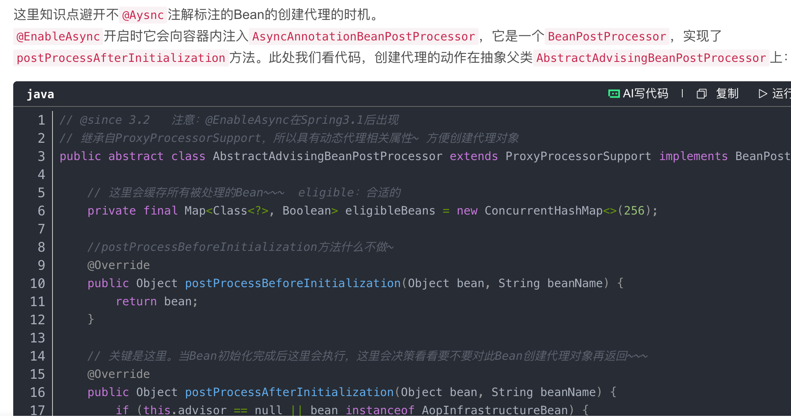
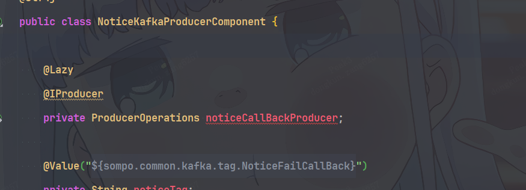
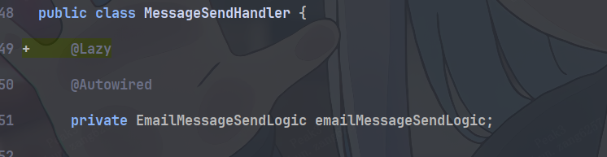

Test2 环境完成 EKS 升级后，Notice 服务在启动过程中抛出 `BeanCurrentlyInCreationException`。日志指出：`emailMessageSendLogic` 的原始对象已注入 `messageSendHandler`，随后该 Bean 又被包装为代理，导致依赖方持有的引用与最终 Bean 不一致。

调查发现，消费者处理消息后又通过生产者发送消息，MQ 自动配置中的消费者集合将依赖链闭合；链路上的邮件发送逻辑包含 `@Async` 方法，进一步触发了早期引用与最终代理不一致的问题。原稿记录了两处邮件发送逻辑已修改，并提供了注入点懒加载的修复截图。

本文保留异常证据、镜像对比和横向审查记录。EKS 升级是事件背景，现有材料尚未证明它直接改变了 Spring 的循环依赖处理规则。

## 事件概述

| 项目 | 记录 |
| --- | --- |
| 事件日期 | 原稿记为 2025-07-23 |
| 已提供的错误日志时间 | 2025-07-30 09:56:12,102 |
| 环境 | Test2；分支发布对比同时涉及 Dev2，历史镜像对比涉及 Dev1 |
| 受影响服务 | Notice（`sj-notice`） |
| 故障阶段 | Spring 容器启动、单例 Bean 创建与初始化 |
| 核心异常 | `BeanCurrentlyInCreationException` |
| 直接冲突 | `messageSendHandler` 持有 `emailMessageSendLogic` 的原始对象，后者最终被包装 |
| 修复记录 | `EmailMessageSendLogic`、`FusionEmailMessageSendLogic` 相关依赖已修改；完整上线与回归结果待补 |

事件日期与日志日期不同，原稿没有解释两者的关系。这里分别记录，不将日志时间改写为事件发生时间。JDK、Spring Boot、Spring Framework 与 MQ 基础包的具体版本也未提供。

### 关键错误日志

以下保留主要异常与定位栈帧，调整换行并省略中间帧。原始内容可下载：[Notice 启动错误日志（TXT）](/blog/reports/notice-startup-circular-dependency/startup-error.txt)。

```text
2025-07-30 09:56:12,102 [main] ERROR
Application run failed

org.springframework.beans.factory.BeanCurrentlyInCreationException:
Error creating bean with name 'emailMessageSendLogic':
Bean with name 'emailMessageSendLogic' has been injected into other beans
[messageSendHandler] in its raw version as part of a circular reference,
but has eventually been wrapped.
This means that said other beans do not use the final version of the bean.

    at org.springframework.beans.factory.support.AbstractAutowireCapableBeanFactory.doCreateBean(AbstractAutowireCapableBeanFactory.java:628)
    ...
    at org.springframework.beans.factory.support.DefaultListableBeanFactory.preInstantiateSingletons(DefaultListableBeanFactory.java:975)
    ...
    at com.zhongan.graphene.notice.NoticeApplication.main(NoticeApplication.java:36)
```

这段日志说明问题发生在容器完成 Bean 创建之前。排查重点是**谁拿到了早期引用，以及最终为什么产生了另一个对象**。

## 调查发现

### 分支发布对比

| 原稿中的分支记录 | Dev2 | Test2 |
| --- | --- | --- |
| `release/10.0.0` | 可用 | 可用 |
| `dev_10.0_rel` | 不可用 | 不可用 |

镜像对比部分将开发分支写为 `dev_day10.0_rel`，与上表的 `dev_10.0_rel` 不一致。尚未确认这是同一分支的笔误还是不同分支，因此下文保留镜像记录中的原名。

### 环境与构建对比

- Dev1 的历史镜像能够正常运行，部署到 Dev2 后也能正常运行。
- Dev2 新构建的镜像持续启动失败。
- 在 Dev1 修改代码并重新构建后，也出现启动失败。

这些结果表明，问题可以随产物或构建变化出现，并不只存在于升级后的 Test2 环境。排查还需要核对代码、依赖、配置及 Bean 初始化顺序。

### 镜像与 JAR 对比

原稿初步比较两环境构建的 JAR 包，没有发现明显差异，记录了以下镜像：

| 镜像引用 | 原稿中的构建与分支记录 | 结果 |
| --- | --- | --- |
| `gj-public-aws-harbor.zatech.com/sj-dev2/sj-notice:05e4a334` | 近期 Dev2 构建，`release/10.0.0` | 可用 |
| `gj-public-aws-harbor.zatech.com/sj-dev2/sj-notice:a852f1f9` | 近期 Dev2 构建，`dev_day10.0_rel` | 不可用 |
| `gj-public-aws-harbor.zatech.com/sj-dev1/sj-notice:a852f1f9` | 早期 Dev1 构建，`dev_day10.0_rel` | 可用 |

两个镜像使用相同的 `a852f1f9` 标签，但位于不同仓库。**标签相同不能证明镜像内容或 JAR 内容相同**；后续应补充镜像 digest、构建时间、完整代码提交、依赖版本和实际启动配置。

现有对比支持继续追踪产物与初始化行为，但不能直接确认某个构建工具、依赖升级或 EKS 组件就是触发因素。

## 依赖环还原

原稿给出的 Spring 失败分析包含以下 Bean。这里省略字段的完整包名，保留依赖方向及关键注入点：

```text
noticeKafkaConsumer
    → noticeConsumerProcessHandler
    → noticeServiceImpl
    → messageProcessManager
    → messageSendHandler
    → emailMessageSendLogic              ← 包含 @Async 方法
    → noticeKafkaProducerComponent
    → noticeCallBackProducer
    → KafkaAutoConfig（consumers Map）
    → noticeKafkaConsumer                ← 消费者集合使链路闭合
```

| 依赖位置 | 原稿记录的注入字段或类型 |
| --- | --- |
| 消费者 → 消费处理器 | `NoticeKafkaConsumer.handler` |
| 消费处理器 → 业务服务 | `NoticeConsumerProcessHandler.noticeService` |
| 业务服务 → 消息管理器 | `NoticeServiceImpl.messageProcessManager` |
| 消息管理器 → 发送处理器 | `MessageProcessManager.messageSendHandler` |
| 发送处理器 → 邮件发送逻辑 | `MessageSendHandler.emailMessageSendLogic` |
| 邮件发送逻辑 → 生产者组件 | `EmailMessageSendLogic.noticeKafkaProducerComponent` |
| 生产者组件 → Producer | `NoticeKafkaProducerComponent.noticeCallBackProducer`，类型为 `ProducerOperations` |
| Producer 的工厂依赖 | `ProducerFactoryBean.octopusMqFactory` |
| MQ 自动配置 → 消费者集合 | `KafkaAutoConfig.consumers`，类型为 `Map` |

这是一条跨越消费者、业务处理和生产者自动配置的长依赖环。`emailMessageSendLogic` 与 `messageSendHandler` 是异常中直接点名的两个 Bean，但材料没有显示它们彼此直接注入；分析时应保留中间链路。

## 根因分析

### 早期原始引用与最终代理不一致

当容器走到允许暴露早期引用的创建路径时，Bean 可以在属性填充和初始化完成之前被其他 Bean 获取。早期引用是否已经是代理，取决于 `getEarlyBeanReference()` 路径中相应后置处理器的实现。

原稿将本次包装定位到 `@Async`：`AsyncAnnotationBeanPostProcessor` 通过 `postProcessAfterInitialization()` 所在的初始化后处理路径添加异步代理，而本次早期引用路径没有提供同一个最终代理。

下面以 `emailMessageSendLogic` 先开始创建的顺序说明这一机制；完整启动入口顺序仍需结合更详细的日志确认：

1. 容器实例化 `emailMessageSendLogic`，得到原始对象，并进入依赖属性解析。
2. 沿 Producer、MQ 自动配置、消费者和业务处理链继续创建其他 Bean，最终到达 `messageSendHandler`。
3. `messageSendHandler` 需要注入仍在创建中的 `emailMessageSendLogic`，因此取得它的早期引用；本次取得的是原始对象。
4. 相关依赖创建返回后，`emailMessageSendLogic` 继续完成属性填充与初始化。
5. 初始化后的 `@Async` 处理将它包装为代理，准备作为最终 Bean 暴露。
6. Spring 检查到依赖方仍持有原始对象，无法保持引用一致性，因此抛出 `BeanCurrentlyInCreationException`。

```text
messageSendHandler.emailMessageSendLogic ──→ 原始对象
容器准备暴露的 emailMessageSendLogic    ──→ @Async 代理对象

依赖方没有拿到最终代理，引用一致性检查失败
```

原稿依据的 Spring 实现中，`allowRawInjectionDespiteWrapping` 默认是 `false`。这项检查保护的是最终 Bean 的一致使用：持有原始对象的调用方可能绕过异步拦截等代理行为。



这个结论适用于本次记录的创建路径。不能仅凭“存在 `@Async`”或“初始化后有代理包装”，就判断所有循环引用都会以同样方式失败；还需要检查早期代理与最终对象是否一致。

### 两类循环依赖提示需要分别判断

材料还附有以下失败分析提示：

```text
Relying upon circular references is discouraged and they are prohibited by default.
Update your application to remove the dependency cycle between beans.
As a last resort, it may be possible to break the cycle automatically by setting
spring.main.allow-circular-references to true.
```

“禁止循环依赖”与“允许早期引用后，原始对象又被包装”是不同的检查阶段。原稿未说明这些日志是否来自同一次启动，也未给出实际配置，因此不能推断当时的 `spring.main.allow-circular-references` 值。

允许循环依赖也不能自动保证 `@Async` 早期引用与最终代理一致。修复目标应是解除本次创建环，并让依赖方获取正确的最终调用对象。

异常中的 `getBeanNamesForType`、`allowEagerInit=false` 是框架给出的过早类型匹配排查提示。现有材料尚未证明某次类型查询就是直接触发源，应对照实际 MQ 工厂与自动配置实现检查。

## 修复记录

### 1. Producer 注入点添加懒加载

原稿在 `NoticeKafkaProducerComponent` 的 `noticeCallBackProducer` 注入字段上添加了 `@Lazy`。截图中的字段如下，省略其他代码：

```java
public class NoticeKafkaProducerComponent {

    @Lazy
    @Producer
    private ProducerOperations noticeCallBackProducer;
}
```



意图是在初始化组件时延后获取实际 Producer，避免立即进入 MQ 工厂和消费者集合的创建路径。

`@Producer` 是项目自定义注解，其注入实现需要支持 `@Lazy` 的延迟解析语义。应结合基础包代码和运行时验证确认实际 Producer 没有在此处被提前创建；仅看到字段上的注解，还不足以证明自定义注入逻辑已延迟执行。

### 2. 邮件发送逻辑注入点添加懒加载

另一张截图显示，`@Lazy` 加在 `MessageSendHandler` 的 `emailMessageSendLogic` 注入字段上：

```java
public class MessageSendHandler {

    @Lazy
    @Autowired
    private EmailMessageSendLogic emailMessageSendLogic;
}
```



对于标准的 Spring 注入点，`@Lazy` 可以提供延迟解析代理，在实际调用时再获取目标 Bean。这样，发送处理器创建时无需立即取得正在创建中的邮件发送逻辑原始对象。

这需要区分注入点懒加载与 Bean 定义懒加载：给 Bean 类或 `@Bean` 方法添加 `@Lazy`，如果它仍被其他非懒加载 Bean 立即依赖，目标仍可能提前创建。本次截图体现的是**在依赖注入点建立延迟解析边界**。

若初始化方法又立即调用这个依赖，延迟边界仍可能在启动阶段被提前触发。因此还需检查实际首次调用发生在哪个生命周期阶段。

### 修复状态与统一调整 Producer 的讨论

横向审查记录将 `EmailMessageSendLogic` 与 `FusionEmailMessageSendLogic` 标为“有问题、已修改”。材料未给出 Fusion 对应的完整修改代码，也未记录最终代码提交、部署镜像、上线时间或完整回归结果。

“是否将所有 Producer 都改为懒加载”仍是待讨论事项，不能作为已实施决策。评估时应针对具体依赖环选择延迟解析边界，并验证自定义注入实现、首次发送和启动就绪行为。

延迟初始化会将部分配置或连接问题推迟到首次调用暴露，验收应覆盖首次使用；长期还应检查 MQ 工厂与消费者装配关系，减少生产者创建对完整消费者业务链的依赖。

## 横向审查记录

原稿审查了其他服务的异步方法，记录如下。表中的结论限定于当时的代码与使用状态；行号保留自原始记录。

| 服务 | 文件与行号 | 注解 | 原稿审查结果与依据 |
| --- | --- | --- | --- |
| `sj-calculate` | `AsyncTaskAnnotation.java:17` | `@Async` | 未发现本次问题；只定义注解，没有使用位置 |
| `sj-claim` | `AutoClaimsServiceImpl.java:93` | `@Async` | 未发现本次问题；地震险相关，消费者已下线 |
| `sj-claim` | `AutoClaimNewHandler.java:62` | `@Async("asyncExecutor")` | 未发现本次问题；接口调用，记录为未使用 |
| `sj-claim` | `AutoClaimManager.java:93` | `@Async` | 未发现本次问题；接口调用 |
| `sj-claim` | `AutoClaimManager.java:484` | `@Async("asyncExecutor")` | 未发现本次问题；航班延误险，接口调用，记录为未使用 |
| `sj-notice` | `EmailMessageSendLogic.java:66` | `@Async("asyncSendExecutor")` | 确认有问题；已修改，添加懒加载配置 |
| `sj-notice` | `FusionEmailMessageSendLogic.java:62` | `@Async("asyncSendExecutor")` | 确认有问题；已修改 |

本次审查仅确认 Notice 的两处邮件发送逻辑受影响。后续复查应沿实际 Bean 依赖链检查代理与早期引用，单独搜索 `@Async` 注解无法覆盖全部创建时序问题。

## 验收与待补记录

修复后需要验证以下行为，再补齐最终处置结果：

1. 使用明确 digest 的新镜像在 Dev2、Test2 多次冷启动，确认容器完成初始化，不再出现上述循环依赖异常。
2. 确认 `messageSendHandler` 获取的是可正确调用最终目标的依赖，邮件异步方法经代理调用后仍在 `asyncSendExecutor` 上执行。
3. 覆盖首次消息消费、首次邮件发送与回调消息发送，确认 Producer 延迟创建后功能完整，启动阶段没有提前触发同一依赖环。
4. 同时验证 `EmailMessageSendLogic` 与 `FusionEmailMessageSendLogic`，以及相关配置缺失、发送失败的日志与处理行为。
5. 如果扩大 Producer 懒加载范围，对所有实际使用方回归，并确认首条消息发送前的就绪或预热策略。

待补信息包括：两种日期的关系、开发分支的准确名称、运行时与依赖版本、构建差异、实际循环依赖配置、修改提交与部署镜像，以及回归和上线结果。

## 参考记录

- [原始 Notice 启动错误日志（TXT）](/blog/reports/notice-startup-circular-dependency/startup-error.txt)
- [原稿引用的循环依赖与异步代理分析](https://blog.csdn.net/f641385712/article/details/92797058)
- [Spring Lazy 注解说明](https://docs.spring.io/spring-framework/docs/current/javadoc-api/org/springframework/context/annotation/Lazy.html)
- [Outbound 启动死锁调查](./outbound-startup-deadlock.md)
- 本文三张分析与修复截图来自原始调查材料，保存在文章本地资源目录中。
