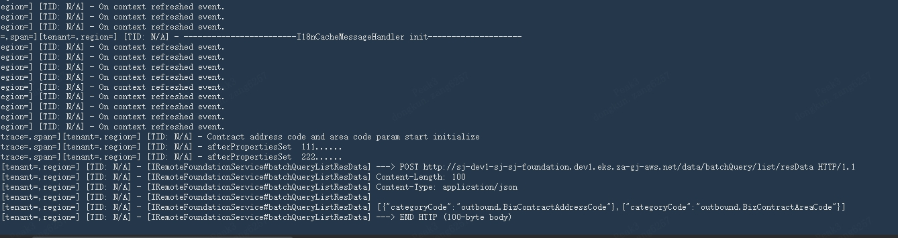

2025 年 7 月 23 日，Dev2 环境完成 EKS 升级后，Outbound 服务在启动阶段调用第三方接口加载数据，随后持续阻塞，没有明确的错误日志。

原始调查将根因定位为：**Spring Bean 初始化顺序变化，暴露了 i18n 与 Address 组件在启动阶段的异步依赖等待问题，导致死锁。** 历史镜像能够在升级后的 Dev2 环境正常运行，而重新构建的镜像在 Dev1、Dev2 均可出现异常，因此需要区分“故障发生在 EKS 升级之后”和“EKS 升级直接导致故障”。

本文整理原始调查记录，保留现场截图与进一步分析的链接。两种修复方案的最终选择、实施时间及修复验证结果未在原稿中记录。

## 事件概述

| 项目 | 记录 |
| --- | --- |
| 事件日期 | 2025-07-23 |
| 环境与背景 | Dev2 环境完成 EKS 升级，随后部署服务 |
| 受影响服务 | Outbound |
| 故障阶段 | 启动初始化期间，调用第三方接口加载数据 |
| 主要现象 | 日志停留在数据加载附近，启动流程不再推进，无明确异常日志 |
| 调查结果 | Bean 初始化顺序变化触发启动阶段死锁；本次横向审查仅发现 Outbound 存在同类问题 |

### 现场现象

服务并非通过异常堆栈显式退出，而是在初始化过程中持续等待。现场日志停留在第三方数据加载调用附近：



截图能帮助定位最后可见的执行阶段，但仅凭日志停顿不能证明第三方接口本身故障。需要结合线程栈，确认请求、回调和组件初始化各自等待什么。

## 调查过程与证据

### 1. 检查系统资源

CPU 和内存使用率均在正常范围内。增加 CPU 分配、Pod 内存配置及 JVM 内存设置后，故障仍然存在。

这些结果未支持资源不足这一排查方向。继续扩容无法解除线程之间的循环等待，因此调查转向构建产物和启动过程。

### 2. 对比环境与镜像

| 对比场景 | 结果 | 对排查的意义 |
| --- | --- | --- |
| Dev1 环境使用历史镜像 | 正常运行 | 历史产物可以完成启动 |
| 将 Dev1 可用镜像部署到 Dev2 | 正常运行 | 升级后的 Dev2 并非无法运行所有 Outbound 镜像 |
| Dev2 环境使用新构建镜像 | 持续启动失败 | 异常与新产物或其初始化行为相关 |
| 在 Dev1 修改代码并重新构建 | 同样出现启动失败 | 问题可以在 Dev2 之外出现，需要继续检查构建与初始化差异 |

这组结果把排查重点从环境资源转向了**新旧产物差异，以及这些差异是否改变 Bean 初始化顺序**。EKS 升级是事件背景，现有证据不足以单独将其认定为直接根因。

### 3. 对比 JAR 包与初始化顺序

初步比较两环境生成的 JAR 包，没有发现明显差异，但 MD5 校验值不一致。SRE 提出可能存在依赖项变更，需要进一步核对。

随后观察到：同一分支、相同代码构建出的 JAR 包，运行时的 Bean 加载顺序并不一致。这是继续追踪启动行为的重要线索。

需要区分两类结论：

- **已观察到的差异**：产物校验值不同，Bean 初始化顺序不同。
- **尚未证实的原因**：构建环境或依赖解析发生变化。MD5 不一致只能证明文件内容不同；打包时间戳、元数据等也可能造成差异，不能仅凭校验值确认依赖版本变更。

原稿没有记录 EKS、JDK、Spring 及构建工具的具体版本，也没有附完整依赖差异清单。因此，导致初始化顺序变化的具体构建因素仍需补充证据。

### 4. 分析运行时线程

使用 Arthas 分析后发现线程阻塞，调查方向进一步收敛到启动过程中的死锁。

详细记录见 [Outbound 启动死锁问题调查](https://zatech.sg.larksuite.com/docx/LX5udMpgyoQjOjx9O8UlRxivg4b)。该链接为原始调查文档，访问需要相应权限。

## 根因分析

### 初始化顺序变化暴露了隐含依赖

原始调查记录了以下顺序变化：

| 场景 | 初始化顺序 | 结果 |
| --- | --- | --- |
| 历史可用场景 | Address 组件先于 i18n 组件初始化 | i18n 执行数据加载时，相关资源已可用，服务正常启动 |
| 故障场景 | i18n 组件先于 Address 组件初始化 | i18n 提前触发异步操作，访问尚未完成初始化的资源，导致启动死锁 |

服务此前能够启动，依赖了一个隐含前提：Address 恰好先完成初始化。初始化顺序发生变化后，这个前提不再成立。

### 异步调用与启动等待形成闭环

根据原始结论，故障机制可以概括为以下等待关系。此处是机制示意，不是现场线程栈的逐行还原：

```text
启动初始化流程
    → i18n 提前初始化并触发异步数据加载
    → 启动流程等待数据加载完成

异步数据加载流程
    → 访问尚未就绪的组件或资源
    → 等待相关初始化继续完成

等待闭环：启动等待加载完成，加载又依赖启动继续推进
```

死锁不会必然产生异常日志：线程可能一直处于等待状态，既没有完成调用，也没有抛出异常，因此表现为“进程仍在，启动日志停住”。

原稿未附完整线程栈、具体锁对象及调用代码，精确的等待链应以原始死锁调查为准。这里能够归纳的修复方向是：**解除启动线程与异步任务之间的循环依赖，并明确数据加载所需组件的生命周期边界。**

## 横向排查与影响范围

团队对其他服务进行了同类风险审查，详细记录见 [Outbound 死锁原因问题横展开](https://zatech.sg.larksuite.com/docx/HFDwd0hW6ovtljxVjSZlkTCBgXd)。访问该原始文档需要相应权限。

本次调查仅确认 Outbound 存在此问题。其他服务在初始化过程中，要么不与第三方服务交互，要么采用同步交互方式，没有发现相同的异步等待闭环。

这个结论限定于本次审查范围。同步调用仍需要检查依赖是否形成循环，以及是否配置超时，不能仅凭“改为同步”保证所有初始化场景都安全。

## 修复方案与实施建议

### 方案 1：定向调整 Outbound

仅修改受影响的 Outbound 服务，使用 `ApplicationListener` 监听合适的生命周期事件，将相关数据加载移出 Bean 初始化阶段，延后至所需组件完成初始化后执行。

实施时需要同时满足以下条件：

- 移除或调整原初始化路径中的提前加载，避免服务在到达监听事件之前仍被阻塞。
- 根据依赖选择具体事件。`ApplicationListener` 是监听机制，本身并不代表资源已经就绪；例如 `ContextRefreshedEvent` 表示容器刷新完成，`ApplicationReadyEvent` 则发生在更晚的启动阶段。
- 防止上下文刷新或父子容器事件导致重复加载，让加载逻辑具备幂等性。
- 如果数据加载是对外服务的前提，应将加载结果纳入就绪判断，并为第三方调用配置超时和失败处理。

该方案变更范围小，适合优先评估用于本次 Outbound 故障处置，但仍需用实际启动验证确认等待闭环已解除。

### 方案 2：调整 i18n 基础包

修改基础包中的 i18n 初始化流程，将引发启动依赖等待的异步步骤改为同步执行。在依赖组件可用、必要初始化完成后，再进入后续异步处理。

该方案需要先梳理同步调用的依赖关系，确保没有保留循环依赖；同时评估第三方调用超时、失败传播及启动耗时。修改会影响所有使用该基础包的项目，需要进行跨服务回归验证。

### 方案对比与决策状态

| 维度 | 方案 1：调整 Outbound | 方案 2：调整 i18n 基础包 |
| --- | --- | --- |
| 修改位置 | Outbound 的数据加载生命周期 | 共享基础包的初始化流程 |
| 核心方式 | 等依赖组件初始化完成后再加载 | 消除初始化阶段的异步等待闭环 |
| 影响范围 | 当前受影响服务 | 所有使用该基础包的项目 |
| 验证重点 | 事件时机、重复执行、启动与就绪状态 | 依赖关系、启动耗时、兼容性与跨服务回归 |
| 实施建议 | 优先评估，控制本次修复范围 | 作为基础包改进评估，安排统一验证与发布 |

**决策状态：原稿未记录最终采用哪一种方案，也未记录修复已上线或验证通过。** 上述优先级属于本文的实施建议，不能作为已完成处置的结论。

## 修复验收与待补记录

实施后应验证以下结果，再补充最终处置记录：

1. 使用新构建的镜像在 Dev1、Dev2 进行多次冷启动，覆盖原先触发问题的初始化顺序。
2. 确认启动流程完成，线程分析中不再出现原等待闭环，相关数据已加载且业务接口可用。
3. 模拟第三方接口超时或返回错误，确认服务能按预期失败或降级，日志能定位具体阶段。
4. 核对就绪探针与数据加载状态，避免在必要数据尚未可用时接收业务流量。
5. 若修改基础包，补充所有使用方的回归结果、启动耗时对比及回滚版本。

最终记录还应包含：实际选用的方案、代码提交与镜像版本、实施时间，以及导致 Bean 初始化顺序变化的构建或依赖证据。

## 参考记录

- [Outbound 启动死锁问题调查](https://zatech.sg.larksuite.com/docx/LX5udMpgyoQjOjx9O8UlRxivg4b)
- [Outbound 死锁原因问题横展开](https://zatech.sg.larksuite.com/docx/HFDwd0hW6ovtljxVjSZlkTCBgXd)
- 本文现场截图来自原始调查记录，保存在文章本地资源目录中。
